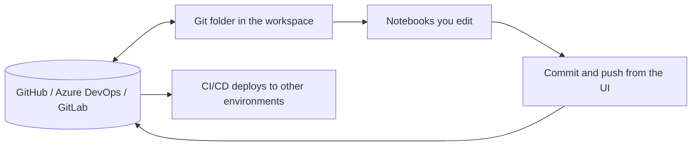
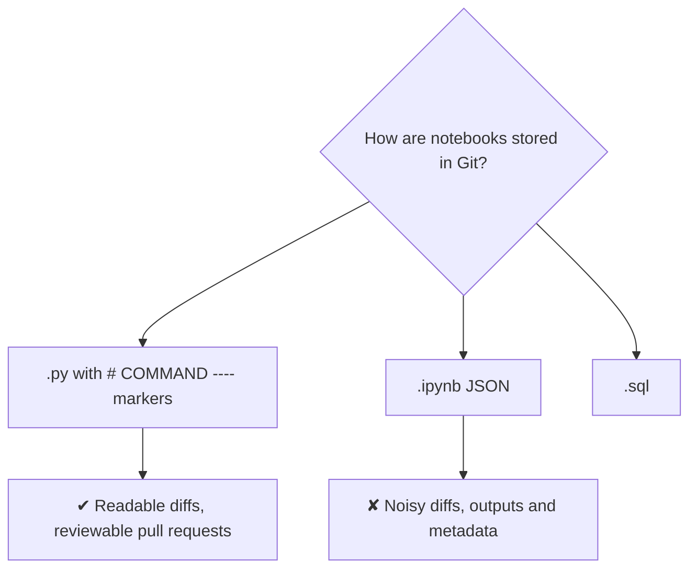
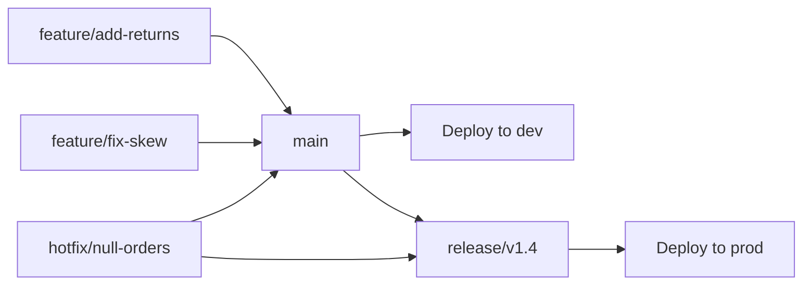
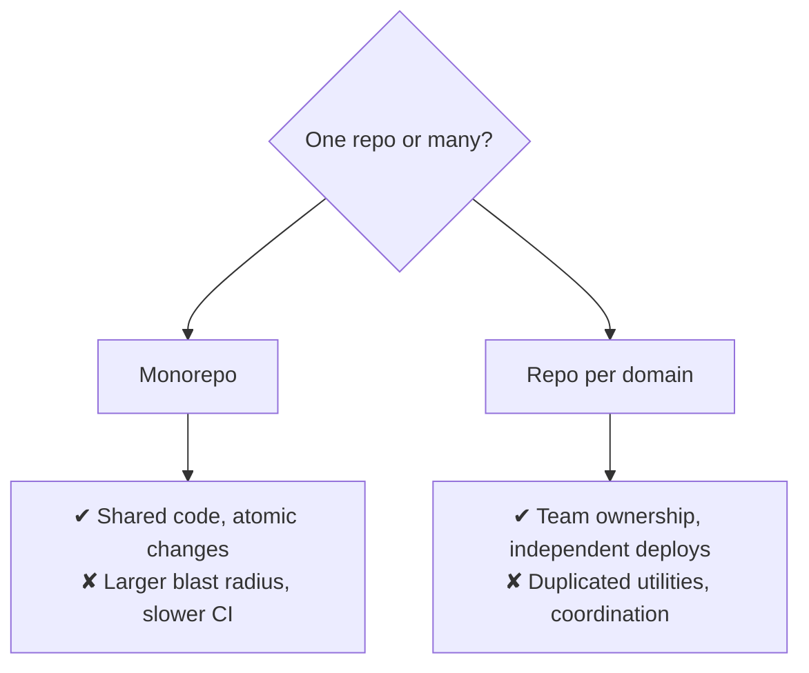
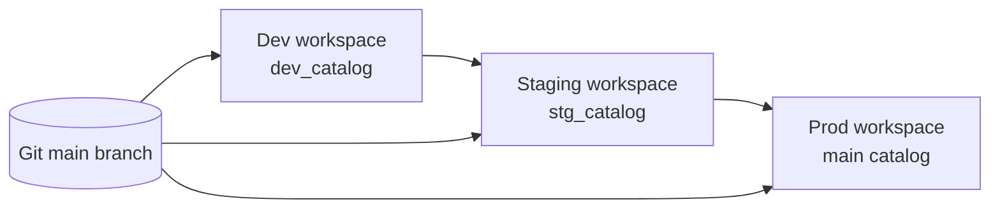
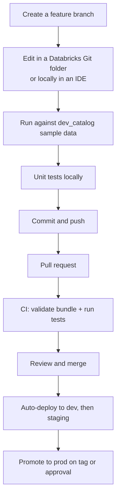

# Git Workflow and Environment Strategy

## Git Folders (Repos) in Databricks

Databricks can clone a Git repository directly into the workspace, so notebooks
are version controlled where you edit them.



```text
Supported providers: GitHub, GitLab, Bitbucket, Azure DevOps,
GitHub Enterprise, AWS CodeCommit.
```

---

## Notebook Source Formats



```python
# Databricks notebook source
# COMMAND ----------

from pyspark.sql import functions as F

# COMMAND ----------

df = spark.table("main.silver.orders")
```

```text
Always commit notebooks as source files (.py / .sql), not .ipynb.
A pull request where every cell shows as changed because execution
counts moved is a pull request nobody reviews properly.
```

---

## Branching Strategy



Two workable models:

### Trunk-based (recommended for most teams)

```text
main is always deployable
Short-lived feature branches (hours to days)
Merge to main → CI deploys to dev automatically
Tag a commit → deploy to prod

✔ Simple, fast, few merge conflicts
✔ Works well with bundles and feature flags
```

### Gitflow (heavier)

```text
main = production, develop = integration, release/* branches

✔ Suits fixed release windows and regulated change control
✘ More overhead, long-lived branches diverge
```

```text
For data platforms, trunk-based with environment promotion via bundle
targets is usually the better fit — the "release" is a deployment,
not a branch merge.
```

---

## Repository Structure

```text
data-platform/
├── databricks.yml
├── resources/
│   ├── jobs.yml
│   └── pipelines.yml
├── src/
│   ├── bronze/
│   ├── silver/
│   ├── gold/
│   └── common/              # shared, importable, testable
├── tests/
│   ├── unit/
│   └── integration/
├── sql/                     # DDL, grants, views
├── docs/
├── .github/workflows/
├── requirements.txt
└── README.md
```



```text
A practical middle ground: one repo per data domain (sales, finance),
plus a shared library repo published as a wheel.
```

---

## Environment Strategy



| | Dev | Staging | Prod |
|---|-----|---------|------|
| Catalog | `dev_catalog` | `stg_catalog` | `main` |
| Data | Sample or masked subset | Production-like volume | Real |
| Schedules | Paused | Active (short intervals) | Active |
| Run as | Individual developers | Staging service principal | Prod service principal |
| Deploy trigger | Every merge to main | Every merge to main | Tag or manual approval |
| Who can edit in UI | Engineers | Nobody | Nobody |

### Workspace-per-environment vs catalog-per-environment

```text
Separate workspaces:
✔ Strong isolation — a runaway dev job cannot touch prod compute
✔ Separate permissions, quotas, and networking
✘ More to manage, more cost

Single workspace, separate catalogs:
✔ Cheaper and simpler for small teams
✘ Weaker isolation; a mistake can reach prod data
✘ Compute contention between dev and prod

Recommendation: separate workspaces for prod at minimum.
```

---

## Development Loop



### Local IDE development

```bash
pip install databricks-connect==14.3.*
databricks auth login --host https://adb-111.11.azuredatabricks.net
```

```python
from databricks.connect import DatabricksSession

spark = DatabricksSession.builder.getOrCreate()
df = spark.table("dev_catalog.silver.orders")
df.show()
```

```text
Databricks Connect runs Spark code from your IDE against a remote cluster,
so you get real autocomplete, debugging, and a proper test runner —
while still reading real data.

The VS Code extension wraps this plus bundle deployment.
```

---

## Handling Notebooks and Shared Code

```text
❌ 2000-line notebook with all the logic
❌ %run ../common/utils   → invisible dependency, untestable

✔ Logic in src/common/*.py, imported as a module
✔ Notebook becomes a thin entry point
✔ The module is unit tested in CI, packaged as a wheel
```

```python
# src/common/transforms.py
def clean_orders(df):
    ...

# src/silver/build_orders.py  (the notebook)
import sys
sys.path.append("../common")      # or install the wheel
from transforms import clean_orders

spark.table("bronze.orders").transform(clean_orders).write...
```

```text
With a bundle wheel artifact, the sys.path juggling disappears:
the library is installed on the cluster and imported normally.
```

---

## Secrets and Configuration

```text
Never in Git:
✘ Tokens, passwords, connection strings
✘ Workspace URLs for other tenants (arguably)
✘ Real customer data in test fixtures

In Git:
✔ Secret scope and key NAMES
✔ Environment variable names
✔ Configuration structure and defaults
```

```python
password = dbutils.secrets.get(scope="production", key="db_password")
```

```yaml
# Bundle: reference a scope, never a value
configuration:
  jdbc_user: "{{secrets/production/db_user}}"
```

```bash
# .gitignore essentials
.databricks/
dist/
*.egg-info/
__pycache__/
.env
*.pem
```

---

## Code Review for Data Pipelines

```text
Beyond normal code review, check:

✔ Is the write idempotent? (MERGE or replaceWhere, not blind append)
✔ Are dates parameterised, not hard-coded?
✔ Does it handle late-arriving data?
✔ Are quality checks present, and what happens when they fail?
✔ Is the schema change backwards compatible for consumers?
✔ Does it read gold rather than recomputing from silver?
✔ Cost: cluster size, schedule frequency, always-on vs triggered
✔ Are secrets referenced rather than embedded?
```

```text
A pipeline review that only checks syntax misses everything that
actually causes incidents.
```

---

## Common Interview Questions

### How do you version control Databricks notebooks?

With Git folders in the workspace linked to a repository, committing notebooks as
source files (`.py` / `.sql`) rather than `.ipynb`, so diffs are reviewable.

### Why avoid committing `.ipynb`?

Output cells and execution metadata create enormous noisy diffs that make pull
request review ineffective.

### Which branching strategy suits data platforms?

Trunk-based development with short-lived feature branches, with environment
promotion handled by bundle targets rather than long-lived branches.

### Separate workspaces or separate catalogs per environment?

Separate workspaces give real isolation of compute, permissions, and networking —
essential for production. Separate catalogs alone are cheaper but weaker.

### How do you develop locally against Databricks?

Databricks Connect with the VS Code extension: Spark code runs from the IDE
against a remote cluster, enabling debugging and standard test tooling.

### How should shared logic be organised?

As importable modules under `src/common`, packaged as a wheel by the bundle,
rather than `%run` of another notebook — which is untestable and invisible to
tooling.

### What belongs in a data pipeline code review that would not be in an application review?

Idempotency, date parameterisation, late-arriving data handling, quality check
behaviour, schema compatibility for consumers, and cost implications.

---

## Quick Revision

```text
Git folders: repo cloned into the workspace, commit from the UI or IDE
Commit notebooks as .py / .sql source, never .ipynb

Branching: trunk-based, short-lived branches, promotion via bundle targets

Environments:
dev (dev_catalog, paused schedules) → staging (stg_catalog) → prod (main)
Separate workspaces for prod isolation
run_as service principal in staging and prod

Local dev: Databricks Connect + VS Code extension

Code organisation:
logic in src/common as importable modules → wheel
notebooks are thin entry points
no %run for shared code

Secrets: names in Git, values in secret scopes

Review checklist: idempotency | parameterised dates | late data |
quality gates | schema compatibility | cost | secrets
```
