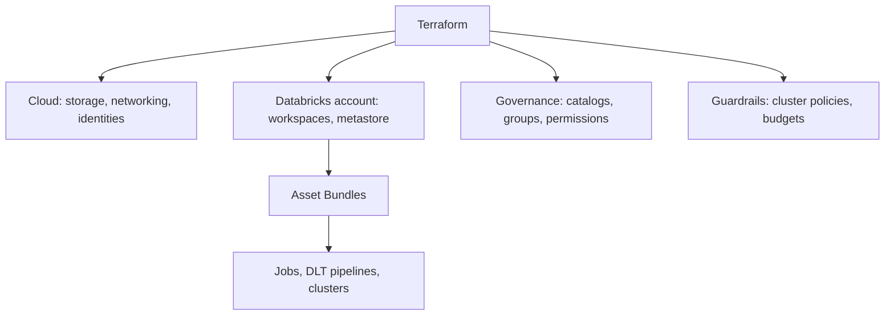
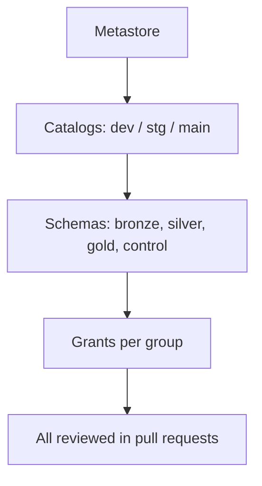
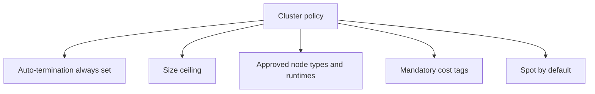
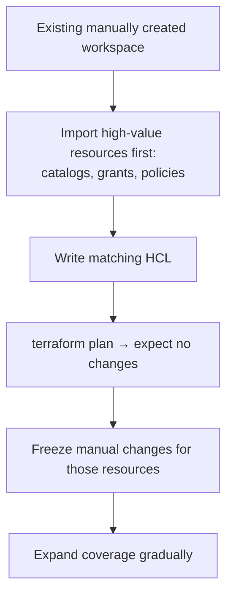

# Terraform and Infrastructure as Code

## Where Terraform Fits

Bundles deploy **workloads**. Terraform provisions the **platform** those
workloads run on.



| | Terraform | Asset Bundles |
|---|-----------|---------------|
| Manages | Workspaces, metastores, groups, catalogs, policies | Jobs, pipelines, task clusters |
| Changed by | Platform team | Data engineers |
| Cadence | Rarely | Every merge |
| State | Explicit state file | Derived from the bundle |

```text
A useful boundary: if a data engineer should be able to change it in a
pull request without platform approval, it belongs in a bundle.
Otherwise it belongs in Terraform.
```

---

## Provider Setup

```hcl
terraform {
  required_providers {
    databricks = {
      source  = "databricks/databricks"
      version = "~> 1.50"
    }
    azurerm = {
      source  = "hashicorp/azurerm"
      version = "~> 3.100"
    }
  }
  backend "azurerm" {
    resource_group_name  = "tfstate-rg"
    storage_account_name = "tfstatedatabricks"
    container_name       = "tfstate"
    key                  = "databricks.tfstate"
  }
}

# Account-level provider: workspaces, metastores, groups
provider "databricks" {
  alias      = "account"
  host       = "https://accounts.azuredatabricks.net"
  account_id = var.databricks_account_id
  client_id  = var.sp_client_id
  client_secret = var.sp_client_secret
}

# Workspace-level provider: catalogs, policies, permissions
provider "databricks" {
  alias = "workspace"
  host  = azurerm_databricks_workspace.this.workspace_url
}
```

```text
The two-provider pattern trips people up constantly: account-level
resources (workspaces, metastore, account groups) and workspace-level
resources (catalogs, policies, secret scopes) use different endpoints.
```

---

## Provisioning a Workspace

```hcl
resource "azurerm_resource_group" "this" {
  name     = "rg-databricks-${var.env}"
  location = var.location
}

resource "azurerm_databricks_workspace" "this" {
  name                = "dbw-${var.env}"
  resource_group_name = azurerm_resource_group.this.name
  location            = azurerm_resource_group.this.location
  sku                 = "premium"

  custom_parameters {
    no_public_ip        = true
    virtual_network_id  = azurerm_virtual_network.this.id
    public_subnet_name  = azurerm_subnet.public.name
    private_subnet_name = azurerm_subnet.private.name
  }

  tags = {
    environment = var.env
    owner       = "data-platform"
  }
}
```

---

## Unity Catalog as Code

```hcl
resource "databricks_metastore" "this" {
  provider      = databricks.account
  name          = "primary-metastore"
  region        = var.location
  owner         = "data-platform-admins"
  force_destroy = false
}

resource "databricks_metastore_assignment" "this" {
  provider     = databricks.account
  workspace_id = azurerm_databricks_workspace.this.workspace_id
  metastore_id = databricks_metastore.this.id
}

resource "databricks_catalog" "envs" {
  provider     = databricks.workspace
  for_each     = toset(["dev_catalog", "stg_catalog", "main"])
  metastore_id = databricks_metastore.this.id
  name         = each.key
  owner        = "data-platform-admins"
  comment      = "Catalog for ${each.key}"

  properties = {
    purpose = "data platform"
  }
}

resource "databricks_schema" "layers" {
  provider = databricks.workspace
  for_each = {
    for pair in setproduct(["dev_catalog", "main"], ["bronze", "silver", "gold", "control"]) :
    "${pair[0]}.${pair[1]}" => { catalog = pair[0], schema = pair[1] }
  }
  catalog_name = each.value.catalog
  name         = each.value.schema
  comment      = "${each.value.schema} layer"
}
```

```hcl
resource "databricks_grants" "gold_read" {
  provider = databricks.workspace
  schema   = "main.gold"

  grant {
    principal  = "data-analysts"
    privileges = ["USE_SCHEMA", "SELECT"]
  }
  grant {
    principal  = "data-engineers"
    privileges = ["ALL_PRIVILEGES"]
  }
}
```



```text
Putting grants in Terraform means access changes have an audit trail and
a reviewer. "Who gave the contractor write access to main?" becomes a
git blame instead of an investigation.
```

---

## External Locations and Storage Credentials

```hcl
resource "databricks_storage_credential" "adls" {
  provider = databricks.workspace
  name     = "adls-credential"
  azure_managed_identity {
    access_connector_id = azurerm_databricks_access_connector.this.id
  }
  owner = "data-platform-admins"
}

resource "databricks_external_location" "landing" {
  provider        = databricks.workspace
  name            = "landing-zone"
  url             = "abfss://landing@${azurerm_storage_account.data.name}.dfs.core.windows.net/"
  credential_name = databricks_storage_credential.adls.name
  comment         = "Vendor file landing zone"
}

resource "databricks_grants" "landing" {
  provider          = databricks.workspace
  external_location = databricks_external_location.landing.id
  grant {
    principal  = "data-engineers"
    privileges = ["READ_FILES", "WRITE_FILES", "CREATE_EXTERNAL_TABLE"]
  }
}
```

---

## Groups and Identity

```hcl
resource "databricks_group" "teams" {
  provider     = databricks.account
  for_each     = toset(["data-engineers", "data-analysts", "data-platform-admins"])
  display_name = each.key
}

resource "databricks_service_principal" "pipelines" {
  provider     = databricks.account
  for_each     = toset(["sp-data-platform-dev", "sp-data-platform-stg", "sp-data-platform-prod"])
  display_name = each.key
}

resource "databricks_group_member" "sp_membership" {
  provider  = databricks.account
  group_id  = databricks_group.teams["data-engineers"].id
  member_id = databricks_service_principal.pipelines["sp-data-platform-prod"].id
}
```

```text
Best practice: grant permissions to GROUPS, never to individuals.
Onboarding becomes "add to group"; offboarding becomes "remove from group".
Per-user grants accumulate into an unauditable mess within a year.
```

---

## Cluster Policies as Guardrails

```hcl
resource "databricks_cluster_policy" "standard" {
  provider = databricks.workspace
  name     = "standard-job-cluster"

  definition = jsonencode({
    "spark_version": {
      "type": "regex",
      "pattern": "1[4-9]\\..*"
    },
    "node_type_id": {
      "type": "allowlist",
      "values": ["Standard_DS3_v2", "Standard_DS4_v2", "Standard_E8s_v3"]
    },
    "autotermination_minutes": {
      "type": "fixed",
      "value": 20
    },
    "autoscale.max_workers": {
      "type": "range",
      "maxValue": 20
    },
    "custom_tags.team": {
      "type": "unlimited",
      "isOptional": false
    },
    "azure_attributes.availability": {
      "type": "fixed",
      "value": "SPOT_WITH_FALLBACK"
    }
  })
}

resource "databricks_permissions" "policy_usage" {
  provider                = databricks.workspace
  cluster_policy_id       = databricks_cluster_policy.standard.id
  access_control {
    group_name       = "data-engineers"
    permission_level = "CAN_USE"
  }
}
```



```text
Policies are the cheapest cost control available: they prevent the
problem rather than reporting it after the invoice.
```

---

## Structuring a Terraform Repository

```text
infrastructure/
├── modules/
│   ├── workspace/
│   ├── unity_catalog/
│   └── policies/
├── environments/
│   ├── dev/
│   │   ├── main.tf
│   │   └── terraform.tfvars
│   ├── staging/
│   └── prod/
└── README.md
```

```hcl
# environments/prod/main.tf
module "workspace" {
  source   = "../../modules/workspace"
  env      = "prod"
  location = "westeurope"
}

module "unity_catalog" {
  source       = "../../modules/unity_catalog"
  workspace_id = module.workspace.workspace_id
  catalogs     = ["main"]
}
```

```bash
cd environments/prod
terraform init
terraform plan -out=tfplan
terraform apply tfplan
```

```text
Separate state per environment. A single state file for all environments
means a dev change can plan a prod destroy — and someone will eventually
type yes.
```

---

## Terraform in CI

```yaml
# .github/workflows/terraform.yml
name: Terraform

on:
  pull_request:
    paths: ["infrastructure/**"]
  push:
    branches: [main]
    paths: ["infrastructure/**"]

jobs:
  plan:
    runs-on: ubuntu-latest
    steps:
      - uses: actions/checkout@v4
      - uses: hashicorp/setup-terraform@v3

      - name: Terraform plan
        working-directory: infrastructure/environments/prod
        env:
          ARM_CLIENT_ID: ${{ secrets.ARM_CLIENT_ID }}
          ARM_CLIENT_SECRET: ${{ secrets.ARM_CLIENT_SECRET }}
          ARM_TENANT_ID: ${{ secrets.ARM_TENANT_ID }}
          ARM_SUBSCRIPTION_ID: ${{ secrets.ARM_SUBSCRIPTION_ID }}
        run: |
          terraform init
          terraform plan -no-color -out=tfplan
          terraform show -no-color tfplan > plan.txt

      - name: Comment plan on PR
        if: github.event_name == 'pull_request'
        uses: actions/github-script@v7
        with:
          script: |
            const fs = require('fs');
            const plan = fs.readFileSync('infrastructure/environments/prod/plan.txt', 'utf8');
            github.rest.issues.createComment({
              issue_number: context.issue.number,
              owner: context.repo.owner,
              repo: context.repo.repo,
              body: '```\n' + plan.slice(0, 60000) + '\n```'
            });
```

```text
Posting the plan on the pull request is what makes infrastructure
review meaningful — the reviewer sees exactly what will change.
Apply only runs on main, after approval.
```

---

## Importing Existing Resources

Most teams adopt Terraform after the workspace already exists.

```bash
terraform import databricks_catalog.main main
terraform import databricks_cluster_policy.standard 0918ABC123
```

```bash
# Generate configuration from what exists (experimental exporter)
databricks bundle generate job --existing-job-id 620745
```



```text
The "plan shows no changes" step is the proof that your HCL matches
reality. Skipping it means the first apply rewrites something.
```

---

## Common Mistakes

```text
❌ Shared state across environments
❌ State stored locally instead of in remote backed-up storage
❌ Secrets in .tf files or committed .tfvars
❌ Permissions granted to individuals instead of groups
❌ Managing jobs in Terraform instead of bundles (slow, wrong tool)
❌ terraform apply from a laptop against prod
❌ force_destroy = true on a metastore
❌ No plan review on the pull request
```

---

## Common Interview Questions

### What is the division of responsibility between Terraform and Asset Bundles?

Terraform provisions the platform — workspaces, metastore, catalogs, groups,
permissions, cluster policies. Bundles deploy workloads — jobs, DLT pipelines,
and their clusters. Platform teams own the first, data engineers the second.

### Why does the Databricks Terraform provider need two provider blocks?

Account-level resources (workspaces, metastore, account groups) use the accounts
endpoint, while workspace-level resources (catalogs, policies, secret scopes) use
the workspace URL.

### Why manage Unity Catalog grants in Terraform?

Access changes get pull request review, an audit trail, and reproducibility
across environments, instead of being applied ad hoc in the UI.

### Why grant permissions to groups rather than users?

Onboarding and offboarding become group membership changes, and permissions stay
auditable instead of accumulating per-user grants nobody can reconstruct.

### What do cluster policies enforce and why are they valuable?

Auto-termination, maximum size, allowed node types and runtimes, mandatory cost
tags, and spot defaults. They prevent cost and compliance problems rather than
reporting them afterwards.

### How do you adopt Terraform for an existing workspace?

Import the highest-value resources first (catalogs, grants, policies), write
matching HCL, confirm `terraform plan` shows no changes, freeze manual edits for
those resources, then expand coverage.

### Why separate state per environment?

So a change planned against dev can never propose destroying production
resources, and so blast radius is contained.

---

## Quick Revision

```text
Terraform = platform: workspaces, metastore, catalogs, groups, grants, policies
Bundles    = workloads: jobs, DLT pipelines, task clusters

Provider: account-level (accounts endpoint) + workspace-level (workspace URL)

Key resources:
databricks_metastore | databricks_catalog | databricks_schema
databricks_grants | databricks_external_location | databricks_storage_credential
databricks_group | databricks_service_principal | databricks_cluster_policy

Structure: modules/ + environments/{dev,staging,prod} with SEPARATE state

CI: plan on PR (posted as a comment) → apply on main after approval

Rules:
✔ Groups, never individuals
✔ Remote state, one per environment
✔ Policies as guardrails (termination, size cap, tags)
✔ Import and verify a no-change plan before adopting
✘ No secrets in .tf, no apply from a laptop, no shared state
```
