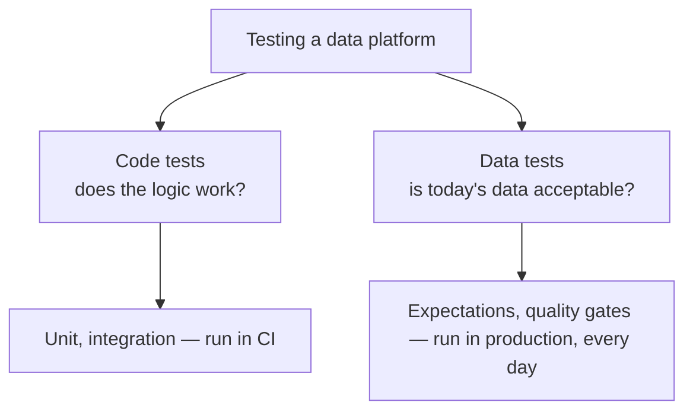
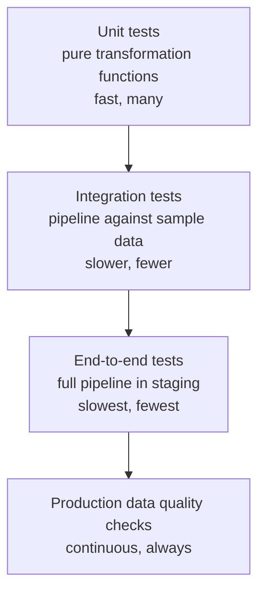
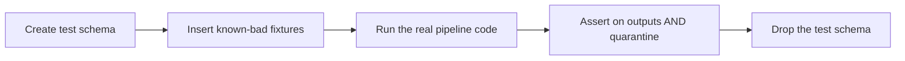
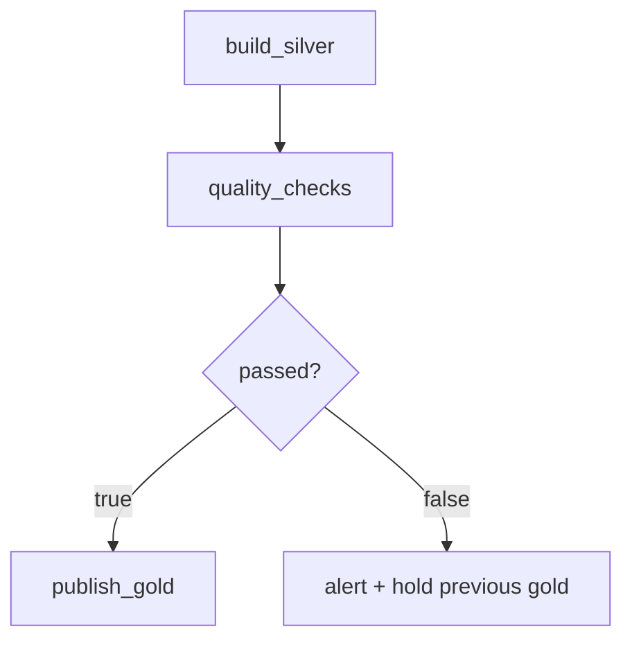
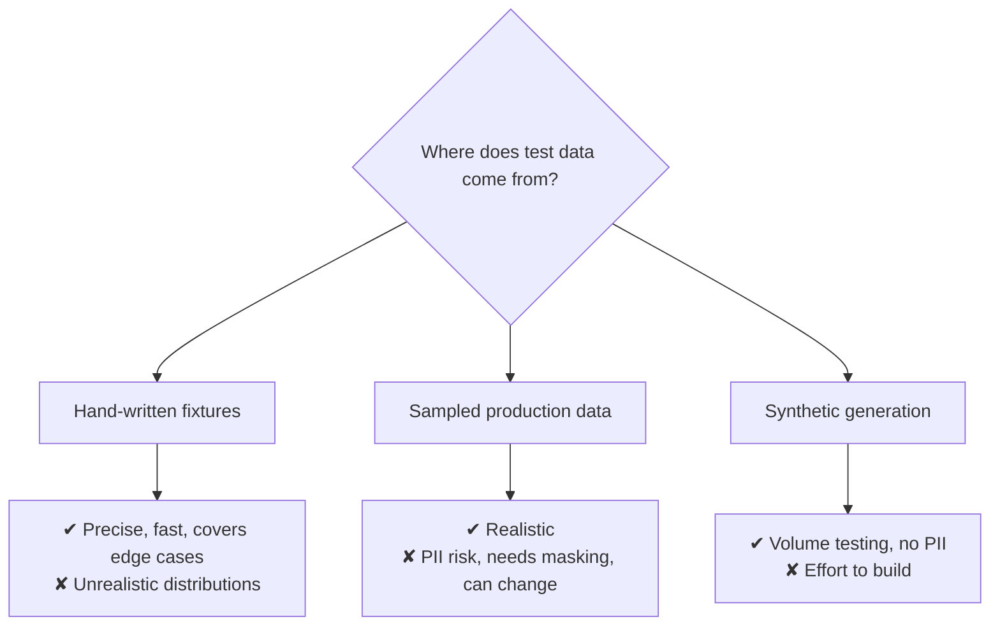

# Testing Data Pipelines

## Why Data Pipelines Are Harder to Test

```text
Application code: same input → same output. Test it once.

Data pipeline: the input changes every day, arrives from systems you do
not control, and can be wrong in ways nobody anticipated.
```

So you need two different kinds of test:



Most teams build only the second kind, or neither.

---

## The Testing Pyramid for Data



| Level | Runs where | Speed | Catches |
|-------|-----------|-------|---------|
| Unit | CI, no cluster | Seconds | Logic bugs |
| Integration | CI or dev workspace | Minutes | Wiring, schema, SQL errors |
| End-to-end | Staging | Tens of minutes | Orchestration, permissions, config |
| Data quality | Production, every run | Continuous | Bad incoming data |

---

## Making Code Testable

The prerequisite for everything below: separate logic from I/O.

```python
# ❌ untestable — reads, transforms, and writes in one function
def process_orders():
    df = spark.table("main.bronze.orders")
    clean = df.filter("order_id IS NOT NULL").withColumn("amount", col("amt").cast("decimal(18,2)"))
    clean.write.saveAsTable("main.silver.orders")
```

```python
# ✔ testable — a pure function of DataFrame in, DataFrame out
def clean_orders(df):
    return (df
        .filter("order_id IS NOT NULL")
        .withColumn("amount", F.col("amt").cast("decimal(18,2)"))
        .withColumn("status", F.upper(F.trim("status"))))

# the notebook / entry point stays thin
def main(spark, catalog):
    src = spark.table(f"{catalog}.bronze.orders")
    clean_orders(src).write.mode("overwrite").saveAsTable(f"{catalog}.silver.orders")
```

```text
Rule: every transformation is a function taking a DataFrame and
returning a DataFrame. Reads and writes live only in the entry point.
```

---

## Unit Tests

```python
# tests/conftest.py
import pytest
from pyspark.sql import SparkSession

@pytest.fixture(scope="session")
def spark():
    return (SparkSession.builder
        .master("local[2]")
        .appName("tests")
        .config("spark.sql.shuffle.partitions", "2")
        .config("spark.jars.packages", "io.delta:delta-spark_2.12:3.1.0")
        .config("spark.sql.extensions", "io.delta.sql.DeltaSparkSessionExtension")
        .config("spark.sql.catalog.spark_catalog",
                "org.apache.spark.sql.delta.catalog.DeltaCatalog")
        .getOrCreate())
```

```python
# tests/unit/test_transforms.py
from src.common.transforms import clean_orders

def test_drops_null_order_ids(spark):
    src = spark.createDataFrame(
        [(1, "10.00", "completed"), (None, "5.00", "completed")],
        ["order_id", "amt", "status"])
    out = clean_orders(src)
    assert out.count() == 1

def test_casts_amount_to_decimal(spark):
    src = spark.createDataFrame([(1, "10.50", "completed")], ["order_id", "amt", "status"])
    out = clean_orders(src)
    assert str(out.schema["amount"].dataType) == "DecimalType(18,2)"
    assert out.collect()[0].amount == Decimal("10.50")

def test_uppercases_status(spark):
    src = spark.createDataFrame([(1, "10.00", " completed ")], ["order_id", "amt", "status"])
    assert clean_orders(src).collect()[0].status == "COMPLETED"

def test_handles_empty_input(spark):
    src = spark.createDataFrame([], "order_id INT, amt STRING, status STRING")
    assert clean_orders(src).count() == 0
```

```text
Cases worth testing explicitly, because they are where pipelines break:
✔ Empty input
✔ Nulls in the key
✔ Unparseable values (the failed-cast-becomes-null trap)
✔ Duplicate business keys
✔ Boundary values (zero, negative, very large)
✔ Unexpected categorical values
```

```bash
pytest tests/unit -v
```

```text
A local Spark session is slow to start (~10 s) but fine afterwards.
Use one session-scoped fixture for the whole suite, not one per test.
```

---

## Testing Deduplication and Merge Logic

```python
def test_keeps_latest_version_per_key(spark):
    src = spark.createDataFrame([
        (1, "100.00", "2026-09-18 09:00:00"),
        (1, "150.00", "2026-09-18 14:00:00"),    # later — should win
        (2, "200.00", "2026-09-18 10:00:00"),
    ], ["order_id", "amount", "updated_at"])

    out = deduplicate_latest(src, key="order_id", order_by="updated_at")

    assert out.count() == 2
    assert out.filter("order_id = 1").collect()[0].amount == "150.00"
```

```python
def test_merge_is_idempotent(spark, tmp_path):
    target = str(tmp_path / "orders")
    initial = spark.createDataFrame([(1, "100.00")], ["order_id", "amount"])
    initial.write.format("delta").save(target)

    updates = spark.createDataFrame([(1, "150.00"), (2, "200.00")], ["order_id", "amount"])

    apply_merge(spark, target, updates)
    first = spark.read.format("delta").load(target).collect()

    apply_merge(spark, target, updates)      # run it twice
    second = spark.read.format("delta").load(target).collect()

    assert sorted(first) == sorted(second)   # idempotent
    assert len(second) == 2
```

```text
The idempotency test is the single most valuable test in a data platform.
It is exactly what retries and repair runs depend on.
```

---

## Integration Tests

```python
# tests/integration/test_silver_pipeline.py
import pytest

CATALOG = "dev_catalog"
SCHEMA = "ci_test"

@pytest.fixture(scope="module")
def setup_test_data(spark):
    spark.sql(f"CREATE SCHEMA IF NOT EXISTS {CATALOG}.{SCHEMA}")
    spark.sql(f"""
        CREATE OR REPLACE TABLE {CATALOG}.{SCHEMA}.bronze_orders AS
        SELECT * FROM VALUES
            ('1', ' 42 ', '199.99', '18/09/2026', 'completed'),
            ('2', '43',   '299.99', '18/09/2026', 'CANCELLED'),
            (NULL,'44',   '99.99',  '18/09/2026', 'completed'),
            ('4', '45',   '-50.00', '18/09/2026', 'completed')
        AS t(ord_id, cust, amt, dt, status)
    """)
    yield
    spark.sql(f"DROP SCHEMA IF EXISTS {CATALOG}.{SCHEMA} CASCADE")

def test_silver_pipeline_end_to_end(spark, setup_test_data):
    build_silver(spark, catalog=CATALOG, schema=SCHEMA)

    result = spark.table(f"{CATALOG}.{SCHEMA}.silver_orders")

    assert result.count() == 2                            # 2 valid rows
    assert result.filter("order_id IS NULL").count() == 0
    assert result.filter("amount < 0").count() == 0
    assert result.filter("status = 'COMPLETED'").count() == 1

    quarantine = spark.table(f"{CATALOG}.{SCHEMA}.quarantine_orders")
    assert quarantine.count() == 2                        # null id + negative amount
```



```text
Always assert on the quarantine table too. A pipeline that drops bad rows
and a pipeline that silently loses good rows look identical if you only
check the happy path.
```

---

## Testing SQL Transformations

```python
def test_gold_aggregation_excludes_cancelled(spark):
    spark.sql("""
        CREATE OR REPLACE TEMP VIEW silver_orders AS
        SELECT * FROM VALUES
            (1, 'IN', 100.0, 'COMPLETED', DATE'2026-09-18'),
            (2, 'IN', 200.0, 'CANCELLED', DATE'2026-09-18'),
            (3, 'US', 300.0, 'COMPLETED', DATE'2026-09-18')
        AS t(order_id, country, amount, status, order_date)
    """)

    result = spark.sql(open("sql/gold_daily_sales.sql").read()).collect()
    by_country = {r.country: r.total_revenue for r in result}

    assert by_country["IN"] == 100.0     # cancelled excluded
    assert by_country["US"] == 300.0
```

```text
Keep SQL in .sql files rather than embedded strings, so the same file
is tested in CI and executed in production. Embedded SQL drifts.
```

---

## Data Quality Tests in Production

Code tests run in CI. Data tests run every day, forever.

```python
def run_quality_checks(spark, table, run_date):
    df = spark.table(table).filter(f"order_date = '{run_date}'")

    checks = {
        "has_rows":            df.count() > 0,
        "no_null_keys":        df.filter("order_id IS NULL").count() == 0,
        "no_duplicates":       df.count() == df.select("order_id").distinct().count(),
        "amounts_valid":       df.filter("amount < 0").count() == 0,
        "no_future_dates":     df.filter("order_date > current_date()").count() == 0,
        "volume_plausible":    abs(df.count() - expected_volume(spark, table)) / max(expected_volume(spark, table), 1) < 0.5,
    }

    failed = [k for k, ok in checks.items() if not ok]
    dbutils.jobs.taskValues.set(key="passed", value=len(failed) == 0)
    dbutils.jobs.taskValues.set(key="failed_checks", value=failed)
    return len(failed) == 0
```



DLT does this declaratively (topic 13):

```python
@dlt.expect_or_drop("valid_order_id", "order_id IS NOT NULL")
@dlt.expect("plausible_amount", "amount BETWEEN 0 AND 1000000")
```

---

## Schema Contract Tests

Catch breaking changes before consumers do.

```python
EXPECTED_SCHEMA = {
    "order_id": "bigint",
    "customer_id": "int",
    "amount": "decimal(18,2)",
    "order_date": "date",
    "status": "string",
}

def test_silver_schema_contract(spark):
    actual = {f.name: f.dataType.simpleString()
              for f in spark.table("main.silver.orders").schema.fields}

    for col, dtype in EXPECTED_SCHEMA.items():
        assert col in actual, f"Contract violation: column {col} was removed"
        assert actual[col] == dtype, f"Contract violation: {col} changed to {actual[col]}"
```

```text
Adding a column is fine. Removing or retyping one breaks every consumer.
This test makes that distinction explicit and enforceable in CI.
```

---

## Test Data Strategy



```text
Practical mix:
- Unit tests → small hand-written fixtures with deliberate edge cases
- Integration → a masked, sampled subset refreshed weekly
- Performance → synthetic data at realistic volume

Never copy unmasked production PII into a dev workspace.
```

---

## What to Test, Concretely

```text
Always test:
✔ Deduplication picks the right record
✔ Writes are idempotent (run twice, same result)
✔ Bad rows go to quarantine, good rows do not
✔ Type casting handles unparseable input
✔ Business rules (which statuses count as revenue)
✔ Schema contract for consumed tables
✔ Empty input does not crash the pipeline

Rarely worth testing:
✘ That Spark's groupBy works
✘ That Delta writes files
✘ Trivial column renames
```

---

## Common Interview Questions

### How do you make Spark transformations testable?

Write them as pure functions taking a DataFrame and returning a DataFrame, and
confine reads and writes to a thin entry point.

### What does the testing pyramid look like for data?

Many fast unit tests of transformation functions, fewer integration tests against
sample data, a small number of end-to-end tests in staging, plus continuous data
quality checks in production.

### What is the most valuable test in a data pipeline?

The idempotency test: run the write twice and assert the result is unchanged,
because retries and repair runs depend on it.

### How do you test SQL transformations?

Keep SQL in files, create temporary views with known fixtures, execute the same
file the pipeline uses, and assert on the results.

### How do you catch breaking schema changes?

A schema contract test asserting that expected columns exist with expected types;
added columns pass, removed or retyped columns fail.

### How do code tests differ from data quality checks?

Code tests verify logic and run in CI against fixed fixtures. Data quality checks
verify each day's incoming data and run in production on every pipeline run.

### Where does test data come from?

Hand-written fixtures for unit tests, a masked and sampled production subset for
integration, and synthetic generation for volume testing — never unmasked PII in
a dev workspace.

---

## Quick Revision

```text
Two kinds of testing:
code tests (CI, fixed fixtures) + data quality checks (production, daily)

Pyramid: unit → integration → end-to-end → production quality gates

Prerequisite: transformations as pure DataFrame → DataFrame functions

Unit test the traps:
empty input | null keys | unparseable casts | duplicates | boundaries

Must-have tests:
✔ Deduplication correctness
✔ Idempotency (run twice, same result)
✔ Quarantine receives exactly the bad rows
✔ Business rules
✔ Schema contract

Integration: create a test schema → known-bad fixtures → run real code →
assert outputs AND quarantine → drop the schema

Test data: fixtures (unit) | masked sample (integration) | synthetic (volume)
Never copy unmasked PII to dev
```
