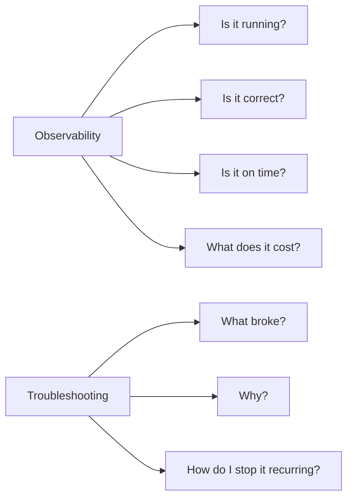
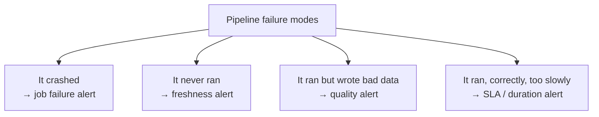

# 16 – Monitoring and Troubleshooting

Topic 14 was about making things fast. This topic is about **knowing what is
happening** and **fixing it when it breaks**.



---

## The Monitoring Maturity Ladder

```text
Level 0: someone notices the dashboard is wrong and emails you
Level 1: job failure emails
Level 2: + freshness and data quality alerts
Level 3: + trends, SLAs, cost attribution, dashboards
Level 4: + anomaly detection and automated remediation
```

Most teams sit at level 1 and believe they are at level 3. Level 2 is where the
real gap closes, because it catches the failures that produce **no error at all**.

---

## Reading Order

| # | File | What you learn |
|---|------|----------------|
| 1 | [observability_stack.md](observability_stack.md) | What to monitor and where the data lives |
| 2 | [system_tables.md](system_tables.md) | Querying platform telemetry |
| 3 | [spark_ui_and_logs.md](spark_ui_and_logs.md) | Reading the Spark UI, logs, and event logs |
| 4 | [common_errors.md](common_errors.md) | Error catalogue with causes and fixes |
| 5 | [incident_response.md](incident_response.md) | What to do when production breaks |
| 6 | [interview_questions.md](interview_questions.md) | Questions asked in interviews |

---

## The Four Failure Modes



```text
Only the first produces an error message.
The other three are silent, and they cause the incidents that damage trust.
```

---

## Quick Revision

```text
Sources of truth:
system.lakeflow.*   → job and task run history
system.billing.*    → cost attribution
system.query.*      → SQL query history
system.access.audit → who did what
DLT event log       → pipeline and expectation detail
Spark UI            → within-job performance
Cluster logs        → driver, executor, init script output

Four alerts every pipeline needs:
failure | freshness | data quality | duration
```
