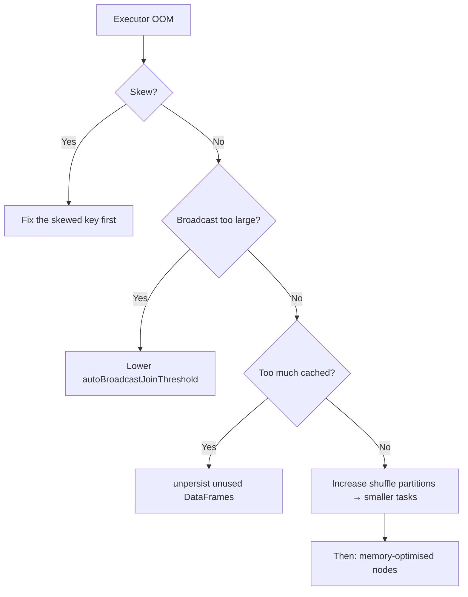
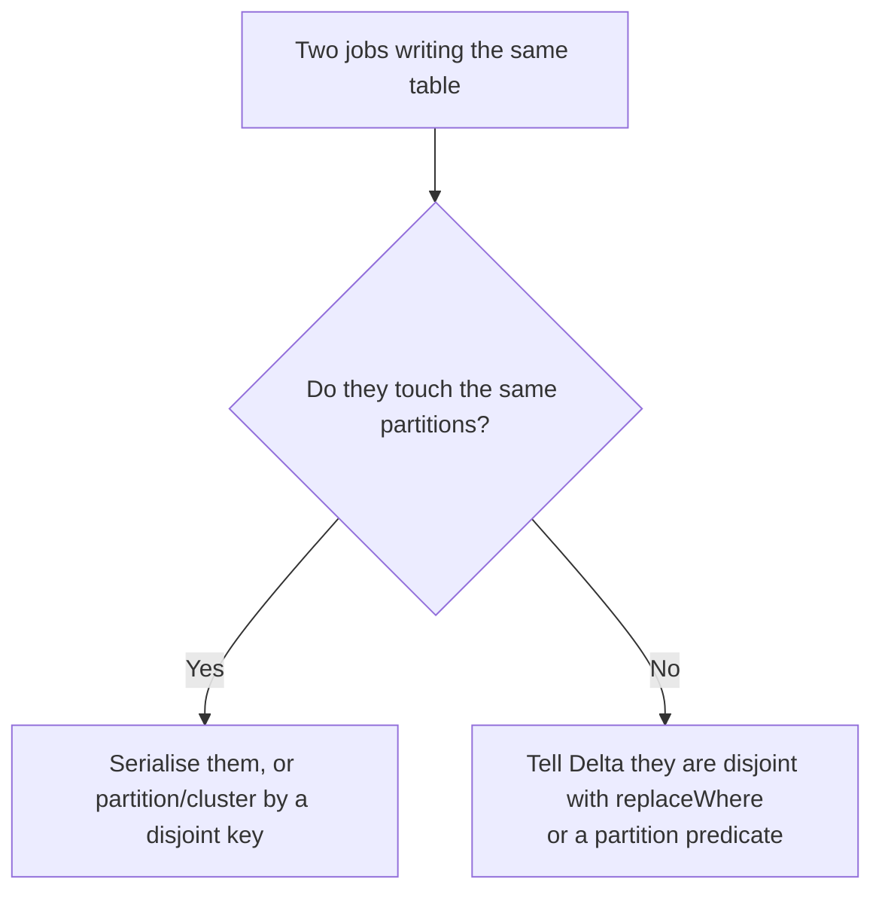
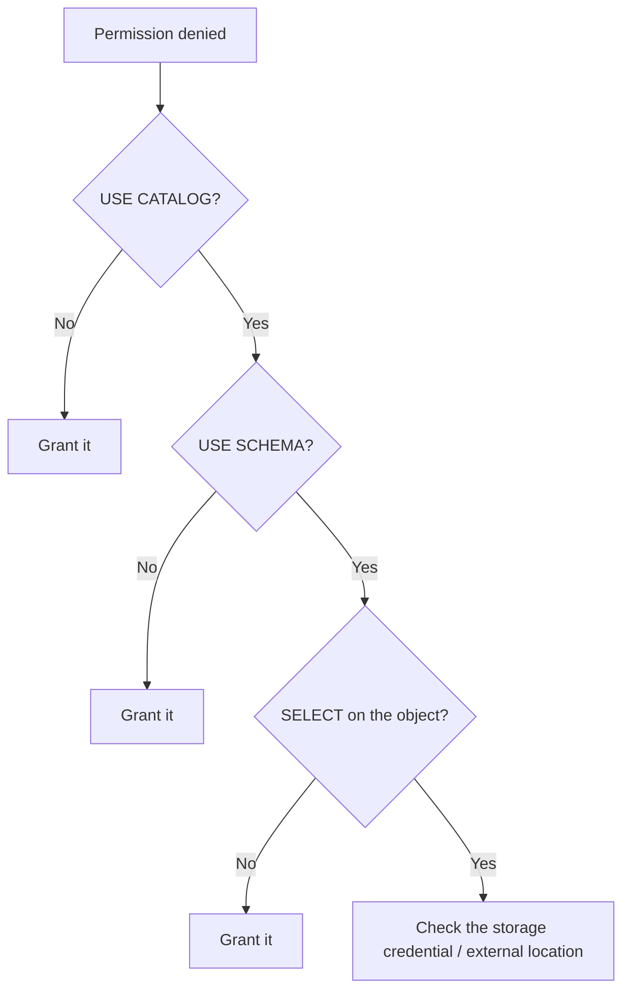
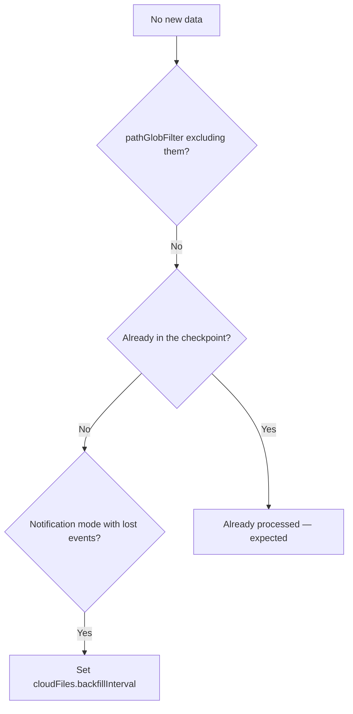
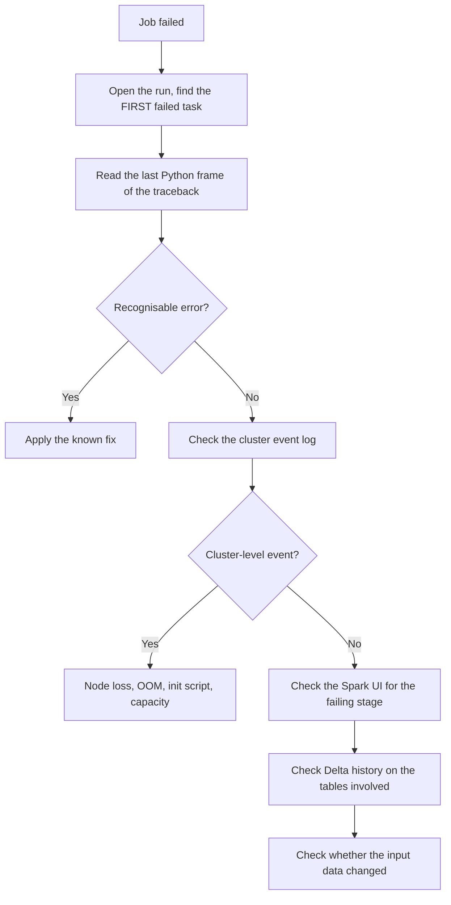

# Common Errors: Causes and Fixes

A catalogue of the errors you will actually meet, what they mean, and what to do.

---

## Memory Errors

### `java.lang.OutOfMemoryError: Java heap space` (driver)

```text
Cause: something pulled too much data to the driver.
```

```python
# ❌ typical culprits
rows = df.collect()
pdf = df.toPandas()
result = df.take(1000000)
spark.conf.set("spark.sql.autoBroadcastJoinThreshold", 2 * 1024**3)
```

```python
# ✔ fixes
df.write.format("delta").saveAsTable("...")   # keep it distributed
sample = df.limit(1000).toPandas()            # bound what you collect
spark.conf.set("spark.driver.maxResultSize", "8g")   # only if genuinely needed
```

```text
Also check: a notebook displaying a huge result, or a loop collecting
per-partition results into a Python list.
```

### `OutOfMemoryError` / container killed (executor)



```python
spark.conf.set("spark.sql.shuffle.partitions", 800)   # smaller partitions
df.unpersist()
```

```text
Order matters: adding memory to fix skew is expensive and does not work.
Fix the distribution first.
```

### `Job aborted due to stage failure: ... ExecutorLostFailure`

```text
Causes:
- Executor OOM (see above)
- Spot instance reclaimed → check the cluster event log for NODES_LOST
- Node hardware or network failure

If spot reclamation: this is normal, Spark re-runs the tasks.
If it happens repeatedly on the same stage: it is memory, not spot.
```

---

## Delta and Concurrency Errors

### `ConcurrentAppendException`

```text
Two writers modified files the other was reading.
```



```python
# Make the disjointness explicit
(df.write.format("delta").mode("overwrite")
   .option("replaceWhere", f"order_date = '{run_date}'")
   .saveAsTable("main.silver.orders"))
```

```text
Also: set max_concurrent_runs = 1 on jobs that write the same table.
```

### `ConcurrentDeleteReadException` / `ConcurrentDeleteDeleteException`

```text
A VACUUM or OPTIMIZE removed files a concurrent operation was using,
or two operations deleted overlapping files.

Fix: schedule maintenance (OPTIMIZE / VACUUM) outside pipeline windows,
and retry the failed operation — Delta is safe, the write simply did not commit.
```

### `MERGE ... multiple source rows matched a target row`

```text
The source contains more than one row per merge key.
```

```python
from pyspark.sql.window import Window
from pyspark.sql import functions as F

w = Window.partitionBy("order_id").orderBy(F.col("updated_at").desc())
deduped = (updates.withColumn("_rn", F.row_number().over(w))
                  .filter("_rn = 1").drop("_rn"))
```

```text
This is the single most common MERGE error, and the fix is always the same:
collapse the source to one row per key before merging.
```

### `AnalysisException: A schema mismatch detected when writing to the Delta table`

```python
.option("mergeSchema", "true")        # add new columns
.option("overwriteSchema", "true")    # replace the schema entirely (destructive)
```

```text
mergeSchema adds columns. overwriteSchema replaces the schema and is
only appropriate for a full reload where you accept the change.
```

### `Detected a data update / deletion in the source table` (streaming)

```text
A streaming read requires an append-only source, but the upstream table
was updated by a MERGE.
```

```python
.option("skipChangeCommits", "true")   # ignore non-append commits
```

```text
Use it only when those updates do not need to reach the downstream table.
Otherwise use Change Data Feed or a materialized view.
```

---

## Schema and Type Errors

### `AnalysisException: cannot resolve 'column_name'`

```text
Causes: typo, the column was renamed upstream, or case sensitivity.
```

```python
print(df.columns)
df.printSchema()
spark.conf.get("spark.sql.caseSensitive")   # default false
```

### Silent nulls after casting

```text
Not an error — which is exactly the problem.
```

```python
# Detect it rather than discovering it in a report
before = df.filter("amt IS NOT NULL").count()
after  = df.withColumn("amount", F.col("amt").cast("decimal(18,2)")) \
           .filter("amount IS NOT NULL").count()
if after < before:
    raise Exception(f"{before - after} rows failed to cast")
```

```text
Spark returns null on cast failure. Always compare pre- and post-cast
non-null counts in silver, or quarantine the failures.
```

### `_rescued_data` populated unexpectedly

```sql
SELECT DISTINCT explode(map_keys(from_json(_rescued_data, 'MAP<STRING,STRING>')))
FROM main.bronze.orders_raw
WHERE _rescued_data IS NOT NULL;
```

```text
Means the source added or changed fields. Not an error — a signal.
Alert on it, then deliberately incorporate the change in silver.
```

---

## Permission Errors

### `PERMISSION_DENIED: User does not have SELECT on table`

```sql
-- Three levels must all be granted
GRANT USE CATALOG ON CATALOG main TO `analysts`;
GRANT USE SCHEMA  ON SCHEMA main.gold TO `analysts`;
GRANT SELECT      ON TABLE main.gold.daily_sales TO `analysts`;
```



```text
The three-level namespace means three grants. Granting SELECT alone
and wondering why it still fails is the most common Unity Catalog ticket.
```

### `Cannot access external location` / storage credential errors

```text
Check:
✔ The external location exists and covers the path
✔ The storage credential has cloud-side permissions (managed identity role)
✔ The principal has READ_FILES / WRITE_FILES on the external location
✔ The cluster access mode supports Unity Catalog
```

### Job fails after someone leaves the company

```text
Cause: the job ran as a named user whose account was deactivated.
Fix:   run_as a service principal, enforced through bundles.
```

---

## Cluster and Startup Errors

### `Cluster terminated. Reason: INIT_SCRIPTS_FAILED`

```text
Check the init script logs in the cluster log destination.
Common causes: a package index unreachable, a version conflict,
a script assuming a path that changed with the runtime.
```

### `CLOUD_PROVIDER_LAUNCH_FAILURE` / capacity errors

```text
The requested instance type is unavailable in the region or you hit a quota.

Fixes:
✔ SPOT_WITH_FALLBACK so it falls back to on-demand
✔ Allow several node types in the cluster policy
✔ Use an instance pool
✔ Request a quota increase
```

### `DRIVER_NOT_RESPONDING`

```text
Usually driver OOM or extreme GC pressure. Check for collect(),
toPandas(), or thousands of tasks being scheduled at once.
```

### Library installation failures

```text
✔ Pin versions in requirements.txt
✔ Prefer cluster libraries or a wheel over %pip in a production notebook
✔ Check for conflicts with runtime-provided packages
✔ For private indexes, configure credentials via secrets, not inline
```

---

## Streaming Errors

### Stream fails immediately on restart after a code change

```text
Cause: a stateful change (grouping keys, join conditions, adding an
aggregation) is incompatible with the existing checkpoint.

Fix: new checkpoint directory, and a plan for reprocessing or
blue-green cutover. Never delete a checkpoint casually.
```

### `Cannot find the query id in the checkpoint`

```text
The checkpoint is shared between two streams, or was partially deleted.
Each stream needs its own checkpoint location.
```

### State grows until the cluster dies

```text
Missing watermark on a stateful operation, or dropDuplicates without
a watermark.
```

```python
.withWatermark("event_time", "1 hour")
.dropDuplicatesWithinWatermark(["order_id"])
```

### Stream stops producing output but does not fail

```text
In append mode, windows are emitted only when the watermark passes them.
If the source goes quiet, the watermark stops advancing and nothing is emitted.
Not a bug — but worth a freshness alert so you notice.
```

---

## Auto Loader Errors

### Files are not being picked up



### `UnknownFieldException`

```text
Expected behaviour with schemaEvolutionMode = addNewColumns:
the stream fails, records the new schema, and a restart picks it up.
Pair it with automatic restart, or switch to rescue mode.
```

### Duplicate data after a vendor re-send

```text
Auto Loader tracks by FILE PATH. A re-send under a new filename is new data.
Fix: deduplicate by business key in silver — which you should be doing anyway.
```

---

## Query and Job Errors

### `AnalysisException: Table or view not found`

```text
✔ Fully qualify: catalog.schema.table
✔ Check USE CATALOG / USE SCHEMA context
✔ Check the table exists in THIS environment (dev vs prod catalog)
✔ Check permissions — a table you cannot see looks like one that does not exist
```

### Job times out

```text
Check whether it is genuinely hung or just slow:
- Spark UI: is a stage progressing?
- Is it waiting on a lock (concurrent write)?
- Is the cluster still starting?

Then: raise the timeout only if the work legitimately takes longer,
otherwise fix the underlying slowness.
```

### Task shows `SKIPPED` / `UPSTREAM_FAILED`

```text
Not an error in itself — an upstream task failed. Find the first
FAILED task in the DAG; everything downstream is a consequence.
```

---

## Error Triage Flow



```text
The most useful habit: before debugging code, ask
"did the data change, or did the code change?"
DESCRIBE HISTORY and your control table answer that in a minute.
```

---

## Common Interview Questions

### What causes driver OOM and how do you fix it?

Collecting too much to the driver — `collect()`, `toPandas()`, or an oversized
broadcast. Keep work distributed, limit what you collect, and lower the broadcast
threshold.

### How do you fix `ConcurrentAppendException`?

Make the writers provably disjoint with `replaceWhere` or a partition predicate,
partition or cluster so each writes distinct ranges, or serialise them and set
`max_concurrent_runs = 1`.

### What causes "multiple source rows matched a target row" in MERGE?

Duplicate keys in the source. Deduplicate with `row_number()` ordered by a
sequence column before merging.

### A user gets permission denied on a table they were granted SELECT on. Why?

They also need `USE CATALOG` and `USE SCHEMA`. All three levels of the namespace
must be granted.

### Why does a streaming query fail after a code change?

The change altered a stateful operator, making the existing checkpoint
incompatible. A new checkpoint and a reprocessing plan are required.

### Why did a cast produce nulls instead of an error?

Spark returns null on cast failure by design. Detect it by comparing pre- and
post-cast non-null counts, or quarantine the failures.

### A job that ran fine for months failed after someone left. Why?

It ran as that person's identity. Production jobs must run as a service
principal.

### How do you tell whether a failure is a code problem or a data problem?

`DESCRIBE HISTORY` on the tables and your control table row counts show whether
the data changed; Git shows whether the code changed. Check both before debugging.

---

## Quick Revision

```text
Memory:
driver OOM   → collect/toPandas/broadcast → keep it distributed
executor OOM → skew first, then partitions, then memory per core

Delta:
ConcurrentAppendException → replaceWhere / disjoint ranges / serialise
MERGE multiple matches    → deduplicate the source by key
schema mismatch           → mergeSchema (add) vs overwriteSchema (replace)
streaming source updated  → skipChangeCommits or use CDF

Schema:
cast failure = silent null → compare counts or quarantine
_rescued_data populated    → the source changed; alert, then handle it

Permissions:
USE CATALOG + USE SCHEMA + SELECT — all three, every time
job fails after someone leaves → run_as a service principal

Cluster:
INIT_SCRIPTS_FAILED | CLOUD_PROVIDER_LAUNCH_FAILURE | DRIVER_NOT_RESPONDING
check the cluster event log before debugging code

Streaming:
stateful change → new checkpoint
shared checkpoint → corruption
state growth → missing watermark

Triage: first failed task → last Python frame → cluster events →
        Spark UI → Delta history → did the DATA change or the CODE?
```
