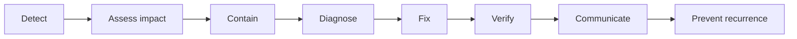
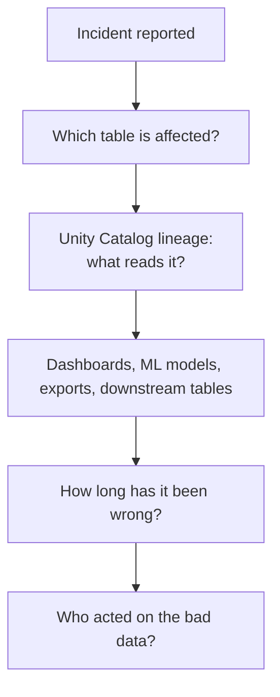
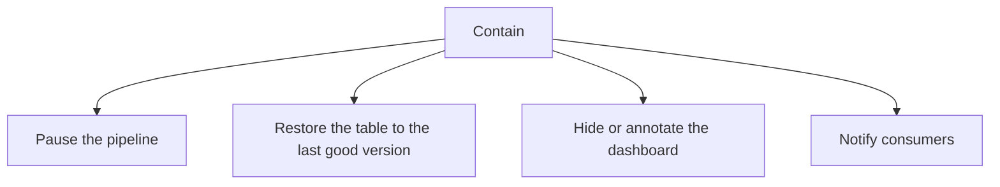
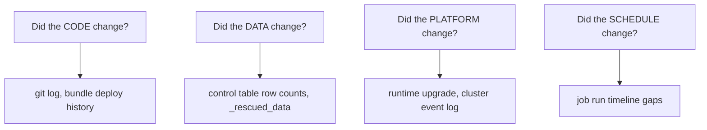
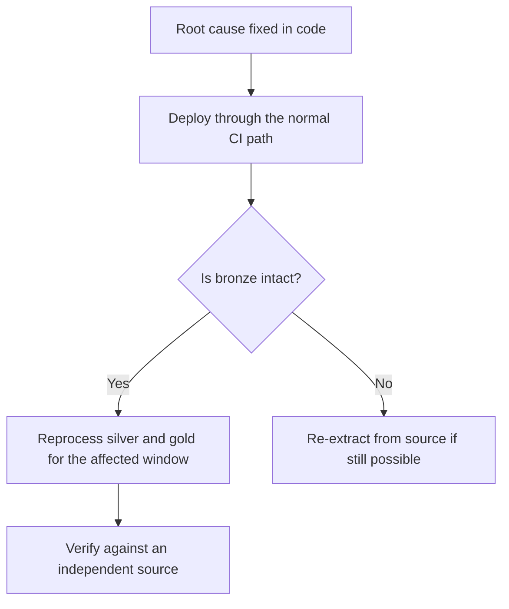
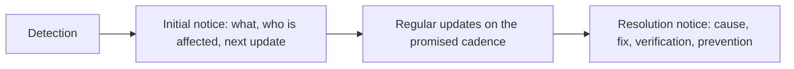
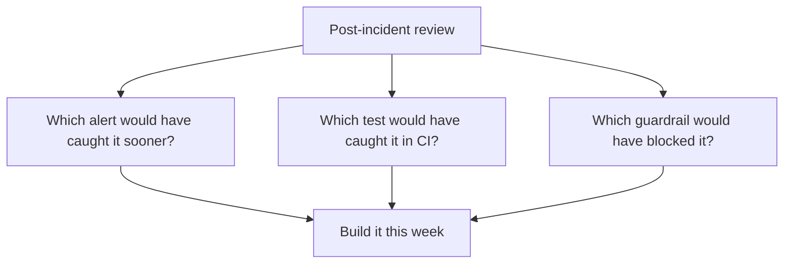
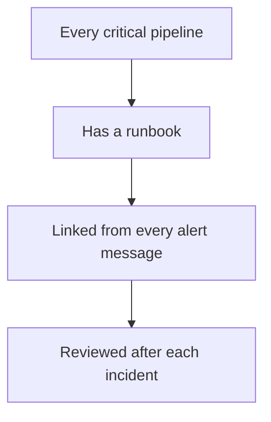

# Incident Response

## The Shape of a Data Incident



```text
Data incidents differ from application incidents in one important way:
the damage is often already distributed. People have read the wrong
number, exported it, and made a decision on it.

That is why "contain" comes before "diagnose".
```

---

## Step 1: Detect

```text
Best case:  an alert fired
Common:     a downstream team noticed
Worst case: an executive noticed in a meeting
```

Each incident should end with a question: **which alert would have caught this
earlier?** If the answer is "none", build it.

---

## Step 2: Assess Impact



```sql
-- Blast radius
SELECT DISTINCT target_table_full_name, entity_type
FROM system.access.table_lineage
WHERE source_table_full_name = 'main.gold.daily_sales'
  AND event_time >= current_date() - INTERVAL 30 DAYS;
```

```sql
-- How long has it been wrong?
DESCRIBE HISTORY main.gold.daily_sales LIMIT 20;
```

```sql
-- Who queried it while it was wrong?
SELECT executed_by, count(*) AS queries, min(start_time), max(start_time)
FROM system.query.history
WHERE start_time >= '2026-09-16'
  AND statement_text ILIKE '%daily_sales%'
GROUP BY executed_by;
```

```text
Severity matrix:

               Internal only    Customer/regulatory facing
Small scope    Low              Medium
Wide scope     Medium           Critical

Critical means: stop the spread now, communicate immediately,
and do not wait for a root cause.
```

---

## Step 3: Contain

Stop the bad data spreading before you understand why it happened.



```bash
# Pause the schedule so the next run does not make it worse
databricks jobs update --json '{"job_id": 620745, "new_settings":
  {"schedule": {"pause_status": "PAUSED"}}}'
```

```sql
-- Roll the table back to the last known-good version
DESCRIBE HISTORY main.gold.daily_sales;
RESTORE TABLE main.gold.daily_sales TO VERSION AS OF 118;
```

```text
Delta time travel is the single most valuable incident tool you have.
A five-second RESTORE buys hours of calm diagnosis.

Caveat: it only works within the VACUUM retention window — which is
why retention should be set from your recovery requirement, not the default.
```

```sql
-- If a rollback is not possible, at least mark the data as suspect
COMMENT ON TABLE main.gold.daily_sales IS
  'INCIDENT 2026-09-18: values for 09-16 to 09-18 are under-reported. Under investigation. Do not use for reporting.';
```

---

## Step 4: Diagnose



```sql
-- Volume anomaly: did the input change?
SELECT run_date, table_name, rows_out
FROM main.control.pipeline_runs
WHERE table_name = 'silver.orders'
  AND run_date >= current_date() - INTERVAL 14 DAYS
ORDER BY run_date;
```

```sql
-- Did the source schema change?
SELECT date(_ingested_at) AS day, count(*) AS rescued
FROM main.bronze.orders_raw
WHERE _rescued_data IS NOT NULL
GROUP BY 1 ORDER BY 1 DESC;
```

```sql
-- Exactly which rows changed between versions?
SELECT * FROM main.gold.daily_sales VERSION AS OF 119
EXCEPT
SELECT * FROM main.gold.daily_sales VERSION AS OF 118;
```

```sql
-- Were rows quarantined unexpectedly?
SELECT date(_quarantined_at) AS day, count(*), collect_set(reason)
FROM main.quarantine.orders
WHERE _quarantined_at >= current_date() - INTERVAL 7 DAYS
GROUP BY 1 ORDER BY 1 DESC;
```

```text
In practice the root cause is usually one of five things:

1. An upstream schema or format change nobody announced
2. A code deployment with an untested edge case
3. A skewed or sentinel key introduced by upstream
4. A schedule paused or a trigger removed during earlier maintenance
5. A permissions or credential change that silently blocked a step
```

---

## Step 5: Fix and Backfill



```python
# Targeted backfill, using the same parameterised job
for d in ["2026-09-16", "2026-09-17", "2026-09-18"]:
    w.jobs.run_now(job_id=620745, job_parameters={"run_date": d})
```

```text
This is where earlier design decisions pay off:

✔ Bronze retained everything → reprocessing is possible
✔ Writes are idempotent      → reprocessing is safe
✔ Dates are parameterised    → the backfill is a loop, not a code change
✔ Delta has history          → you can prove the fix worked

Without those, an incident becomes a multi-day rebuild.
```

---

## Step 6: Verify

```sql
-- Compare against an independent source or a known-good baseline
SELECT
    order_date,
    sum(total_revenue) AS gold_revenue,
    (SELECT sum(amount) FROM main.silver.orders
     WHERE order_date = g.order_date AND status = 'COMPLETED') AS silver_revenue
FROM main.gold.daily_sales g
WHERE order_date BETWEEN '2026-09-16' AND '2026-09-18'
GROUP BY order_date;
```

```text
Verification checklist:
✔ Row counts match the expected baseline
✔ Key aggregates reconcile with the layer below
✔ Quality checks pass
✔ The dashboard shows plausible values
✔ A downstream consumer confirms independently
```

```text
Do not declare the incident resolved based on "the job succeeded".
The job succeeding is what produced the wrong data in the first place.
```

---

## Step 7: Communicate

```text
During the incident (within 30 minutes of detection):

  "Sales dashboard revenue for 16–18 Sept is under-reported.
   Cause under investigation. Do not use these figures.
   Next update: 14:00."

After resolution:

  "Resolved. Revenue for 16–18 Sept was under-reported by ~12% due to an
   upstream date format change that caused valid orders to be rejected.
   Data has been reprocessed and verified. Dashboards are correct as of 13:40.
   A quality alert has been added so this is detected within one run."
```



```text
Communication rules:
✔ Tell people the data is wrong BEFORE you know why
✔ State what not to use, not just what broke
✔ Give a next-update time and honour it
✔ Avoid blame; describe systems, not people
```

---

## Step 8: Prevent Recurrence



```text
For the date-format example:

Detection:  alert on quarantine rate > 1% of daily volume
Prevention: silver handles both date formats; parse failures quarantined
Testing:    a unit test with both formats in the fixture
Contract:   a schema/format agreement with the upstream team
Guardrail:  a quality gate so gold is not published when the rate is breached
```

### The review template

```text
INCIDENT: <short title>
Date/time detected:        2026-09-18 09:40
Date/time root cause began: 2026-09-16 06:12
Detected by:               downstream team (not an alert) ← a finding in itself
Impact:                    gold.daily_sales under-reported 12% for 3 days;
                           executive dashboard and 2 downstream tables affected
Root cause:                upstream changed the date format; casts returned null;
                           rows quarantined without an alert
Resolution:                parser handles both formats; reprocessed from bronze
Time to detect:            2 days 3 hours
Time to resolve:           4 hours

Actions:
1. Quarantine rate alert (owner: data-platform, by 2026-09-25)
2. Unit test for both date formats (owner: A, by 2026-09-20)
3. Schema contract with the upstream team (owner: B, by 2026-10-02)
4. Quality gate before gold publish (owner: data-platform, by 2026-09-25)
```

```text
"Time to detect" is the most important number in the report.
Two days means the monitoring failed, regardless of how fast the fix was.
```

---

## Runbooks

Write them before the incident, not during.

```text
RUNBOOK: silver.orders load failure

Symptoms:  job retail_daily task build_silver failed, or quarantine alert fired
Owner:     #data-platform-oncall
Impact:    gold.daily_sales will not refresh; the sales dashboard goes stale

Triage:
1. Open the job run, find the first failed task, read the last Python frame
2. Check the quarantine table for the reject reason
3. Check bronze _rescued_data for a source schema change
4. Check control.pipeline_runs for a volume anomaly

Common causes and fixes:
- Cast failures after a source format change → see PARSER section below
- Source file missing → check the landing zone and vendor SLA
- Permission denied → check the service principal and external location grants

Containment:
- If gold already published bad data: RESTORE TABLE to the last good version
- Pause the schedule if the next run would make it worse

Recovery:
- Fix, deploy via CI, then: databricks jobs run-now with the affected run_date(s)

Escalate to: @data-platform-lead if unresolved after 1 hour
```



---

## On-Call Readiness Checklist

```text
Before you go on call, confirm you can:
✔ Find the run history of every critical pipeline
✔ Read a control table and quarantine table
✔ Roll back a Delta table (RESTORE TABLE)
✔ Pause and resume a job schedule
✔ Trigger a backfill with parameters
✔ Find the runbook for each critical alert
✔ Reach the upstream data provider's contact
✔ Communicate to the business channel

If any of these is unclear, the incident will take hours longer.
```

---

## Common Interview Questions

### Walk me through how you handle a data incident.

Detect, assess impact via lineage, contain (pause the pipeline, restore the
table, notify consumers), diagnose (code, data, platform, or schedule change),
fix and backfill, verify against an independent source, communicate, and run a
post-incident review that produces concrete prevention actions.

### Why contain before diagnosing?

Because bad data spreads: dashboards are read, exports are sent, decisions are
made. Stopping the spread is cheap and reversible; diagnosis takes time.

### How do you roll back bad data?

`DESCRIBE HISTORY` to find the last good version and `RESTORE TABLE ... TO
VERSION AS OF`, provided it is within the VACUUM retention window.

### How do you determine the blast radius?

Unity Catalog lineage for downstream tables and consumers, plus
`system.query.history` to see who queried the table while it was wrong.

### What makes backfilling easy or hard?

Easy when bronze retained the raw data, writes are idempotent, and dates are
parameterised — then a backfill is a loop over run dates. Hard when any of those
is missing.

### What is the most important metric in a post-incident review?

Time to detect. A fast fix after a two-day detection delay means the monitoring
failed.

### What should an incident communication contain?

What is wrong, who is affected, what not to use, and when the next update will
come — sent before the root cause is known.

---

## Quick Revision

```text
Flow: detect → assess → CONTAIN → diagnose → fix → verify → communicate → prevent

Contain first:
pause the schedule | RESTORE TABLE to the last good version | notify consumers

Assess: UC lineage (what reads it) + query history (who read it) +
        DESCRIBE HISTORY (how long it has been wrong)

Diagnose: did the CODE, the DATA, the PLATFORM, or the SCHEDULE change?
Usual causes: upstream format change | bad deploy | new skewed key |
              paused schedule | credential change

Backfill is easy only if: bronze retained | writes idempotent | dates parameterised

Verify against the layer below or an independent source — not "the job succeeded"

Communicate: what is wrong, who is affected, what not to use, next update time

Post-incident: time to detect is the key metric;
every review ends with an alert, a test, and a guardrail

Runbooks: written in advance, linked from every alert
```
