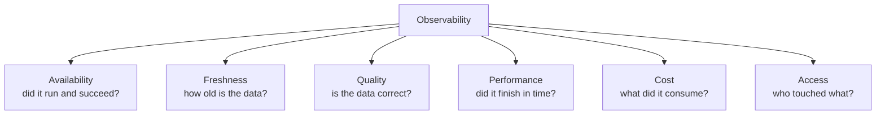
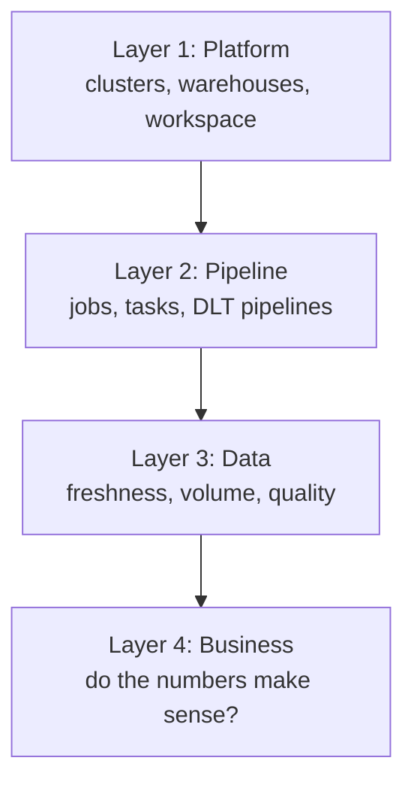
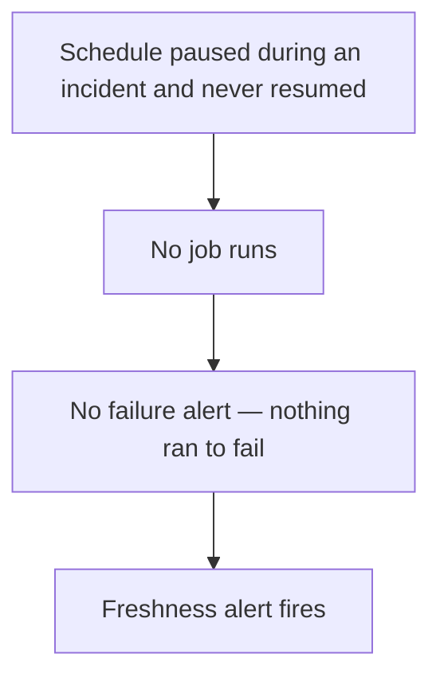
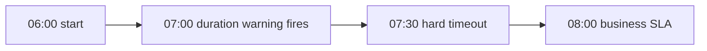
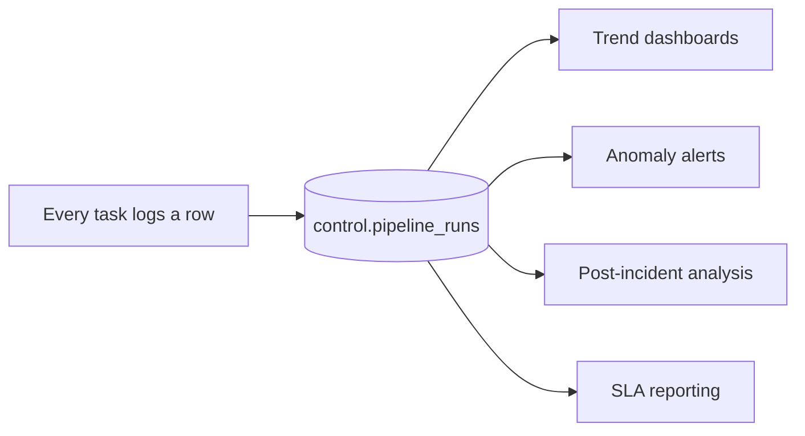
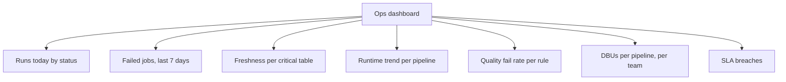
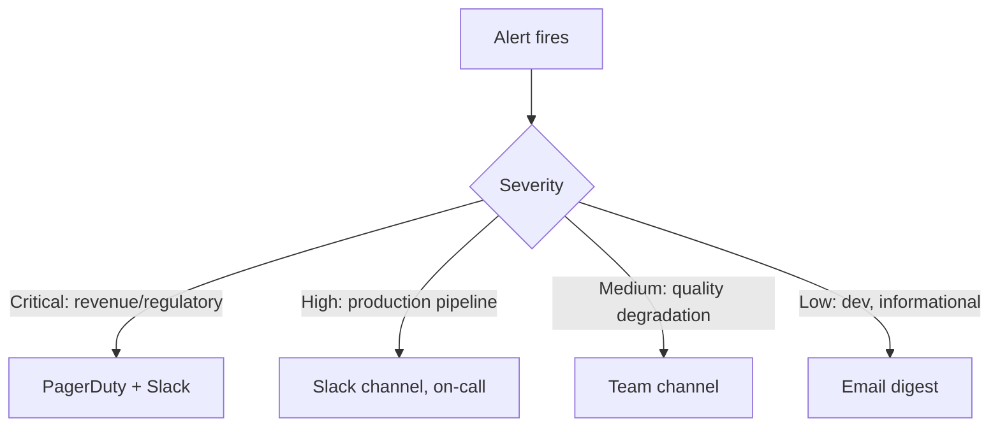
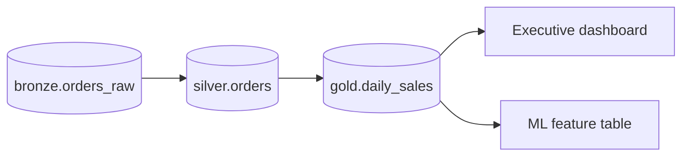

# The Observability Stack

## What to Monitor



| Dimension | Question | Source |
|-----------|----------|--------|
| Availability | Did the job run and succeed? | `system.lakeflow.job_run_timeline` |
| Freshness | How old is the newest row? | The table itself |
| Quality | Are values valid, complete, plausible? | Quality checks / DLT expectations |
| Performance | Runtime versus SLA | Job run history, Spark UI |
| Cost | DBUs per job, per team | `system.billing.usage` |
| Access | Who read or changed what? | `system.access.audit` |

---

## The Layered Model



```text
Teams instrument layer 2 and stop. The incidents that hurt come from
layers 3 and 4, where nothing throws an exception.
```

---

## The Four Essential Alerts

Every production pipeline needs all four. Each catches a failure the others
cannot see.

### 1. Failure alert — "it crashed"

```yaml
email_notifications:
  on_failure: [data-oncall@company.com]
  no_alert_for_skipped_runs: true
```

```text
Catches: exceptions, timeouts, cluster failures, permission errors
Misses:  everything that does not throw
```

### 2. Freshness alert — "it never ran"

```sql
SELECT
    datediff(minute, max(_ingested_at), current_timestamp()) AS minutes_stale
FROM main.bronze.orders_raw;
-- Alert when > expected interval × 2
```



```text
Catches: paused schedules, deleted triggers, upstream stopped delivering,
         a broken notification queue, a disabled service principal
This is the alert that catches the incidents nobody expects.
```

### 3. Quality alert — "it ran but the data is wrong"

```sql
SELECT count(*) AS bad_rows
FROM main.silver.orders
WHERE order_date = current_date()
  AND (order_id IS NULL OR amount < 0);
-- Alert when > 0
```

```sql
-- Volume anomaly: 3 sigma from the 30-day mean
WITH daily AS (
    SELECT date(_ingested_at) d, count(*) n
    FROM main.bronze.orders_raw
    WHERE _ingested_at >= current_date() - INTERVAL 30 DAYS
    GROUP BY 1
), base AS (
    SELECT avg(n) mu, stddev(n) sd FROM daily WHERE d < current_date()
)
SELECT d.d, d.n, round(b.mu) AS expected
FROM daily d CROSS JOIN base b
WHERE d.d = current_date() - INTERVAL 1 DAY
  AND abs(d.n - b.mu) > 3 * b.sd;
```

### 4. Duration alert — "it ran correctly but too slowly"

```yaml
health:
  rules:
    - metric: RUN_DURATION_SECONDS
      op: GREATER_THAN
      value: 3600
email_notifications:
  on_duration_warning_threshold_exceeded: [data-team@company.com]
```



```text
The warning exists so a human can act BEFORE the SLA is missed.
warning threshold < timeout < SLA.
```

---

## Building a Control Table

Alerts tell you about now. A control table gives you history and trends.

```sql
CREATE TABLE IF NOT EXISTS main.control.pipeline_runs (
    pipeline_name   STRING,
    run_id          STRING,
    run_date        DATE,
    layer           STRING,
    table_name      STRING,
    rows_in         BIGINT,
    rows_out        BIGINT,
    rows_quarantined BIGINT,
    duration_seconds INT,
    status          STRING,
    error_message   STRING,
    logged_at       TIMESTAMP
) USING DELTA;
```

```python
from pyspark.sql import functions as F
import time

def log_run(spark, **kwargs):
    (spark.createDataFrame([kwargs])
        .withColumn("logged_at", F.current_timestamp())
        .write.format("delta").mode("append")
        .option("mergeSchema", "true")
        .saveAsTable("main.control.pipeline_runs"))

start = time.time()
try:
    rows_out = build_silver(spark, run_date)
    log_run(spark, pipeline_name="retail_daily", run_id=run_id, run_date=run_date,
            layer="silver", table_name="silver.orders", rows_out=rows_out,
            duration_seconds=int(time.time() - start), status="SUCCESS")
except Exception as e:
    log_run(spark, pipeline_name="retail_daily", run_id=run_id, run_date=run_date,
            layer="silver", status="FAILED", error_message=str(e)[:1000],
            duration_seconds=int(time.time() - start))
    raise
```



```text
This table costs almost nothing and answers questions no built-in
telemetry can: "how many rows did silver.orders load each day for
the last six months, and when did that change?"
```

---

## The Operations Dashboard



```sql
-- Tile: freshness of every critical table
SELECT 'bronze.orders'  AS tbl, max(_ingested_at) AS last_load FROM main.bronze.orders_raw
UNION ALL
SELECT 'silver.orders', max(_ingested_at) FROM main.silver.orders
UNION ALL
SELECT 'gold.daily_sales', max(_updated_at) FROM main.gold.daily_sales_summary;
```

```sql
-- Tile: runtime trend
SELECT pipeline_name, run_date, sum(duration_seconds) / 60 AS minutes
FROM main.control.pipeline_runs
WHERE run_date >= current_date() - INTERVAL 30 DAYS
GROUP BY 1, 2 ORDER BY 2;
```

```sql
-- Tile: today's status summary
SELECT status, count(*) AS runs
FROM main.control.pipeline_runs
WHERE run_date = current_date()
GROUP BY status;
```

```text
Dashboard design rule (topic 09 applies here too):
every tile should answer "is this good or bad?", not just "what is this?"
Add thresholds, comparisons, and a "data as of" timestamp.
```

---

## Alert Routing and Severity



```text
Every alert must have:
✔ An owner (a team, not a person who might be on holiday)
✔ A runbook link
✔ A severity that determines the route
✔ A clear message: what is wrong, how bad, what to do

Every alert must also be reviewed periodically:
if nobody has acted on it in three months, delete it.
```

```text
❌ "Alert: data_check triggered"
✅ "SILVER LOAD: 1,204 invalid rows in silver.orders for 2026-09-18 (2.4%).
    Gold NOT refreshed. Runbook: wiki/runbooks/silver-orders
    Owner: @data-platform-oncall"
```

---

## SLAs and SLOs

```text
SLA: what the business is promised
     "the sales dashboard is fresh by 08:00 on business days"

SLO: the internal target that protects it
     "the gold pipeline completes by 07:15 on 99% of days"

Error budget: 1% of days ≈ 3 days per year may miss
```

```sql
-- SLO compliance over the last 90 days
WITH runs AS (
    SELECT run_date,
           max(CASE WHEN table_name = 'gold.daily_sales' THEN logged_at END) AS gold_done
    FROM main.control.pipeline_runs
    WHERE run_date >= current_date() - INTERVAL 90 DAYS AND status = 'SUCCESS'
    GROUP BY run_date
)
SELECT
    count(*)                                                        AS days,
    sum(CASE WHEN hour(gold_done) < 7 THEN 1 ELSE 0 END)            AS met,
    round(100.0 * sum(CASE WHEN hour(gold_done) < 7 THEN 1 ELSE 0 END) / count(*), 2) AS pct_met
FROM runs;
```

```text
Publishing this number changes conversations. "The pipeline is
usually fine" becomes "we met the SLO on 97.8% of days, below our
99% target, driven by three incidents in August."
```

---

## Lineage as an Observability Tool



```text
Unity Catalog captures lineage automatically. Use it to answer:

"This gold table is wrong — which upstream tables feed it?"
"We need to change silver.orders — what breaks?"
"Who queries this table? Can we deprecate it?"
```

```sql
-- Downstream consumers of a table
SELECT DISTINCT target_table_full_name
FROM system.access.table_lineage
WHERE source_table_full_name = 'main.silver.orders'
  AND event_time >= current_date() - INTERVAL 30 DAYS;
```

```sql
-- Tables nobody has queried in 90 days (deprecation candidates)
SELECT table_full_name, max(event_time) AS last_access
FROM system.access.table_lineage
GROUP BY table_full_name
HAVING max(event_time) < current_date() - INTERVAL 90 DAYS;
```

---

## Instrumentation Checklist for a New Pipeline

```text
Alerts
✔ on_failure notification to a monitored channel
✔ Freshness alert on the output table
✔ Quality checks with a gate before publishing
✔ Duration warning below the SLA, hard timeout above it

Logging
✔ Row counts in and out per task, to a control table
✔ Quarantine counts
✔ Run duration and status
✔ Cluster log delivery enabled

Dashboards
✔ Pipeline appears on the team ops dashboard
✔ Runtime and volume trends visible

Governance
✔ Runs as a service principal
✔ Owner and runbook documented
✔ Cost visible in the per-team DBU report
```

---

## Common Interview Questions

### What should you monitor in a data platform?

Availability, freshness, quality, performance against SLA, cost, and access — not
just job success.

### Which four alerts does every pipeline need?

Failure, freshness, data quality, and duration. Each catches a failure mode the
others cannot see.

### Why is a freshness alert essential if you already alert on failure?

A job that never runs — paused schedule, deleted trigger, disabled identity —
produces no failure to alert on. Only freshness catches it.

### What is the value of a control table of pipeline runs?

It provides history and trends that no built-in telemetry gives: row counts per
table per day, quarantine volumes, duration trends, and the evidence needed for
post-incident analysis and SLO reporting.

### How do you avoid alert fatigue?

Severity-based routing, retrigger intervals, an owner and runbook per alert,
actionable messages, and periodically deleting alerts nobody acts on.

### What is the difference between an SLA and an SLO?

The SLA is the promise to the business; the SLO is the stricter internal target
that protects it, with an error budget quantifying acceptable misses.

### How is lineage useful operationally?

To find the upstream source of a wrong number, assess the blast radius of a
change, and identify unused tables that can be deprecated.

---

## Quick Revision

```text
Monitor: availability | freshness | quality | performance | cost | access

Four alerts:
1. Failure   → it crashed
2. Freshness → it never ran        ← the one most teams lack
3. Quality   → it wrote bad data
4. Duration  → it was too slow

Control table: pipeline_name, run_date, table, rows_in/out, quarantined,
               duration, status, error → trends and post-incident analysis

Dashboard tiles: status today | failures 7d | freshness | runtime trend |
                 quality fail rate | DBUs per team | SLA compliance

Alert hygiene: owner + runbook + severity routing + actionable message
               + delete what nobody acts on

SLA (business promise) vs SLO (internal target) + error budget

Lineage: blast radius, root cause, deprecation candidates
```
