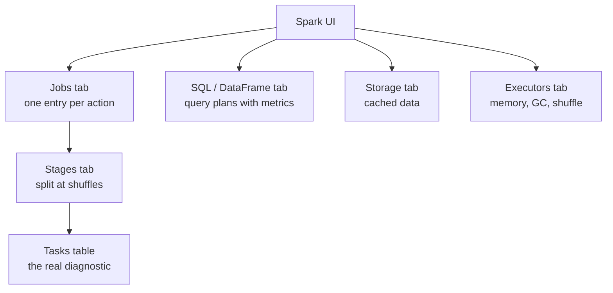
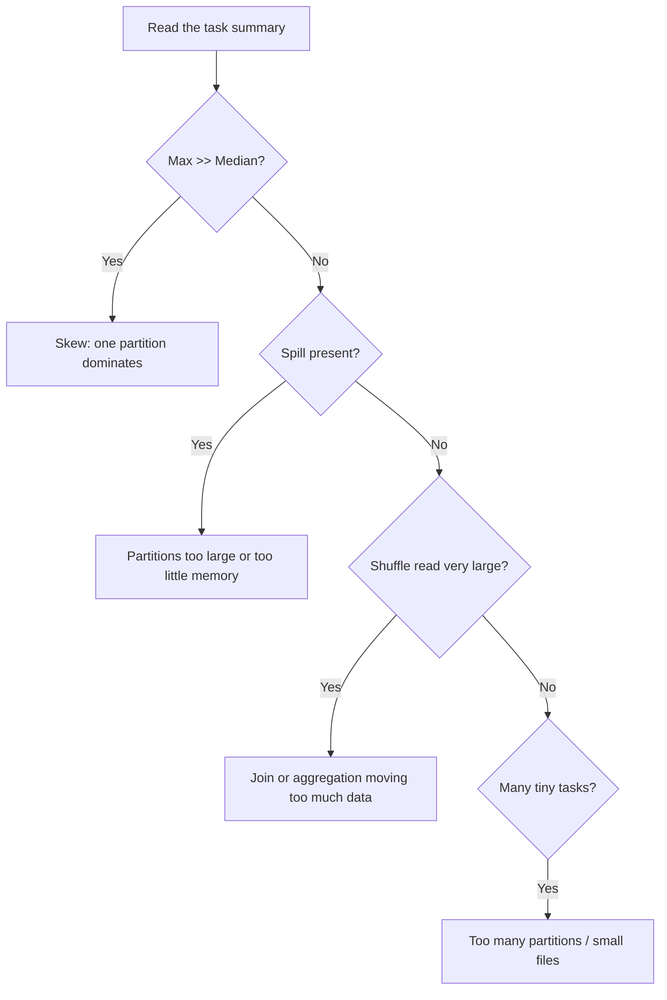
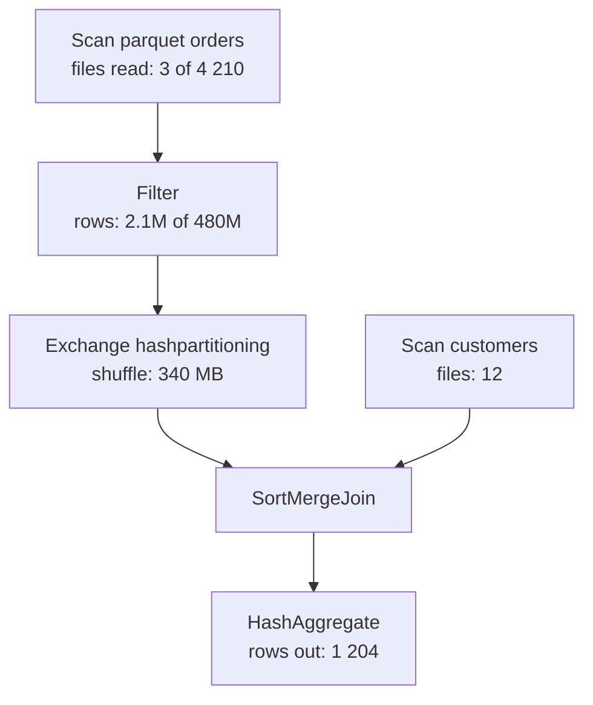
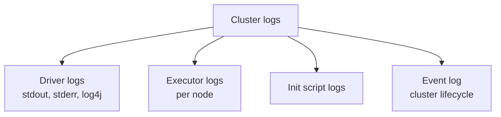
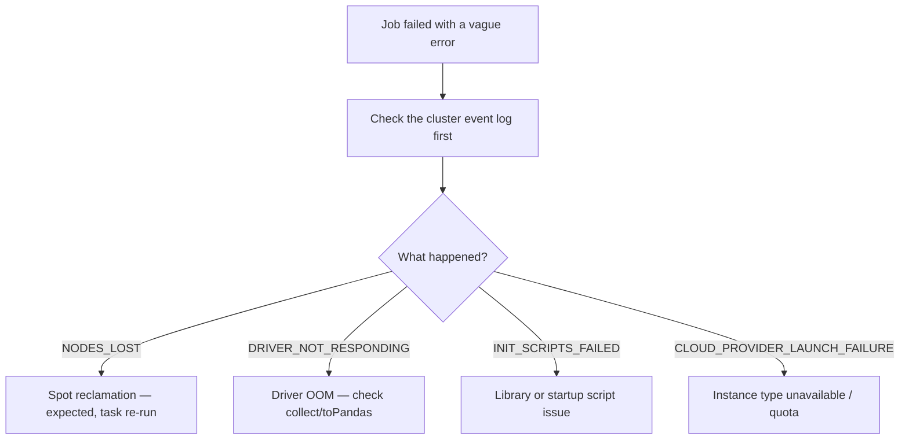
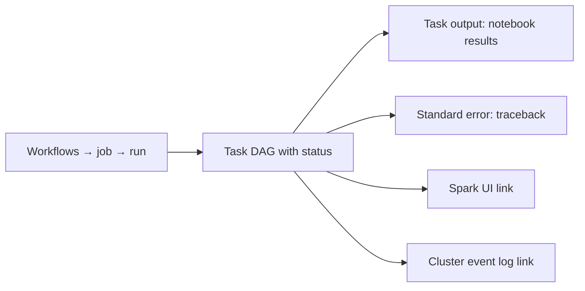
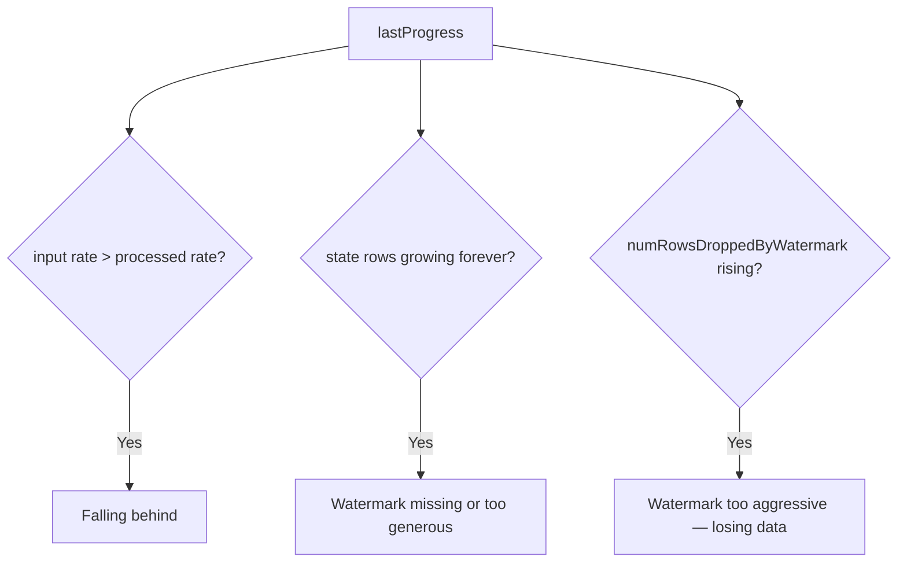
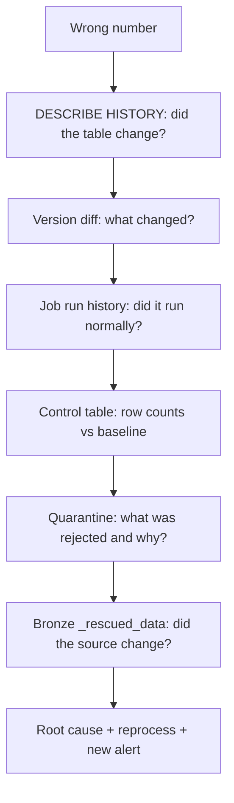

# Spark UI, Logs, and Event Logs

System tables tell you **which** job is slow. These tools tell you **why**.

---

## Navigating the Spark UI



```text
Access: cluster → Spark UI, or job run → task → Spark UI.
For a terminated cluster, the UI is available only if cluster log
delivery was configured — which is why you configure it in advance.
```

---

## The Tasks Table Is the Whole Game

For the slowest stage, look at the summary metrics:

```text
Metric              Min    25th   Median  75th    Max
Duration            2 s    3 s    4 s     5 s     3 200 s   ← SKEW
GC Time             0.1 s  0.2 s  0.2 s   0.3 s   180 s
Shuffle Read        12 MB  14 MB  15 MB   16 MB   9.2 GB    ← SKEW confirmed
Spill (Disk)        0      0      0       0       42 GB     ← memory pressure
```



| Column | What a bad value means |
|--------|------------------------|
| Duration max >> median | Skew |
| GC Time high | Memory pressure, too much cached data |
| Shuffle Read/Write large | Expensive join or wide aggregation |
| Spill (Memory/Disk) > 0 | Partitions too big for available memory |
| Input Size large, output rows small | Poor pruning — a layout problem |
| Scheduler Delay high | Cluster starting, or resource contention |

---

## The SQL / DataFrame Tab

```text
Shows the physical plan as a diagram, annotated with real metrics:
rows output per operator, bytes read, time spent, files pruned.
```



```text
Read it bottom-up for cost, top-down for logic. The two numbers that
matter most:
✔ "files read: 3 of 4 210"  → pruning is working
✔ "rows: 2.1M of 480M"      → the filter is selective and applied early
```

---

## Reading Query Plans in Code

```python
df.explain(True)          # parsed → analysed → optimised → physical
df.explain("formatted")   # readable operator tree
df.explain("cost")        # with statistics estimates
```

```text
What to look for in a physical plan:

BroadcastHashJoin        ✔ small side broadcast
SortMergeJoin            → both sides shuffled; is that necessary?
BroadcastNestedLoopJoin  ❌ almost always a missing join condition
Exchange                 → a shuffle; count them
PhotonScan / Photon*     ✔ Photon is handling it
ColumnarToRow            → a fallback out of Photon, often a UDF
PushedFilters: [...]     ✔ predicates pushed into the scan
PartitionFilters: [...]  ✔ partition pruning applied
```

---

## Cluster Logs



```text
Driver logs      → your print statements, Python tracebacks, job orchestration
Executor logs    → task-level failures, OOM kills
Init script logs → library install failures, startup problems
Event log        → why the cluster failed to start, resize, or terminate
```

### Configuring log delivery

```json
{
  "cluster_log_conf": {
    "volumes": { "destination": "/Volumes/main/ops/cluster_logs" }
  }
}
```

```yaml
# In a bundle
new_cluster:
  cluster_log_conf:
    volumes:
      destination: /Volumes/main/ops/cluster_logs
```

```text
Without this, logs die with the cluster. The first time you need to
investigate a failure from last Tuesday and find nothing, you will
configure it everywhere — configure it now instead.
```

### Querying delivered logs

```python
logs = (spark.read.text("/Volumes/main/ops/cluster_logs/*/driver/log4j-*")
        .filter("value LIKE '%ERROR%'"))
logs.show(50, truncate=False)
```

---

## Cluster Event Log

```text
Cluster → Event log

Common events:
CREATING / STARTING / RUNNING / TERMINATING
RESIZING                 autoscaling activity
NODES_LOST               spot reclamation
DRIVER_NOT_RESPONDING    driver overloaded or OOM
INIT_SCRIPTS_FAILED      startup script error
CLOUD_PROVIDER_LAUNCH_FAILURE  capacity or quota problem
```



```text
A surprising share of "Spark errors" are actually cluster events.
Check the event log before debugging code.
```

---

## Job Run Output



```text
For a failed notebook task, the traceback appears in the task output.
Read the LAST Python frame — the Spark stack trace above it is usually
noise from the JVM boundary.
```

```python
# Structured logging beats print() for production tasks
import logging
logger = logging.getLogger(__name__)
logger.setLevel(logging.INFO)

logger.info("Starting silver load", extra={"run_date": run_date})
logger.info(f"Read {src.count()} rows from bronze")
```

---

## DLT Event Log

DLT pipelines have their own structured log, richer than anything a hand-written
pipeline provides for free.

```sql
-- Update outcomes
SELECT timestamp, details:update_progress:state AS state
FROM event_log(TABLE(main.retail.gold_daily_sales))
WHERE event_type = 'update_progress'
ORDER BY timestamp DESC LIMIT 20;
```

```sql
-- Rows written per flow per run
SELECT
    timestamp,
    origin.flow_name,
    details:flow_progress:metrics:num_output_rows AS rows_written
FROM event_log(TABLE(main.retail.gold_daily_sales))
WHERE event_type = 'flow_progress'
  AND details:flow_progress:metrics IS NOT NULL
ORDER BY timestamp DESC;
```

```sql
-- Errors with messages
SELECT timestamp, message, details
FROM event_log(TABLE(main.retail.gold_daily_sales))
WHERE level = 'ERROR'
ORDER BY timestamp DESC LIMIT 20;
```

```sql
-- Expectation results
SELECT timestamp, details:flow_progress:data_quality:expectations
FROM event_log(TABLE(main.retail.gold_daily_sales))
WHERE details:flow_progress:data_quality IS NOT NULL
ORDER BY timestamp DESC;
```

See topic 13 for a full quality view built on this.

---

## Streaming Query Metrics

```python
q = spark.streams.active[0]
p = q.lastProgress

print("batch:", p["batchId"])
print("input rows:", p["numInputRows"])
print("input rate:", p.get("inputRowsPerSecond"))
print("processing rate:", p.get("processedRowsPerSecond"))
print("batch duration ms:", p.get("batchDuration"))
print("watermark:", p.get("eventTime", {}).get("watermark"))

for op in p.get("stateOperators", []):
    print("state rows:", op["numRowsTotal"],
          "dropped late:", op.get("numRowsDroppedByWatermark"))
```



Persist these with a `StreamingQueryListener` (topic 11) so they survive the
cluster.

---

## Delta Table Diagnostics

```sql
-- Physical health
DESCRIBE DETAIL main.silver.orders;
-- numFiles, sizeInBytes, partitionColumns, clusteringColumns, location

-- Change history: who changed what, when, and how
DESCRIBE HISTORY main.silver.orders LIMIT 20;
-- version, timestamp, operation, operationParameters, operationMetrics
```

```sql
-- What did the last write actually do?
SELECT version, timestamp, operation,
       operationMetrics.numOutputRows,
       operationMetrics.numFiles,
       operationMetrics.numTargetRowsUpdated,
       operationMetrics.numTargetRowsInserted,
       operationMetrics.numTargetRowsDeleted
FROM (DESCRIBE HISTORY main.silver.orders)
ORDER BY version DESC LIMIT 10;
```

```text
DESCRIBE HISTORY is the first thing to run when a number looks wrong:
it shows whether the table changed, when, by which operation, and
how many rows were affected.
```

```sql
-- Compare two versions to see what changed
SELECT * FROM main.gold.daily_sales VERSION AS OF 42
EXCEPT
SELECT * FROM main.gold.daily_sales VERSION AS OF 41;
```

---

## A Diagnostic Walkthrough

```text
Report: "yesterday's revenue number is too low"

1. DESCRIBE HISTORY main.gold.daily_sales
   → last write at 06:42, MERGE, numTargetRowsUpdated = 1 204
2. Compare versions 41 and 42 → India revenue dropped 40%
3. system.lakeflow.job_run_timeline → the job succeeded, normal duration
4. main.control.pipeline_runs → silver row count was 60% of the 30-day average
5. Quarantine table → 40% of rows rejected with _fail_valid_date
6. Bronze _rescued_data → the vendor changed the date format
7. Root cause: upstream format change; silver cast to null; rows quarantined
8. Fix: handle both formats, reprocess from bronze (possible because
   bronze kept everything), add an alert on quarantine rate
```



```text
Notice: no step required the Spark UI. Data correctness incidents are
investigated through Delta history and your own logging, not through
execution metrics.
```

---

## Common Interview Questions

### Where do you start when a job is slow?

The Spark UI for the slowest stage, then the task summary metrics — duration and
shuffle read min/median/max — which immediately reveal skew or spill.

### What does a large gap between max and median task duration mean?

Data skew: one partition holds far more data than the rest.

### Where do logs go after a job cluster terminates?

Nowhere, unless cluster log delivery is configured to a volume or cloud storage
path in advance.

### What is in the cluster event log and why check it?

Cluster lifecycle events — node loss, driver not responding, init script
failures, cloud capacity problems. Many apparent Spark errors are actually
cluster events.

### How do you investigate a wrong number in a gold table?

`DESCRIBE HISTORY` to see whether and when it changed, a version diff to see
what changed, job run history to confirm execution, your control table for volume
anomalies, and the quarantine and rescued-data tables for the root cause.

### What does `DESCRIBE DETAIL` tell you?

Physical table health: file count, total size, partition and clustering columns,
and location — the fastest way to detect a small-file problem.

### How do you monitor a running stream?

`lastProgress` metrics: input versus processed rate, batch duration, state row
count, and rows dropped by the watermark — persisted with a
`StreamingQueryListener` so they outlive the cluster.

### What does `BroadcastNestedLoopJoin` in a plan indicate?

Usually a missing equality join condition, producing a near-cartesian join.

---

## Quick Revision

```text
Spark UI:
slowest stage → task summary (min/median/max)
max >> median → skew | spill > 0 → memory | huge shuffle → join cost
SQL tab shows files pruned and rows per operator

Plans:
explain("formatted"); look for BroadcastHashJoin, Exchange count,
PushedFilters, PartitionFilters, ColumnarToRow (Photon fallback)

Logs:
driver (your prints, tracebacks) | executor (OOM) | init scripts | event log
configure cluster_log_conf in advance or they are lost

Cluster event log: NODES_LOST, DRIVER_NOT_RESPONDING, INIT_SCRIPTS_FAILED

DLT: event_log(TABLE(...)) → update state, rows written, expectations, errors
Streaming: lastProgress → rates, batch duration, state rows, dropped late rows

Delta:
DESCRIBE DETAIL  → file count and size (small files)
DESCRIBE HISTORY → what changed, when, how many rows
VERSION AS OF diff → exactly which rows changed

Correctness incidents: Delta history + your control/quarantine tables,
not the Spark UI
```
