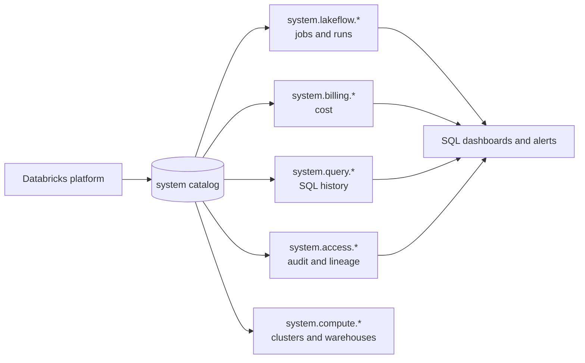
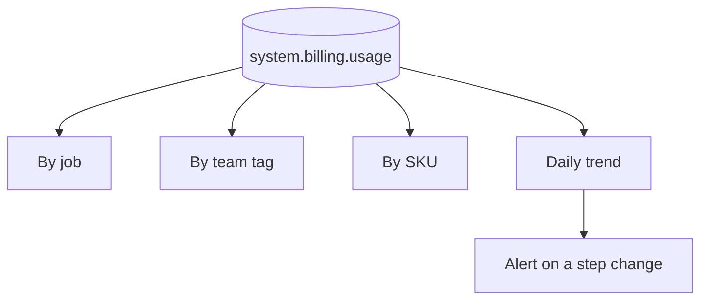
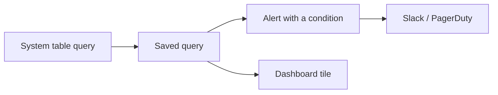

# System Tables

## What They Are

System tables are Databricks-managed Delta tables in the `system` catalog
containing operational telemetry about your account: job runs, billing, query
history, audit events, and lineage.



```text
They turn platform operations into a data problem you already know how
to solve: write SQL, build a dashboard, set an alert.
```

---

## Enabling Them

```sql
-- Check what is available
SHOW SCHEMAS IN system;
SHOW TABLES IN system.lakeflow;

-- Schemas are enabled per metastore by an account admin
-- (via the CLI / API; the billing schema is typically on by default)
GRANT USE CATALOG ON CATALOG system TO `data-platform-admins`;
GRANT USE SCHEMA ON SCHEMA system.lakeflow TO `data-platform-admins`;
GRANT SELECT ON SCHEMA system.lakeflow TO `data-platform-admins`;
```

```text
Data retention varies by schema (commonly around a year). For longer
history, snapshot what you need into your own Delta tables on a schedule.
```

---

## The Schemas That Matter

| Schema | Contains |
|--------|----------|
| `system.lakeflow` | Jobs, tasks, run timelines |
| `system.billing` | DBU usage and list prices |
| `system.query` | SQL warehouse query history |
| `system.access` | Audit logs, table and column lineage |
| `system.compute` | Cluster and warehouse metadata |
| `system.storage` | Predictive optimization operations |

---

## Job Monitoring: `system.lakeflow`

```sql
-- Every run in the last 7 days with its outcome
SELECT
    j.name                                AS job_name,
    r.run_id,
    r.result_state,
    r.period_start_time,
    r.period_end_time,
    round((unix_timestamp(r.period_end_time)
         - unix_timestamp(r.period_start_time)) / 60.0, 1) AS minutes
FROM system.lakeflow.job_run_timeline r
JOIN system.lakeflow.jobs j
  ON r.job_id = j.job_id AND r.workspace_id = j.workspace_id
WHERE r.period_start_time >= current_date() - INTERVAL 7 DAYS
ORDER BY r.period_start_time DESC;
```

```sql
-- Failure rate per job over 30 days
SELECT
    j.name AS job_name,
    count(*)                                                        AS total_runs,
    sum(CASE WHEN r.result_state = 'SUCCEEDED' THEN 1 ELSE 0 END)   AS succeeded,
    sum(CASE WHEN r.result_state = 'FAILED' THEN 1 ELSE 0 END)      AS failed,
    round(100.0 * sum(CASE WHEN r.result_state = 'FAILED' THEN 1 ELSE 0 END)
          / count(*), 1)                                            AS failure_pct
FROM system.lakeflow.job_run_timeline r
JOIN system.lakeflow.jobs j USING (job_id, workspace_id)
WHERE r.period_start_time >= current_date() - INTERVAL 30 DAYS
GROUP BY j.name
HAVING failed > 0
ORDER BY failure_pct DESC;
```

```sql
-- Runtime trend: which pipelines are getting slower?
WITH weekly AS (
    SELECT
        j.name AS job_name,
        date_trunc('week', r.period_start_time) AS wk,
        avg((unix_timestamp(r.period_end_time)
           - unix_timestamp(r.period_start_time)) / 60.0) AS avg_minutes
    FROM system.lakeflow.job_run_timeline r
    JOIN system.lakeflow.jobs j USING (job_id, workspace_id)
    WHERE r.period_start_time >= current_date() - INTERVAL 90 DAYS
      AND r.result_state = 'SUCCEEDED'
    GROUP BY 1, 2
)
SELECT
    job_name, wk, round(avg_minutes, 1) AS avg_minutes,
    round(avg_minutes - lag(avg_minutes) OVER (PARTITION BY job_name ORDER BY wk), 1) AS delta
FROM weekly
ORDER BY job_name, wk;
```

```sql
-- Which TASK inside a job is the bottleneck?
SELECT
    t.task_key,
    count(*) AS runs,
    round(avg((unix_timestamp(t.period_end_time)
             - unix_timestamp(t.period_start_time)) / 60.0), 1) AS avg_minutes,
    round(max((unix_timestamp(t.period_end_time)
             - unix_timestamp(t.period_start_time)) / 60.0), 1) AS max_minutes
FROM system.lakeflow.job_task_run_timeline t
WHERE t.period_start_time >= current_date() - INTERVAL 7 DAYS
  AND t.job_id = 620745
GROUP BY t.task_key
ORDER BY avg_minutes DESC;
```

```sql
-- Jobs that have not run at all recently (silently disabled)
SELECT j.name, max(r.period_start_time) AS last_run
FROM system.lakeflow.jobs j
LEFT JOIN system.lakeflow.job_run_timeline r USING (job_id, workspace_id)
GROUP BY j.name
HAVING max(r.period_start_time) < current_date() - INTERVAL 7 DAYS
    OR max(r.period_start_time) IS NULL;
```

```text
That last query is the platform-wide version of a freshness alert,
and it regularly finds jobs somebody paused months ago.
```

---

## Cost Monitoring: `system.billing`

```sql
-- DBUs by job over 30 days
SELECT
    u.usage_metadata.job_id,
    j.name AS job_name,
    round(sum(u.usage_quantity), 1) AS dbus
FROM system.billing.usage u
LEFT JOIN system.lakeflow.jobs j
  ON u.usage_metadata.job_id = j.job_id
WHERE u.usage_date >= current_date() - INTERVAL 30 DAYS
  AND u.usage_metadata.job_id IS NOT NULL
GROUP BY 1, 2
ORDER BY dbus DESC
LIMIT 25;
```

```sql
-- Estimated cost using list prices
SELECT
    u.sku_name,
    round(sum(u.usage_quantity), 1)                       AS dbus,
    round(sum(u.usage_quantity * p.pricing.default), 2)   AS est_cost_usd
FROM system.billing.usage u
JOIN system.billing.list_prices p
  ON u.sku_name = p.sku_name
 AND u.usage_end_time >= p.price_start_time
 AND (p.price_end_time IS NULL OR u.usage_end_time < p.price_end_time)
WHERE u.usage_date >= current_date() - INTERVAL 30 DAYS
GROUP BY u.sku_name
ORDER BY est_cost_usd DESC;
```

```sql
-- Cost by team, via cluster tags
SELECT
    coalesce(custom_tags.team, 'UNTAGGED') AS team,
    round(sum(usage_quantity), 1)          AS dbus
FROM system.billing.usage
WHERE usage_date >= current_date() - INTERVAL 30 DAYS
GROUP BY 1
ORDER BY dbus DESC;
```

```sql
-- The anti-pattern hunt: all-purpose compute used for scheduled work
SELECT
    usage_metadata.cluster_id,
    sku_name,
    round(sum(usage_quantity), 1) AS dbus
FROM system.billing.usage
WHERE usage_date >= current_date() - INTERVAL 30 DAYS
  AND sku_name LIKE '%ALL_PURPOSE%'
GROUP BY 1, 2
ORDER BY dbus DESC;
```

```sql
-- Daily spend trend, to catch a step change early
SELECT usage_date, round(sum(usage_quantity), 1) AS dbus
FROM system.billing.usage
WHERE usage_date >= current_date() - INTERVAL 60 DAYS
GROUP BY usage_date
ORDER BY usage_date;
```



---

## Query Monitoring: `system.query`

```sql
-- Slowest queries yesterday
SELECT
    executed_by,
    left(statement_text, 120)      AS query_preview,
    round(total_duration_ms / 1000.0, 1) AS seconds,
    round(read_bytes / 1e9, 2)     AS gb_read,
    round(read_rows / 1e6, 2)      AS million_rows,
    warehouse_id
FROM system.query.history
WHERE start_time >= current_date() - INTERVAL 1 DAY
ORDER BY total_duration_ms DESC
LIMIT 25;
```

```sql
-- Queries scanning far more than they return (missing pruning)
SELECT
    left(statement_text, 120) AS query_preview,
    round(read_bytes / 1e9, 2) AS gb_read,
    produced_rows,
    round(read_rows / nullif(produced_rows, 0), 0) AS rows_read_per_row_returned
FROM system.query.history
WHERE start_time >= current_date() - INTERVAL 7 DAYS
  AND produced_rows > 0
  AND read_rows / nullif(produced_rows, 0) > 10000
ORDER BY read_bytes DESC
LIMIT 25;
```

```sql
-- Who and what is driving warehouse load?
SELECT
    warehouse_id,
    executed_by,
    count(*)                              AS queries,
    round(sum(total_duration_ms) / 60000.0, 1) AS total_minutes
FROM system.query.history
WHERE start_time >= current_date() - INTERVAL 7 DAYS
GROUP BY 1, 2
ORDER BY total_minutes DESC
LIMIT 25;
```

---

## Audit and Lineage: `system.access`

```sql
-- Who accessed a sensitive table?
SELECT
    event_time,
    user_identity.email,
    action_name,
    request_params.full_name_arg AS table_name
FROM system.access.audit
WHERE event_date >= current_date() - INTERVAL 30 DAYS
  AND service_name = 'unityCatalog'
  AND request_params.full_name_arg = 'main.gold.customer_pii'
ORDER BY event_time DESC;
```

```sql
-- Permission changes (who granted what, to whom)
SELECT
    event_time,
    user_identity.email AS changed_by,
    action_name,
    request_params
FROM system.access.audit
WHERE event_date >= current_date() - INTERVAL 30 DAYS
  AND action_name IN ('updatePermissions', 'updateSharePermissions')
ORDER BY event_time DESC;
```

```sql
-- Failed authentication or authorisation attempts
SELECT event_time, user_identity.email, action_name, response.error_message
FROM system.access.audit
WHERE event_date >= current_date() - INTERVAL 7 DAYS
  AND response.status_code >= 400
ORDER BY event_time DESC
LIMIT 50;
```

```sql
-- Lineage: what consumes this table?
SELECT DISTINCT
    target_table_full_name,
    entity_type,
    max(event_time) AS last_seen
FROM system.access.table_lineage
WHERE source_table_full_name = 'main.silver.orders'
  AND event_time >= current_date() - INTERVAL 30 DAYS
GROUP BY 1, 2;
```

```sql
-- Unused tables: deprecation candidates
SELECT
    source_table_full_name AS table_name,
    max(event_time)        AS last_accessed
FROM system.access.table_lineage
GROUP BY 1
HAVING max(event_time) < current_date() - INTERVAL 90 DAYS
ORDER BY last_accessed;
```

---

## Turning Queries into Alerts



```text
Alert 1: any job failed in the last hour
Alert 2: a critical job has not run in 26 hours
Alert 3: daily DBUs exceed the baseline by 50%
Alert 4: a job's average runtime this week is 1.5× last week
Alert 5: permission changes on the production catalog
Alert 6: failed authorisation attempts above a threshold
```

```sql
-- Alert 3: cost spike
SELECT round(sum(usage_quantity), 1) AS dbus_yesterday
FROM system.billing.usage
WHERE usage_date = current_date() - INTERVAL 1 DAY;
-- Condition: > your baseline
```

---

## Snapshotting for Long-Term History

```python
# Weekly job: keep history beyond system table retention
(spark.table("system.lakeflow.job_run_timeline")
   .filter("period_start_time >= current_date() - INTERVAL 7 DAYS")
   .write.format("delta").mode("append")
   .saveAsTable("main.control.job_run_history"))
```

```text
Worth doing for:
✔ Year-over-year SLA reporting
✔ Cost trend analysis beyond retention
✔ Regulatory audit requirements
```

---

## Common Interview Questions

### What are Databricks system tables?

Managed Delta tables in the `system` catalog exposing platform telemetry — job
runs, billing, query history, audit events, lineage — queryable with ordinary
SQL.

### How would you report on all job failures across a workspace?

Query `system.lakeflow.job_run_timeline` joined to `system.lakeflow.jobs`,
aggregate by job and result state, and build a dashboard and alert on it.

### How do you attribute Databricks cost to a team?

`system.billing.usage`, grouped by `custom_tags.team` (with tags enforced by
cluster policy) or by `usage_metadata.job_id` joined to job names.

### How do you find queries that are scanning too much data?

`system.query.history`, comparing `read_rows` to `produced_rows` or `read_bytes`
to returned data, which surfaces missing pruning and layout problems.

### How do you detect a job that has silently stopped running?

Left join jobs to run timelines and filter for a maximum run time older than the
expected interval — the platform-wide freshness check.

### How do you audit who accessed a sensitive table?

`system.access.audit` filtered on the Unity Catalog service and the table name,
which also reveals permission changes and failed authorisation attempts.

### What are the limitations of system tables?

They must be enabled per metastore, they have finite retention, and there is some
latency before events appear — so snapshot anything needed for long-term
reporting.

---

## Quick Revision

```text
system.lakeflow.jobs / job_run_timeline / job_task_run_timeline
  → failures, runtime trends, bottleneck tasks, jobs that stopped running

system.billing.usage + list_prices
  → DBUs by job, team tag, SKU; daily trend; all-purpose anti-pattern

system.query.history
  → slowest queries, poor pruning (read_rows vs produced_rows), warehouse load

system.access.audit / table_lineage
  → who accessed what, permission changes, failed auth, consumers, dead tables

Pattern: system table query → saved query → alert + dashboard tile

Caveats: enable per metastore | finite retention | some ingestion latency
→ snapshot into your own Delta tables for long-term history
```
