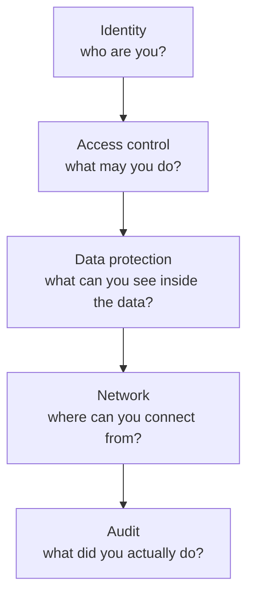
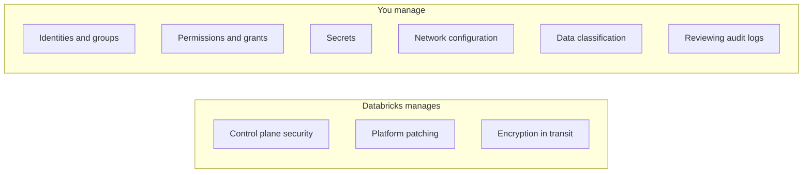

# 17 – Security

Security in Databricks is not one feature. It is five layers, and a gap in any
one of them undoes the others.



```text
Perfect table permissions do not help if credentials sit in a notebook.
Perfect secrets do not help if the workspace is open to the internet.
Perfect networking does not help if everyone is an account admin.
```

---

## Reading Order

| # | File | What you learn |
|---|------|----------------|
| 1 | [identity_and_access.md](identity_and_access.md) | Users, groups, service principals, permission model |
| 2 | [secrets_management.md](secrets_management.md) | Secret scopes, Key Vault, credential handling |
| 3 | [data_protection.md](data_protection.md) | Encryption, masking, row/column security, PII |
| 4 | [network_security.md](network_security.md) | Private connectivity, IP access lists, isolation |
| 5 | [compliance_and_audit.md](compliance_and_audit.md) | Audit logs, retention, regulatory patterns |
| 6 | [interview_questions.md](interview_questions.md) | Questions asked in interviews |

---

## The Shared Responsibility Model



Most real incidents come from the right-hand column.

---

## Quick Revision

```text
Identity:   SCIM-provisioned users, groups, service principals for automation
Access:     Unity Catalog grants to GROUPS, three-level namespace, least privilege
Secrets:    secret scopes (ideally Key Vault backed); never credentials in code
Data:       encryption at rest and in transit, column masks, row filters, PII tagging
Network:    private connectivity, IP access lists, no public endpoints in prod
Audit:      system.access.audit, retained and actually reviewed

Golden rule: production runs as a service principal, permissions go to groups,
and nothing sensitive is ever written in a notebook.
```
