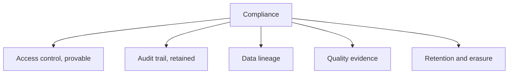
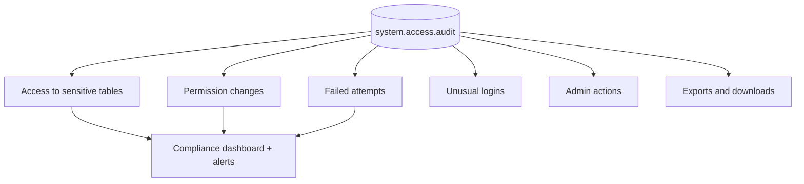
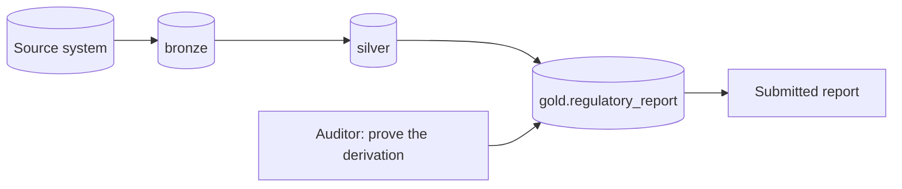
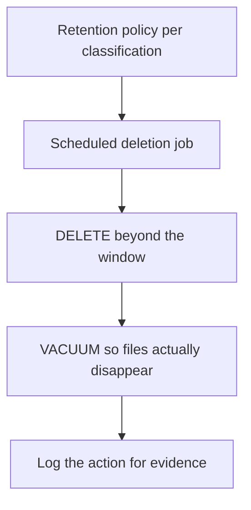
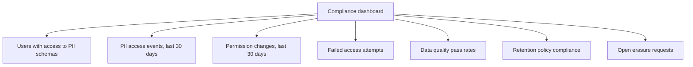

# Compliance and Audit

## What Auditors Actually Ask

```text
1. Who has access to sensitive data, and who approved it?
2. Who has actually accessed it, and when?
3. How do you know data is accurate?
4. How long do you keep data, and how do you delete it?
5. Can you prove all of the above for the last 12 months?
```

Every control in this file exists to answer one of those questions.



---

## The Audit Log

```sql
SELECT
    event_time,
    user_identity.email,
    service_name,
    action_name,
    request_params,
    response.status_code
FROM system.access.audit
WHERE event_date >= current_date() - INTERVAL 7 DAYS
ORDER BY event_time DESC
LIMIT 100;
```

| Service | Captures |
|---------|----------|
| `unityCatalog` | Grants, table creation, data access requests |
| `accounts` | Login, SSO, user and group changes |
| `clusters` | Cluster creation, start, permission changes |
| `jobs` | Job creation, runs, permission changes |
| `notebook` | Notebook operations |
| `secrets` | Scope and ACL operations (never values) |
| `sqlPermissions` | Legacy table ACL changes |

---

## The Queries Auditors Ask For

```sql
-- 1. Who accessed a specific sensitive table?
SELECT event_time, user_identity.email, action_name
FROM system.access.audit
WHERE event_date >= current_date() - INTERVAL 90 DAYS
  AND service_name = 'unityCatalog'
  AND request_params.full_name_arg = 'main.pii.customers'
ORDER BY event_time DESC;
```

```sql
-- 2. Every permission change, and who made it
SELECT event_time, user_identity.email AS changed_by, action_name, request_params
FROM system.access.audit
WHERE event_date >= current_date() - INTERVAL 90 DAYS
  AND action_name IN ('updatePermissions', 'createCatalog', 'createSchema', 'deleteTable')
ORDER BY event_time DESC;
```

```sql
-- 3. Failed access attempts (possible probing or misconfiguration)
SELECT event_time, user_identity.email, action_name, response.error_message
FROM system.access.audit
WHERE event_date >= current_date() - INTERVAL 30 DAYS
  AND response.status_code >= 400
ORDER BY event_time DESC;
```

```sql
-- 4. Logins from unexpected locations
SELECT event_time, user_identity.email, source_ip_address, action_name
FROM system.access.audit
WHERE event_date >= current_date() - INTERVAL 30 DAYS
  AND action_name = 'login'
  AND source_ip_address NOT LIKE '203.0.113.%'
ORDER BY event_time DESC;
```

```sql
-- 5. Admin actions, which should be rare and explainable
SELECT event_time, user_identity.email, action_name, request_params
FROM system.access.audit
WHERE event_date >= current_date() - INTERVAL 90 DAYS
  AND action_name LIKE '%Admin%'
ORDER BY event_time DESC;
```

```sql
-- 6. Data downloads and exports
SELECT event_time, user_identity.email, action_name, request_params
FROM system.access.audit
WHERE event_date >= current_date() - INTERVAL 30 DAYS
  AND action_name IN ('downloadQueryResult', 'downloadPreviewResults')
ORDER BY event_time DESC;
```



---

## Retention Beyond System Table Limits

```python
# Nightly snapshot into a retained table
(spark.table("system.access.audit")
   .filter("event_date = current_date() - INTERVAL 1 DAY")
   .write.format("delta").mode("append")
   .partitionBy("event_date")
   .saveAsTable("main.compliance.audit_archive"))
```

```sql
-- Protect the archive from tampering
ALTER TABLE main.compliance.audit_archive OWNER TO `compliance-admins`;
REVOKE MODIFY ON TABLE main.compliance.audit_archive FROM `data-engineers`;

ALTER TABLE main.compliance.audit_archive SET TBLPROPERTIES (
  'delta.deletedFileRetentionDuration' = 'interval 2555 days'   -- 7 years
);
```

```text
System tables have finite retention. If the requirement is seven years,
archive daily into a table that only the compliance group can modify.
```

---

## Lineage as Compliance Evidence

```sql
-- Where did this regulatory report come from?
SELECT DISTINCT source_table_full_name, event_time
FROM system.access.table_lineage
WHERE target_table_full_name = 'main.gold.regulatory_report'
ORDER BY event_time DESC;
```

```sql
-- Where does PII flow to?
SELECT DISTINCT target_table_full_name
FROM system.access.table_lineage
WHERE source_table_full_name LIKE 'main.pii.%';
```



```text
Automatic lineage answers "where did this number come from?" without a
manual data flow diagram that was accurate once, in 2023.

The PII flow query is the one that finds surprises: a PII column that
someone joined into a widely accessible gold table.
```

---

## Quality Evidence

Auditors increasingly ask how you know the data is right.

```sql
-- Evidence from DLT expectations
SELECT
    date(timestamp) AS day,
    e.name          AS rule,
    sum(e.passed_records) AS passed,
    sum(e.failed_records) AS failed
FROM (
    SELECT timestamp, explode(from_json(
        details:flow_progress:data_quality:expectations,
        'ARRAY<STRUCT<name STRING, passed_records BIGINT, failed_records BIGINT>>')) AS e
    FROM event_log(TABLE(main.retail.gold_daily_sales))
    WHERE details:flow_progress:data_quality:expectations IS NOT NULL
)
GROUP BY 1, 2 ORDER BY 1 DESC;
```

```sql
-- Evidence from your own control table
SELECT run_date, table_name, rows_out, rows_quarantined, status
FROM main.control.pipeline_runs
WHERE run_date >= current_date() - INTERVAL 90 DAYS
ORDER BY run_date DESC;
```

```text
This is why the control table from topic 16 matters for compliance,
not only for operations: it is the durable record that each run
executed, how much data it processed, and what it rejected.
```

---

## Retention and Deletion

```sql
-- Retention per classification tier, expressed as table properties
ALTER TABLE main.bronze.orders_raw SET TBLPROPERTIES (
  'delta.deletedFileRetentionDuration' = 'interval 90 days',
  'classification' = 'internal',
  'retention_policy' = '2 years'
);
```

```python
# Scheduled enforcement job
POLICIES = {
    "main.bronze.orders_raw":   730,   # 2 years
    "main.silver.orders":      1095,   # 3 years
    "main.pii.customers":       365,   # 1 year
}

for table, days in POLICIES.items():
    spark.sql(f"DELETE FROM {table} WHERE _ingested_at < current_date() - INTERVAL {days} DAYS")
    spark.sql(f"VACUUM {table} RETAIN 168 HOURS")
```



```text
Deletion is not complete until VACUUM removes the underlying files.
A DELETE alone leaves the data recoverable through time travel —
which is a finding in a privacy audit.
```

---

## Subject Access and Erasure Requests

```python
def find_subject_data(spark, customer_id):
    """Every table containing this individual."""
    pii_tables = spark.sql("""
        SELECT DISTINCT concat_ws('.', catalog_name, schema_name, table_name) AS t
        FROM system.information_schema.column_tags
        WHERE tag_name = 'pii'
    """).collect()

    found = []
    for row in pii_tables:
        cnt = spark.sql(f"SELECT count(*) c FROM {row.t} WHERE customer_id = {customer_id}").collect()[0].c
        if cnt:
            found.append((row.t, cnt))
    return found
```

```python
def erase_subject(spark, customer_id, tables):
    for t in tables:
        spark.sql(f"DELETE FROM {t} WHERE customer_id = {customer_id}")
    for t in tables:
        spark.sql(f"VACUUM {t} RETAIN 168 HOURS")

    spark.sql(f"""
        INSERT INTO main.compliance.erasure_log
        VALUES ({customer_id}, array({','.join(repr(t) for t in tables)}),
                current_timestamp(), current_user())
    """)
```

```text
The erasure log is itself evidence: it proves the request was received,
which tables were processed, when, and by whom.

Design note: this works only because PII columns are TAGGED. Without
classification, finding every copy of an individual is guesswork.
```

---

## Compliance Dashboard



```sql
-- Tile: who can read PII, and did they?
WITH granted AS (
    SELECT DISTINCT principal FROM (SHOW GRANTS ON SCHEMA main.pii)
),
used AS (
    SELECT user_identity.email AS principal, count(*) AS accesses
    FROM system.access.audit
    WHERE event_date >= current_date() - INTERVAL 90 DAYS
      AND request_params.full_name_arg LIKE 'main.pii.%'
    GROUP BY 1
)
SELECT g.principal, coalesce(u.accesses, 0) AS accesses_90d
FROM granted g LEFT JOIN used u ON g.principal = u.principal
ORDER BY accesses_90d;
```

```text
Rows with zero accesses are the access review output: granted but unused,
therefore revocable without argument.
```

---

## Common Regulatory Patterns

| Requirement | Implementation |
|-------------|----------------|
| Access control provable | UC grants to groups, managed in Terraform, reviewed quarterly |
| Access audit trail | `system.access.audit`, archived for the required period |
| Data minimisation | PII in a separate schema, pseudonymised copies for analytics |
| Right to erasure | Tagged PII, erasure procedure with VACUUM, erasure log |
| Retention limits | Per-table retention policy enforced by a scheduled job |
| Data accuracy | Quality expectations with retained metrics |
| Lineage / provenance | Unity Catalog automatic lineage |
| Segregation of duties | Deployment via service principal, engineers cannot edit prod |
| Change control | Everything in Git with pull request review |
| Encryption | At rest and in transit; CMK where mandated |

```text
Notice how much of this is the platform engineering from topics 15 and 16.
A well-run platform is most of the way to compliant; a click-ops platform
cannot be made compliant with documentation alone.
```

---

## Compliance Readiness Checklist

```text
Access
✔ All grants to groups, defined in code, reviewed quarterly
✔ Production runs as service principals
✔ Admin accounts few, named, and monitored
✔ SCIM deprovisioning verified to work

Audit
✔ system.access.audit archived beyond system retention
✔ Archive owned by a compliance group, not writable by engineers
✔ Alerts on permission changes and failed access
✔ Admin actions reviewed

Data
✔ PII tagged, inventoried, and isolated
✔ Column masks and row filters where appropriate
✔ Retention policy per classification, enforced by a job
✔ Erasure procedure documented, tested, and logged

Evidence
✔ Quality metrics retained (expectations or control table)
✔ Lineage available for regulated outputs
✔ Change history in Git for every pipeline and grant
✔ Incident records with timelines
```

---

## Common Interview Questions

### Where do you find who accessed a table?

`system.access.audit`, filtered on the Unity Catalog service and the table name —
retained per the system table policy, and archived if longer retention is needed.

### How do you retain audit data for seven years?

A scheduled job appending daily partitions from `system.access.audit` into a Delta
table owned by a compliance group, with modify permission revoked from engineers.

### How does lineage help with compliance?

It proves the derivation of a regulated output automatically, and reveals where
PII flows — including into tables it should not have reached.

### Why is `VACUUM` part of an erasure procedure?

A `DELETE` only removes rows from the current version; the data remains
recoverable through time travel until `VACUUM` removes the underlying files.

### How do you find every table containing a specific individual?

Tagged PII columns in `system.information_schema.column_tags` give the candidate
tables, which are then queried by the subject identifier. Without classification
this is guesswork.

### How do you demonstrate data accuracy to an auditor?

Retained quality metrics: DLT expectation pass and fail counts from the event log,
or row counts and quarantine volumes from a control table, over the audit period.

### What is segregation of duties in this context?

Engineers write and review code but cannot change production directly;
deployment happens through CI under a service principal, so no single person can
both author and unilaterally deploy a change.

### How do you run an access review efficiently?

Compare granted access on sensitive schemas with actual access from audit logs,
and revoke everything granted but unused over the review period.

---

## Quick Revision

```text
Auditor questions: who CAN access | who DID access | is it accurate |
                   how long kept | prove it for 12 months

system.access.audit:
sensitive table access | permission changes | failed attempts |
unusual logins | admin actions | exports

Retention: archive audit daily into a compliance-owned Delta table

Lineage: system.access.table_lineage → provenance of regulated outputs,
         and where PII has spread

Quality evidence: DLT expectation metrics or control.pipeline_runs

Erasure: tagged PII → find every table → DELETE → VACUUM → log it
         (DELETE alone leaves data in time travel)

Retention: policy per classification, enforced by a scheduled job

Most of compliance is good platform engineering:
grants in code, deploys via CI, everything in Git, evidence retained
```
