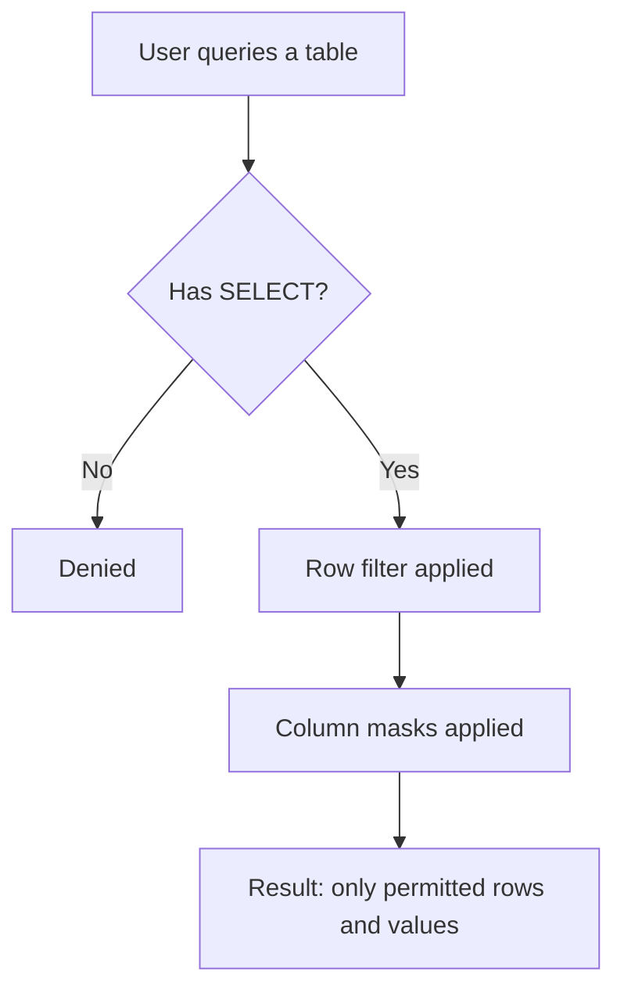
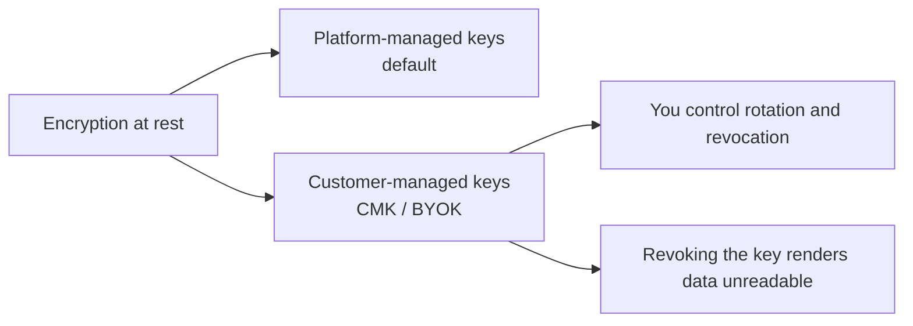
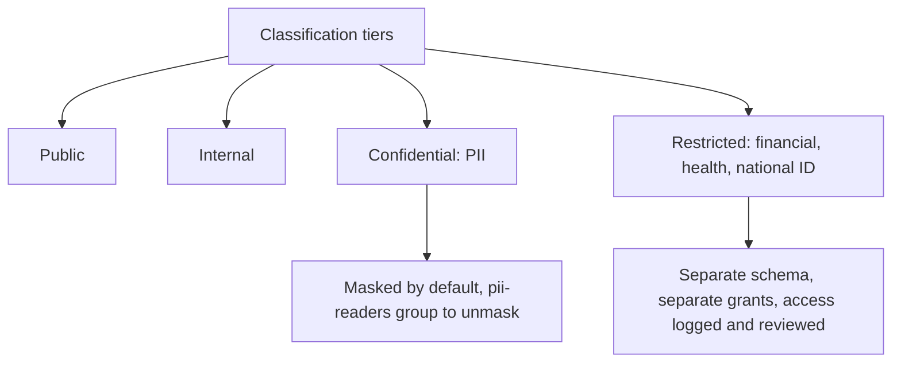
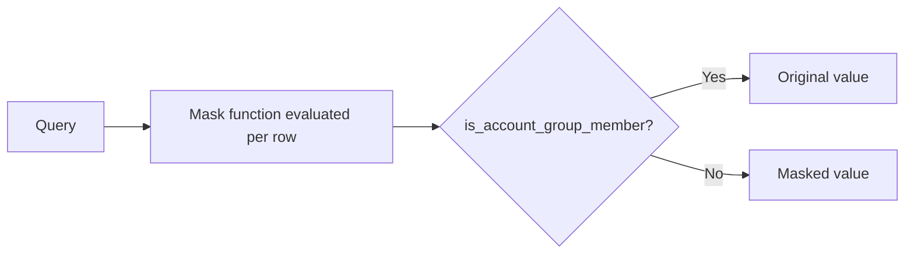
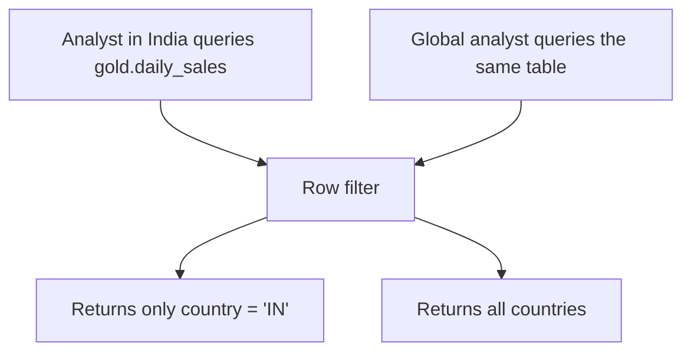
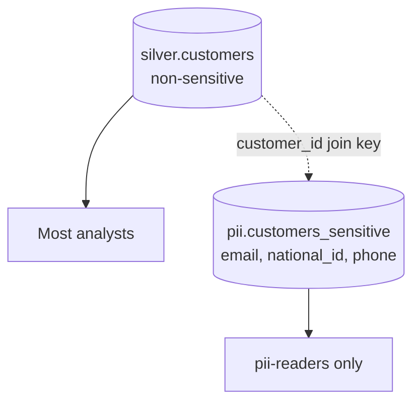
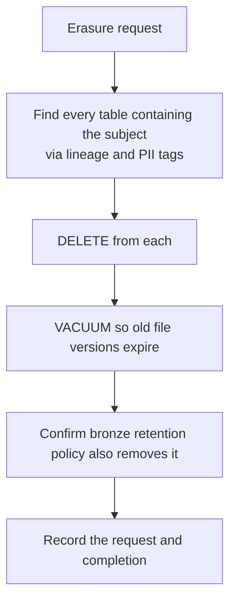
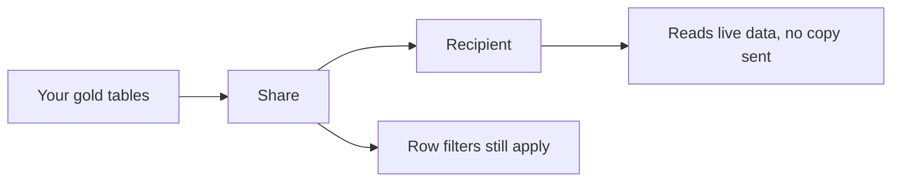

# Data Protection

Access control decides **whether** you can query a table. Data protection decides
**what you see inside it**.



---

## Encryption

```text
In transit:  TLS everywhere, managed by the platform
At rest:     cloud storage encryption, on by default
```



```text
Customer-managed keys apply to:
✔ Managed storage (the DBFS root / workspace storage)
✔ Managed services (notebooks, query results, secrets)

When to use CMK:
✔ A regulatory requirement demands key custody
✔ You need the ability to cryptographically revoke access
Otherwise platform-managed keys are appropriate and simpler.
```

---

## Classifying Data First

You cannot protect what you have not identified.

```sql
-- Tag sensitive columns so policy can be applied consistently
ALTER TABLE main.silver.customers
  ALTER COLUMN email SET TAGS ('pii' = 'true', 'classification' = 'confidential');

ALTER TABLE main.silver.customers
  ALTER COLUMN national_id SET TAGS ('pii' = 'true', 'classification' = 'restricted');

ALTER TABLE main.gold.daily_sales
  SET TAGS ('classification' = 'internal');
```

```sql
-- Find everything tagged as PII
SELECT catalog_name, schema_name, table_name, column_name
FROM system.information_schema.column_tags
WHERE tag_name = 'pii' AND tag_value = 'true';
```



---

## Column Masks

A mask rewrites a column's value based on who is querying.

```sql
-- The masking function
CREATE OR REPLACE FUNCTION main.security.mask_email(email STRING)
RETURN CASE
    WHEN is_account_group_member('pii-readers') THEN email
    ELSE regexp_replace(email, '^[^@]+', '***')
END;

-- Apply it
ALTER TABLE main.silver.customers
  ALTER COLUMN email SET MASK main.security.mask_email;
```

```text
pii-readers see:  priya.sharma@example.com
everyone else:    ***@example.com
```

```sql
-- Full redaction
CREATE OR REPLACE FUNCTION main.security.mask_full(val STRING)
RETURN CASE WHEN is_account_group_member('pii-readers') THEN val ELSE '***REDACTED***' END;

-- Partial reveal: last four digits only
CREATE OR REPLACE FUNCTION main.security.mask_card(card STRING)
RETURN CASE
    WHEN is_account_group_member('pci-readers') THEN card
    ELSE concat('****-****-****-', right(card, 4))
END;

-- Numeric banding rather than exact values
CREATE OR REPLACE FUNCTION main.security.band_salary(salary DECIMAL(12,2))
RETURN CASE
    WHEN is_account_group_member('hr-readers') THEN salary
    WHEN salary < 50000  THEN 25000
    WHEN salary < 100000 THEN 75000
    ELSE 150000
END;
```



```text
Masks apply everywhere the table is read: notebooks, SQL warehouses,
Power BI, Genie. There is no path around them — which is the point.

Caveat: a dashboard PUBLISHED with embedded credentials runs as the
publisher, so viewers see the publisher's unmasked values. Match the
publish mode to the sensitivity (topic 09).
```

---

## Row Filters

A row filter restricts which rows a principal sees.

```sql
CREATE OR REPLACE FUNCTION main.security.region_filter(region STRING)
RETURN is_account_group_member('global-analysts')
    OR region = current_user_region();     -- your own mapping function

ALTER TABLE main.gold.daily_sales
  SET ROW FILTER main.security.region_filter ON (country);
```

A common mapping approach uses a lookup table:

```sql
CREATE TABLE main.security.user_regions (
    user_email STRING,
    region     STRING
);

CREATE OR REPLACE FUNCTION main.security.region_filter(region STRING)
RETURN is_account_group_member('global-analysts')
    OR exists (
        SELECT 1 FROM main.security.user_regions
        WHERE user_email = current_user() AND region = region_filter.region
    );
```



```text
One table, one query, different results per user. The alternative —
a separate table or view per region — multiplies maintenance and
inevitably drifts.
```

---

## Dynamic Views (the Older Pattern)

```sql
CREATE OR REPLACE VIEW main.gold.v_customers AS
SELECT
    customer_id,
    CASE WHEN is_account_group_member('pii-readers') THEN email ELSE '***' END AS email,
    country,
    segment
FROM main.silver.customers
WHERE is_account_group_member('global-analysts') OR country = 'IN';
```

| | Dynamic view | Row filters and column masks |
|---|-------------|------------------------------|
| Applies to | Only the view | The table itself |
| Bypassable | Yes, if users can query the base table | No |
| Maintenance | One view per access pattern | One policy, reused |
| Recommended | Legacy | Yes |

```text
The decisive difference: a user with SELECT on the base table can simply
query around a dynamic view. Row filters and masks attach to the table,
so there is no way around them.
```

---

## Useful Context Functions

```sql
current_user()                              -- the querying identity
is_account_group_member('group-name')       -- group membership (recommended)
is_member('workspace-group')                -- workspace-local group (legacy)
session_user()
```

```text
Prefer is_account_group_member: account-level groups are what SCIM syncs
and what Unity Catalog grants use. Workspace-local groups are a legacy
concept that does not exist consistently across workspaces.
```

---

## PII Handling Patterns

### Pattern 1: separate the sensitive columns



```sql
CREATE SCHEMA main.pii;
-- Only one narrow group is granted anything here
GRANT USE SCHEMA, SELECT ON SCHEMA main.pii TO `pii-readers`;
```

```text
The strongest control: the data simply is not in the schema most people
can reach. Masks protect a column; separation protects the whole dataset.
```

### Pattern 2: pseudonymisation

```sql
CREATE OR REPLACE TABLE main.silver.customers_pseudo AS
SELECT
    sha2(concat(customer_id, secret('security', 'hash_salt')), 256) AS customer_key,
    country,
    segment,
    registration_date
FROM main.silver.customers;
```

```text
Analytics keeps working (joins on customer_key) while identity is removed.
The salt lives in a secret scope so the hash cannot be brute-forced from
a known ID list.
```

### Pattern 3: right to erasure (GDPR)

```sql
-- Delete the individual
DELETE FROM main.silver.customers WHERE customer_id = 12345;
DELETE FROM main.silver.orders    WHERE customer_id = 12345;

-- Delta keeps old versions — erasure is not complete until they expire
VACUUM main.silver.customers RETAIN 168 HOURS;
VACUUM main.silver.orders    RETAIN 168 HOURS;
```



```text
The trap nobody anticipates: time travel and bronze.
A deleted row still exists in older Delta versions until VACUUM removes
the files, and it still exists in bronze unless bronze is also processed.
Design erasure into the retention policy, not as an afterthought.
```

---

## Delta Sharing Security

```sql
CREATE SHARE sales_share;
ALTER SHARE sales_share ADD TABLE main.gold.daily_sales;

CREATE RECIPIENT partner_acme USING ID 'acme:cloud:region:uuid';
GRANT SELECT ON SHARE sales_share TO RECIPIENT partner_acme;
```

```text
Sharing rules:
✔ Share gold aggregates, never raw or PII tables
✔ Use a dedicated schema of share-safe tables
✔ Apply row filters so a recipient sees only their own data
✔ Set recipient IP access lists where supported
✔ Set an expiry on the recipient token
✔ Audit share access in system.access.audit
```



---

## Data Protection Checklist

```text
Classification
✔ PII and restricted columns tagged
✔ An inventory query that lists all tagged columns
✔ Sensitive data isolated in its own schema

Protection
✔ Column masks on PII in shared tables
✔ Row filters where access is scoped by region, team, or customer
✔ Pseudonymised copies for broad analytics
✔ Encryption at rest (CMK if required by policy)

Governance
✔ Access to sensitive schemas granted to one narrow group
✔ Quarterly review of who has that access and who actually used it
✔ Erasure procedure documented, including VACUUM and bronze
✔ Retention policy per classification tier
✔ Delta Sharing limited to curated, filtered gold tables
```

---

## Common Interview Questions

### How do you hide sensitive values from most users but not all?

Column masks: a UDF applied to the column that returns the real value only for
members of a privileged group, evaluated wherever the table is read.

### How do you restrict which rows a user sees?

Row filters: a function attached to the table that returns a boolean per row,
typically combining group membership with a user-to-scope lookup table.

### Why are row filters and column masks better than dynamic views?

They attach to the table, so a user with SELECT on the base table cannot query
around them. A dynamic view only protects data accessed through that view.

### Which function should you use for group checks and why?

`is_account_group_member`, because account-level groups are what SCIM provisions
and what Unity Catalog grants use; workspace-local groups are legacy.

### What is pseudonymisation and when is it useful?

Replacing identifiers with a salted hash so analytics and joins still work while
identity is removed — useful for broad analytical access to behavioural data.

### What breaks a GDPR erasure request in a lakehouse?

Delta time travel retains old file versions until VACUUM, and bronze retains the
raw record. Erasure must cover both, which means designing retention around it.

### What are customer-managed keys for?

Holding custody of the encryption keys for managed storage and services, so the
organisation can rotate or revoke them independently of the platform — used where
regulation demands it.

### How do you share data with a partner safely?

Delta Sharing from a curated share-safe schema of gold tables, with row filters
applied, recipient token expiry, IP restrictions where available, and access
audited.

---

## Quick Revision

```text
Order of enforcement:
grants → row filters → column masks → result

Classify first: column tags (pii, classification) + an inventory query

Column mask:
CREATE FUNCTION ... RETURN CASE WHEN is_account_group_member('g') THEN v ELSE '***' END
ALTER TABLE ... ALTER COLUMN c SET MASK f

Row filter:
CREATE FUNCTION ... RETURN is_account_group_member('g') OR <scope condition>
ALTER TABLE ... SET ROW FILTER f ON (col)

Filters and masks > dynamic views (cannot be bypassed via the base table)

PII patterns:
separate schema (strongest) | column masks | salted-hash pseudonymisation

Erasure: DELETE + VACUUM + bronze retention — time travel keeps deleted rows

Encryption: TLS in transit, storage encryption at rest, CMK where required

Delta Sharing: curated gold only, row filters apply, expiring recipient tokens
```
