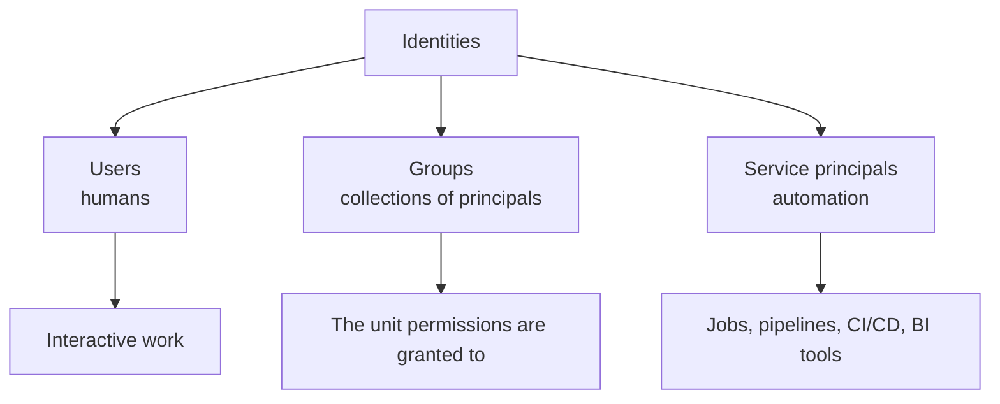
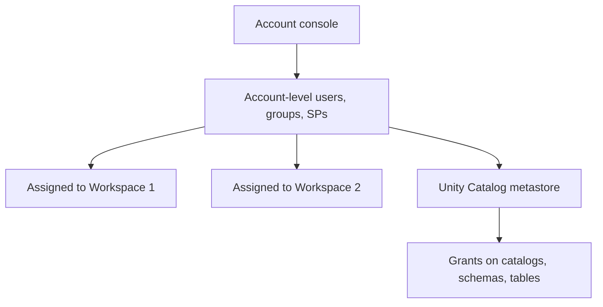
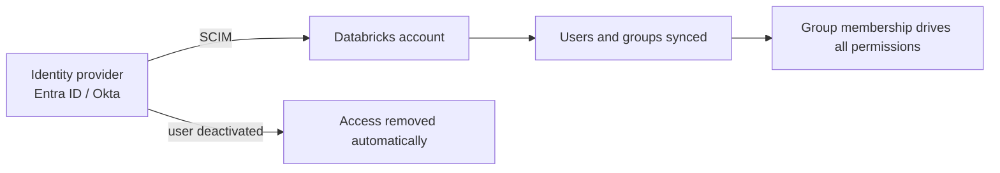
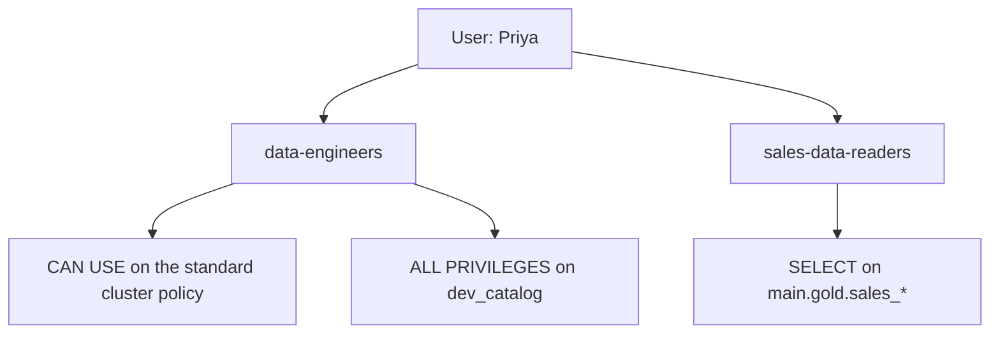
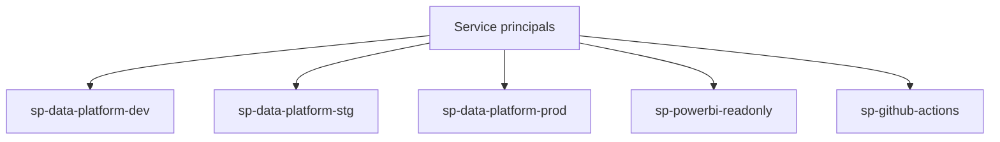
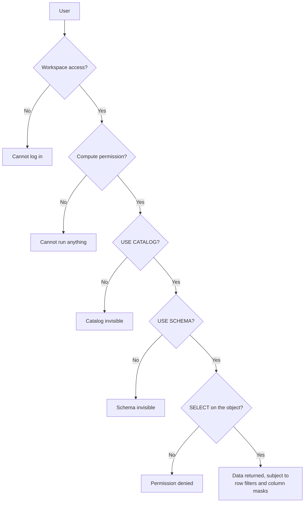
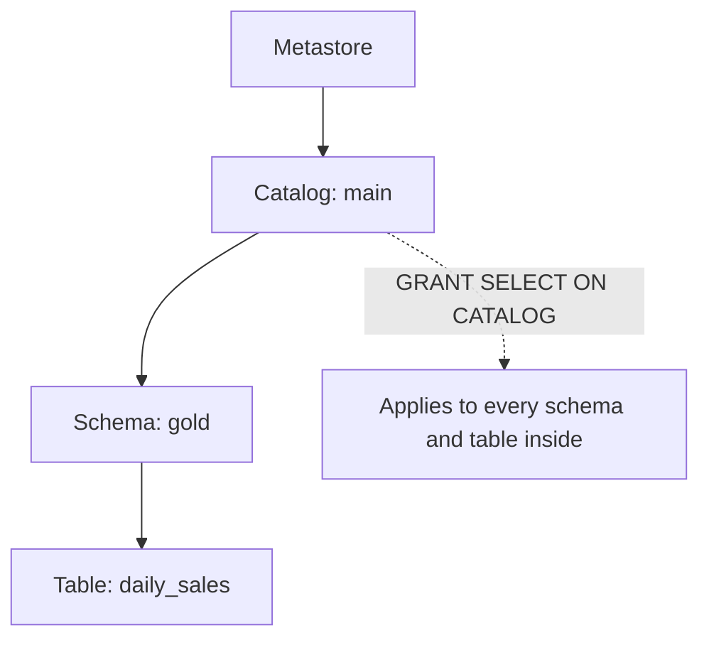
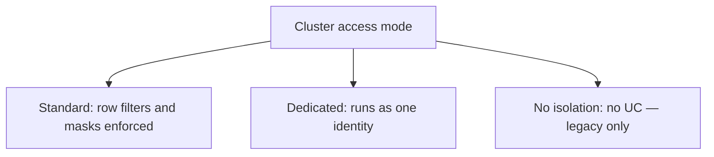
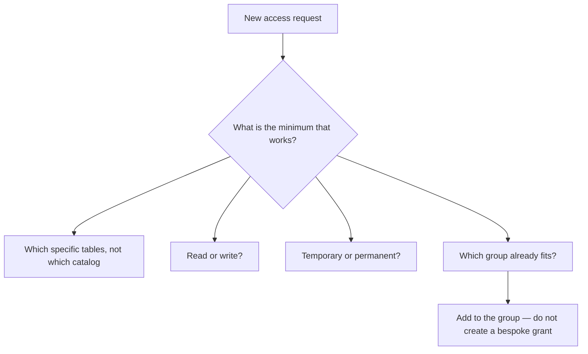
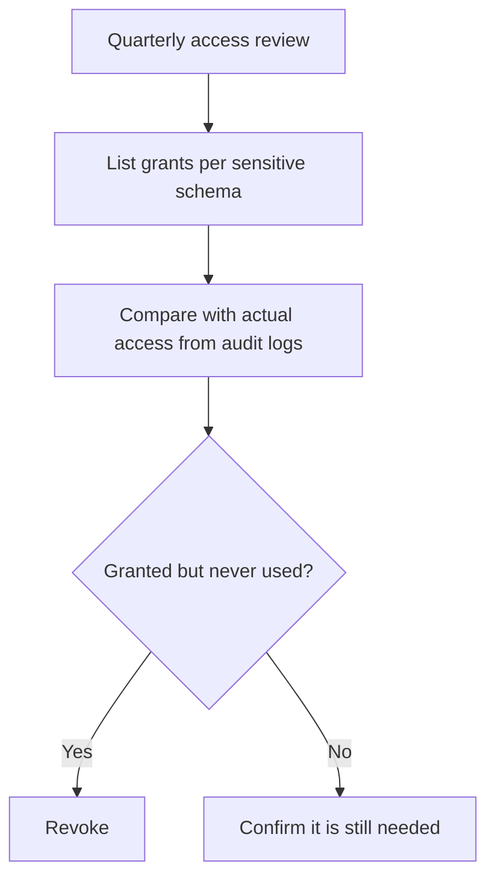

# Identity and Access Management

## The Three Identity Types



```text
Rule that prevents most access chaos:

  Permissions are granted to GROUPS.
  Users and service principals become members of groups.
  A permission granted directly to a person is a future audit finding.
```

---

## Account vs Workspace Identity



```text
Identities live at the ACCOUNT level and are assigned to workspaces.
Unity Catalog grants are metastore-wide, not per workspace.

Legacy workspace-local users and groups still exist in older setups and
are a migration item — they cannot be used in Unity Catalog grants.
```

---

## Provisioning with SCIM

```text
Manual user management does not survive contact with reality:
people join, move teams, and leave, and nobody remembers to revoke access.
```



```text
✔ Sync groups, not just users — group membership is what grants access
✔ Deprovisioning is the point: a leaver loses access without a ticket
✔ Keep a small number of break-glass admin accounts outside SCIM,
  with strong MFA and monitored usage
```

---

## Group Design

```text
Functional groups (what someone does):
  data-engineers
  data-analysts
  data-scientists
  data-platform-admins

Data-domain groups (what they may see):
  sales-data-readers
  finance-data-readers
  pii-readers

Environment groups:
  prod-deployers
```



```text
Combining functional and data-domain groups means access is composable:
a new sales analyst joins two groups and has exactly the right access,
with no bespoke grants to unpick later.
```

---

## Service Principals

```text
A service principal is a non-human identity for automation.
```



```text
Why they matter:
✔ Jobs survive when the person who created them leaves
✔ Permissions reflect a system's needs, not an individual's
✔ Credentials can be rotated without disrupting a person's access
✔ Audit logs clearly separate human from automated activity

Rules:
✔ One per environment and per integration — never one shared SP
✔ Least privilege: the BI service principal gets SELECT on gold only
✔ Rotate OAuth secrets on a schedule
✔ Grant permissions through groups, as with users
```

```yaml
# Enforced in a bundle
targets:
  prod:
    run_as:
      service_principal_name: sp-data-platform-prod
```

```sql
-- The BI tool identity sees only curated gold
GRANT USE CATALOG ON CATALOG main TO `sp-powerbi-readonly`;
GRANT USE SCHEMA  ON SCHEMA main.gold TO `sp-powerbi-readonly`;
GRANT SELECT      ON SCHEMA main.gold TO `sp-powerbi-readonly`;
```

---

## The Permission Layers

A user needs permission at **every** layer between them and the data.



```text
The three-level namespace means three grants. "I granted SELECT and it
still fails" is almost always a missing USE CATALOG or USE SCHEMA.
```

---

## Unity Catalog Privileges

```sql
-- Namespace traversal
GRANT USE CATALOG ON CATALOG main TO `data-analysts`;
GRANT USE SCHEMA  ON SCHEMA main.gold TO `data-analysts`;

-- Data access
GRANT SELECT ON TABLE main.gold.daily_sales TO `data-analysts`;
GRANT SELECT ON SCHEMA main.gold TO `data-analysts`;      -- all current and future tables
GRANT MODIFY ON TABLE main.silver.orders TO `data-engineers`;

-- Creation
GRANT CREATE TABLE  ON SCHEMA main.silver TO `data-engineers`;
GRANT CREATE SCHEMA ON CATALOG dev_catalog TO `data-engineers`;

-- Storage
GRANT READ FILES, WRITE FILES ON EXTERNAL LOCATION landing_zone TO `data-engineers`;
GRANT READ VOLUME, WRITE VOLUME ON VOLUME main.landing.orders TO `data-engineers`;

-- Everything (use sparingly)
GRANT ALL PRIVILEGES ON CATALOG dev_catalog TO `data-engineers`;
```

```sql
-- Inspect and revoke
SHOW GRANTS ON TABLE main.gold.daily_sales;
SHOW GRANTS TO `data-analysts`;
REVOKE SELECT ON TABLE main.gold.customer_pii FROM `data-analysts`;
```

```text
Ownership matters: the owner of an object can always grant on it,
regardless of other permissions. Set owners to GROUPS
(data-platform-admins), never individuals who may leave.
```

```sql
ALTER TABLE main.gold.daily_sales OWNER TO `data-platform-admins`;
ALTER SCHEMA main.gold OWNER TO `data-platform-admins`;
```

---

## Privilege Inheritance



```text
Grants cascade downward. GRANT SELECT ON SCHEMA main.gold covers every
table in that schema, including ones created later.

Convenient — and dangerous if a sensitive table lands in a broadly
granted schema. Keep PII in its own schema with its own grants.
```

---

## Compute Access Modes

The cluster access mode determines whether Unity Catalog enforcement is even
possible.

| Mode | Unity Catalog | Multi-user | Use for |
|------|---------------|-----------|---------|
| **Standard (shared)** | Full enforcement | Yes | Shared interactive work |
| **Dedicated (single user)** | Full enforcement | No | Jobs, ML, single-user work |
| **No isolation shared** | Not supported | Yes | Legacy — avoid |



```text
A cluster in no-isolation mode bypasses Unity Catalog entirely.
Block it with a cluster policy, or your table-level security is theatre.
```

---

## Workspace-Level Permissions

```text
Beyond data, principals need permissions on objects:

Clusters       CAN ATTACH TO | CAN RESTART | CAN MANAGE
Jobs           CAN VIEW | CAN MANAGE RUN | CAN MANAGE | IS OWNER
Pipelines      CAN VIEW | CAN RUN | CAN MANAGE
Notebooks      CAN READ | CAN RUN | CAN EDIT | CAN MANAGE
SQL warehouses CAN USE | CAN MONITOR | CAN MANAGE
Secret scopes  READ | WRITE | MANAGE
Policies       CAN USE
```

```text
Common production pattern:
data-engineers      → CAN VIEW on prod jobs (see runs, not edit)
sp-prod-deployer    → CAN MANAGE on prod jobs (deploys via CI)
data-platform-admins→ CAN MANAGE on everything

Engineers editing prod jobs directly is exactly what bundles prevent.
```

---

## Least Privilege in Practice



```text
✔ Grant SELECT on gold, not on the catalog
✔ Analysts never get access to bronze
✔ PII lives in its own schema with a dedicated group
✔ Production write access belongs to service principals, not people
✔ Admin rights are few, named, and reviewed
✔ Time-bound access for contractors, with an expiry reminder
```

---

## Access Reviews

```sql
-- Who can read the sensitive schema?
SHOW GRANTS ON SCHEMA main.pii;
```

```sql
-- Permission changes in the last 30 days
SELECT event_time, user_identity.email AS changed_by, action_name, request_params
FROM system.access.audit
WHERE event_date >= current_date() - INTERVAL 30 DAYS
  AND action_name IN ('updatePermissions', 'createCatalog', 'createSchema')
ORDER BY event_time DESC;
```

```sql
-- Who actually accessed the PII tables?
SELECT user_identity.email, count(*) AS accesses, max(event_time) AS last_access
FROM system.access.audit
WHERE event_date >= current_date() - INTERVAL 90 DAYS
  AND request_params.full_name_arg LIKE 'main.pii.%'
GROUP BY 1 ORDER BY accesses DESC;
```



```text
"Granted but never used in 90 days" is the most productive filter in
an access review — it finds real over-permissioning without argument.
```

---

## Common Mistakes

```text
❌ Permissions granted to individuals instead of groups
❌ Jobs running as a person who later leaves
❌ One service principal shared across all environments
❌ Analysts granted access to bronze "just in case"
❌ PII tables in a broadly granted schema
❌ Object ownership held by individuals
❌ No-isolation clusters allowed, bypassing Unity Catalog
❌ No SCIM, so leavers keep access
❌ Access granted and never reviewed
```

---

## Common Interview Questions

### Why grant permissions to groups rather than users?

Onboarding and offboarding become membership changes, permissions stay
auditable, and access does not fragment into thousands of per-user grants nobody
can reconstruct.

### What is a service principal and why use one for jobs?

A non-human identity for automation. Jobs owned by it survive staff changes,
follow least privilege for a system rather than a person, and separate automated
from human activity in audit logs.

### Why does a user with SELECT still get permission denied?

They also need `USE CATALOG` and `USE SCHEMA`. All three levels of the namespace
must be granted, and compute permission is a separate layer again.

### How does privilege inheritance work in Unity Catalog?

Grants cascade downward — a grant on a catalog applies to its schemas and
tables, including future ones — which is why sensitive data belongs in its own
schema.

### Why does cluster access mode matter for security?

No-isolation clusters do not support Unity Catalog, so row filters and column
masks are not enforced. Block them via cluster policy.

### What is SCIM and why is it important?

Automated provisioning from the corporate identity provider. Its real value is
deprovisioning: a leaver loses access automatically rather than by ticket.

### How do you run an access review?

Compare granted permissions on sensitive objects with actual access from
`system.access.audit`, and revoke grants unused for a defined period.

### Who should own Unity Catalog objects?

A group such as `data-platform-admins`, never an individual — because owners can
always grant, and an individual owner leaving orphans the object.

---

## Quick Revision

```text
Identities: users | groups | service principals — all at ACCOUNT level
Provisioning: SCIM from the IdP; deprovisioning is the point

Grant to GROUPS, always. Own objects with GROUPS, always.

Permission layers:
workspace access → compute permission → USE CATALOG → USE SCHEMA → SELECT
→ row filters and column masks

Key privileges:
USE CATALOG | USE SCHEMA | SELECT | MODIFY | CREATE TABLE
READ FILES / WRITE FILES on external locations
READ VOLUME / WRITE VOLUME on volumes

Inheritance cascades down → keep PII in its own schema

Compute:
standard (shared) and dedicated enforce UC
no-isolation bypasses it — block by policy

Service principals: one per environment and integration, least privilege,
rotated, used for all production jobs and BI connections

Review: grants vs actual audit access; revoke what is unused
```
