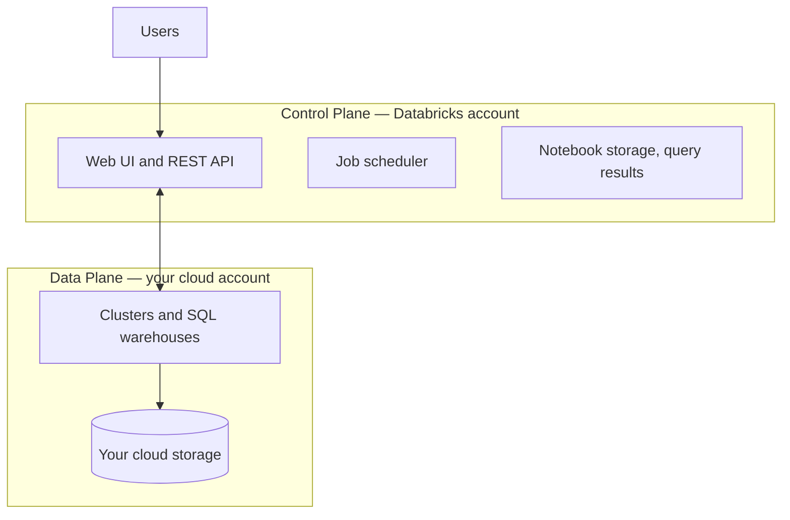
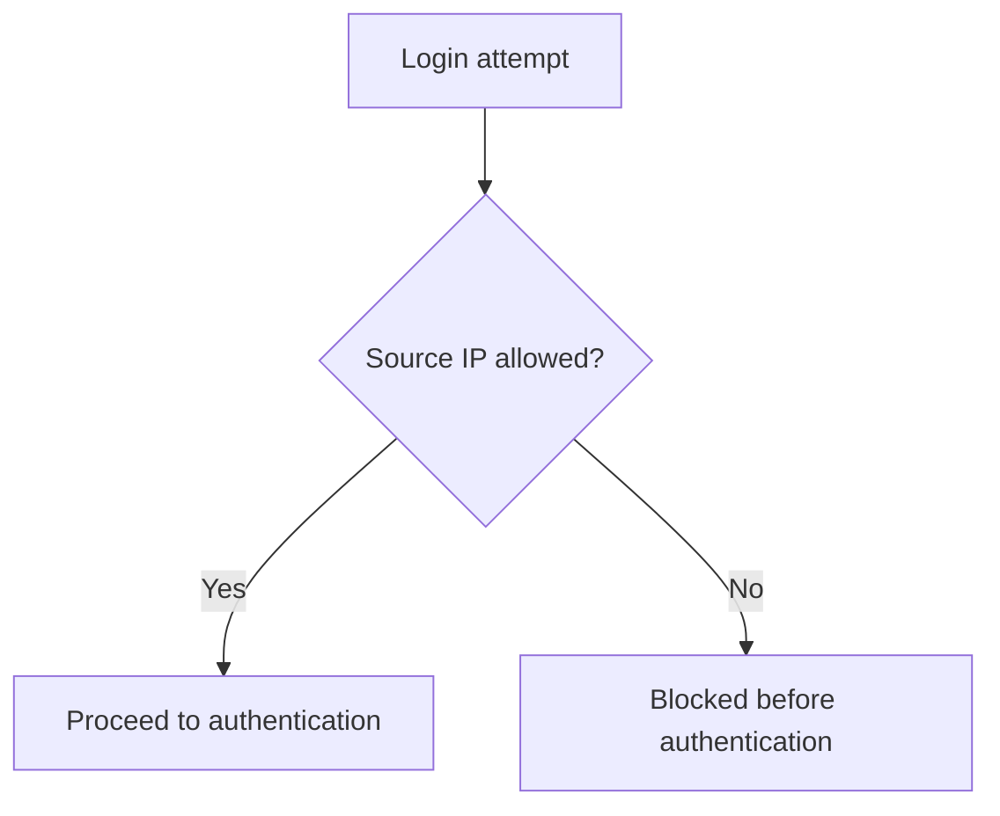
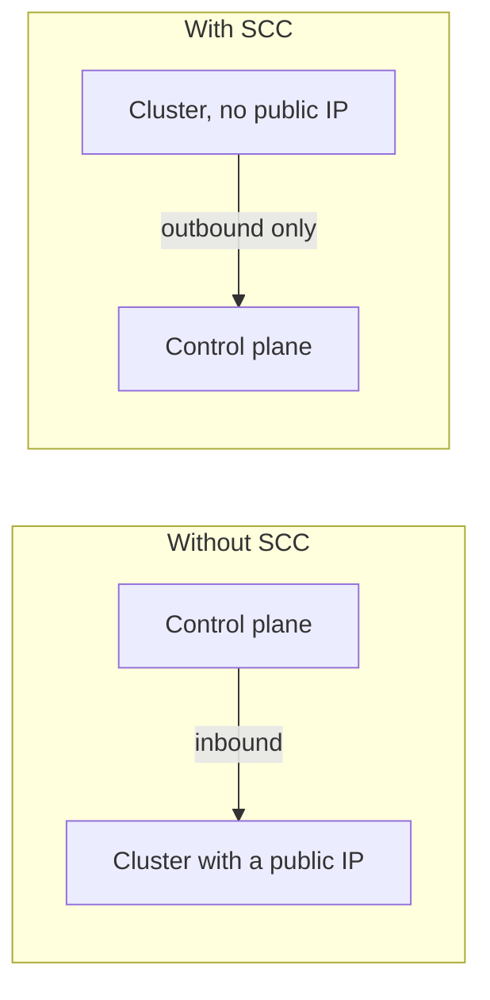
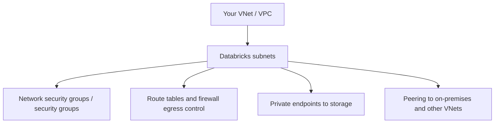
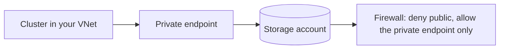
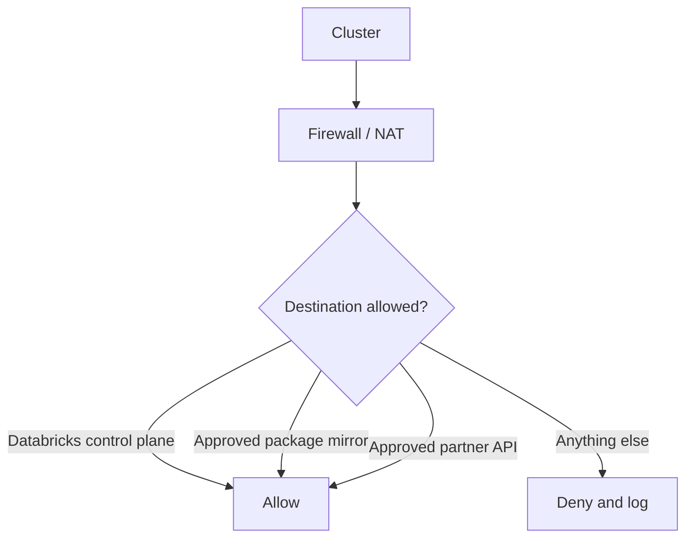
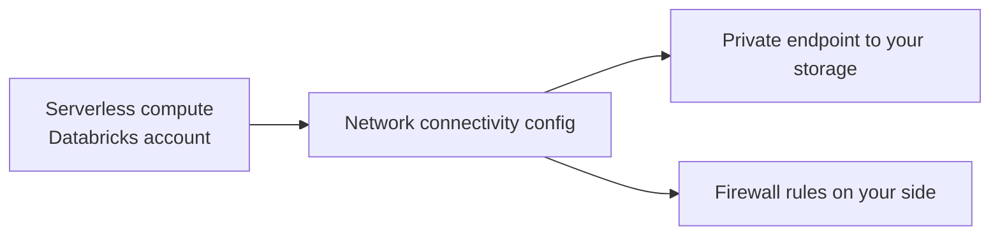
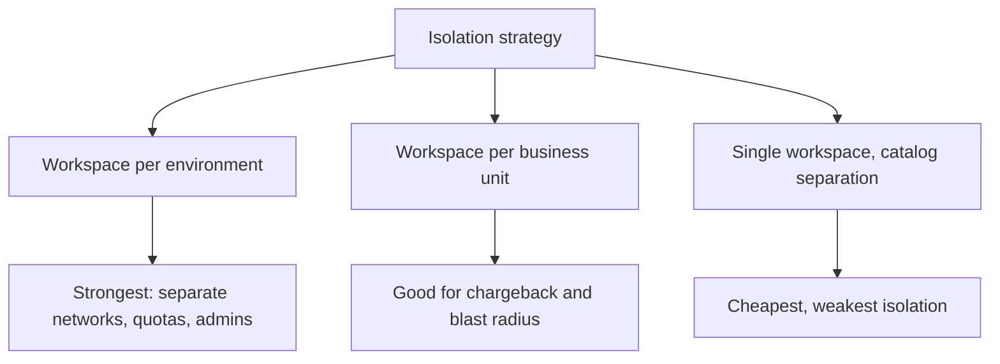
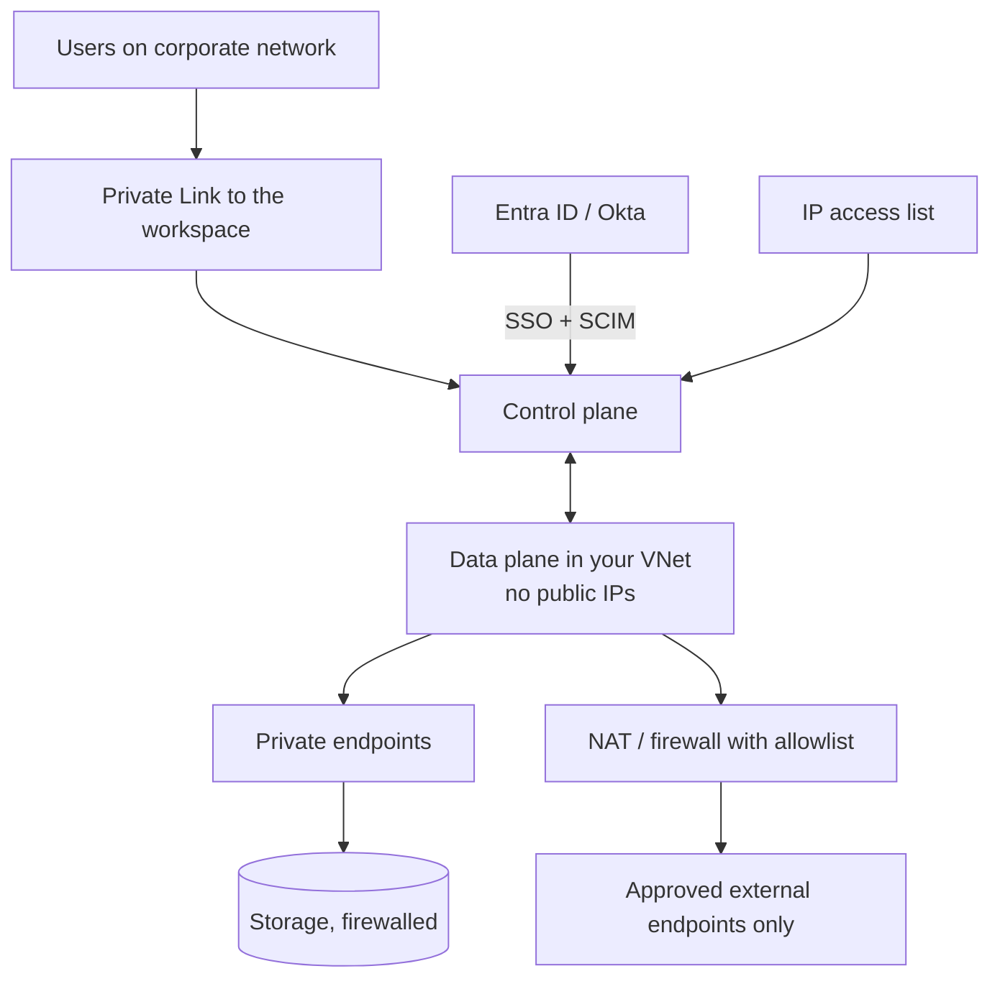

# Network Security

## The Architecture You Are Securing



```text
Control plane: managed by Databricks, holds metadata and orchestration
Data plane:    runs in YOUR cloud subscription, where data is processed

Network security is about controlling three paths:
1. Users → control plane
2. Control plane ↔ data plane
3. Data plane → storage and other services
```

---

## Path 1: Users to the Control Plane

### IP access lists

```bash
databricks ip-access-lists create --json '{
  "label": "corporate-vpn",
  "list_type": "ALLOW",
  "ip_addresses": ["203.0.113.0/24", "198.51.100.5/32"]
}'
```



```text
✔ Restricts the workspace to corporate networks and VPN ranges
✔ Applies to the UI and the REST API
⚠ Add your CI/CD runner ranges, or deployments break
⚠ Keep a break-glass path; locking yourself out is a support ticket
```

### Private connectivity for users

```text
Azure:  Private Link to the workspace front-end
AWS:    PrivateLink to the workspace endpoint
GCP:    Private Service Connect

Effect: users reach Databricks over the cloud backbone, never the
public internet, and the public endpoint can be disabled entirely.
```

### SSO and conditional access

```text
✔ SAML or OIDC single sign-on through the corporate IdP
✔ MFA enforced by the IdP, not by Databricks
✔ Conditional access: device compliance, location, risk level
✔ Session timeouts
✔ SCIM for provisioning and, crucially, deprovisioning
```

---

## Path 2: Control Plane to Data Plane

### Secure cluster connectivity (no public IP)



```json
{
  "custom_parameters": {
    "no_public_ip": true
  }
}
```

```text
Clusters initiate an outbound connection to the control plane and keep it
open. No inbound rule is needed, and no cluster has a public IP.

This is the default expectation for any production workspace.
```

### VNet injection / customer-managed VPC

```hcl
resource "azurerm_databricks_workspace" "this" {
  name                = "dbw-prod"
  resource_group_name = azurerm_resource_group.this.name
  location            = var.location
  sku                 = "premium"

  custom_parameters {
    no_public_ip        = true
    virtual_network_id  = azurerm_virtual_network.this.id
    public_subnet_name  = azurerm_subnet.host.name
    private_subnet_name = azurerm_subnet.container.name
  }
}
```



```text
Why deploy into your own network:
✔ Your firewall rules and egress control apply
✔ Private endpoints to storage, databases, and key vaults
✔ Connectivity to on-premises systems over VPN or ExpressRoute
✔ Traffic inspection and logging by your security tooling
✔ IP ranges you control and can allow-list elsewhere
```

---

## Path 3: Data Plane to Storage and Services



```text
Storage should not be reachable from the internet at all:
✔ Storage firewall set to deny public network access
✔ Private endpoints from the Databricks subnets
✔ Access via Unity Catalog storage credentials (managed identity / IAM role)
✔ No account keys anywhere
```

### Egress control

```text
Clusters need outbound access to:
- The Databricks control plane
- Package repositories (PyPI, Maven, CRAN) — if libraries are installed
- Your cloud's storage and metadata services
- Any external APIs your pipelines call

Options:
✔ NAT gateway with a fixed egress IP that partners can allow-list
✔ Firewall with an FQDN allowlist
✔ Private package mirror, so PyPI access is not needed at all
```



```text
Egress filtering is the control that stops a compromised notebook
exfiltrating data to an arbitrary internet endpoint. It is also the
one most often skipped because it breaks pip installs — which is
exactly why a private mirror matters.
```

---

## Serverless Compute and Networking

```text
Serverless compute runs in the Databricks account, not your VNet,
which changes the model:

✔ Network connectivity configurations (NCC) provide private connectivity
  from serverless to your storage and databases
✔ Stable egress IPs can be requested for allow-listing
✘ You cannot apply your own NSGs to serverless compute
```



```text
For workloads with strict network requirements, classic compute in your
own VNet remains the stricter option. Evaluate serverless against the
actual requirement rather than assuming either answer.
```

---

## Workspace Isolation



```text
Recommended baseline:
- Separate workspaces for dev and prod at minimum
- One Unity Catalog metastore per region, shared across workspaces
- Catalog binding so a catalog is only accessible from permitted workspaces
```

```sql
-- Bind a production catalog to production workspaces only
ALTER CATALOG main SET WORKSPACE BINDING = (workspace_id_1, workspace_id_2);
```

```text
Catalog binding is the control that stops someone in the dev workspace
querying production data despite having the grant.
```

---

## Compute Isolation

| Access mode | Isolation | Unity Catalog |
|-------------|-----------|---------------|
| Standard (shared) | Users isolated from each other | Enforced |
| Dedicated (single user) | One identity per cluster | Enforced |
| No isolation shared | None | **Not supported** |

```text
Block no-isolation clusters with a cluster policy. They bypass Unity
Catalog, so row filters and column masks do not apply — which silently
undoes the data protection work from the previous file.
```

```json
{
  "data_security_mode": {
    "type": "allowlist",
    "values": ["USER_ISOLATION", "SINGLE_USER"]
  }
}
```

---

## Reference Architecture



```text
Layers, from outside in:
1. SSO with MFA and conditional access
2. IP access list, or private front-end connectivity
3. No public IPs on compute
4. Compute in your own VNet with NSGs
5. Private endpoints to storage; public storage access denied
6. Egress firewall with an allowlist
7. Unity Catalog grants, row filters, column masks
8. Audit logging over all of it
```

---

## Common Mistakes

```text
❌ Workspace reachable from the entire internet with only a password
❌ Storage accounts with public network access enabled
❌ Clusters with public IPs in production
❌ No-isolation clusters allowed, bypassing Unity Catalog
❌ IP access list configured without the CI/CD runner ranges
❌ No break-glass access path, causing a lockout
❌ Unrestricted egress, so a notebook can send data anywhere
❌ Assuming serverless inherits your VNet controls
```

---

## Common Interview Questions

### What is the difference between the control plane and the data plane?

The control plane is managed by Databricks and holds the UI, API, job scheduler,
and metadata. The data plane runs in your cloud account, where clusters process
data.

### What is secure cluster connectivity?

Clusters have no public IP and initiate an outbound connection to the control
plane, so no inbound access is required. It is the expected production baseline.

### Why deploy Databricks into your own VNet or VPC?

To apply your own security groups, egress firewall rules, private endpoints to
storage, connectivity to on-premises systems, and traffic inspection.

### What do IP access lists protect, and what is the risk?

They restrict UI and API access to allowed source ranges. The risk is locking out
CI/CD runners or administrators, so runner ranges and a break-glass path must be
planned.

### How do you stop data being exfiltrated from a cluster?

Egress control: a firewall or NAT with an allowlist of permitted destinations,
plus a private package mirror so open internet access is not needed.

### How does networking differ for serverless compute?

Serverless runs in the Databricks account, so your VNet controls do not apply.
Private connectivity is configured through network connectivity configurations
and stable egress IPs instead.

### What is catalog binding and why does it matter?

It restricts a catalog to specified workspaces, so production data cannot be
queried from a development workspace even by a principal holding the grant.

### Why do cluster access modes matter for network and data security?

No-isolation clusters do not support Unity Catalog, so grants, row filters, and
column masks are not enforced. They must be blocked by policy.

---

## Quick Revision

```text
Control plane (Databricks) ↔ Data plane (your cloud account)

Users → control plane:
SSO + MFA + conditional access | IP access lists | Private Link

Control plane ↔ data plane:
secure cluster connectivity (no public IPs) | VNet / VPC injection

Data plane → storage:
private endpoints | storage firewall denying public access |
Unity Catalog storage credentials, never account keys

Egress:
NAT with a fixed IP | FQDN allowlist | private package mirror

Isolation:
separate workspaces per environment | catalog binding |
block no-isolation clusters by policy

Serverless: runs in the Databricks account → use NCCs, not your NSGs

Do not forget: CI runner IPs in the allowlist, and a break-glass path
```
