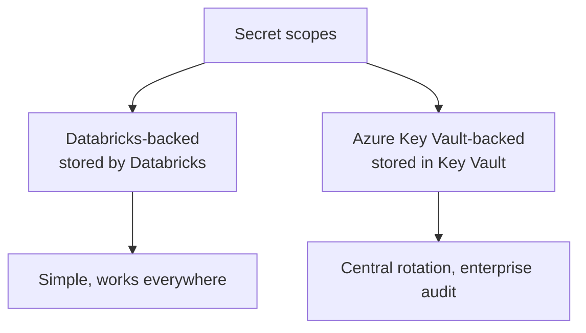
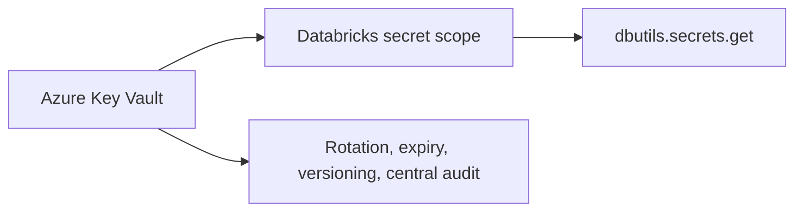
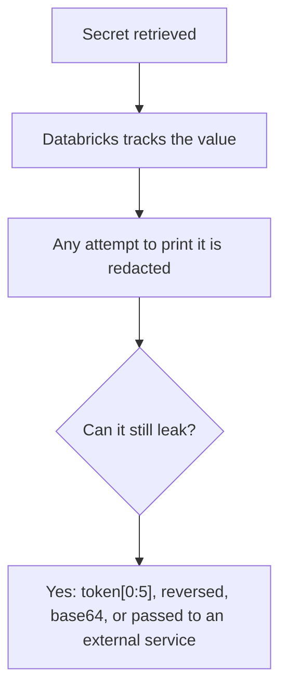
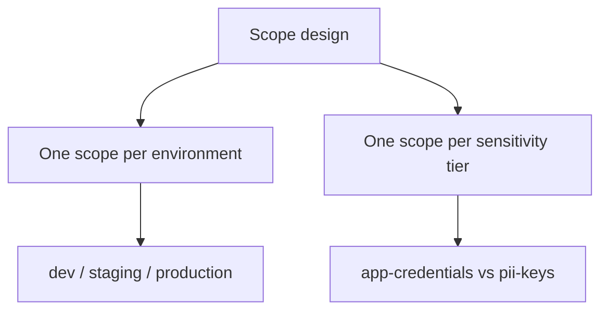
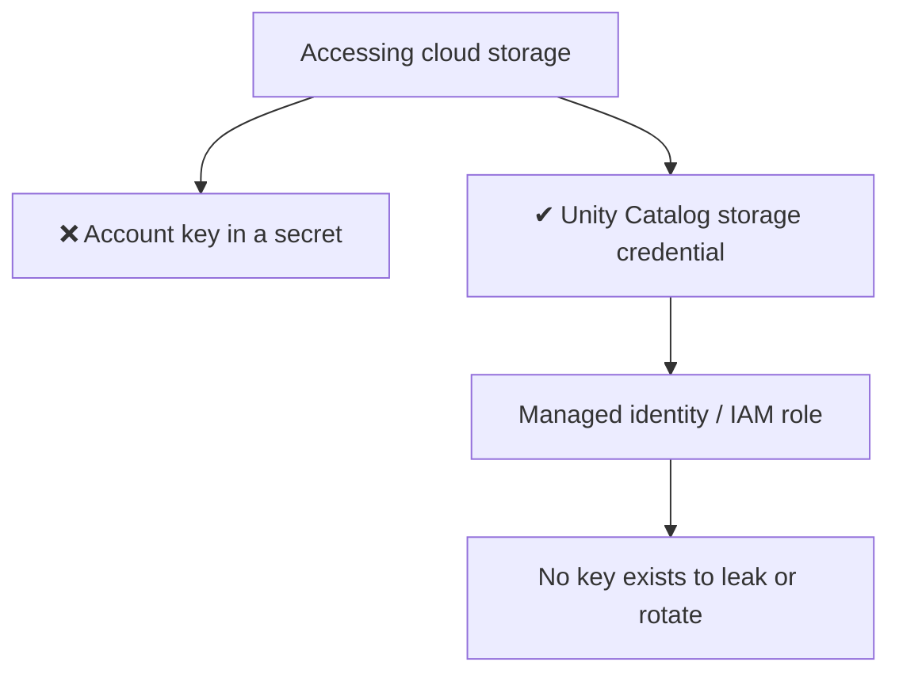
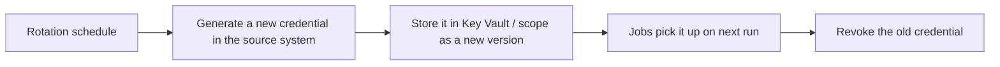

# Secrets Management

## The Rule

```text
No credential is ever written in a notebook, a job parameter,
a repository, or a log line. Ever.
```

```python
# ❌ Every one of these is a security incident waiting to be found
password = "Pa55word!"
conn = "jdbc:postgresql://host/db?user=admin&password=Pa55word!"
spark.conf.set("fs.azure.account.key.acct.dfs.core.windows.net", "abc123==")
print(f"Connecting with token {token}")
```

```python
# ✔ The only acceptable pattern
password = dbutils.secrets.get(scope="production", key="db_password")
```

```text
Why it matters beyond the obvious: notebooks are exported, committed,
shared in screenshots, and stored in job run output. A credential in a
notebook is a credential in a dozen places you have not thought of.
```

---

## Secret Scopes



### Databricks-backed scope

```bash
databricks secrets create-scope production
databricks secrets put-secret production db_password --string-value "$DB_PASSWORD"
databricks secrets list-scopes
databricks secrets list-secrets production
```

```text
Note: list-secrets shows KEY NAMES and metadata, never values.
There is no API that returns a secret value outside a cluster context.
```

### Azure Key Vault-backed scope

```bash
databricks secrets create-scope keyvault-prod \
  --scope-backend-type AZURE_KEYVAULT \
  --resource-id "/subscriptions/.../providers/Microsoft.KeyVault/vaults/kv-prod" \
  --dns-name "https://kv-prod.vault.azure.net/"
```



```text
✔ Secrets rotate in Key Vault and Databricks picks up the new value
✔ One vault serves Databricks, App Service, Functions, and everything else
✔ Key Vault access policies and its own audit log apply
✔ Read-only from Databricks — you cannot write secrets from a notebook
```

```text
On AWS, the equivalent pattern is storing credentials in Secrets Manager
and fetching them with an instance profile, or using Databricks-backed
scopes with rotation driven by your own automation.
```

---

## Using Secrets

```python
# Basic retrieval
password = dbutils.secrets.get(scope="production", key="db_password")

# Discover what exists (names only)
dbutils.secrets.listScopes()
dbutils.secrets.list("production")
```

```python
# JDBC connection
jdbc_url = "jdbc:postgresql://erp-db.internal:5432/orders"
df = (spark.read.format("jdbc")
    .option("url", jdbc_url)
    .option("dbtable", "orders")
    .option("user", dbutils.secrets.get("production", "db_user"))
    .option("password", dbutils.secrets.get("production", "db_password"))
    .load())
```

```python
# API call
import requests
token = dbutils.secrets.get("production", "api_token")
r = requests.get("https://api.vendor.com/orders",
                 headers={"Authorization": f"Bearer {token}"})
```

```python
# Storage access in a Spark conf (the value is redacted in the UI)
spark.conf.set(
    "fs.azure.account.key.mystorage.dfs.core.windows.net",
    dbutils.secrets.get("production", "storage_key"))
```

```sql
-- Secrets in SQL, via the secret function
SELECT secret('production', 'api_token');
```

---

## Redaction

```python
token = dbutils.secrets.get("production", "api_token")
print(token)
# [REDACTED]
```



```text
Redaction is a safety net, not a control.

❌ print(token[:5])              → partial leak, not redacted
❌ print(base64.b64encode(token)) → not recognised, printed in full
❌ requests.get(f"https://api/?key={token}")  → in the URL, in their logs
❌ Writing the secret into a Delta table

Treat redaction as protection against accidents, never as permission
to be careless.
```

---

## Secret Scope Permissions

```bash
databricks secrets put-acl production data-engineers READ
databricks secrets put-acl production data-platform-admins MANAGE
databricks secrets list-acls production
```

| Permission | Allows |
|------------|--------|
| `READ` | Read secret values and list keys |
| `WRITE` | Create and update secrets |
| `MANAGE` | Change ACLs, delete the scope |



```text
Scope granularity matters: anyone with READ on a scope can read EVERY
secret in it. A single "all-secrets" scope means the dev service
principal can read the production database password.

Recommended:
  secrets-dev        → dev SP + engineers
  secrets-staging    → staging SP
  secrets-production → prod SP only, admins for break-glass
```

---

## Secrets in Jobs and Pipelines

```yaml
# Asset Bundle: reference, never embed
resources:
  jobs:
    ingest_erp:
      tasks:
        - task_key: extract
          notebook_task:
            notebook_path: ../src/ingest/erp_extract.py
          # the notebook reads dbutils.secrets.get internally
```

```yaml
# Spark conf referencing a secret
new_cluster:
  spark_conf:
    "fs.azure.account.key.acct.dfs.core.windows.net": "{{secrets/production/storage_key}}"
```

```text
The {{secrets/scope/key}} syntax resolves at cluster start. The value
never appears in the job definition, in Git, or in the UI.
```

```python
# DLT pipeline configuration
source_token = spark.conf.get("api_token")   # set from {{secrets/...}} in the pipeline config
```

---

## Storage Credentials: the Better Alternative

For cloud storage, do not use keys at all.



```sql
-- Unity Catalog handles the credential; users never see it
CREATE EXTERNAL LOCATION landing_zone
URL 'abfss://landing@account.dfs.core.windows.net/'
WITH (STORAGE CREDENTIAL adls_managed_identity);

GRANT READ FILES ON EXTERNAL LOCATION landing_zone TO `data-engineers`;
```

```text
Benefits over a stored key:
✔ No secret to rotate, leak, or accidentally print
✔ Access governed by Unity Catalog grants and auditable
✔ Revocation is a grant change, not a key rotation across every job
✔ Fine-grained: per external location, not per storage account
```

```text
Legacy pattern to migrate away from: mount points created with account
keys in a secret. They bypass Unity Catalog governance entirely.
```

---

## Rotation



```text
Design for rotation from the start:
✔ Reference secrets by NAME, never copy values into configs
✔ Support overlapping validity so rotation is not a cutover
✔ Automate with Key Vault rotation policies where possible
✔ Track secret age and alert when it exceeds policy
✔ Rotate immediately when someone with access leaves
```

```python
# Check for stale secrets (metadata only — values are never returned)
for s in dbutils.secrets.list("production"):
    print(s.key, s.last_updated_timestamp)
```

---

## Secrets in CI/CD

```yaml
# GitHub Actions
env:
  DATABRICKS_HOST: ${{ secrets.DATABRICKS_HOST_PROD }}
  DATABRICKS_CLIENT_ID: ${{ secrets.DATABRICKS_CLIENT_ID_PROD }}
  DATABRICKS_CLIENT_SECRET: ${{ secrets.DATABRICKS_CLIENT_SECRET_PROD }}
```

```text
✔ CI secrets stored in the CI platform's secret store
✔ Separate credentials per environment
✔ Environment protection rules so prod secrets need approval
✔ Never echo them; beware of set -x in shell scripts
✔ Rotate on a schedule and when a maintainer leaves
```

```bash
# ❌ leaks the value into the CI log
echo "Deploying with token $DATABRICKS_TOKEN"

# ❌ set -x prints every command including secrets
set -x

# ✔ pass through the environment, never through argv or echo
databricks bundle deploy --target prod
```

---

## Detecting Leaked Secrets

```bash
# Pre-commit scanning
pip install detect-secrets
detect-secrets scan > .secrets.baseline
```

```yaml
# .pre-commit-config.yaml
repos:
  - repo: https://github.com/Yelp/detect-secrets
    rev: v1.4.0
    hooks:
      - id: detect-secrets
        args: ["--baseline", ".secrets.baseline"]
```

```text
Also enable your Git platform's secret scanning (GitHub Advanced Security,
GitLab secret detection) so a pushed credential is flagged immediately.

If a secret does leak:
1. Rotate it immediately — assume it is compromised
2. Revoke the old credential at the source
3. Check audit logs for use of the old credential
4. Remove it from Git history (and accept that forks may retain it)
5. Add the pattern to your scanner
```

---

## Checklist

```text
✔ No credentials in notebooks, repos, job configs, or logs
✔ Key Vault-backed scopes where available
✔ One scope per environment; production scope readable only by the prod SP
✔ ACLs on every scope; MANAGE limited to admins
✔ Unity Catalog storage credentials instead of storage account keys
✔ {{secrets/scope/key}} references in cluster and pipeline configuration
✔ Rotation schedule, with secret age monitored
✔ Pre-commit and repository secret scanning enabled
✔ CI secrets separated per environment with approval on prod
✔ A documented response procedure for a leaked credential
```

---

## Common Interview Questions

### How do you handle credentials in Databricks?

Secret scopes — ideally Azure Key Vault-backed — accessed with
`dbutils.secrets.get`, never written in notebooks, job definitions, or Git.

### Databricks-backed vs Key Vault-backed scopes?

Databricks-backed is simple and works everywhere. Key Vault-backed keeps secrets
in a central enterprise vault with its own rotation, versioning, and audit, and
is read-only from Databricks.

### Does Databricks prevent you from printing a secret?

It redacts values it recognises in output, but that is a safety net, not a
control — transformations such as slicing or encoding defeat it, and passing a
secret to an external service leaks it regardless.

### Why does secret scope granularity matter?

READ on a scope grants access to every secret in it, so a single shared scope
lets dev identities read production credentials. Use one scope per environment.

### What is better than storing a storage account key as a secret?

A Unity Catalog storage credential backed by a managed identity or IAM role:
there is no key to leak or rotate, and access is governed and audited through
Unity Catalog grants.

### How do you reference a secret in a cluster configuration?

The `{{secrets/scope/key}}` syntax in Spark conf or environment variables, which
resolves at cluster start without exposing the value in the definition.

### What do you do when a credential leaks?

Rotate and revoke immediately, check audit logs for misuse, remove it from
history, and add detection so it cannot recur — in that order, rotation first.

---

## Quick Revision

```text
Never: credentials in notebooks, repos, job configs, logs, or URLs

Scopes:
Databricks-backed  → simple
Key Vault-backed   → central rotation, versioning, enterprise audit

Access:
dbutils.secrets.get(scope, key)
{{secrets/scope/key}} in cluster and pipeline config
secret('scope','key') in SQL

ACLs: READ | WRITE | MANAGE — one scope per environment,
      prod scope readable only by the prod service principal

Redaction is a safety net, not a control

Better than secrets for storage:
Unity Catalog storage credentials with managed identity / IAM role

Rotation: reference by name, overlap validity, monitor age, rotate on leavers

CI: platform secret store, per-environment credentials, no echo, no set -x

Leak response: rotate → revoke → audit → purge → add detection
```
