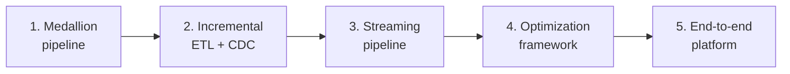

# 18 – Real World Projects

Five projects that combine everything from topics 01–17 into things you can
actually build, show in an interview, and adapt at work.



---

## The Projects

| # | Project | Core skills | Time |
|---|---------|-------------|------|
| 1 | [Medallion Pipeline](project_1_medallion_pipeline.md) | Auto Loader, Delta, quality gates, Workflows | 3–4 h |
| 2 | [Incremental ETL](project_2_incremental_etl.md) | Watermarks, MERGE, CDC, SCD2, backfills | 4–5 h |
| 3 | [Streaming Pipeline](project_3_streaming_pipeline.md) | Structured Streaming, watermarks, DLT | 4–5 h |
| 4 | [Optimization Framework](project_4_optimization_framework.md) | Clustering, OPTIMIZE, system tables, cost | 3–4 h |
| 5 | [End-to-End Platform](project_5_end_to_end_platform.md) | Everything: UC, bundles, CI/CD, monitoring | 8–12 h |

---

## How to Use These

```text
✔ Build them in order — each assumes the previous
✔ Type the code rather than copying; the errors teach you
✔ Break things deliberately, then fix them
✔ Keep everything in a Git repository as a portfolio
✔ Write a short README per project: problem, design, trade-offs
```

```text
For interviews, the trade-offs matter more than the code.
"I used MERGE rather than append because retries must be idempotent"
demonstrates more than a working notebook.
```

---

## Shared Setup

Every project assumes this base:

```sql
CREATE CATALOG IF NOT EXISTS dbx_projects;
USE CATALOG dbx_projects;

CREATE SCHEMA IF NOT EXISTS landing;
CREATE SCHEMA IF NOT EXISTS bronze;
CREATE SCHEMA IF NOT EXISTS silver;
CREATE SCHEMA IF NOT EXISTS gold;
CREATE SCHEMA IF NOT EXISTS control;
CREATE SCHEMA IF NOT EXISTS quarantine;

CREATE VOLUME IF NOT EXISTS landing.files;
```

```python
# Common helpers used across projects
CATALOG = "dbx_projects"
VOLUME  = f"/Volumes/{CATALOG}/landing/files"

def log_run(spark, **kwargs):
    from pyspark.sql import functions as F
    (spark.createDataFrame([kwargs])
        .withColumn("logged_at", F.current_timestamp())
        .write.format("delta").mode("append")
        .option("mergeSchema", "true")
        .saveAsTable(f"{CATALOG}.control.pipeline_runs"))
```

---

## Quick Revision

```text
Project 1: files → bronze → silver → gold, with a quality gate
Project 2: watermarks, MERGE, CDC events, SCD2, parameterised backfill
Project 3: streaming ingestion, windowed aggregation, late data, DLT
Project 4: measure layout, fix it, prove the improvement, track cost
Project 5: all of the above, deployed via bundles with CI/CD and monitoring
```
