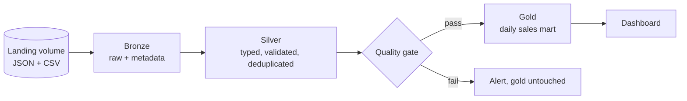
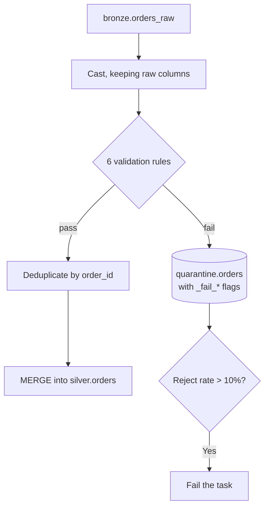

# Project 1: Medallion Pipeline

## The Brief

An online retailer drops three files into cloud storage each night: orders,
customers, and products. Build a pipeline that lands them reliably, cleans them,
publishes business aggregates, and refuses to publish bad data.



---

## Architecture Decisions

| Decision | Choice | Why |
|----------|--------|-----|
| Ingestion | Auto Loader, `availableNow` | Exactly-once, no control table, batch economics |
| Bronze types | All strings | A source format change cannot break ingestion |
| Silver write | `MERGE` on business key | Idempotent, so retries and repairs are safe |
| Bad rows | Quarantine, not fail | Good data still flows; rejects stay investigable |
| Gold publish | Behind a quality gate | Stale gold beats wrong gold |
| Orchestration | Workflows with a shared job cluster | One cluster startup, full DAG visibility |

---

## Step 1: Generate Source Files

```python
from pyspark.sql import functions as F
import json, random
from datetime import date, timedelta

CATALOG = "dbx_projects"
VOLUME  = f"/Volumes/{CATALOG}/landing/files"

def generate_day(run_date: str, n_orders: int = 2000, inject_bad: bool = True):
    random.seed(hash(run_date) % 10000)
    rows = []
    for i in range(n_orders):
        rows.append({
            "ord_id": str(abs(hash(run_date + str(i))) % 10**8),
            "cust":   f" {random.randint(1, 500)} ",
            "amt":    f"{round(random.uniform(5, 800), 2)}",
            "dt":     "/".join(reversed(run_date.split("-"))),   # dd/MM/yyyy
            "status": random.choice(["completed", "COMPLETED", "cancelled", "pending"]),
        })

    if inject_bad:
        rows += [
            {"ord_id": None, "cust": "7", "amt": "50.00", "dt": "/".join(reversed(run_date.split("-"))), "status": "completed"},
            {"ord_id": "99999901", "cust": "8", "amt": "-25.00", "dt": "/".join(reversed(run_date.split("-"))), "status": "completed"},
            {"ord_id": "99999902", "cust": "9", "amt": "N/A", "dt": "/".join(reversed(run_date.split("-"))), "status": "completed"},
        ]

    dbutils.fs.mkdirs(f"{VOLUME}/orders/")
    dbutils.fs.put(f"{VOLUME}/orders/orders_{run_date}.json",
                   "\n".join(json.dumps(r) for r in rows), overwrite=True)

# Reference data
customers = "\n".join(
    ["customer_id,name,country,segment"] +
    [f"{i},Customer_{i},{'IN' if i % 3 else 'US' if i % 2 else 'UK'},"
     f"{'PREMIUM' if i % 5 == 0 else 'STANDARD'}" for i in range(1, 501)])
dbutils.fs.mkdirs(f"{VOLUME}/customers/")
dbutils.fs.put(f"{VOLUME}/customers/customers.csv", customers, overwrite=True)

for d in range(5, 0, -1):
    generate_day(str(date.today() - timedelta(days=d)))
```

```text
The deliberate defects matter: a null key, a negative amount, and an
unparseable number. A pipeline that only handles clean data proves nothing.
```

---

## Step 2: Bronze Ingestion

```python
# notebook: 01_bronze_ingest
from pyspark.sql import functions as F

dbutils.widgets.text("catalog", "dbx_projects")
dbutils.widgets.text("entity", "orders")

CATALOG = dbutils.widgets.get("catalog")
ENTITY  = dbutils.widgets.get("entity")
FMT     = "csv" if ENTITY == "customers" else "json"

reader = (spark.readStream.format("cloudFiles")
    .option("cloudFiles.format", FMT)
    .option("cloudFiles.schemaLocation", f"/Volumes/{CATALOG}/landing/files/_schema/{ENTITY}")
    .option("cloudFiles.inferColumnTypes", "false")
    .option("cloudFiles.schemaEvolutionMode", "rescue")
    .option("cloudFiles.maxFilesPerTrigger", 100)
    .option("pathGlobFilter", f"*.{FMT}"))

if FMT == "csv":
    reader = reader.option("header", "true").option("mode", "PERMISSIVE")

df = (reader.load(f"/Volumes/{CATALOG}/landing/files/{ENTITY}/")
    .withColumn("_ingested_at",   F.current_timestamp())
    .withColumn("_source_file",   F.col("_metadata.file_path"))
    .withColumn("_file_modified", F.col("_metadata.file_modification_time"))
    .withColumn("_ingest_date",   F.current_date()))

(df.writeStream
   .option("checkpointLocation", f"/Volumes/{CATALOG}/landing/files/_ckpt/{ENTITY}")
   .option("mergeSchema", "true")
   .trigger(availableNow=True)
   .toTable(f"{CATALOG}.bronze.{ENTITY}_raw")
   .awaitTermination())

count = spark.table(f"{CATALOG}.bronze.{ENTITY}_raw") \
             .filter(F.col("_ingest_date") == F.current_date()).count()
dbutils.jobs.taskValues.set(key=f"bronze_{ENTITY}_rows", value=count)
print(f"Bronze {ENTITY}: {count} rows")
```

```text
Note awaitTermination(): with availableNow the stream must finish before
the task ends, or downstream tasks read an empty table.
```

---

## Step 3: Silver Transformation

```python
# notebook: 02_silver_orders
from pyspark.sql import functions as F
from pyspark.sql.window import Window

dbutils.widgets.text("catalog", "dbx_projects")
dbutils.widgets.text("run_date", "")
CATALOG  = dbutils.widgets.get("catalog")
RUN_DATE = dbutils.widgets.get("run_date")

raw = spark.table(f"{CATALOG}.bronze.orders_raw")
if RUN_DATE:
    raw = raw.filter(F.col("_ingest_date") >= F.date_sub(F.lit(RUN_DATE), 2))

# --- 1. cast, keeping the originals so failures are detectable
typed = raw.select(
    F.col("ord_id").cast("bigint").alias("order_id"),
    F.trim("cust").cast("int").alias("customer_id"),
    F.col("amt").cast("decimal(18,2)").alias("amount"),
    F.to_date("dt", "dd/MM/yyyy").alias("order_date"),
    F.upper(F.trim("status")).alias("status"),
    F.col("ord_id").alias("_raw_ord_id"),
    F.col("amt").alias("_raw_amt"),
    "_ingested_at", "_source_file",
)

# --- 2. validate
RULES = {
    "valid_order_id":   "order_id IS NOT NULL",
    "valid_customer":   "customer_id IS NOT NULL",
    "amount_parsed":    "NOT (amount IS NULL AND _raw_amt IS NOT NULL)",
    "amount_positive":  "amount >= 0",
    "valid_date":       "order_date IS NOT NULL AND order_date <= current_date()",
    "known_status":     "status IN ('COMPLETED','CANCELLED','PENDING','REFUNDED')",
}
COND = " AND ".join(f"({r})" for r in RULES.values())

valid   = typed.filter(COND)
invalid = typed.filter(f"NOT ({COND})")

n_invalid = invalid.count()
n_total   = typed.count()

if n_invalid:
    tagged = invalid
    for name, rule in RULES.items():
        tagged = tagged.withColumn(f"_fail_{name}", F.expr(f"NOT ({rule})"))
    (tagged.withColumn("_quarantined_at", F.current_timestamp())
           .write.format("delta").mode("append")
           .option("mergeSchema", "true")
           .saveAsTable(f"{CATALOG}.quarantine.orders"))

reject_rate = n_invalid / max(n_total, 1)
if reject_rate > 0.10:
    raise Exception(f"Reject rate {reject_rate:.1%} exceeds 10% — refusing to load")

# --- 3. deduplicate: latest ingestion wins
w = Window.partitionBy("order_id").orderBy(F.col("_ingested_at").desc())
clean = (valid.withColumn("_rn", F.row_number().over(w))
              .filter("_rn = 1")
              .drop("_rn", "_raw_ord_id", "_raw_amt"))

# --- 4. idempotent upsert
spark.sql(f"""
CREATE TABLE IF NOT EXISTS {CATALOG}.silver.orders (
    order_id BIGINT, customer_id INT, amount DECIMAL(18,2),
    order_date DATE, status STRING,
    _ingested_at TIMESTAMP, _source_file STRING
) USING DELTA CLUSTER BY (order_date)
""")

clean.createOrReplaceTempView("updates")
spark.sql(f"""
MERGE INTO {CATALOG}.silver.orders t
USING updates s ON t.order_id = s.order_id
WHEN MATCHED AND s._ingested_at > t._ingested_at THEN UPDATE SET *
WHEN NOT MATCHED THEN INSERT *
""")

dbutils.jobs.taskValues.set(key="silver_rows", value=clean.count())
dbutils.jobs.taskValues.set(key="quarantined", value=n_invalid)
print(f"Silver: {clean.count()} clean, {n_invalid} quarantined ({reject_rate:.2%})")
```



---

## Step 4: Silver Customers

```python
# notebook: 03_silver_customers
from pyspark.sql import functions as F

CATALOG = dbutils.widgets.get("catalog")

clean = (spark.table(f"{CATALOG}.bronze.customers_raw")
    .select(
        F.col("customer_id").cast("int").alias("customer_id"),
        F.col("name"),
        F.upper(F.trim("country")).alias("country"),
        F.upper(F.trim("segment")).alias("segment"),
        "_ingested_at")
    .filter("customer_id IS NOT NULL")
    .dropDuplicates(["customer_id"]))

clean.write.format("delta").mode("overwrite") \
     .saveAsTable(f"{CATALOG}.silver.customers")

dbutils.jobs.taskValues.set(key="silver_customers", value=clean.count())
```

```text
A small, slowly changing dimension: full overwrite is correct here.
Reaching for incremental logic on a 500-row table is over-engineering.
```

---

## Step 5: Quality Gate

```python
# notebook: 04_quality_check
from pyspark.sql import functions as F

CATALOG  = dbutils.widgets.get("catalog")
RUN_DATE = dbutils.widgets.get("run_date")

orders    = spark.table(f"{CATALOG}.silver.orders")
customers = spark.table(f"{CATALOG}.silver.customers")

if RUN_DATE:
    orders = orders.filter(F.col("order_date") == RUN_DATE)

orphans = orders.join(customers, "customer_id", "left_anti").count()
row_count = orders.count()

# Volume baseline from history
hist = (spark.table(f"{CATALOG}.silver.orders")
    .groupBy("order_date").count()
    .filter(F.col("order_date") < RUN_DATE if RUN_DATE else F.lit(True))
    .agg(F.avg("count").alias("mu")).collect())
baseline = hist[0].mu if hist and hist[0].mu else row_count

checks = {
    "has_rows":            row_count > 0,
    "no_null_keys":        orders.filter("order_id IS NULL").count() == 0,
    "no_duplicates":       row_count == orders.select("order_id").distinct().count(),
    "no_negative_amounts": orders.filter("amount < 0").count() == 0,
    "no_orphan_customers": orphans == 0,
    "customers_present":   customers.count() > 0,
    "volume_plausible":    abs(row_count - baseline) / max(baseline, 1) < 0.5,
}

failed = [k for k, ok in checks.items() if not ok]
for k, ok in checks.items():
    print(f"{'PASS' if ok else 'FAIL'}  {k}")

dbutils.jobs.taskValues.set(key="passed", value=len(failed) == 0)
dbutils.jobs.taskValues.set(key="failed_checks", value=failed)
dbutils.jobs.taskValues.set(key="row_count", value=row_count)
```

```text
This task deliberately does not raise. It records a verdict; the
If/else task decides the route. Separating measurement from control
flow makes both easier to reason about.
```

---

## Step 6: Gold Mart

```python
# notebook: 05_gold_daily_sales
CATALOG  = dbutils.widgets.get("catalog")
RUN_DATE = dbutils.widgets.get("run_date")

spark.sql(f"""
CREATE TABLE IF NOT EXISTS {CATALOG}.gold.daily_sales_summary (
    order_date DATE, country STRING, segment STRING,
    order_count BIGINT, customer_count BIGINT,
    total_revenue DECIMAL(18,2), avg_order_value DECIMAL(18,2),
    cancelled_orders BIGINT, _updated_at TIMESTAMP
) USING DELTA CLUSTER BY (order_date, country)
COMMENT 'Daily revenue by country and segment. Grain: one row per date/country/segment. Revenue = COMPLETED orders only.'
""")

spark.sql(f"""
MERGE INTO {CATALOG}.gold.daily_sales_summary t
USING (
    SELECT
        o.order_date, c.country, c.segment,
        count(*)                                   AS order_count,
        count(DISTINCT o.customer_id)              AS customer_count,
        sum(CASE WHEN o.status = 'COMPLETED' THEN o.amount ELSE 0 END) AS total_revenue,
        avg(CASE WHEN o.status = 'COMPLETED' THEN o.amount END)        AS avg_order_value,
        sum(CASE WHEN o.status = 'CANCELLED' THEN 1 ELSE 0 END)        AS cancelled_orders,
        current_timestamp()                        AS _updated_at
    FROM {CATALOG}.silver.orders o
    JOIN {CATALOG}.silver.customers c USING (customer_id)
    WHERE o.order_date >= current_date() - INTERVAL 3 DAYS
    GROUP BY o.order_date, c.country, c.segment
) s
ON t.order_date = s.order_date AND t.country = s.country AND t.segment = s.segment
WHEN MATCHED THEN UPDATE SET *
WHEN NOT MATCHED THEN INSERT *
""")

spark.sql(f"SELECT * FROM {CATALOG}.gold.daily_sales_summary ORDER BY order_date DESC LIMIT 20").show()
```

```text
The 3-day window handles late-arriving data: an order that lands two
days late still corrects its original date. Recomputing only today
would leave older dates permanently wrong.
```

---

## Step 7: Summary Task

```python
# notebook: 06_pipeline_summary  (run_if: ALL_DONE)
from pyspark.sql import functions as F

CATALOG  = dbutils.widgets.get("catalog")
RUN_DATE = dbutils.widgets.get("run_date")

def tv(task, key, default=0):
    return dbutils.jobs.taskValues.get(taskKey=task, key=key,
                                       default=default, debugValue=default)

summary = {
    "pipeline_name":  "medallion_retail",
    "run_date":       RUN_DATE,
    "bronze_orders":  tv("bronze_orders", "bronze_orders_rows"),
    "silver_orders":  tv("silver_orders", "silver_rows"),
    "quarantined":    tv("silver_orders", "quarantined"),
    "quality_passed": tv("quality_check", "passed", False),
    "failed_checks":  str(tv("quality_check", "failed_checks", [])),
}
print(summary)

(spark.createDataFrame([summary])
   .withColumn("logged_at", F.current_timestamp())
   .write.format("delta").mode("append")
   .option("mergeSchema", "true")
   .saveAsTable(f"{CATALOG}.control.pipeline_runs"))
```

---

## Step 8: The Workflow

```yaml
# databricks.yml
bundle:
  name: medallion_retail

variables:
  catalog: { default: dbx_projects }

resources:
  jobs:
    medallion_retail:
      name: "medallion_retail_${bundle.target}"
      max_concurrent_runs: 1
      schedule:
        quartz_cron_expression: "0 0 6 * * ?"
        timezone_id: UTC
        pause_status: PAUSED
      email_notifications:
        on_failure: [you@example.com]
        no_alert_for_skipped_runs: true
      health:
        rules:
          - metric: RUN_DURATION_SECONDS
            op: GREATER_THAN
            value: 1800
      parameters:
        - name: catalog
          default: ${var.catalog}
        - name: run_date
          default: "{{job.start_time.[iso_date]}}"
      job_clusters:
        - job_cluster_key: main
          new_cluster:
            spark_version: "14.3.x-scala2.12"
            node_type_id: Standard_DS3_v2
            num_workers: 2
            data_security_mode: SINGLE_USER
      tasks:
        - task_key: bronze_orders
          job_cluster_key: main
          max_retries: 2
          notebook_task:
            notebook_path: ./01_bronze_ingest
            base_parameters: { entity: orders }

        - task_key: bronze_customers
          job_cluster_key: main
          max_retries: 2
          notebook_task:
            notebook_path: ./01_bronze_ingest
            base_parameters: { entity: customers }

        - task_key: silver_orders
          depends_on: [{ task_key: bronze_orders }]
          job_cluster_key: main
          notebook_task: { notebook_path: ./02_silver_orders }

        - task_key: silver_customers
          depends_on: [{ task_key: bronze_customers }]
          job_cluster_key: main
          notebook_task: { notebook_path: ./03_silver_customers }

        - task_key: quality_check
          depends_on:
            - { task_key: silver_orders }
            - { task_key: silver_customers }
          job_cluster_key: main
          notebook_task: { notebook_path: ./04_quality_check }

        - task_key: quality_gate
          depends_on: [{ task_key: quality_check }]
          condition_task:
            op: EQUAL_TO
            left: "{{tasks.quality_check.values.passed}}"
            right: "true"

        - task_key: gold_daily_sales
          depends_on: [{ task_key: quality_gate, outcome: "true" }]
          job_cluster_key: main
          notebook_task: { notebook_path: ./05_gold_daily_sales }

        - task_key: alert_failure
          depends_on: [{ task_key: quality_gate, outcome: "false" }]
          job_cluster_key: main
          notebook_task: { notebook_path: ./07_alert_failure }

        - task_key: pipeline_summary
          depends_on:
            - { task_key: gold_daily_sales }
            - { task_key: alert_failure }
          run_if: ALL_DONE
          job_cluster_key: main
          notebook_task: { notebook_path: ./06_pipeline_summary }
```

```bash
databricks bundle validate
databricks bundle deploy --target dev
databricks bundle run medallion_retail
```

---

## Step 9: Test the Failure Path

```sql
-- Break referential integrity on purpose
INSERT INTO dbx_projects.silver.orders
VALUES (999999999, 99999, 100.00, current_date(), 'COMPLETED',
        current_timestamp(), 'manual_test');
```

Re-run and confirm:

```text
quality_check     → no_orphan_customers FAILS
quality_gate      → false branch
gold_daily_sales  → SKIPPED (yesterday's correct gold is retained)
alert_failure     → FAILED with a message
pipeline_summary  → runs anyway (run_if ALL_DONE)
job status        → FAILED, notification sent
```

```sql
DELETE FROM dbx_projects.silver.orders WHERE order_id = 999999999;
```

Then use **Repair run** to re-run only the failed and skipped tasks.

---

## Step 10: Verify

```sql
-- Bronze keeps everything, including bad rows
SELECT count(*) FROM dbx_projects.bronze.orders_raw;

-- Silver keeps only valid rows, one per order
SELECT count(*), count(DISTINCT order_id) FROM dbx_projects.silver.orders;

-- Quarantine explains every rejection
SELECT _fail_valid_order_id, _fail_amount_positive, _fail_amount_parsed, count(*)
FROM dbx_projects.quarantine.orders
GROUP BY 1, 2, 3;

-- Gold reconciles with silver
SELECT
    (SELECT sum(total_revenue) FROM dbx_projects.gold.daily_sales_summary) AS gold_rev,
    (SELECT sum(amount) FROM dbx_projects.silver.orders WHERE status = 'COMPLETED') AS silver_rev;

-- Run history
SELECT * FROM dbx_projects.control.pipeline_runs ORDER BY logged_at DESC;
```

---

## What This Demonstrates

```text
✔ Auto Loader with schema rescue and exactly-once ingestion
✔ Bronze as strings with full ingestion metadata
✔ Named validation rules and an explainable quarantine table
✔ A reject-rate threshold that distinguishes noise from a systemic problem
✔ Correct deduplication (row_number, not dropDuplicates)
✔ Idempotent MERGE with an ordering guard
✔ Late-arrival window in the gold recompute
✔ Quality gate: stale gold beats wrong gold
✔ Conditional branching, run_if ALL_DONE, repair runs
✔ Deployed as code with alerts and a health rule
```

---

## Extensions

| Extension | Teaches |
|-----------|---------|
| Replace ingestion with a For Each over a control table | Metadata-driven design |
| Add a file arrival trigger | Event-driven pipelines |
| Rebuild silver and gold as a DLT pipeline | Topic 13 |
| Add liquid clustering and an OPTIMIZE task | Topic 14 |
| Add freshness and quarantine alerts | Topic 16 |
| Add a Databricks SQL dashboard on `control.pipeline_runs` | Topic 09 |
| Add row filters by country on gold | Topic 17 |
