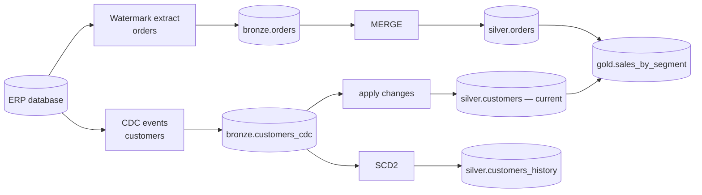
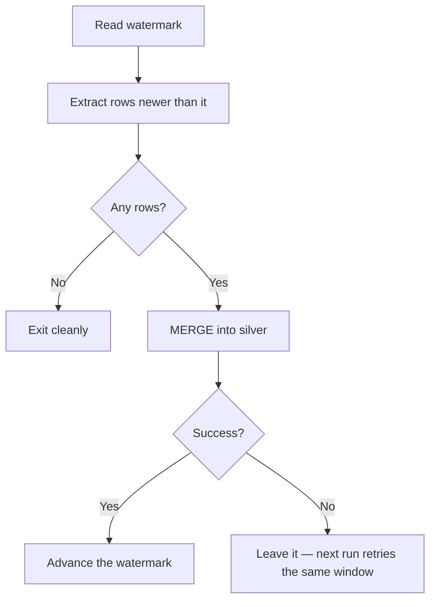
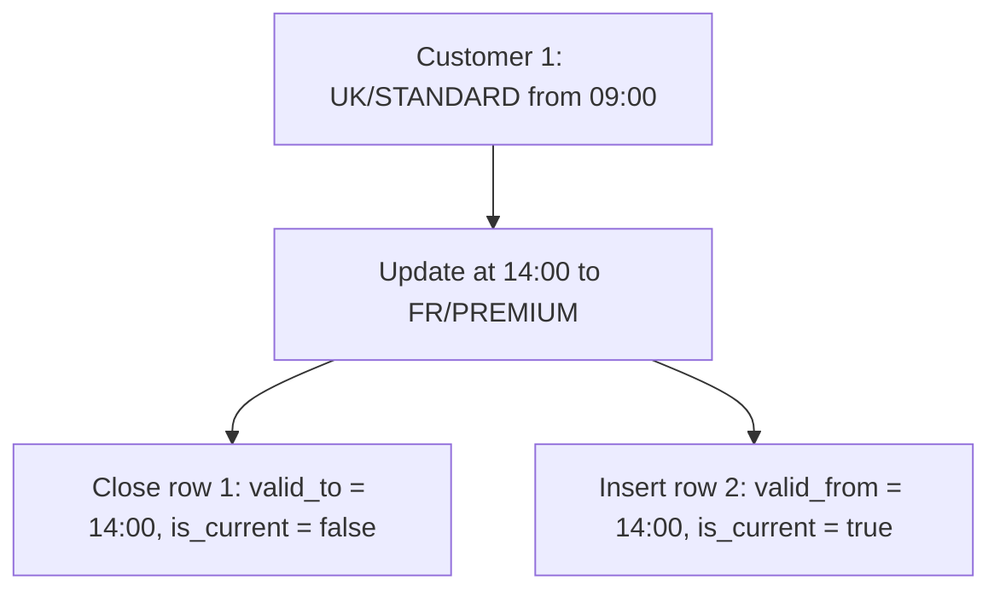
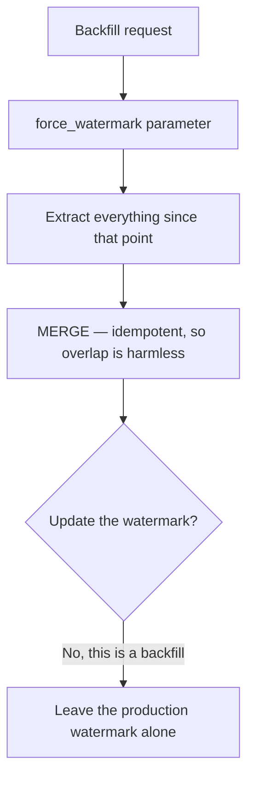
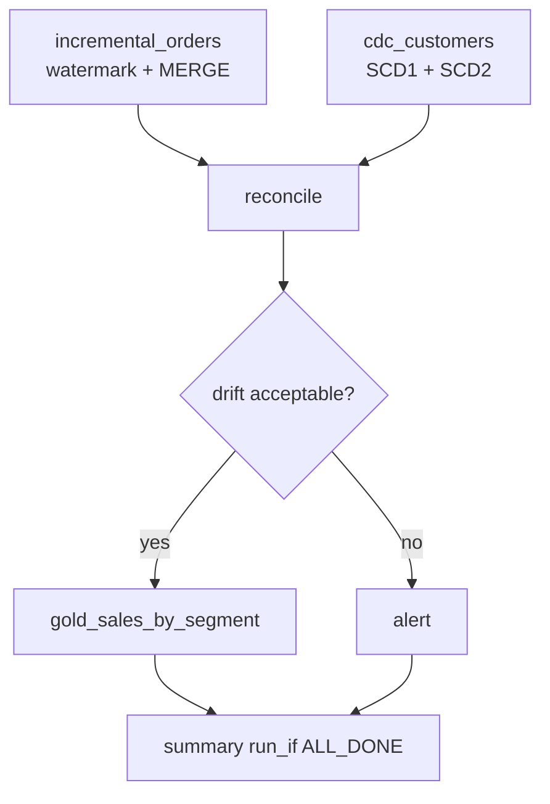

# Project 2: Incremental ETL with CDC and SCD2

## The Brief

An ERP database holds 50 million orders and 2 million customers. A full nightly
reload is no longer possible. Build an incremental pipeline that:

```text
✔ Loads only what changed, using a watermark
✔ Handles inserts, updates, and deletes via CDC
✔ Maintains customer history as SCD Type 2
✔ Supports backfills without code changes
✔ Reconciles against the source and alerts on drift
```



---

## Step 1: Simulated Source

```python
from pyspark.sql import functions as F
from datetime import datetime, timedelta
import random

CATALOG = "dbx_projects"
spark.sql(f"USE CATALOG {CATALOG}")
spark.sql("CREATE SCHEMA IF NOT EXISTS source")

# Source orders table, with an updated_at column we can watermark on
spark.sql("""
CREATE TABLE IF NOT EXISTS source.orders (
    order_id BIGINT, customer_id INT, amount DECIMAL(18,2),
    order_date DATE, status STRING, updated_at TIMESTAMP
) USING DELTA
""")

def seed_orders(n=50000):
    base = datetime.now() - timedelta(days=30)
    df = (spark.range(1, n + 1)
        .withColumn("order_id", F.col("id"))
        .withColumn("customer_id", (F.rand(1) * 2000).cast("int") + 1)
        .withColumn("amount", F.round(F.rand(2) * 500 + 10, 2).cast("decimal(18,2)"))
        .withColumn("order_date", F.date_sub(F.current_date(), (F.rand(3) * 30).cast("int")))
        .withColumn("status", F.when(F.rand(4) > 0.1, "COMPLETED").otherwise("CANCELLED"))
        .withColumn("updated_at", F.lit(base).cast("timestamp"))
        .drop("id"))
    df.write.format("delta").mode("overwrite").saveAsTable("source.orders")

def simulate_changes(n_new=500, n_updates=200):
    """New orders plus updates to existing ones, all with a fresh updated_at."""
    max_id = spark.sql("SELECT max(order_id) m FROM source.orders").collect()[0].m
    new = (spark.range(max_id + 1, max_id + n_new + 1)
        .withColumn("order_id", F.col("id"))
        .withColumn("customer_id", (F.rand() * 2000).cast("int") + 1)
        .withColumn("amount", F.round(F.rand() * 500 + 10, 2).cast("decimal(18,2)"))
        .withColumn("order_date", F.current_date())
        .withColumn("status", F.lit("COMPLETED"))
        .withColumn("updated_at", F.current_timestamp())
        .drop("id"))
    new.write.format("delta").mode("append").saveAsTable("source.orders")

    spark.sql(f"""
        UPDATE source.orders
        SET status = 'CANCELLED', updated_at = current_timestamp()
        WHERE order_id IN (SELECT order_id FROM source.orders
                           ORDER BY rand() LIMIT {n_updates})
    """)

seed_orders()
```

---

## Step 2: The Control Table

```sql
CREATE TABLE IF NOT EXISTS dbx_projects.control.load_state (
    table_name   STRING,
    watermark    TIMESTAMP,
    last_run_id  STRING,
    rows_loaded  BIGINT,
    updated_at   TIMESTAMP
) USING DELTA;
```



```text
The whole design rests on step G happening only after step E succeeds.
Advancing first turns a transient failure into permanent data loss.
```

---

## Step 3: Watermark Incremental Load

```python
# notebook: 01_incremental_orders
from pyspark.sql import functions as F

dbutils.widgets.text("catalog", "dbx_projects")
dbutils.widgets.text("overlap_minutes", "5")
dbutils.widgets.text("force_watermark", "")     # for backfills

CATALOG = dbutils.widgets.get("catalog")
OVERLAP = int(dbutils.widgets.get("overlap_minutes"))
FORCED  = dbutils.widgets.get("force_watermark")
TABLE   = "orders"

spark.sql(f"USE CATALOG {CATALOG}")

# --- 1. read the watermark
if FORCED:
    last_wm = FORCED
else:
    rows = spark.sql(f"""
        SELECT watermark FROM control.load_state WHERE table_name = '{TABLE}'
    """).collect()
    last_wm = str(rows[0].watermark) if rows else "1900-01-01 00:00:00"

print(f"Watermark: {last_wm} (overlap {OVERLAP} min)")

# --- 2. extract with a small overlap; MERGE makes re-reads harmless
src = spark.sql(f"""
    SELECT * FROM source.{TABLE}
    WHERE updated_at >= timestamp'{last_wm}' - INTERVAL {OVERLAP} MINUTES
""")

n = src.count()
if n == 0:
    print("No changes")
    dbutils.jobs.taskValues.set(key="rows_loaded", value=0)
    dbutils.notebook.exit("NO_DATA")

# --- 3. land in bronze (append-only, full history of what we saw)
(src.withColumn("_ingested_at", F.current_timestamp())
    .withColumn("_batch_id", F.lit(dbutils.widgets.get("catalog") + "_" + str(spark.sparkContext.applicationId)))
    .write.format("delta").mode("append")
    .option("mergeSchema", "true")
    .saveAsTable(f"bronze.{TABLE}"))

# --- 4. deduplicate within the batch, then MERGE into silver
from pyspark.sql.window import Window
w = Window.partitionBy("order_id").orderBy(F.col("updated_at").desc())
latest = src.withColumn("_rn", F.row_number().over(w)).filter("_rn = 1").drop("_rn")

spark.sql("""
CREATE TABLE IF NOT EXISTS silver.orders (
    order_id BIGINT, customer_id INT, amount DECIMAL(18,2),
    order_date DATE, status STRING, updated_at TIMESTAMP
) USING DELTA CLUSTER BY (order_date)
""")

latest.createOrReplaceTempView("updates")
spark.sql("""
MERGE INTO silver.orders t
USING updates s ON t.order_id = s.order_id
WHEN MATCHED AND s.updated_at > t.updated_at THEN UPDATE SET *
WHEN NOT MATCHED THEN INSERT *
""")

# --- 5. advance the watermark ONLY now
new_wm = src.agg(F.max("updated_at")).collect()[0][0]
spark.sql(f"""
MERGE INTO control.load_state t
USING (SELECT '{TABLE}' AS table_name, timestamp'{new_wm}' AS watermark,
              {n} AS rows_loaded, current_timestamp() AS updated_at) s
ON t.table_name = s.table_name
WHEN MATCHED THEN UPDATE SET watermark = s.watermark,
                             rows_loaded = s.rows_loaded,
                             updated_at = s.updated_at
WHEN NOT MATCHED THEN INSERT (table_name, watermark, rows_loaded, updated_at)
                      VALUES (s.table_name, s.watermark, s.rows_loaded, s.updated_at)
""")

dbutils.jobs.taskValues.set(key="rows_loaded", value=n)
print(f"Loaded {n} rows; watermark advanced to {new_wm}")
```

```text
Three details that matter:

1. The overlap window covers boundary records written during the previous read
2. Deduplication inside the batch prevents "multiple source rows matched"
3. The MERGE guard (s.updated_at > t.updated_at) stops an older record
   overwriting a newer one during a reprocess
```

---

## Step 4: CDC for Customers

```python
# Simulate a CDC feed: insert, update, delete events
from pyspark.sql import functions as F

spark.sql("""
CREATE TABLE IF NOT EXISTS bronze.customers_cdc (
    customer_id INT, name STRING, country STRING, segment STRING,
    email STRING, operation STRING, updated_at TIMESTAMP,
    _ingested_at TIMESTAMP
) USING DELTA
""")

events = spark.createDataFrame([
    (1, "Alice",  "UK", "STANDARD", "alice@x.com", "I", "2026-09-18 09:00:00"),
    (2, "Bob",    "US", "PREMIUM",  "bob@x.com",   "I", "2026-09-18 09:01:00"),
    (1, "Alice",  "FR", "PREMIUM",  "alice@x.com", "U", "2026-09-18 14:00:00"),  # moved + upgraded
    (3, "Chandra","IN", "STANDARD", "c@x.com",     "I", "2026-09-18 15:00:00"),
    (2, None,     None, None,        None,         "D", "2026-09-18 16:00:00"),  # deleted
], "customer_id INT, name STRING, country STRING, segment STRING, email STRING, operation STRING, updated_at STRING")

(events.withColumn("updated_at", F.col("updated_at").cast("timestamp"))
       .withColumn("_ingested_at", F.current_timestamp())
       .write.format("delta").mode("append").saveAsTable("bronze.customers_cdc"))
```

### Applying CDC to current state (SCD1)

```python
from pyspark.sql.window import Window

spark.sql("""
CREATE TABLE IF NOT EXISTS silver.customers (
    customer_id INT, name STRING, country STRING,
    segment STRING, email STRING, updated_at TIMESTAMP
) USING DELTA
""")

# Collapse to one event per key — mandatory before MERGE
w = Window.partitionBy("customer_id").orderBy(F.col("updated_at").desc())
latest = (spark.table("bronze.customers_cdc")
    .withColumn("_rn", F.row_number().over(w))
    .filter("_rn = 1").drop("_rn", "_ingested_at"))

latest.createOrReplaceTempView("cdc_batch")

spark.sql("""
MERGE INTO silver.customers t
USING cdc_batch s ON t.customer_id = s.customer_id
WHEN MATCHED AND s.operation = 'D' THEN DELETE
WHEN MATCHED AND s.operation IN ('I','U') AND s.updated_at > t.updated_at THEN
    UPDATE SET t.name = s.name, t.country = s.country,
               t.segment = s.segment, t.email = s.email,
               t.updated_at = s.updated_at
WHEN NOT MATCHED AND s.operation <> 'D' THEN
    INSERT (customer_id, name, country, segment, email, updated_at)
    VALUES (s.customer_id, s.name, s.country, s.segment, s.email, s.updated_at)
""")

spark.sql("SELECT * FROM silver.customers ORDER BY customer_id").show()
```

```text
Expected result: customer 1 in FR/PREMIUM, customer 3 present,
customer 2 gone. A watermark-based load could never have removed customer 2 —
that is precisely what CDC adds.
```

---

## Step 5: SCD Type 2 History

```python
spark.sql("""
CREATE TABLE IF NOT EXISTS silver.customers_history (
    customer_id INT, name STRING, country STRING, segment STRING,
    email STRING, valid_from TIMESTAMP, valid_to TIMESTAMP, is_current BOOLEAN
) USING DELTA
""")

# The two-row union trick: one row closes the old version, one inserts the new
spark.sql("""
MERGE INTO silver.customers_history t
USING (
    -- rows that will INSERT a new version
    SELECT customer_id AS merge_key, * FROM cdc_batch WHERE operation <> 'D'
    UNION ALL
    -- NULL merge_key forces the "not matched" branch, so the UPDATE branch
    -- closes the existing current row
    SELECT NULL AS merge_key, c.*
    FROM cdc_batch c
    JOIN silver.customers_history h
      ON c.customer_id = h.customer_id AND h.is_current = true
    WHERE c.operation <> 'D'
      AND (c.country <> h.country OR c.segment <> h.segment)
) s
ON t.customer_id = s.merge_key AND t.is_current = true

WHEN MATCHED AND (t.country <> s.country OR t.segment <> s.segment) THEN
    UPDATE SET t.is_current = false, t.valid_to = s.updated_at

WHEN NOT MATCHED THEN
    INSERT (customer_id, name, country, segment, email, valid_from, valid_to, is_current)
    VALUES (s.customer_id, s.name, s.country, s.segment, s.email, s.updated_at, NULL, true)
""")

spark.sql("""
SELECT customer_id, country, segment, valid_from, valid_to, is_current
FROM silver.customers_history ORDER BY customer_id, valid_from
""").show()
```



```text
Compare this with the DLT one-liner in topic 13:

    stored_as_scd_type=2, track_history_column_list=['country','segment']

Build it by hand once so you understand what APPLY CHANGES is doing —
then use APPLY CHANGES in production.
```

### Point-in-time join

```sql
-- Revenue by the segment the customer was in AT ORDER TIME
SELECT h.segment, sum(o.amount) AS revenue
FROM dbx_projects.silver.orders o
JOIN dbx_projects.silver.customers_history h
  ON o.customer_id = h.customer_id
 AND o.updated_at >= h.valid_from
 AND (h.valid_to IS NULL OR o.updated_at < h.valid_to)
GROUP BY h.segment;
```

```text
This is the reason SCD2 exists. With SCD1 only, a customer upgraded to
PREMIUM today would retroactively change last year's segment revenue —
and last year's published report would stop reconciling.
```

---

## Step 6: Reconciliation

```python
# notebook: 04_reconcile
from pyspark.sql import functions as F

CATALOG = dbutils.widgets.get("catalog")
spark.sql(f"USE CATALOG {CATALOG}")

src = spark.sql("SELECT count(*) c, sum(amount) s FROM source.orders").collect()[0]
tgt = spark.sql("SELECT count(*) c, sum(amount) s FROM silver.orders").collect()[0]

row_diff = abs(src.c - tgt.c)
amt_diff = abs(float(src.s or 0) - float(tgt.s or 0))
amt_pct  = amt_diff / max(float(src.s or 1), 1)

print(f"Source: {src.c} rows, {src.s}")
print(f"Target: {tgt.c} rows, {tgt.s}")
print(f"Diff:   {row_diff} rows, {amt_pct:.4%} of value")

dbutils.jobs.taskValues.set(key="row_diff", value=int(row_diff))
dbutils.jobs.taskValues.set(key="amount_diff_pct", value=float(amt_pct))

if amt_pct > 0.001:
    raise Exception(f"Reconciliation failed: {amt_pct:.3%} value difference")
```

```sql
-- Which specific rows differ?
SELECT 'missing_in_target' AS issue, order_id FROM dbx_projects.source.orders
EXCEPT
SELECT 'missing_in_target', order_id FROM dbx_projects.silver.orders;
```

```text
Incremental pipelines drift. Without scheduled reconciliation, they are
quietly wrong and nobody has checked. Run it nightly, alert on drift.
```

---

## Step 7: Backfill

```python
# Backfill a window without changing any code
from databricks.sdk import WorkspaceClient
w = WorkspaceClient()

w.jobs.run_now(job_id=JOB_ID, job_parameters={
    "force_watermark": "2026-09-01 00:00:00",
    "overlap_minutes": "0",
})
```



```text
Important subtlety: a backfill should NOT advance the production watermark,
or the normal schedule will skip everything between the backfill point and now.
Add a `skip_watermark_update` flag for backfill runs.
```

```python
SKIP_WM = dbutils.widgets.get("skip_watermark_update") == "true"
if not SKIP_WM:
    # ... advance the watermark
    pass
```

---

## Step 8: Gold with Point-in-Time Correctness

```sql
CREATE OR REPLACE TABLE dbx_projects.gold.sales_by_segment
CLUSTER BY (order_date)
COMMENT 'Revenue by the customer segment AS AT order time (SCD2 join). COMPLETED orders only.'
AS
SELECT
    o.order_date,
    h.country,
    h.segment,
    count(*)        AS order_count,
    sum(o.amount)   AS revenue,
    current_timestamp() AS _updated_at
FROM dbx_projects.silver.orders o
JOIN dbx_projects.silver.customers_history h
  ON o.customer_id = h.customer_id
 AND o.updated_at >= h.valid_from
 AND (h.valid_to IS NULL OR o.updated_at < h.valid_to)
WHERE o.status = 'COMPLETED'
GROUP BY o.order_date, h.country, h.segment;
```

---

## Step 9: The Workflow



```yaml
tasks:
  - task_key: incremental_orders
    job_cluster_key: main
    max_retries: 2
    notebook_task:
      notebook_path: ./01_incremental_orders
      base_parameters:
        overlap_minutes: "5"
        skip_watermark_update: "false"

  - task_key: cdc_customers
    job_cluster_key: main
    notebook_task: { notebook_path: ./02_cdc_customers }

  - task_key: reconcile
    depends_on:
      - { task_key: incremental_orders }
      - { task_key: cdc_customers }
    job_cluster_key: main
    notebook_task: { notebook_path: ./04_reconcile }

  - task_key: gold_sales
    depends_on: [{ task_key: reconcile }]
    job_cluster_key: main
    notebook_task: { notebook_path: ./05_gold_sales }
```

---

## Step 10: Exercises

```text
1. Run the pipeline, then simulate_changes(), then run it again.
   Confirm only the changed rows were processed.

2. Run it twice with no source changes. Confirm the second run
   loads zero rows and silver is unchanged — idempotency.

3. Kill the job midway (before the watermark update). Re-run.
   Confirm no data is lost and none is duplicated.

4. Manually advance the watermark ahead of reality, insert source rows
   behind it, and observe the silent data loss. This is the failure the
   ordering rule prevents — worth seeing once.

5. Delete a row in the source without a CDC event. Watch reconciliation
   catch the drift that the watermark load could not see.

6. Change a customer's country twice in one batch and confirm SCD2
   produces the correct chain of versions.
```

---

## What This Demonstrates

```text
✔ Watermark-based incremental extraction with an overlap window
✔ Control table state management, updated only after success
✔ Batch-level deduplication before MERGE
✔ MERGE with an ordering guard for out-of-order reprocessing
✔ CDC handling of inserts, updates, and deletes
✔ SCD Type 2 with valid_from / valid_to / is_current
✔ Point-in-time joins for historically correct reporting
✔ Reconciliation against the source, with alerting on drift
✔ Parameterised backfill that does not corrupt the production watermark
```

---

## Extensions

| Extension | Teaches |
|-----------|---------|
| Replace the manual SCD2 MERGE with DLT `apply_changes` | Topic 13 |
| Enable Change Data Feed on silver and drive gold incrementally | Topic 10 |
| Add a For Each loop over 20 source tables from a config table | Topic 08 |
| Add lateness measurement and tune the overlap window from data | Topic 10 |
| Add quarantine and a reject-rate threshold | Topic 10 |
| Publish reconciliation results to a dashboard with alerts | Topics 09, 16 |
