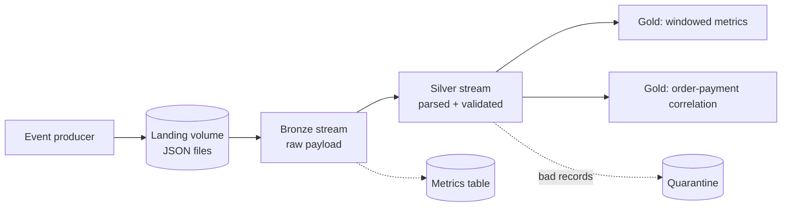
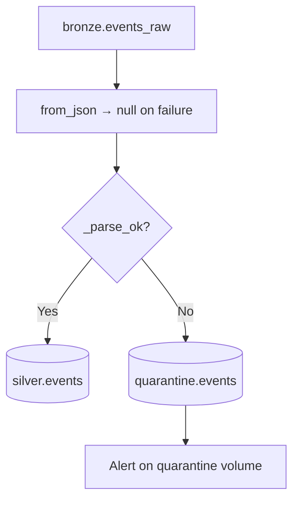
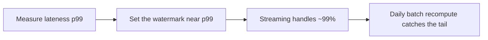
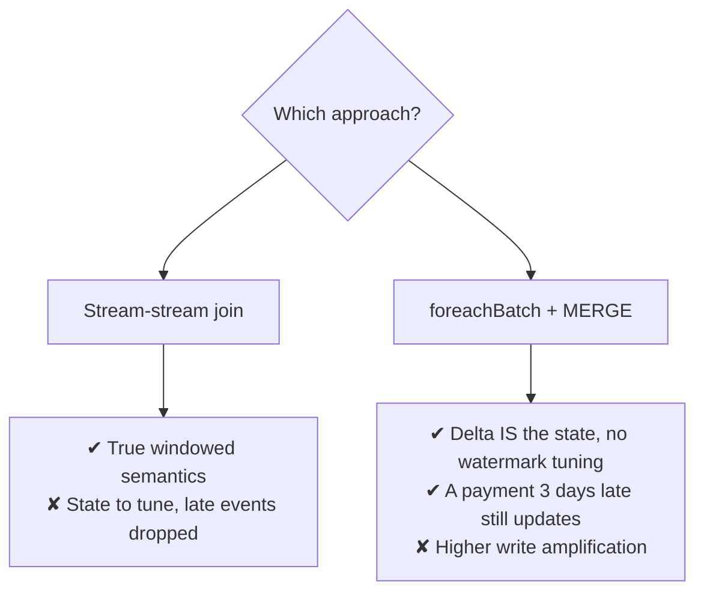
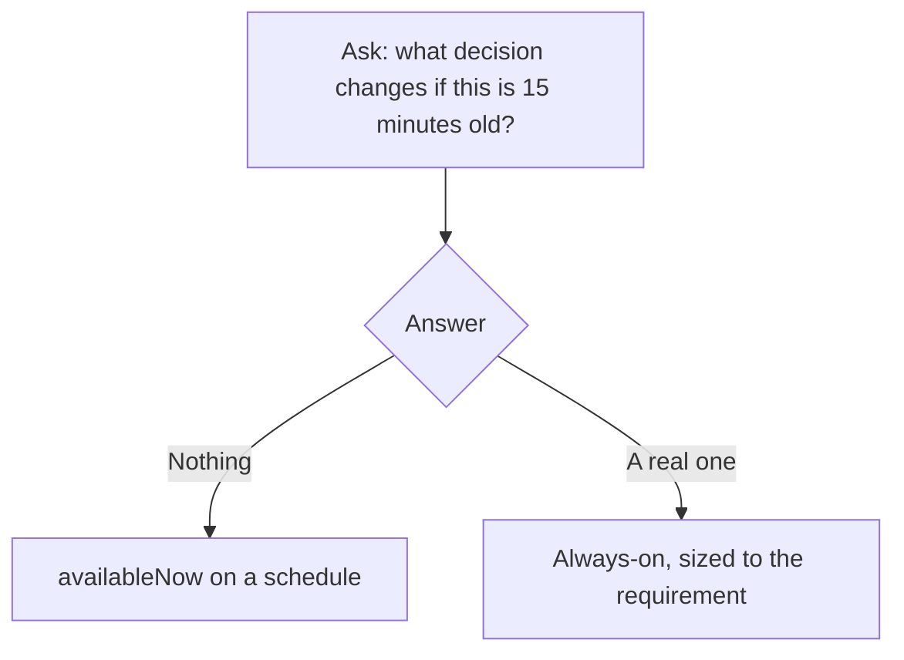

# Project 3: Streaming Data Pipeline

## The Brief

An e-commerce site emits clickstream and order events continuously. Build a
near-real-time pipeline that:

```text
✔ Ingests events with exactly-once guarantees
✔ Parses and validates without a bad record killing the stream
✔ Aggregates by event time, handling late arrivals
✔ Correlates orders with payments
✔ Runs cheaply, with monitoring that catches a silent death
```



---

## Step 1: The Event Generator

```python
import json, random, time
from datetime import datetime, timedelta

CATALOG = "dbx_projects"
VOLUME  = f"/Volumes/{CATALOG}/landing/files/events"
dbutils.fs.mkdirs(VOLUME)

def emit_batch(n=500, late_fraction=0.05, bad_fraction=0.02):
    """Write one file of events, some deliberately late and some malformed."""
    now = datetime.utcnow()
    events = []
    for i in range(n):
        # most events are near-real-time; some are minutes or hours late
        if random.random() < late_fraction:
            ts = now - timedelta(minutes=random.randint(20, 240))
        else:
            ts = now - timedelta(seconds=random.randint(0, 60))

        events.append(json.dumps({
            "event_id":    f"{int(time.time()*1000)}_{i}",
            "event_type":  random.choice(["view", "add_to_cart", "order", "payment"]),
            "order_id":    random.randint(1, 5000),
            "customer_id": random.randint(1, 1000),
            "amount":      round(random.uniform(10, 500), 2),
            "country":     random.choice(["IN", "US", "UK", "DE"]),
            "event_time":  ts.isoformat(),
        }))

    # malformed records that must not kill the stream
    for _ in range(int(n * bad_fraction)):
        events.append('{"event_id": "broken", "event_time":')

    fname = f"{VOLUME}/events_{int(time.time())}.json"
    dbutils.fs.put(fname, "\n".join(events), overwrite=True)
    return fname

for _ in range(5):
    print(emit_batch())
```

---

## Step 2: Bronze Stream

```python
# notebook: 01_bronze_stream
from pyspark.sql import functions as F

CATALOG = "dbx_projects"
VOLUME  = f"/Volumes/{CATALOG}/landing/files/events"

bronze = (spark.readStream.format("cloudFiles")
    .option("cloudFiles.format", "text")          # keep the raw line intact
    .option("cloudFiles.maxFilesPerTrigger", 50)
    .load(VOLUME)
    .select(
        F.col("value").alias("raw_payload"),
        F.col("_metadata.file_path").alias("_source_file"),
        F.current_timestamp().alias("_ingested_at"),
    ))

(bronze.writeStream
    .option("checkpointLocation", f"{VOLUME}/_ckpt/bronze")
    .option("mergeSchema", "true")
    .trigger(availableNow=True)
    .toTable(f"{CATALOG}.bronze.events_raw")
    .awaitTermination())

print(spark.table(f"{CATALOG}.bronze.events_raw").count(), "rows in bronze")
```

```text
Reading as `text` rather than `json` is deliberate: a malformed line
lands intact instead of failing the read, and silver decides what to do
with it. This is the bronze contract — keep everything.
```

---

## Step 3: Silver Stream with Quarantine

```python
# notebook: 02_silver_stream
from pyspark.sql import functions as F

CATALOG = "dbx_projects"
VOLUME  = f"/Volumes/{CATALOG}/landing/files/events"

SCHEMA = """
    event_id STRING, event_type STRING, order_id BIGINT,
    customer_id INT, amount DOUBLE, country STRING, event_time TIMESTAMP
"""

parsed = (spark.readStream.format("delta")
    .table(f"{CATALOG}.bronze.events_raw")
    .withColumn("d", F.from_json("raw_payload", SCHEMA))
    .withColumn("_parse_ok", F.col("d").isNotNull() & F.col("d.event_time").isNotNull()))

def write_batch(batch_df, batch_id):
    b = batch_df.persist()
    spark_ = b.sparkSession

    good = (b.filter("_parse_ok")
        .select("d.*", "_ingested_at", "_source_file")
        .filter("event_id IS NOT NULL AND amount >= 0"))

    bad = (b.filter("NOT _parse_ok")
        .select("raw_payload", "_ingested_at", "_source_file")
        .withColumn("_batch_id", F.lit(batch_id))
        .withColumn("_quarantined_at", F.current_timestamp()))

    (good.write.format("delta").mode("append")
        .option("mergeSchema", "true")
        .saveAsTable(f"{CATALOG}.silver.events"))

    if bad.count() > 0:
        (bad.write.format("delta").mode("append")
            .option("mergeSchema", "true")
            .saveAsTable(f"{CATALOG}.quarantine.events"))

    print(f"batch {batch_id}: {good.count()} good, {bad.count()} quarantined")
    b.unpersist()

(parsed.writeStream
    .foreachBatch(write_batch)
    .option("checkpointLocation", f"{VOLUME}/_ckpt/silver")
    .trigger(availableNow=True)
    .start()
    .awaitTermination())
```



```text
`from_json` returning null instead of throwing is what keeps the stream
alive. A pipeline that dies on one malformed record cannot run unattended.

`foreachBatch` is required here because we write to two tables from one
micro-batch — a plain sink cannot do that.
```

---

## Step 4: Windowed Aggregation with Watermarks

```python
# notebook: 03_gold_windowed
from pyspark.sql import functions as F

CATALOG = "dbx_projects"
VOLUME  = f"/Volumes/{CATALOG}/landing/files/events"

events = (spark.readStream.format("delta")
    .table(f"{CATALOG}.silver.events")
    .filter("event_time IS NOT NULL"))

hourly = (events
    .withWatermark("event_time", "30 minutes")       # measured, see below
    .groupBy(F.window("event_time", "1 hour"), "country", "event_type")
    .agg(
        F.count("*").alias("event_count"),
        F.sum("amount").alias("total_amount"),
        F.approx_count_distinct("customer_id").alias("unique_customers"),
    )
    .select(
        F.col("window.start").alias("hour_start"),
        F.col("window.end").alias("hour_end"),
        "country", "event_type", "event_count", "total_amount", "unique_customers",
    ))

def upsert_hourly(batch_df, batch_id):
    batch_df.createOrReplaceTempView("w")
    batch_df.sparkSession.sql(f"""
        MERGE INTO {CATALOG}.gold.hourly_metrics t
        USING w s
        ON t.hour_start = s.hour_start
       AND t.country = s.country
       AND t.event_type = s.event_type
        WHEN MATCHED THEN UPDATE SET *
        WHEN NOT MATCHED THEN INSERT *
    """)

spark.sql(f"""
CREATE TABLE IF NOT EXISTS {CATALOG}.gold.hourly_metrics (
    hour_start TIMESTAMP, hour_end TIMESTAMP, country STRING, event_type STRING,
    event_count BIGINT, total_amount DOUBLE, unique_customers BIGINT
) USING DELTA CLUSTER BY (hour_start)
""")

(hourly.writeStream
    .outputMode("update")
    .foreachBatch(upsert_hourly)
    .option("checkpointLocation", f"{VOLUME}/_ckpt/gold_hourly")
    .trigger(availableNow=True)
    .start()
    .awaitTermination())
```

```text
Why update mode + MERGE rather than append?

append → each window is written once, only after the watermark passes it.
         Correct and final, but the dashboard shows nothing for 90 minutes.

update → windows are upserted as they change, so the dashboard is current
         and self-corrects when late data arrives.

For an operational dashboard, update is the better experience.
For an immutable audit record, append is the right choice.
```

### Measuring the watermark rather than guessing

```sql
SELECT
    percentile(unix_timestamp(_ingested_at) - unix_timestamp(event_time), 0.50) / 60 AS p50_min,
    percentile(unix_timestamp(_ingested_at) - unix_timestamp(event_time), 0.95) / 60 AS p95_min,
    percentile(unix_timestamp(_ingested_at) - unix_timestamp(event_time), 0.99) / 60 AS p99_min,
    max(unix_timestamp(_ingested_at) - unix_timestamp(event_time)) / 60             AS max_min
FROM dbx_projects.silver.events;
```



---

## Step 5: Correlating Orders and Payments

Two approaches — build both and compare.

### Approach A: stream-stream join

```python
orders = (spark.readStream.format("delta").table(f"{CATALOG}.silver.events")
    .filter("event_type = 'order'")
    .select("order_id", "customer_id", "amount", F.col("event_time").alias("order_time"))
    .withWatermark("order_time", "1 hour"))

payments = (spark.readStream.format("delta").table(f"{CATALOG}.silver.events")
    .filter("event_type = 'payment'")
    .select(F.col("order_id").alias("pay_order_id"),
            F.col("amount").alias("paid_amount"),
            F.col("event_time").alias("payment_time"))
    .withWatermark("payment_time", "2 hours"))

matched = orders.join(
    payments,
    F.expr("""
        order_id = pay_order_id AND
        payment_time >= order_time AND
        payment_time <= order_time + INTERVAL 30 MINUTES
    """),
    "leftOuter")

result = matched.withColumn(
    "payment_status",
    F.when(F.col("payment_time").isNull(), "UNPAID").otherwise("PAID"))

(result.writeStream
    .outputMode("append")
    .option("checkpointLocation", f"{VOLUME}/_ckpt/order_payments")
    .trigger(availableNow=True)
    .toTable(f"{CATALOG}.gold.order_payments")
    .awaitTermination())
```

```text
Behaviour to observe:
- PAID rows appear once the payment arrives within 30 minutes
- UNPAID rows appear only after the 2-hour watermark expires
- State holds ~1 hour of orders and ~2 hours of payments
```

### Approach B: foreachBatch + MERGE (usually better)

```python
spark.sql(f"""
CREATE TABLE IF NOT EXISTS {CATALOG}.gold.order_state (
    order_id BIGINT, customer_id INT, amount DOUBLE,
    order_time TIMESTAMP, paid BOOLEAN, paid_amount DOUBLE,
    payment_time TIMESTAMP, _updated_at TIMESTAMP
) USING DELTA
""")

def apply_events(batch_df, batch_id):
    s = batch_df.sparkSession
    batch_df.createOrReplaceTempView("ev")

    s.sql(f"""
        MERGE INTO {CATALOG}.gold.order_state t
        USING (SELECT * FROM ev WHERE event_type = 'order') o
        ON t.order_id = o.order_id
        WHEN NOT MATCHED THEN
          INSERT (order_id, customer_id, amount, order_time, paid, _updated_at)
          VALUES (o.order_id, o.customer_id, o.amount, o.event_time, false, current_timestamp())
    """)

    s.sql(f"""
        MERGE INTO {CATALOG}.gold.order_state t
        USING (SELECT * FROM ev WHERE event_type = 'payment') p
        ON t.order_id = p.order_id
        WHEN MATCHED THEN
          UPDATE SET t.paid = true, t.paid_amount = p.amount,
                     t.payment_time = p.event_time, t._updated_at = current_timestamp()
    """)

(spark.readStream.format("delta").table(f"{CATALOG}.silver.events")
    .writeStream
    .foreachBatch(apply_events)
    .option("checkpointLocation", f"{VOLUME}/_ckpt/order_state")
    .trigger(availableNow=True)
    .start()
    .awaitTermination())
```



```text
For "update the record when a related event arrives", approach B is
simpler, more robust, and handles arbitrarily late events. Reach for a
stream-stream join only when you genuinely need windowed correlation.
```

---

## Step 6: Monitoring

```python
# Persist streaming metrics so they outlive the cluster
from pyspark.sql.streaming import StreamingQueryListener
from pyspark.sql import functions as F
import json

class MetricsListener(StreamingQueryListener):
    def onQueryStarted(self, event): pass
    def onQueryTerminated(self, event): pass
    def onQueryProgress(self, event):
        p = json.loads(event.progress.json)
        row = [{
            "query_name":   p.get("name"),
            "batch_id":     p.get("batchId"),
            "input_rows":   p.get("numInputRows"),
            "input_rps":    p.get("inputRowsPerSecond"),
            "processed_rps":p.get("processedRowsPerSecond"),
            "batch_ms":     p.get("batchDuration"),
            "watermark":    p.get("eventTime", {}).get("watermark"),
            "state_rows":   sum(o.get("numRowsTotal", 0) for o in p.get("stateOperators", [])),
            "dropped_late": sum(o.get("numRowsDroppedByWatermark", 0) for o in p.get("stateOperators", [])),
        }]
        (spark.createDataFrame(row)
            .withColumn("logged_at", F.current_timestamp())
            .write.format("delta").mode("append")
            .option("mergeSchema", "true")
            .saveAsTable(f"{CATALOG}.control.stream_metrics"))

spark.streams.addListener(MetricsListener())
```

```sql
-- Alert: a stream stopped reporting (the silent death)
SELECT query_name, max(logged_at) AS last_seen
FROM dbx_projects.control.stream_metrics
GROUP BY query_name
HAVING max(logged_at) < current_timestamp() - INTERVAL 15 MINUTES;
```

```sql
-- Alert: falling behind
SELECT query_name, avg(input_rps) AS in_rps, avg(processed_rps) AS out_rps
FROM dbx_projects.control.stream_metrics
WHERE logged_at >= current_timestamp() - INTERVAL 30 MINUTES
GROUP BY query_name
HAVING avg(input_rps) > avg(processed_rps) * 1.1;
```

```sql
-- Alert: data being dropped as too late
SELECT query_name, sum(dropped_late) AS dropped
FROM dbx_projects.control.stream_metrics
WHERE logged_at >= current_date()
GROUP BY query_name HAVING sum(dropped_late) > 0;
```

---

## Step 7: The DLT Version

The same pipeline, declaratively — worth building to feel the difference.

```python
import dlt
from pyspark.sql import functions as F

SCHEMA = "event_id STRING, event_type STRING, order_id BIGINT, customer_id INT, amount DOUBLE, country STRING, event_time TIMESTAMP"

@dlt.table(name="bronze_events")
def bronze_events():
    return (spark.readStream.format("cloudFiles")
        .option("cloudFiles.format", "text")
        .load("/Volumes/dbx_projects/landing/files/events")
        .select(F.col("value").alias("raw_payload"),
                F.current_timestamp().alias("_ingested_at")))

@dlt.table(name="silver_events")
@dlt.expect_or_drop("parsed", "event_id IS NOT NULL")
@dlt.expect_or_drop("has_event_time", "event_time IS NOT NULL")
@dlt.expect("plausible_amount", "amount BETWEEN 0 AND 10000")
def silver_events():
    return (dlt.read_stream("bronze_events")
        .select(F.from_json("raw_payload", SCHEMA).alias("d"), "_ingested_at")
        .select("d.*", "_ingested_at"))

@dlt.table(name="quarantine_events")
def quarantine_events():
    return (dlt.read_stream("bronze_events")
        .withColumn("d", F.from_json("raw_payload", SCHEMA))
        .filter("d IS NULL OR d.event_id IS NULL")
        .select("raw_payload", "_ingested_at")
        .withColumn("_quarantined_at", F.current_timestamp()))

@dlt.table(name="gold_hourly_metrics")
def gold_hourly_metrics():
    return (dlt.read_stream("silver_events")
        .withWatermark("event_time", "30 minutes")
        .groupBy(F.window("event_time", "1 hour"), "country", "event_type")
        .agg(F.count("*").alias("event_count"),
             F.sum("amount").alias("total_amount"))
        .select(F.col("window.start").alias("hour_start"),
                F.col("window.end").alias("hour_end"),
                "country", "event_type", "event_count", "total_amount"))
```

```text
What disappeared:
✘ Four checkpoint paths
✘ foreachBatch functions and MERGE statements
✘ Manual quarantine plumbing
✘ Table creation DDL
✘ Dependency wiring

What you gained:
✔ Automatic quality metrics in the event log
✔ Lineage
✔ Managed state and retries
```

---

## Step 8: Cost Comparison

```text
Configuration A — always-on, default trigger, 4 workers:
  168 hours/week of compute

Configuration B — availableNow every 5 minutes, 2 workers:
  ~288 runs/day × ~1.5 min ≈ 7 hours/day ≈ 50 hours/week

Configuration C — availableNow every 15 minutes, 2 workers:
  ~96 runs/day × ~1.5 min ≈ 2.4 hours/day ≈ 17 hours/week

Same data. Roughly a 10× cost range, driven entirely by the
latency requirement — which is usually never actually asked.
```



---

## Step 9: Exercises

```text
1. Run emit_batch() repeatedly while the streams run with
   trigger(processingTime="30 seconds"). Watch batches appear.

2. Set the watermark to 1 minute. Confirm late events are dropped and
   numRowsDroppedByWatermark rises.

3. Kill the cluster mid-batch. Restart. Confirm no duplicates and no gaps.

4. Change the groupBy keys and restart on the same checkpoint.
   Observe the failure — then fix it with a new checkpoint.

5. Compare approach A and approach B for order-payment correlation
   by emitting a payment 3 hours after its order.

6. Build the DLT version and compare lines of code and operational effort.

7. Measure the actual lateness distribution and re-tune the watermark.
```

---

## What This Demonstrates

```text
✔ Exactly-once streaming ingestion with checkpoints
✔ Bronze as raw text so malformed records cannot break the stream
✔ from_json + quarantine for resilient parsing
✔ foreachBatch for multi-table writes and MERGE
✔ Event-time windowing with a measured watermark
✔ update mode + MERGE for self-correcting dashboards
✔ Stream-stream join versus Delta-as-state, with the trade-offs
✔ StreamingQueryListener metrics persisted to Delta
✔ Alerts for falling behind, dropped late data, and silent death
✔ The same pipeline in DLT, and what the framework removes
✔ The cost consequence of the latency requirement
```

---

## Extensions

| Extension | Teaches |
|-----------|---------|
| Replace files with Kafka or Event Hubs | Real streaming sources |
| Add session windows for user journeys | Topic 11 |
| Add a continuous job with auto-restart | Topic 08 |
| Add RocksDB state store and changelog checkpointing | Topic 11 |
| Add a daily batch reconciliation of gold from silver | Topic 10 |
| Add a real-time dashboard on gold.hourly_metrics | Topic 09 |
