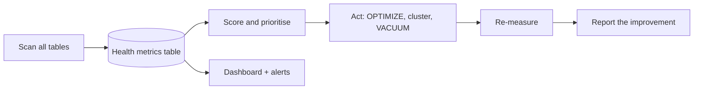
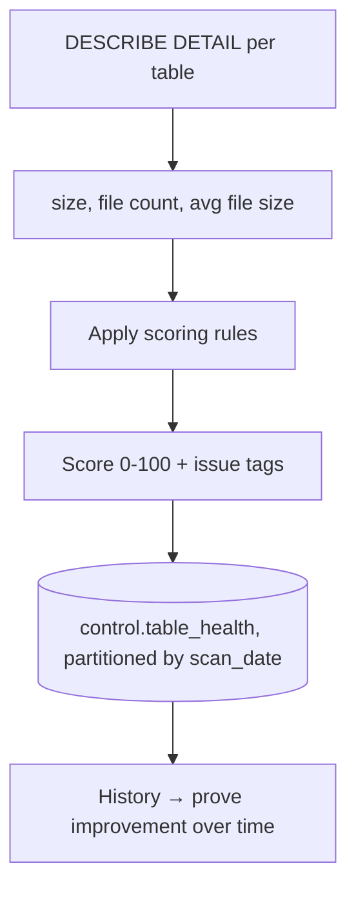
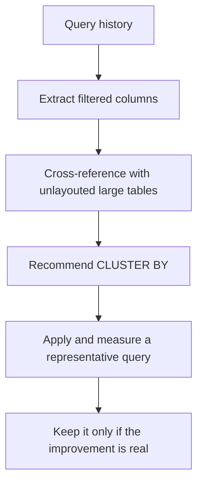
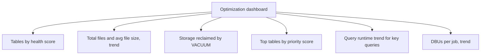

# Project 4: Delta Optimization Framework

## The Brief

A platform has 200 Delta tables. Nobody knows which are fragmented, which are
badly clustered, or which cost the most. Build a framework that **measures**,
**prioritises**, **acts**, and **proves the improvement**.



```text
The point of a framework rather than ad-hoc tuning: OPTIMIZE on a healthy
table costs money and changes nothing. Measurement is what makes
optimisation an investment instead of a ritual.
```

---

## Step 1: The Health Metrics Table

```sql
CREATE TABLE IF NOT EXISTS dbx_projects.control.table_health (
    scan_date        DATE,
    catalog_name     STRING,
    schema_name      STRING,
    table_name       STRING,
    full_name        STRING,
    size_bytes       BIGINT,
    num_files        BIGINT,
    avg_file_mb      DOUBLE,
    partition_cols   STRING,
    clustering_cols  STRING,
    last_modified    TIMESTAMP,
    days_since_write INT,
    health_score     INT,
    issues           STRING,
    scanned_at       TIMESTAMP
) USING DELTA
PARTITIONED BY (scan_date);
```

---

## Step 2: The Scanner

```python
# notebook: 01_scan_table_health
from pyspark.sql import functions as F
from datetime import datetime

CATALOG = dbutils.widgets.get("catalog") if dbutils.widgets.get("catalog") else "dbx_projects"
SCHEMAS = ["bronze", "silver", "gold"]

def scan_table(full_name: str) -> dict:
    d = spark.sql(f"DESCRIBE DETAIL {full_name}").collect()[0]
    size_bytes = d.sizeInBytes or 0
    num_files  = d.numFiles or 0
    avg_mb     = (size_bytes / num_files / 1024 / 1024) if num_files else 0

    issues, score = [], 100

    # Small files
    if num_files > 100 and avg_mb < 16:
        issues.append("severe_small_files"); score -= 40
    elif num_files > 50 and avg_mb < 64:
        issues.append("small_files"); score -= 20

    # Layout
    if size_bytes > 10 * 1024**3 and not d.clusteringColumns and not d.partitionColumns:
        issues.append("large_table_no_layout"); score -= 25

    # Over-partitioning
    if d.partitionColumns and num_files > 10000 and avg_mb < 32:
        issues.append("over_partitioned"); score -= 30

    # Stale
    days_since = (datetime.now() - d.lastModified.replace(tzinfo=None)).days if d.lastModified else 999
    if days_since > 90:
        issues.append("stale_table"); score -= 10

    # Tiny table with many files
    if size_bytes < 100 * 1024**2 and num_files > 100:
        issues.append("tiny_table_many_files"); score -= 20

    return {
        "scan_date":       datetime.now().date(),
        "full_name":       full_name,
        "catalog_name":    full_name.split(".")[0],
        "schema_name":     full_name.split(".")[1],
        "table_name":      full_name.split(".")[2],
        "size_bytes":      size_bytes,
        "num_files":       num_files,
        "avg_file_mb":     round(avg_mb, 2),
        "partition_cols":  ",".join(d.partitionColumns or []),
        "clustering_cols": ",".join(d.clusteringColumns or []),
        "last_modified":   d.lastModified,
        "days_since_write": days_since,
        "health_score":    max(score, 0),
        "issues":          ",".join(issues) or "none",
    }

results = []
for schema in SCHEMAS:
    for t in spark.sql(f"SHOW TABLES IN {CATALOG}.{schema}").collect():
        full = f"{CATALOG}.{schema}.{t.tableName}"
        try:
            results.append(scan_table(full))
        except Exception as e:
            print(f"skip {full}: {str(e)[:120]}")

(spark.createDataFrame(results)
    .withColumn("scanned_at", F.current_timestamp())
    .write.format("delta").mode("append")
    .option("mergeSchema", "true")
    .saveAsTable(f"{CATALOG}.control.table_health"))

spark.sql(f"""
    SELECT full_name, round(size_bytes/1e9, 2) AS gb, num_files,
           avg_file_mb, health_score, issues
    FROM {CATALOG}.control.table_health
    WHERE scan_date = current_date()
    ORDER BY health_score, size_bytes DESC
""").show(50, truncate=False)
```



---

## Step 3: Prioritisation

Not every unhealthy table is worth fixing. Weight by usage and size.

```python
# notebook: 02_prioritise
from pyspark.sql import functions as F

CATALOG = "dbx_projects"

health = spark.table(f"{CATALOG}.control.table_health") \
              .filter("scan_date = current_date()")

# Usage from lineage (how often is it read?)
usage = spark.sql("""
    SELECT source_table_full_name AS full_name, count(*) AS read_events
    FROM system.access.table_lineage
    WHERE event_time >= current_date() - INTERVAL 30 DAYS
    GROUP BY 1
""")

priority = (health.join(usage, "full_name", "left")
    .fillna({"read_events": 0})
    .withColumn("size_gb", F.col("size_bytes") / 1e9)
    .withColumn("priority_score",
        (100 - F.col("health_score")) *                      # how unhealthy
        F.log1p(F.col("read_events")) *                      # how used
        F.log1p(F.col("size_gb")))                           # how large
    .orderBy(F.desc("priority_score")))

priority.select("full_name", "health_score", "read_events",
                F.round("size_gb", 2).alias("size_gb"),
                F.round("priority_score", 1).alias("priority"),
                "issues").show(20, truncate=False)

targets = [r.full_name for r in priority.limit(10).collect()]
dbutils.jobs.taskValues.set(key="targets", value=targets)
```

```text
A 5 GB table nobody queries scores low even if badly fragmented.
A 200 GB table read 4000 times a month with 40 KB files scores highest.

This is the difference between optimising and looking busy.
```

---

## Step 4: The Optimizer

```python
# notebook: 03_optimize
from pyspark.sql import functions as F
import time

CATALOG = "dbx_projects"
DRY_RUN = dbutils.widgets.get("dry_run") == "true"

targets = dbutils.jobs.taskValues.get(
    taskKey="prioritise", key="targets", default=[], debugValue=[])

def optimize_table(full_name, dry_run=True):
    before = spark.sql(f"DESCRIBE DETAIL {full_name}").collect()[0]
    actions, t0 = [], time.time()

    avg_mb = (before.sizeInBytes / max(before.numFiles, 1)) / 1024 / 1024

    # 1. Enable auto-optimisation so the problem does not return
    if not dry_run:
        spark.sql(f"""
            ALTER TABLE {full_name} SET TBLPROPERTIES (
              'delta.autoOptimize.optimizeWrite' = 'true',
              'delta.autoOptimize.autoCompact'   = 'true',
              'delta.enableDeletionVectors'      = 'true'
            )""")
    actions.append("enabled_auto_optimize")

    # 2. Compact if fragmented
    if avg_mb < 64 and before.numFiles > 50:
        if not dry_run:
            spark.sql(f"OPTIMIZE {full_name}")
        actions.append("optimize")

    # 3. Refresh statistics
    if not dry_run:
        spark.sql(f"ANALYZE TABLE {full_name} COMPUTE STATISTICS FOR ALL COLUMNS")
    actions.append("analyze")

    # 4. Reclaim storage
    if not dry_run:
        spark.sql(f"VACUUM {full_name} RETAIN 168 HOURS")
    actions.append("vacuum")

    after = spark.sql(f"DESCRIBE DETAIL {full_name}").collect()[0]

    return {
        "full_name":      full_name,
        "files_before":   before.numFiles,
        "files_after":    after.numFiles,
        "avg_mb_before":  round(avg_mb, 2),
        "avg_mb_after":   round((after.sizeInBytes / max(after.numFiles, 1)) / 1024 / 1024, 2),
        "size_gb_before": round(before.sizeInBytes / 1e9, 3),
        "size_gb_after":  round(after.sizeInBytes / 1e9, 3),
        "duration_sec":   round(time.time() - t0, 1),
        "actions":        ",".join(actions),
        "dry_run":        dry_run,
    }

results = []
for t in targets:
    try:
        r = optimize_table(t, DRY_RUN)
        results.append(r)
        print(f"{t}: {r['files_before']} → {r['files_after']} files "
              f"({r['avg_mb_before']} → {r['avg_mb_after']} MB avg)")
    except Exception as e:
        print(f"FAILED {t}: {str(e)[:200]}")

if results:
    (spark.createDataFrame(results)
        .withColumn("run_at", F.current_timestamp())
        .write.format("delta").mode("append")
        .option("mergeSchema", "true")
        .saveAsTable(f"{CATALOG}.control.optimization_log"))
```

```text
DRY_RUN exists because the first version of any automation that runs
VACUUM across 200 tables should print what it would do, not do it.
```

---

## Step 5: Clustering Recommendations

```python
# notebook: 04_recommend_clustering
from pyspark.sql import functions as F
import re

CATALOG = "dbx_projects"

# Which columns do queries actually filter on?
queries = spark.sql("""
    SELECT statement_text, read_bytes, produced_rows, total_duration_ms
    FROM system.query.history
    WHERE start_time >= current_date() - INTERVAL 30 DAYS
      AND statement_type = 'SELECT'
      AND read_bytes > 1e9
""").collect()

def extract_filters(sql: str):
    """Very rough: find columns compared in WHERE clauses."""
    pattern = r"where\s+(.+?)(?:group by|order by|limit|$)"
    m = re.search(pattern, sql.lower(), re.DOTALL)
    if not m:
        return []
    return re.findall(r"(\w+)\s*(?:=|>|<|>=|<=|between|in)\s", m.group(1))

from collections import Counter
filter_counts = Counter()
for q in queries:
    for col in extract_filters(q.statement_text or ""):
        filter_counts[col] += 1

print("Most-filtered columns across expensive queries:")
for col, n in filter_counts.most_common(15):
    print(f"  {col}: {n}")
```

```sql
-- Which large tables have no layout at all?
SELECT full_name, round(size_bytes/1e9, 1) AS gb, num_files,
       partition_cols, clustering_cols
FROM dbx_projects.control.table_health
WHERE scan_date = current_date()
  AND size_bytes > 5e9
  AND clustering_cols = '' AND partition_cols = ''
ORDER BY size_bytes DESC;
```

```python
# Apply a recommendation and measure the effect
TABLE = "dbx_projects.silver.orders"
KEYS  = "order_date, country"

import time
def timed(sql):
    t0 = time.time()
    spark.sql(sql).collect()
    return round(time.time() - t0, 2)

q = f"SELECT count(*), sum(amount) FROM {TABLE} WHERE order_date = current_date() - INTERVAL 3 DAYS"

before = timed(q)
spark.sql(f"ALTER TABLE {TABLE} CLUSTER BY ({KEYS})")
spark.sql(f"OPTIMIZE {TABLE}")
after = timed(q)

print(f"Before: {before}s   After: {after}s   Improvement: {(1 - after/before):.0%}")
```



---

## Step 6: Cost Attribution

```sql
-- Cost per job, joined to what those jobs write
SELECT
    u.usage_metadata.job_id,
    j.name AS job_name,
    round(sum(u.usage_quantity), 1) AS dbus_30d
FROM system.billing.usage u
LEFT JOIN system.lakeflow.jobs j ON u.usage_metadata.job_id = j.job_id
WHERE u.usage_date >= current_date() - INTERVAL 30 DAYS
  AND u.usage_metadata.job_id IS NOT NULL
GROUP BY 1, 2
ORDER BY dbus_30d DESC
LIMIT 20;
```

```sql
-- Jobs getting slower: cost grows with runtime
WITH weekly AS (
    SELECT j.name AS job_name,
           date_trunc('week', r.period_start_time) AS wk,
           avg((unix_timestamp(r.period_end_time)
              - unix_timestamp(r.period_start_time)) / 60.0) AS avg_min
    FROM system.lakeflow.job_run_timeline r
    JOIN system.lakeflow.jobs j USING (job_id, workspace_id)
    WHERE r.period_start_time >= current_date() - INTERVAL 60 DAYS
      AND r.result_state = 'SUCCEEDED'
    GROUP BY 1, 2
)
SELECT job_name, wk, round(avg_min, 1) AS avg_min,
       round(avg_min - lag(avg_min) OVER (PARTITION BY job_name ORDER BY wk), 1) AS wow_change
FROM weekly ORDER BY job_name, wk;
```

```sql
-- The anti-pattern hunt
SELECT usage_metadata.cluster_id, sku_name, round(sum(usage_quantity), 1) AS dbus
FROM system.billing.usage
WHERE usage_date >= current_date() - INTERVAL 30 DAYS
  AND sku_name LIKE '%ALL_PURPOSE%'
GROUP BY 1, 2 ORDER BY dbus DESC;
```

---

## Step 7: The Dashboard



```sql
-- Tile: health trend — proof the framework is working
SELECT scan_date,
       round(avg(health_score), 1)      AS avg_health,
       sum(num_files)                   AS total_files,
       round(avg(avg_file_mb), 1)       AS avg_file_mb,
       sum(CASE WHEN issues LIKE '%small_files%' THEN 1 ELSE 0 END) AS tables_with_small_files
FROM dbx_projects.control.table_health
GROUP BY scan_date ORDER BY scan_date;
```

```sql
-- Tile: what did the last optimisation run achieve?
SELECT full_name,
       files_before, files_after,
       files_before - files_after AS files_removed,
       avg_mb_before, avg_mb_after,
       round(size_gb_before - size_gb_after, 2) AS gb_reclaimed,
       duration_sec
FROM dbx_projects.control.optimization_log
WHERE run_at >= current_date() - INTERVAL 7 DAYS
ORDER BY files_removed DESC;
```

---

## Step 8: The Scheduled Job

```yaml
resources:
  jobs:
    table_optimization:
      name: "table_optimization_${bundle.target}"
      schedule:
        quartz_cron_expression: "0 0 2 ? * SUN"     # Sunday 02:00
        timezone_id: UTC
      email_notifications:
        on_failure: [data-platform@example.com]
      job_clusters:
        - job_cluster_key: maint
          new_cluster:
            spark_version: "14.3.x-scala2.12"
            node_type_id: Standard_DS4_v2
            autoscale: { min_workers: 2, max_workers: 8 }
      tasks:
        - task_key: scan
          job_cluster_key: maint
          notebook_task: { notebook_path: ./01_scan_table_health }

        - task_key: prioritise
          depends_on: [{ task_key: scan }]
          job_cluster_key: maint
          notebook_task: { notebook_path: ./02_prioritise }

        - task_key: optimize
          depends_on: [{ task_key: prioritise }]
          job_cluster_key: maint
          timeout_seconds: 7200
          notebook_task:
            notebook_path: ./03_optimize
            base_parameters: { dry_run: "false" }

        - task_key: rescan
          depends_on: [{ task_key: optimize }]
          job_cluster_key: maint
          notebook_task: { notebook_path: ./01_scan_table_health }

        - task_key: report
          depends_on: [{ task_key: rescan }]
          run_if: ALL_DONE
          job_cluster_key: maint
          notebook_task: { notebook_path: ./05_report }
```

```text
Note the rescan after optimising: the framework measures its own effect.
Without it you have automation with no evidence that it helps.
```

---

## Step 9: The Simpler Alternative

```sql
ALTER CATALOG main ENABLE PREDICTIVE OPTIMIZATION;
```

```text
Predictive optimization runs OPTIMIZE, VACUUM, and statistics collection
automatically on Unity Catalog managed tables, based on observed usage.

Build the framework anyway, because:
✔ You learn what the platform is doing on your behalf
✔ It covers external tables and non-UC scenarios
✔ It gives you the measurement and reporting layer, which
  predictive optimization does not surface in the same way
✔ Interviews ask how you would diagnose and fix layout problems,
  not whether you can enable a feature
```

---

## Step 10: Exercises

```text
1. Create a deliberately fragmented table: write 5000 tiny appends.
   Scan it, confirm the health score collapses, optimise, rescan.

2. Time a filtered query before and after adding clustering keys.
   Record the improvement in the optimization log.

3. Over-partition a table by a high-cardinality column.
   Observe the file count explosion and the scan slowdown.

4. Run VACUUM with a 7-day retention, then try to time travel
   to an older version. Understand exactly what you lost.

5. Enable deletion vectors and compare DELETE performance before and after.

6. Extend the scanner to flag tables whose clustering keys do not
   match the columns queries actually filter on.
```

---

## What This Demonstrates

```text
✔ Measurement before action: DESCRIBE DETAIL across every table
✔ A health scoring model with explicit, explainable rules
✔ Prioritisation weighted by usage and size, not just fragmentation
✔ Safe automation with a dry-run mode
✔ Preventing recurrence (optimizeWrite, autoCompact) not just fixing
✔ Clustering recommendations derived from real query history
✔ Cost attribution and runtime trend analysis from system tables
✔ Self-measuring automation: rescan and report the improvement
✔ Knowing when the platform feature (predictive optimization) is enough
```

---

## Extensions

| Extension | Teaches |
|-----------|---------|
| Add Z-order to liquid clustering migration detection | Topic 14 |
| Add a skew detector from job task duration distributions | Topic 14 |
| Alert when a table's health score drops week over week | Topic 16 |
| Estimate cost savings from each optimisation in DBUs | Topic 14 |
| Add retention policy enforcement per classification | Topic 17 |
| Extend the scanner across multiple catalogs and workspaces | Topic 15 |
