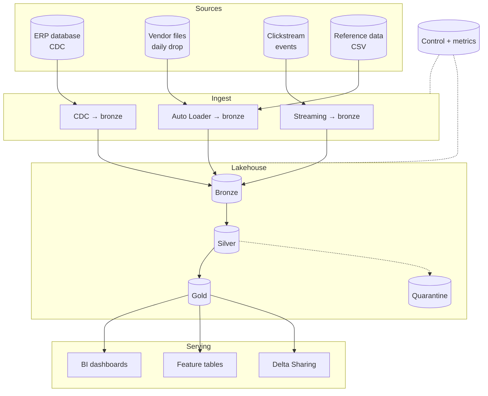
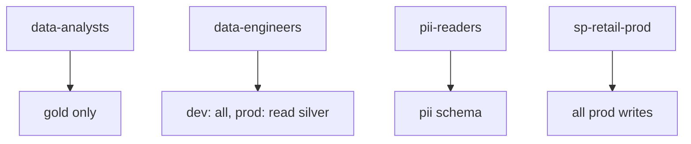
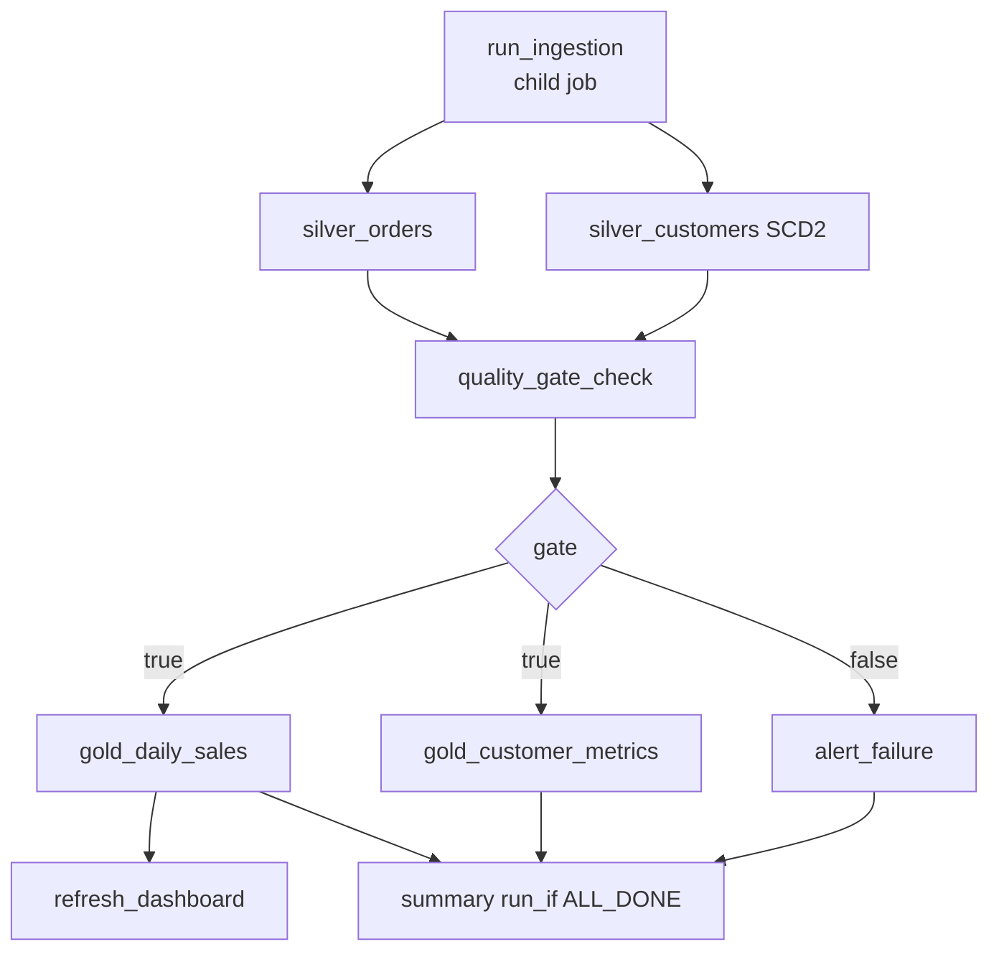
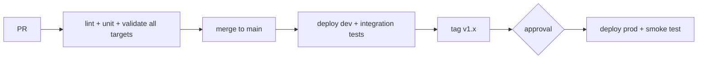
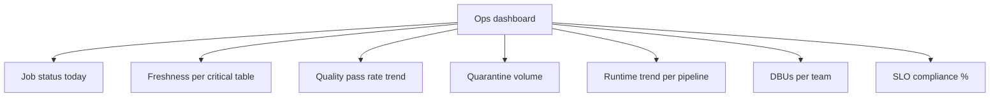

# Project 5: End-to-End Data Platform

The capstone. Everything from topics 01–17 assembled into one platform you could
defend in an architecture review.

```text
Time: 8–12 hours. Build it over several sessions.
```

---

## The Brief

A retail company needs a governed data platform serving analysts, data
scientists, and executives, with:

```text
✔ Batch and streaming ingestion from four sources
✔ A medallion architecture under Unity Catalog governance
✔ Data quality gates and quarantine
✔ Dev, staging, and production environments deployed from Git
✔ CI/CD with tests and approval gates
✔ Monitoring, alerting, and cost attribution
✔ PII protection and access control
```

---

## Target Architecture



---

## Phase 1: Governance Foundation

```sql
-- Catalogs per environment
CREATE CATALOG IF NOT EXISTS retail_dev  COMMENT 'Development';
CREATE CATALOG IF NOT EXISTS retail_stg  COMMENT 'Staging';
CREATE CATALOG IF NOT EXISTS retail_prod COMMENT 'Production';

-- Schemas per layer (repeat per catalog)
CREATE SCHEMA IF NOT EXISTS retail_prod.bronze     COMMENT 'Raw, as delivered';
CREATE SCHEMA IF NOT EXISTS retail_prod.silver     COMMENT 'Cleaned, conformed';
CREATE SCHEMA IF NOT EXISTS retail_prod.gold       COMMENT 'Business marts';
CREATE SCHEMA IF NOT EXISTS retail_prod.pii        COMMENT 'Restricted personal data';
CREATE SCHEMA IF NOT EXISTS retail_prod.control    COMMENT 'Pipeline state and metrics';
CREATE SCHEMA IF NOT EXISTS retail_prod.quarantine COMMENT 'Rejected records';
CREATE SCHEMA IF NOT EXISTS retail_prod.security   COMMENT 'Masking and filter functions';
```

```sql
-- Ownership to groups, never individuals
ALTER CATALOG retail_prod OWNER TO `data-platform-admins`;
ALTER SCHEMA retail_prod.gold OWNER TO `data-platform-admins`;

-- Least privilege
GRANT USE CATALOG ON CATALOG retail_prod TO `data-analysts`;
GRANT USE SCHEMA, SELECT ON SCHEMA retail_prod.gold TO `data-analysts`;

GRANT ALL PRIVILEGES ON CATALOG retail_dev TO `data-engineers`;
GRANT USE CATALOG ON CATALOG retail_prod TO `data-engineers`;
GRANT USE SCHEMA, SELECT ON SCHEMA retail_prod.silver TO `data-engineers`;

-- PII: one narrow group only
GRANT USE SCHEMA, SELECT ON SCHEMA retail_prod.pii TO `pii-readers`;

-- Production writes belong to a service principal
GRANT ALL PRIVILEGES ON CATALOG retail_prod TO `sp-retail-prod`;
```

```sql
-- Catalog binding: prod data unreachable from the dev workspace
ALTER CATALOG retail_prod SET WORKSPACE BINDING = (PROD_WORKSPACE_ID);
```



---

## Phase 2: Repository Structure

```text
retail-platform/
├── databricks.yml
├── resources/
│   ├── jobs_ingestion.yml
│   ├── jobs_transformation.yml
│   ├── jobs_maintenance.yml
│   └── pipelines.yml
├── src/
│   ├── common/
│   │   ├── transforms.py        # pure functions, unit tested
│   │   ├── quality.py
│   │   └── logging.py
│   ├── bronze/
│   │   ├── ingest_files.py
│   │   ├── ingest_cdc.py
│   │   └── ingest_stream.py
│   ├── silver/
│   │   ├── orders.py
│   │   ├── customers_scd2.py
│   │   └── products.py
│   ├── gold/
│   │   ├── daily_sales.py
│   │   ├── customer_metrics.py
│   │   └── feature_table.py
│   └── ops/
│       ├── quality_gate.py
│       ├── reconcile.py
│       └── optimize.py
├── sql/
│   ├── ddl/
│   ├── grants/
│   └── migrations/
├── tests/
│   ├── unit/
│   └── integration/
├── infrastructure/          # Terraform: catalogs, groups, policies
├── .github/workflows/
└── README.md
```

---

## Phase 3: Configuration-Driven Ingestion

```sql
CREATE TABLE IF NOT EXISTS retail_prod.control.ingestion_config (
    entity         STRING,
    source_type    STRING,      -- file | cdc | stream
    source_path    STRING,
    file_format    STRING,
    schema_hints   STRING,
    target_table   STRING,
    load_type      STRING,      -- full | incremental | cdc
    watermark_col  STRING,
    business_key   STRING,
    is_active      BOOLEAN,
    owner_team     STRING,
    sla_minutes    INT,
    updated_at     TIMESTAMP
) USING DELTA;

INSERT INTO retail_prod.control.ingestion_config VALUES
 ('orders',    'file','/Volumes/retail_prod/landing/orders/',   'json','order_id BIGINT',
  'retail_prod.bronze.orders_raw','incremental','updated_at','order_id',true,'sales',60,current_timestamp()),
 ('customers', 'cdc', '/Volumes/retail_prod/landing/cdc/customers/','json','customer_id INT',
  'retail_prod.bronze.customers_cdc','cdc','updated_at','customer_id',true,'crm',60,current_timestamp()),
 ('products',  'file','/Volumes/retail_prod/landing/products/', 'csv', NULL,
  'retail_prod.bronze.products_raw','full',NULL,'product_id',true,'catalog',180,current_timestamp()),
 ('events',    'stream','/Volumes/retail_prod/landing/events/', 'json',NULL,
  'retail_prod.bronze.events_raw','incremental',NULL,'event_id',true,'web',15,current_timestamp());
```

```python
# src/bronze/ingest_files.py — one notebook for every file-based source
from pyspark.sql import functions as F

dbutils.widgets.text("catalog", "retail_dev")
dbutils.widgets.text("entity", "")

CATALOG = dbutils.widgets.get("catalog")
ENTITY  = dbutils.widgets.get("entity")

cfg = (spark.table(f"{CATALOG}.control.ingestion_config")
       .filter(f"entity = '{ENTITY}' AND is_active").collect()[0])

reader = (spark.readStream.format("cloudFiles")
    .option("cloudFiles.format", cfg.file_format)
    .option("cloudFiles.schemaLocation", f"{cfg.source_path}_schema")
    .option("cloudFiles.inferColumnTypes", "false")
    .option("cloudFiles.schemaEvolutionMode", "rescue")
    .option("cloudFiles.maxFilesPerTrigger", 1000)
    .option("pathGlobFilter", f"*.{cfg.file_format}"))

if cfg.schema_hints:
    reader = reader.option("cloudFiles.schemaHints", cfg.schema_hints)
if cfg.file_format == "csv":
    reader = reader.option("header", "true").option("mode", "PERMISSIVE")

(reader.load(cfg.source_path)
    .withColumn("_ingested_at", F.current_timestamp())
    .withColumn("_source_file", F.col("_metadata.file_path"))
    .withColumn("_entity", F.lit(ENTITY))
    .writeStream
    .option("checkpointLocation", f"{cfg.source_path}_ckpt")
    .option("mergeSchema", "true")
    .trigger(availableNow=True)
    .toTable(cfg.target_table)
    .awaitTermination())
```

```yaml
# Fan out over every active file-based entity
- task_key: ingest_files
  for_each_task:
    inputs: "{{tasks.get_config.values.file_entities}}"
    concurrency: 4
    task:
      task_key: ingest_one
      job_cluster_key: ingest
      notebook_task:
        notebook_path: ../src/bronze/ingest_files.py
        base_parameters:
          catalog: ${var.catalog}
          entity: "{{input}}"
```

```text
Adding a fifth source becomes an INSERT into the config table.
No new notebook, no deployment, no code review of copy-pasted logic.
```

---

## Phase 4: Silver with Shared, Tested Logic

```python
# src/common/transforms.py — pure functions, no I/O
from pyspark.sql import functions as F
from pyspark.sql.window import Window

def cast_orders(df):
    return df.select(
        F.col("ord_id").cast("bigint").alias("order_id"),
        F.trim("cust").cast("int").alias("customer_id"),
        F.col("amt").cast("decimal(18,2)").alias("amount"),
        F.to_date("dt", "dd/MM/yyyy").alias("order_date"),
        F.upper(F.trim("status")).alias("status"),
        F.col("amt").alias("_raw_amt"),
        "_ingested_at", "_source_file",
    )

def deduplicate_latest(df, key, order_by):
    w = Window.partitionBy(key).orderBy(F.col(order_by).desc())
    return df.withColumn("_rn", F.row_number().over(w)).filter("_rn = 1").drop("_rn")

ORDER_RULES = {
    "valid_order_id":  "order_id IS NOT NULL",
    "valid_customer":  "customer_id IS NOT NULL",
    "amount_parsed":   "NOT (amount IS NULL AND _raw_amt IS NOT NULL)",
    "amount_positive": "amount >= 0",
    "valid_date":      "order_date IS NOT NULL AND order_date <= current_date()",
    "known_status":    "status IN ('COMPLETED','CANCELLED','PENDING','REFUNDED')",
}

def split_valid(df, rules):
    cond = " AND ".join(f"({r})" for r in rules.values())
    return df.filter(cond), df.filter(f"NOT ({cond})")

def tag_failures(df, rules):
    for name, rule in rules.items():
        df = df.withColumn(f"_fail_{name}", F.expr(f"NOT ({rule})"))
    return df.withColumn("_quarantined_at", F.current_timestamp())
```

```python
# tests/unit/test_transforms.py — runs in CI, no cluster needed
from src.common.transforms import cast_orders, deduplicate_latest, split_valid, ORDER_RULES

def test_cast_failure_is_detectable(spark):
    src = spark.createDataFrame(
        [("1", "5", "N/A", "18/09/2026", "completed", None, None)],
        "ord_id STRING, cust STRING, amt STRING, dt STRING, status STRING, _ingested_at STRING, _source_file STRING")
    typed = cast_orders(src)
    valid, invalid = split_valid(typed, ORDER_RULES)
    assert valid.count() == 0
    assert invalid.count() == 1        # amount_parsed rule caught it

def test_deduplicate_keeps_latest(spark):
    src = spark.createDataFrame(
        [(1, "2026-09-18 09:00:00"), (1, "2026-09-18 14:00:00")],
        "order_id INT, _ingested_at STRING")
    out = deduplicate_latest(src, "order_id", "_ingested_at")
    assert out.count() == 1
    assert out.collect()[0]._ingested_at == "2026-09-18 14:00:00"
```

---

## Phase 5: PII Protection

```sql
-- Sensitive attributes live in their own schema
CREATE TABLE retail_prod.pii.customer_contacts AS
SELECT customer_id, email, phone, address FROM staging_customers;

-- Broad tables carry a pseudonymised key instead of an identifier
CREATE TABLE retail_prod.silver.customers AS
SELECT
    customer_id,
    sha2(concat(cast(customer_id AS STRING), secret('retail','hash_salt')), 256) AS customer_key,
    country, segment, registration_date
FROM staging_customers;
```

```sql
-- Masking for any PII that must remain in a shared table
CREATE OR REPLACE FUNCTION retail_prod.security.mask_email(email STRING)
RETURN CASE
    WHEN is_account_group_member('pii-readers') THEN email
    ELSE regexp_replace(email, '^[^@]+', '***')
END;

ALTER TABLE retail_prod.pii.customer_contacts
  ALTER COLUMN email SET MASK retail_prod.security.mask_email;

-- Row filter: regional analysts see only their region
CREATE OR REPLACE FUNCTION retail_prod.security.region_filter(country STRING)
RETURN is_account_group_member('global-analysts')
    OR exists (SELECT 1 FROM retail_prod.security.user_regions
               WHERE user_email = current_user() AND region = country);

ALTER TABLE retail_prod.gold.daily_sales
  SET ROW FILTER retail_prod.security.region_filter ON (country);
```

```sql
-- Classification for inventory and erasure
ALTER TABLE retail_prod.pii.customer_contacts
  ALTER COLUMN email SET TAGS ('pii' = 'true', 'classification' = 'confidential');
```

---

## Phase 6: Bundle Definition

```yaml
# databricks.yml
bundle:
  name: retail_platform

include:
  - resources/*.yml

variables:
  catalog:        { default: retail_dev }
  landing_root:   { default: /Volumes/retail_dev/landing }
  warehouse_id:   { default: "" }
  node_type:      { default: Standard_DS3_v2 }
  max_workers:    { default: 4 }

targets:
  dev:
    mode: development
    default: true
    workspace: { host: https://adb-dev.azuredatabricks.net }
    variables:
      catalog: retail_dev
      landing_root: /Volumes/retail_dev/landing

  staging:
    mode: production
    workspace: { host: https://adb-stg.azuredatabricks.net }
    variables:
      catalog: retail_stg
      landing_root: /Volumes/retail_stg/landing
    run_as: { service_principal_name: sp-retail-stg }

  prod:
    mode: production
    workspace: { host: https://adb-prod.azuredatabricks.net }
    variables:
      catalog: retail_prod
      landing_root: /Volumes/retail_prod/landing
      node_type: Standard_DS4_v2
      max_workers: 12
    run_as: { service_principal_name: sp-retail-prod }
    permissions:
      - level: CAN_VIEW
        group_name: data-engineers
      - level: CAN_MANAGE
        group_name: data-platform-admins
```

```yaml
# resources/jobs_transformation.yml
resources:
  jobs:
    retail_daily:
      name: "retail_daily_${bundle.target}"
      max_concurrent_runs: 1
      schedule:
        quartz_cron_expression: "0 0 6 * * ?"
        timezone_id: UTC
      email_notifications:
        on_failure: [data-oncall@example.com]
        no_alert_for_skipped_runs: true
      health:
        rules:
          - metric: RUN_DURATION_SECONDS
            op: GREATER_THAN
            value: 3600
      parameters:
        - name: catalog
          default: ${var.catalog}
        - name: run_date
          default: "{{job.start_time.[iso_date]}}"
      job_clusters:
        - job_cluster_key: main
          new_cluster:
            spark_version: "14.3.x-scala2.12"
            node_type_id: ${var.node_type}
            autoscale: { min_workers: 2, max_workers: ${var.max_workers} }
            data_security_mode: SINGLE_USER
            custom_tags: { team: data-platform, env: ${bundle.target} }
      tasks:
        - task_key: run_ingestion
          run_job_task: { job_id: ${resources.jobs.retail_ingestion.id} }

        - task_key: silver_orders
          depends_on: [{ task_key: run_ingestion }]
          job_cluster_key: main
          notebook_task: { notebook_path: ../src/silver/orders.py }

        - task_key: silver_customers
          depends_on: [{ task_key: run_ingestion }]
          job_cluster_key: main
          notebook_task: { notebook_path: ../src/silver/customers_scd2.py }

        - task_key: quality_gate_check
          depends_on:
            - { task_key: silver_orders }
            - { task_key: silver_customers }
          job_cluster_key: main
          notebook_task: { notebook_path: ../src/ops/quality_gate.py }

        - task_key: gate
          depends_on: [{ task_key: quality_gate_check }]
          condition_task:
            op: EQUAL_TO
            left: "{{tasks.quality_gate_check.values.passed}}"
            right: "true"

        - task_key: gold_daily_sales
          depends_on: [{ task_key: gate, outcome: "true" }]
          job_cluster_key: main
          notebook_task: { notebook_path: ../src/gold/daily_sales.py }

        - task_key: gold_customer_metrics
          depends_on: [{ task_key: gate, outcome: "true" }]
          job_cluster_key: main
          notebook_task: { notebook_path: ../src/gold/customer_metrics.py }

        - task_key: refresh_dashboard
          depends_on: [{ task_key: gold_daily_sales }]
          sql_task:
            warehouse_id: ${var.warehouse_id}
            dashboard: { dashboard_id: "REPLACE_ME" }

        - task_key: alert_failure
          depends_on: [{ task_key: gate, outcome: "false" }]
          job_cluster_key: main
          notebook_task: { notebook_path: ../src/ops/alert_failure.py }

        - task_key: pipeline_summary
          depends_on:
            - { task_key: gold_daily_sales }
            - { task_key: gold_customer_metrics }
            - { task_key: alert_failure }
          run_if: ALL_DONE
          job_cluster_key: main
          notebook_task: { notebook_path: ../src/ops/summary.py }
```



---

## Phase 7: CI/CD

```yaml
# .github/workflows/ci.yml
name: CI
on:
  pull_request: { branches: [main] }

jobs:
  test:
    runs-on: ubuntu-latest
    steps:
      - uses: actions/checkout@v4
      - uses: actions/setup-python@v5
        with: { python-version: "3.11" }
      - run: pip install -r requirements.txt pytest ruff
      - run: ruff check src/ tests/
      - run: pytest tests/unit -v
      - uses: databricks/setup-cli@main
      - name: Validate every target
        env:
          DATABRICKS_HOST: ${{ secrets.DATABRICKS_HOST_DEV }}
          DATABRICKS_CLIENT_ID: ${{ secrets.DATABRICKS_CLIENT_ID_DEV }}
          DATABRICKS_CLIENT_SECRET: ${{ secrets.DATABRICKS_CLIENT_SECRET_DEV }}
        run: |
          databricks bundle validate --target dev
          databricks bundle validate --target staging
          databricks bundle validate --target prod
```

```yaml
# .github/workflows/cd.yml
name: CD
on:
  push:
    branches: [main]
    tags: ["v*"]

jobs:
  dev:
    runs-on: ubuntu-latest
    environment: dev
    steps:
      - uses: actions/checkout@v4
      - uses: databricks/setup-cli@main
      - env:
          DATABRICKS_HOST: ${{ secrets.DATABRICKS_HOST_DEV }}
          DATABRICKS_CLIENT_ID: ${{ secrets.DATABRICKS_CLIENT_ID_DEV }}
          DATABRICKS_CLIENT_SECRET: ${{ secrets.DATABRICKS_CLIENT_SECRET_DEV }}
        run: |
          databricks bundle deploy --target dev
          databricks bundle run integration_tests --target dev

  prod:
    needs: dev
    if: startsWith(github.ref, 'refs/tags/v')
    runs-on: ubuntu-latest
    environment: production      # manual approval gate
    steps:
      - uses: actions/checkout@v4
      - uses: databricks/setup-cli@main
      - env:
          DATABRICKS_HOST: ${{ secrets.DATABRICKS_HOST_PROD }}
          DATABRICKS_CLIENT_ID: ${{ secrets.DATABRICKS_CLIENT_ID_PROD }}
          DATABRICKS_CLIENT_SECRET: ${{ secrets.DATABRICKS_CLIENT_SECRET_PROD }}
        run: |
          databricks bundle deploy --target prod
          databricks bundle run smoke_test --target prod
```



---

## Phase 8: Monitoring

```sql
-- Freshness of every critical table
CREATE OR REPLACE VIEW retail_prod.control.v_freshness AS
SELECT 'bronze.orders_raw' AS tbl, max(_ingested_at) AS last_load
FROM retail_prod.bronze.orders_raw
UNION ALL SELECT 'silver.orders', max(_ingested_at) FROM retail_prod.silver.orders
UNION ALL SELECT 'gold.daily_sales', max(_updated_at) FROM retail_prod.gold.daily_sales;
```

```sql
-- Platform-wide job health
CREATE OR REPLACE VIEW retail_prod.control.v_job_health AS
SELECT
    j.name AS job_name,
    date(r.period_start_time) AS run_date,
    r.result_state,
    round((unix_timestamp(r.period_end_time) - unix_timestamp(r.period_start_time)) / 60.0, 1) AS minutes
FROM system.lakeflow.job_run_timeline r
JOIN system.lakeflow.jobs j USING (job_id, workspace_id)
WHERE r.period_start_time >= current_date() - INTERVAL 30 DAYS;
```

```text
Alerts to configure (topic 16):
1. Any critical job failed                       → PagerDuty
2. Any critical table stale beyond its SLA       → PagerDuty
3. Quality gate failed                           → Slack
4. Quarantine rate above 2%                      → Slack
5. Daily DBUs 50% above baseline                 → Email to platform owner
6. Permission change on retail_prod              → Security channel
7. Reconciliation drift above 0.1%               → Slack
```



---

## Phase 9: Build Order

```text
Session 1 (2h): Governance
  catalogs, schemas, groups, grants, catalog binding, Terraform for the above

Session 2 (2h): Ingestion
  config table, generic file loader, For Each fan-out, CDC loader

Session 3 (2h): Silver
  shared transform module, unit tests, quality rules, quarantine, SCD2

Session 4 (2h): Gold and serving
  marts, feature table, dashboard, row filters and masks

Session 5 (2h): Deployment
  bundle with three targets, CI workflow, first prod deploy

Session 6 (2h): Operations
  control tables, alerts, dashboards, maintenance job, cost attribution

Session 7 (2h): Break it
  fail a quality gate, corrupt a table and restore it, simulate a
  schema change, run a backfill, do a post-incident review
```

---

## Phase 10: The Architecture Review

Be able to answer these about your own build:

```text
Design
1. Why medallion rather than a single transformation step?
2. Where does business logic live, and why not in silver?
3. Why MERGE rather than append in silver?
4. How does the pipeline handle late-arriving data?
5. What happens if the same file is delivered twice?

Reliability
6. What happens if the job fails halfway through?
7. How do you reprocess three days of data?
8. What stops bad data reaching the executive dashboard?
9. How would you recover from a bad deployment?

Operations
10. How would you know if this stopped running?
11. How would you know if it ran but produced wrong numbers?
12. What is the SLA, and how do you prove you met it?

Cost
13. What does this cost per month, and what drives it?
14. What would you change if the budget halved?

Security
15. Who can see PII, and how do you prove it?
16. How does a leaver lose access?
17. What would an auditor ask that you cannot currently answer?

Trade-offs
18. What did you deliberately not build, and why?
19. What would you do differently at 100× the data volume?
20. Where is the biggest remaining risk?
```

```text
Question 18 is the one that separates candidates. "I did not build
stream-stream joins because foreachBatch with MERGE handles late payments
better for this use case" is a stronger answer than any amount of code.
```

---

## What This Demonstrates

```text
Architecture:  medallion under Unity Catalog, batch + CDC + streaming
Engineering:   config-driven ingestion, shared tested modules, idempotency
Quality:       named rules, quarantine, gates, reconciliation
Governance:    groups, least privilege, PII isolation, masks, row filters
Delivery:      bundles, three environments, CI/CD with approval gates
Operations:    control tables, seven alerts, dashboards, runbooks
Cost:          tagging, attribution, right-sizing, scheduled not always-on
Judgement:     knowing what NOT to build
```

---

## Portfolio Write-Up

For each project, write a one-page README covering:

```text
1. The problem, in business terms
2. The architecture, with one diagram
3. Three design decisions and their trade-offs
4. What you would do differently at 100× scale
5. How it is monitored and what happens when it breaks
```

```text
That document is what gets read in an interview. The code proves you can
build it; the write-up proves you understand why you built it that way.
```
