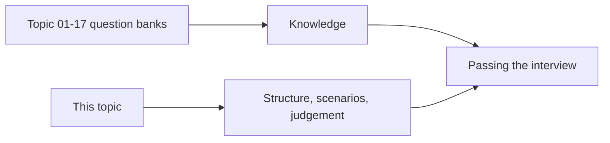

# 19 – Interview Preparation

Every topic in this repository ends with its own interview questions. This topic
is different: it covers the **cross-cutting** questions, how to **structure an
answer**, and a **preparation plan**.



---

## What Interviewers Are Really Testing

```text
Not: can you recall the syntax of MERGE?
But: do you know why MERGE matters, and when it is the wrong tool?

Not: do you know what a watermark is?
But: how would you choose the value, and what breaks if you get it wrong?

Not: can you write a pipeline?
But: how does it behave at 3 AM when the vendor sends a corrupt file?
```

Strong candidates talk about **failure modes, trade-offs, and cost**. Weak
candidates recite features.

---

## Reading Order

| # | File | What it covers |
|---|------|----------------|
| 1 | [answering_technique.md](answering_technique.md) | How to structure answers; common traps |
| 2 | [core_questions.md](core_questions.md) | The 40 questions asked most often |
| 3 | [scenario_questions.md](scenario_questions.md) | "Something broke — what do you do?" |
| 4 | [architecture_questions.md](architecture_questions.md) | Design and system questions |
| 5 | [coding_challenges.md](coding_challenges.md) | PySpark and SQL exercises with solutions |
| 6 | [preparation_plan.md](preparation_plan.md) | A four-week plan and a final checklist |

---

## The Topic Question Banks

```text
Topic 08  Workflows              → orchestration, retries, idempotency
Topic 09  Databricks SQL         → warehouses, dashboards, performance
Topic 10  Data Engineering       → medallion, incremental, CDC, SCD
Topic 11  Streaming              → checkpoints, watermarks, joins
Topic 12  Auto Loader            → detection, schema evolution
Topic 13  DLT                    → declarative pipelines, expectations
Topic 14  Performance            → skew, layout, joins, cost
Topic 15  DevOps                 → bundles, CI/CD, testing
Topic 16  Monitoring             → observability, incidents
Topic 17  Security               → identity, secrets, PII, network
```

---

## Quick Revision

```text
Answer structure:  definition → why it exists → how it works → trade-off → example

Always mention where relevant:
✔ Idempotency
✔ What happens on failure
✔ Cost implications
✔ How you would monitor it
✔ What you would NOT do, and why
```
