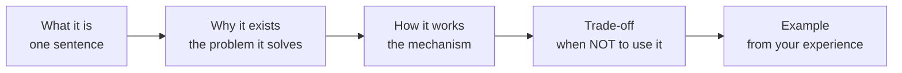
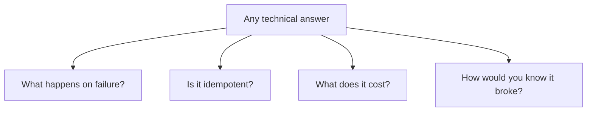
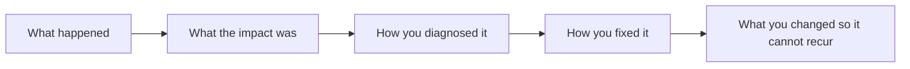
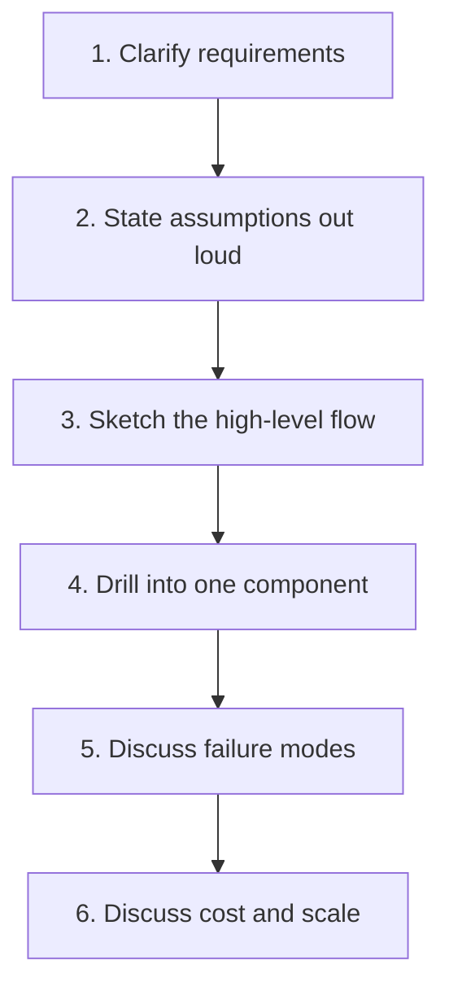
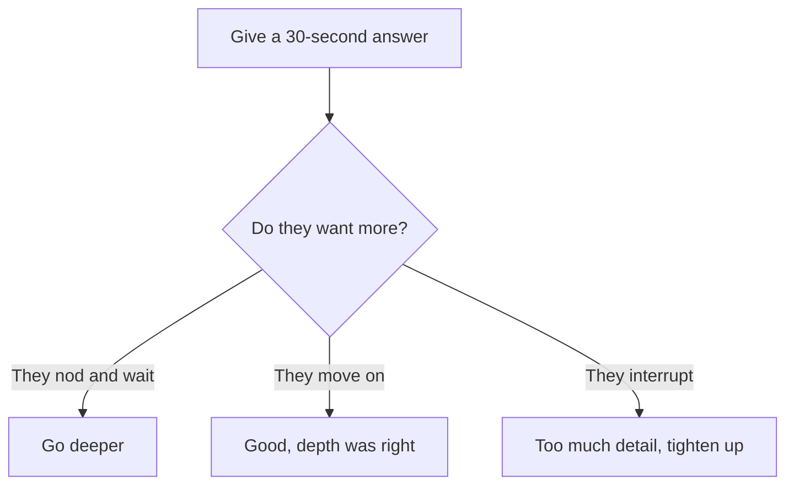

# Answering Technique

## The Structure That Works



Compare two answers to "What is Delta Lake?"

```text
❌ Weak:
"Delta Lake is an open source storage layer that provides ACID transactions,
time travel, schema enforcement, and unified batch and streaming."

That is a marketing bullet list. It proves you read the documentation.
```

```text
✅ Strong:
"Delta Lake is Parquet files plus a transaction log.

The problem it solves: on a plain data lake, a failed write leaves half-written
files, concurrent readers see inconsistent state, and there is no way to update
a row or recover yesterday's version.

The mechanism: the _delta_log directory records every commit atomically, so
readers always see a consistent snapshot, and writers detect conflicts.

The trade-off: the log adds metadata overhead, and many small commits create a
small-file problem you have to manage with OPTIMIZE.

In practice: I used time travel to restore a gold table after a bad deployment —
DESCRIBE HISTORY to find the last good version, then RESTORE TABLE. That turned
a potential day of reprocessing into about thirty seconds."
```

```text
The second answer is not longer because it rambles. It is longer because
it contains four things the first one lacks: a problem, a mechanism,
a limitation, and evidence.
```

---

## Always Mention These Four

Whatever the question, these dimensions separate senior from junior answers.



```text
Question: "How would you load data incrementally?"

Junior:  "Use a watermark column and load rows newer than the last value."

Senior:  "...and I'd store the watermark in a control table, updated only
         after the write succeeds — updating it first turns a transient
         failure into silent data loss. The write is a MERGE, so
         reprocessing the same window is harmless. I'd add a reconciliation
         job comparing source and target counts, because incremental
         pipelines drift, and a freshness alert, because a job that stops
         running produces no failure to alert on."
```

---

## The Trap Questions

### "Have you used X?" when you have not

```text
❌ "Yes" (then falling apart under follow-up)
❌ "No." (dead end)

✅ "I haven't used it in production, but I understand it as <accurate summary>.
    The closest thing I've done is <related experience>, where the equivalent
    problem was <problem>. What does your team use it for?"
```

Honesty plus demonstrated reasoning beats a bluff that collapses two questions
later.

### "What's the best approach for X?"

```text
Almost always the right opening: "It depends on..."

Then name the specific factors, not vague ones:
✔ data volume and growth rate
✔ latency requirement (and who actually needs it)
✔ how often the source changes
✔ team size and on-call capability
✔ budget

Then commit to a recommendation. "It depends" without a
recommendation sounds evasive.
```

### "Why did you choose X over Y?"

```text
They are testing whether you made a decision or followed a tutorial.

✅ "We chose availableNow on a 15-minute schedule over an always-on stream
    because the business requirement was 'fresh by the morning meeting'.
    An always-on cluster would have cost roughly ten times more for latency
    nobody needed. If the requirement had been sub-minute, I'd have gone
    the other way."
```

### "This design has a problem — can you see it?"

```text
Do not get defensive. Interviewers introduce flaws deliberately.

✅ "Let me think through the failure modes... if the job retries after
    a partial write, the append would duplicate rows. I'd change it to
    a MERGE on the business key to make it idempotent. Good catch."
```

---

## Talking About Failure

Every candidate has broken production. The ones who get hired talk about it
well.



```text
✅ "A vendor changed a date format without telling us. Our silver cast
    returned nulls, rows failed validation, and we quarantined 40% of a
    day's orders — so gold under-reported revenue by 12% for two days
    before a downstream team noticed.

    I found it with DESCRIBE HISTORY on the gold table, then the version
    diff, then the quarantine table which showed the failure reason.

    We reprocessed from bronze — possible because bronze keeps everything
    untransformed — and added an alert on quarantine rate above 1%.

    The real finding was time to detect: two days. The fix took four hours;
    the monitoring gap was the actual problem."
```

```text
Notice what that answer demonstrates without claiming it:
bronze retention design, quarantine design, Delta history usage,
idempotent reprocessing, and post-incident thinking.
```

---

## Whiteboard and Design Questions



```text
Clarifying questions worth asking every time:

"What's the data volume, and how fast is it growing?"
"What latency does the business actually need?"
"Is the source append-only, or can records change and be deleted?"
"Who consumes the output, and what do they do with it?"
"What's the cost sensitivity?"
"Is there an on-call team, or does this need to run unattended?"
```

```text
Candidates who start drawing immediately look decisive and end up solving
the wrong problem. Two minutes of clarification is never wasted.
```

---

## Handling "I Don't Know"

```text
❌ Making something up (interviewers can tell, and it poisons everything else)
❌ "I don't know." and silence

✅ "I don't know that specifically. My reasoning would be <reasoning from
    first principles>. Is that the right direction, or am I missing something?"

✅ "I'd look that up rather than guess — it's the kind of detail where
    being wrong is expensive. What I do know is the surrounding concept:
    <explain what you do know>."
```

```text
Admitting a gap and then reasoning well is a strong signal.
Nobody knows everything, and everybody can tell when you are bluffing.
```

---

## Questions to Ask Them

The questions you ask reveal how you think about data platforms.

```text
About the platform:
"What does the medallion layout look like today, and what would you change?"
"Are jobs deployed from Git, or managed in the UI?"
"How do you find out a pipeline produced wrong numbers?"
"What's the on-call load like for data incidents?"

About the work:
"What's the biggest data quality problem right now?"
"Where does the team spend most of its time — building or firefighting?"
"How are cost decisions made?"

About the team:
"How do data engineers and analysts work together here?"
"What does a code review look like for a pipeline change?"
```

```text
"How do you find out a pipeline produced wrong numbers?" is the single
most revealing question you can ask. The answer tells you the platform's
maturity in one sentence.
```

---

## Common Self-Inflicted Mistakes

```text
❌ Listing features instead of explaining problems
❌ Never mentioning cost
❌ Never mentioning monitoring
❌ Claiming every tool is the best tool
❌ Describing a pipeline with no failure handling
❌ Answering a design question with a tool name instead of a design
❌ Talking for five minutes without checking whether it is the right depth
❌ Not asking what "real time" means to them before agreeing to build it
```

```text
Antidote to the last one: whenever someone says "real time", ask
"what decision changes if this data is fifteen minutes old?"

Half the time the honest answer is "nothing", and that conversation
is worth more than any technical answer you could give.
```

---

## Calibrating Depth



```text
Start concise, then offer: "I can go deeper on the mechanism if useful."
This respects their time and lets them steer.
```

---

## Quick Revision

```text
Answer structure:
what it is → why it exists → how it works → trade-off → your example

Always address:
failure behaviour | idempotency | cost | how you would monitor it

Trap questions:
"Have you used X?"     → honest + adjacent experience + a question back
"What's best?"         → "it depends on..." then COMMIT to a recommendation
"Why X over Y?"        → show a decision, not a default
"Spot the problem"     → engage, do not defend

Design questions:
clarify → assume aloud → sketch → drill in → failure modes → cost

Failure stories: impact → diagnosis → fix → prevention
The prevention part is what they are listening for

Ask them: "How do you find out a pipeline produced wrong numbers?"
```
