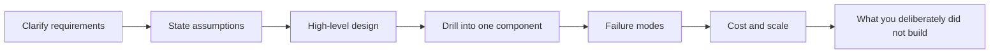
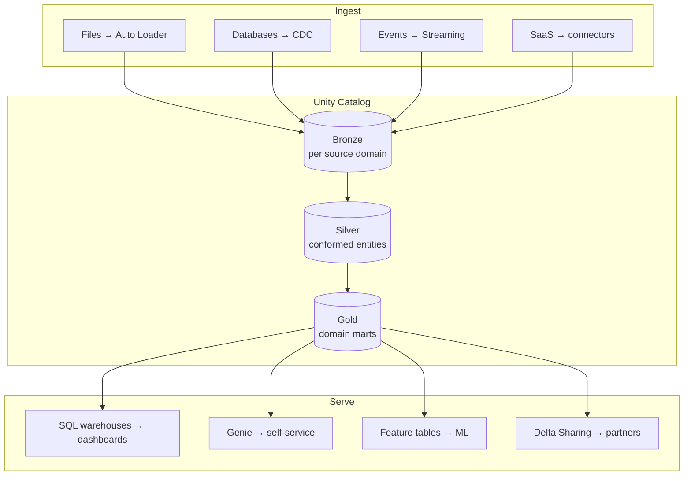
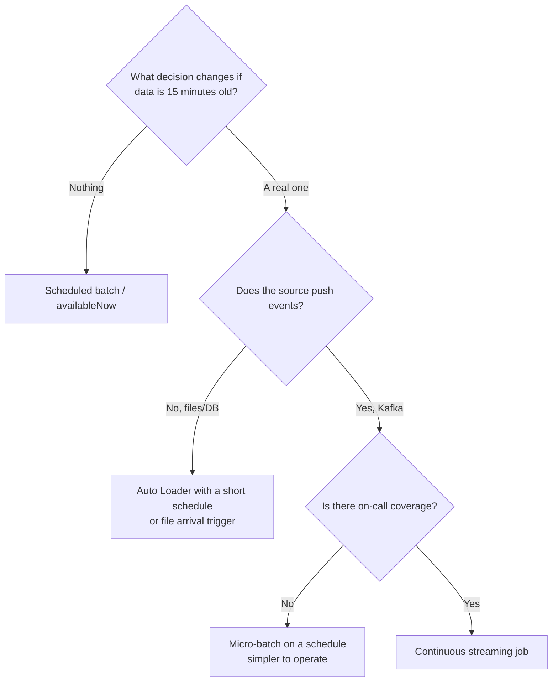
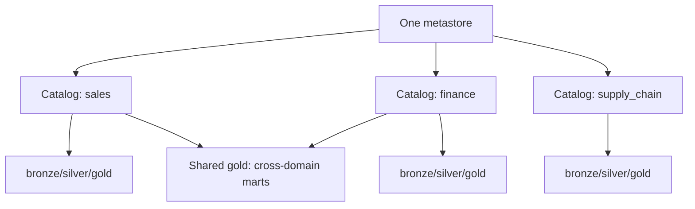
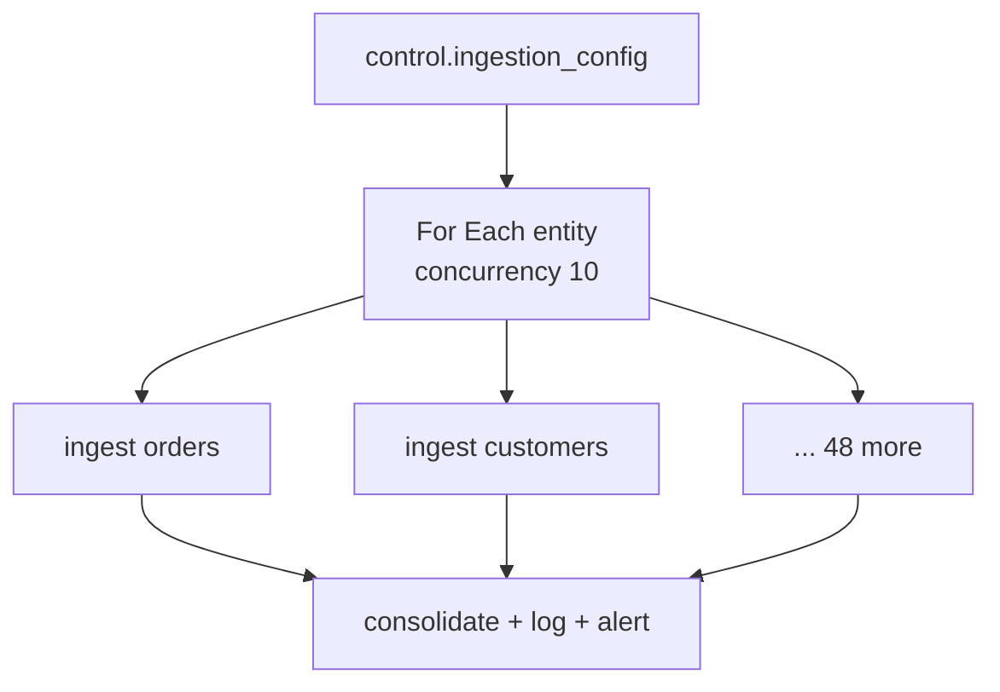
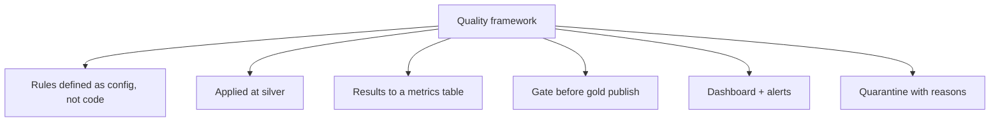
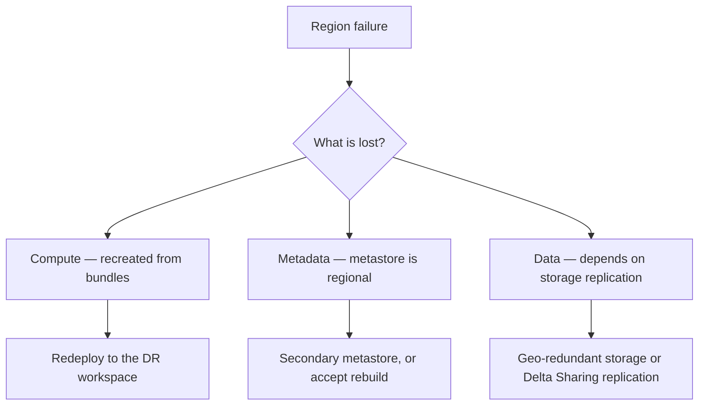

# Architecture and Design Questions

Open-ended design questions. There is no right answer — there is a right
**process**, and there are wrong answers that ignore failure, cost, or people.



---

## Design 1: A Data Platform for a Mid-Size Retailer

> "Design a Databricks platform for a retailer with 50 source systems,
> 200 analysts, and a 2 TB/day ingestion volume."

### Clarify

```text
"What's the latency requirement per source — do all 50 need to be fresh hourly?"
"How many of those 200 analysts write SQL versus consume dashboards?"
"Is there PII, and are there regulatory constraints?"
"What's the existing stack — are we migrating or greenfield?"
"What's the team size that will run this?"
```

### High-level design



### Key decisions to state

```text
Governance:
  One metastore per region; catalog per environment (dev/stg/prod);
  schema per domain and layer for 50 sources (main.sales_bronze, etc.);
  grants to groups; PII in dedicated schemas.

Ingestion:
  Config-table-driven with a For Each fan-out — 50 sources must not mean
  50 notebooks. One generic loader per source TYPE, not per source.

Processing:
  Batch by default. Streaming only where a named business decision
  depends on sub-hour latency. At 2 TB/day, always-on streaming for all
  50 sources would dominate the budget.

Serving:
  Serverless SQL warehouses sized per workload: one for dashboards,
  one for ad-hoc analyst queries, one for jobs — so a runaway analyst
  query cannot slow the executive dashboard.

Delivery:
  Asset Bundles, three environments, CI/CD with approval gates,
  service principals in staging and prod.

Operations:
  Control tables, four alert types per pipeline, ops dashboard from
  system tables, weekly maintenance job.
```

### Failure modes to raise unprompted

```text
✔ One source breaking must not stop the other 49 → independent jobs
   or a For Each that tolerates individual failures
✔ Reprocessing: bronze retention long enough to rebuild silver
✔ Silent failures: freshness alerts, not just failure alerts
✔ Cost runaway: cluster policies, DBU alerts, tagged chargeback
```

### What you would not build

```text
"I would not build a real-time path for all 50 sources. I'd build batch
for everything, then promote specific sources to streaming when a named
business case justifies the cost and the on-call burden."
```

---

## Design 2: Batch or Streaming?

> "How do you decide between batch and streaming for a new pipeline?"



```text
Factors beyond latency:
✔ Cost: always-on is roughly 10× a 15-minute schedule
✔ Operational burden: streaming fails at 3 AM and needs someone
✔ Correctness: batch reconciles easily; streaming needs watermarks
   and a batch backstop for late data
✔ Team capability: a team that has never run a stream should not
   start with a business-critical one

Strong answer: "Default to batch. Promote to streaming when a specific
decision depends on it, and be explicit about the cost and on-call
implications when you do."
```

---

## Design 3: Multi-Tenant Platform

> "How would you serve five business units from one Databricks platform?"



```text
Isolation model:
- Catalog per business unit, with its own owner group
- Workspace per unit if they need separate compute quotas and admins,
  otherwise one workspace with cluster policies per group
- Catalog binding so a unit's catalog is reachable only from its workspaces
- Cross-domain data shared through a governed shared gold schema,
  not by granting access to another unit's silver

Chargeback:
- Mandatory cluster tags enforced by policy
- system.billing.usage grouped by tag
- Monthly report per unit

Standards versus autonomy:
- Central: governance, naming, CI/CD path, monitoring standards
- Local: their own pipelines, marts, and schedules

The failure mode to avoid: a central team that becomes a bottleneck
for every change, or five teams that each invent their own conventions.
Publish a paved path and make it the easiest option.
```

---

## Design 4: Handling 50 Source Tables

> "You need to ingest 50 tables from one ERP. How do you avoid 50 notebooks?"

```text
Metadata-driven ingestion:

Control table:
  entity, source_query, load_type, watermark_col, business_key,
  target_table, is_active, owner_team, sla_minutes

Job structure:
  Task 1: read the config, emit the active entity list as a task value
  Task 2: For Each over entities, concurrency 10, running ONE generic
          notebook parameterised by entity
  Task 3: consolidate results, log per-entity row counts, alert on failures

Generic notebooks by LOAD TYPE, not by table:
  ingest_full.py | ingest_watermark.py | ingest_cdc.py

Adding table 51 becomes an INSERT into the config table.
```



```text
Trade-off to state: generic code is harder to debug than explicit code,
and one entity's odd behaviour tempts you into special cases. Keep the
special cases in the config, not in branching logic.
```

---

## Design 5: Data Quality Framework

> "Design a data quality framework for a platform with 200 tables."



```text
Layers:
1. Structural (silver): types, null keys, duplicates, referential integrity
2. Business (gold): value ranges, category membership, cross-field logic
3. Statistical: volume anomaly, distribution drift versus baseline
4. Freshness: is the data recent enough to be useful?

Implementation choice:
- DLT expectations if pipelines are declarative — metrics come free
- A shared quality module plus a metrics table if using Workflows

Severity model:
- warn     → record it, keep the row
- drop     → quarantine the row, keep the pipeline running
- fail     → stop the pipeline (reserve for contract violations)

Governance:
- Rules live in a config table so a data steward can change a threshold
  without a deployment
- Every rule has an owner
- Quarterly review: rules that never fire, and rules that always fire

The most common failure: building the framework and never looking at the
output. The dashboard and alerts are the deliverable, not the rules.
```

---

## Design 6: Disaster Recovery

> "Your region goes down. What is your recovery plan?"



```text
Tiers, by criticality:

Tier 1 (revenue/regulatory):
  Geo-redundant storage, a standby workspace in a second region,
  bundles deployable to either, tested failover twice a year,
  RPO measured in minutes, RTO in hours

Tier 2 (important, not critical):
  Storage replication, bundles ready to deploy, no standby workspace,
  RTO in days

Tier 3 (everything else):
  Rebuild from source systems, accept the outage

What makes recovery possible:
✔ Everything as code — a workspace is reproducible in minutes
✔ Bronze retention long enough to rebuild silver and gold
✔ Source systems that can re-extract
✔ A documented, TESTED runbook

What breaks it:
✘ Jobs created in the UI and never captured in Git
✘ Secrets that only exist in one workspace
✘ Undocumented manual steps someone did two years ago
```

---

## Design 7: Cost-Constrained Platform

> "Your budget is being cut 40%. What do you change?"

```text
I'd work in order of impact per unit of effort, with measurement first:

1. Measure: system.billing.usage by job, team, and SKU. Do not guess.
2. Kill what nobody uses: unowned clusters, dev streams left running,
   dashboards nobody opens, pipelines feeding dead tables (check lineage).
3. Move production off all-purpose clusters — usually the single
   biggest line item.
4. Enforce autotermination and size caps via cluster policy.
5. Convert always-on streams to availableNow where latency permits —
   frequently 80-90% of that pipeline's cost.
6. Right-size: measure CPU utilisation; most clusters are over-provisioned.
7. Reduce schedule frequency to the real requirement — an hourly job
   whose output is read daily is 23 wasted runs.
8. Fix the slow jobs: a job that runs 3× longer costs 3× more.
   Layout and skew fixes often pay back immediately.
9. Spot instances for fault-tolerant batch.

What I would NOT cut:
✘ Monitoring and alerting — the first undetected incident costs more
  than the savings
✘ Bronze retention — it is cheap storage buying expensive optionality

I'd also present the trade-offs explicitly: "moving pipeline X to a
4-hour schedule saves N, and the dashboard becomes up to 4 hours stale.
That's a business decision, not an engineering one."
```

---

## Design 8: Greenfield in Six Weeks

> "You're the first data engineer at a startup. What do you build first?"

```text
Week 1: Foundations
  Unity Catalog, three catalogs, groups, a service principal,
  a Git repo with a bundle skeleton. Non-negotiable even under pressure —
  retrofitting governance is far more expensive.

Week 2: One pipeline end to end
  The single most valuable source, bronze → silver → gold → one dashboard.
  Depth over breadth: a complete thin slice proves the whole path.

Week 3: Make it production-grade
  Quality gate, four alerts, control table, CI deploy to prod.

Week 4-5: Expand to the next 3-5 sources
  Now generalise: config table, generic loaders, For Each.

Week 6: Operations
  Ops dashboard, runbook, cost visibility, handover documentation.

What I would deliberately skip early:
✘ Streaming (until something needs it)
✘ DLT (learn Workflows first; DLT hides mechanics you need to understand)
✘ A perfect dimensional model (build marts for actual questions asked)
✘ 200 tables of "might be useful" data

The mistake I'd avoid: spending six weeks on architecture and delivering
nothing. One working, monitored, governed pipeline beats a beautiful
design document.
```

---

## Questions They Might Push Back On

```text
"Why not just use a data warehouse?"
→ One copy of data, open format, same platform for ML and SQL, no ETL lag
  between lake and warehouse. But acknowledge: if the workload is purely
  structured BI at moderate scale, a warehouse is a legitimate choice.

"Isn't medallion just extra copies of the same data?"
→ Yes, and storage is the cheapest part of the platform. What you buy is
  reprocessability, auditability, and separation of concerns. At small
  scale the overhead may not be worth it — I'd still keep bronze.

"Why not do everything in DLT?"
→ DLT builds tables. It is not a general orchestrator, so ML training,
  exports, API calls, and multi-system flows still need Workflows.
  The common pattern is a Workflow that runs DLT as one task.

"Do we really need three environments?"
→ Two at minimum: somewhere to break things and somewhere that must not
  break. The cost is small; the cost of testing in production is not.
```

---

## Quick Revision

```text
Process: clarify → assume aloud → sketch → drill in → failure modes → cost
         → what you deliberately did NOT build

Recurring design principles:
✔ Config-driven over copy-pasted (50 sources ≠ 50 notebooks)
✔ Batch by default; streaming when a decision depends on it
✔ Catalog per environment, schema per domain and layer
✔ Grants to groups, production as service principals
✔ Independent failure: one source breaking must not stop the others
✔ Bronze retention sized for reprocessing, not for storage cost
✔ Monitoring and governance are not optional extras

Cost levers in order:
kill unused → off all-purpose → autotermination → availableNow →
right-size → reduce frequency → fix slow jobs → spot

The answer that impresses: naming what you would NOT build, and why.
```
