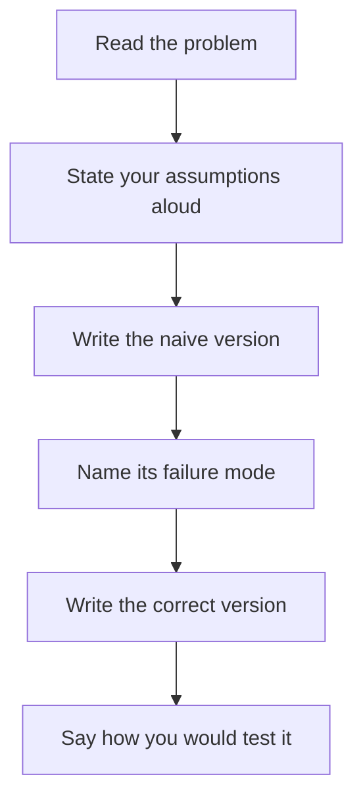

# Coding Challenges

Exercises that appear in Databricks technical screens, with worked solutions and
the reasoning interviewers listen for.

```text
Tip: talk while you code. A correct silent solution scores lower than a
slightly slower one where you explained the deduplication choice.
```

---

## Challenge 1: Deduplicate Keeping the Latest

> "Given orders with duplicate `order_id`, keep only the most recent version."

```python
from pyspark.sql import functions as F
from pyspark.sql.window import Window

# ❌ common wrong answer
df.dropDuplicates(["order_id"])        # keeps an ARBITRARY row

# ✅ correct
w = Window.partitionBy("order_id").orderBy(F.col("updated_at").desc())
latest = (df.withColumn("_rn", F.row_number().over(w))
            .filter("_rn = 1")
            .drop("_rn"))
```

```sql
SELECT * EXCEPT (rn) FROM (
    SELECT *, row_number() OVER (PARTITION BY order_id ORDER BY updated_at DESC) AS rn
    FROM orders
) WHERE rn = 1;
```

```text
What to say:
"dropDuplicates picks an arbitrary row — fine only if duplicates are
byte-identical. Here we need a deterministic 'latest wins' rule, so
row_number over a window ordered by the sequence column.

If updated_at can tie, I'd add a tiebreaker like _ingested_at or the
Kafka offset, otherwise the result is non-deterministic across runs."
```

---

## Challenge 2: Idempotent Upsert

> "Write silver so that running it twice produces the same result."

```python
from pyspark.sql import functions as F
from pyspark.sql.window import Window

def upsert_orders(spark, updates_df, target="main.silver.orders"):
    # 1. collapse to one row per key — MERGE fails otherwise
    w = Window.partitionBy("order_id").orderBy(F.col("updated_at").desc())
    latest = updates_df.withColumn("_rn", F.row_number().over(w)) \
                       .filter("_rn = 1").drop("_rn")

    latest.createOrReplaceTempView("updates")

    # 2. MERGE with an ordering guard
    spark.sql(f"""
        MERGE INTO {target} t
        USING updates s ON t.order_id = s.order_id
        WHEN MATCHED AND s.updated_at > t.updated_at THEN UPDATE SET *
        WHEN NOT MATCHED THEN INSERT *
    """)
```

```text
Three things to point out:

1. Deduplication BEFORE the merge — otherwise
   "multiple source rows matched a target row"

2. The guard `s.updated_at > t.updated_at` — without it, reprocessing
   an old batch overwrites newer data

3. Adding a predicate on the clustering column to the ON clause makes
   large merges far faster by enabling file skipping:
   ON t.order_id = s.order_id AND t.order_date >= current_date() - INTERVAL 7 DAYS
```

---

## Challenge 3: Detect Silent Cast Failures

> "Cast a string amount column to decimal. How do you know a value failed?"

```python
from pyspark.sql import functions as F

typed = df.withColumn("amount", F.col("amt").cast("decimal(18,2)"))

# The failure is silent — Spark returns null, it does not raise
cast_failed = typed.filter("amount IS NULL AND amt IS NOT NULL")

n_failed = cast_failed.count()
if n_failed:
    (cast_failed
        .withColumn("_reason", F.lit("amount_cast_failed"))
        .withColumn("_quarantined_at", F.current_timestamp())
        .write.format("delta").mode("append")
        .option("mergeSchema", "true")
        .saveAsTable("main.quarantine.orders"))

    if n_failed / max(typed.count(), 1) > 0.05:
        raise Exception(f"{n_failed} cast failures exceed the 5% threshold")
```

```text
Why this matters: a failed cast becoming null is the single most common
source of silently wrong numbers. The row still exists, the pipeline
succeeds, and the sum is simply too low.

The threshold distinguishes noise from a systemic change:
a handful of bad rows is a vendor typo; 40% is a format change.
```

---

## Challenge 4: SCD Type 2

> "Implement slowly changing dimension type 2 for customers."

```sql
CREATE TABLE IF NOT EXISTS silver.customers_scd2 (
    customer_id INT, name STRING, country STRING, segment STRING,
    valid_from TIMESTAMP, valid_to TIMESTAMP, is_current BOOLEAN
) USING DELTA;

MERGE INTO silver.customers_scd2 t
USING (
    -- rows that will INSERT a new version
    SELECT customer_id AS merge_key, * FROM updates
    UNION ALL
    -- NULL merge_key forces the NOT MATCHED branch, so the MATCHED branch
    -- above closes the existing current row
    SELECT NULL AS merge_key, u.*
    FROM updates u
    JOIN silver.customers_scd2 t2
      ON u.customer_id = t2.customer_id AND t2.is_current = true
    WHERE u.country <> t2.country OR u.segment <> t2.segment
) s
ON t.customer_id = s.merge_key AND t.is_current = true

WHEN MATCHED AND (t.country <> s.country OR t.segment <> s.segment) THEN
    UPDATE SET t.is_current = false, t.valid_to = s.updated_at

WHEN NOT MATCHED THEN
    INSERT (customer_id, name, country, segment, valid_from, valid_to, is_current)
    VALUES (s.customer_id, s.name, s.country, s.segment, s.updated_at, NULL, true);
```

```text
Explain the union trick: a single MERGE cannot both close the old row and
insert a new one for the same key, so we emit two source rows — one with
the real key (matches, closes the old version) and one with a NULL key
(never matches, inserts the new version).

Then mention: "In DLT this is one line —
apply_changes(..., stored_as_scd_type=2). I'd use that in production,
but it's worth knowing what it does underneath."
```

```sql
-- The payoff: point-in-time correctness
SELECT h.segment, sum(o.amount)
FROM silver.orders o
JOIN silver.customers_scd2 h
  ON o.customer_id = h.customer_id
 AND o.order_date >= h.valid_from
 AND (h.valid_to IS NULL OR o.order_date < h.valid_to)
GROUP BY h.segment;
```

---

## Challenge 5: Sessionise Events

> "Group user events into sessions with a 30-minute inactivity gap."

```python
from pyspark.sql import functions as F
from pyspark.sql.window import Window

w = Window.partitionBy("user_id").orderBy("event_time")

sessions = (events
    .withColumn("prev_time", F.lag("event_time").over(w))
    .withColumn("gap_minutes",
        (F.unix_timestamp("event_time") - F.unix_timestamp("prev_time")) / 60)
    .withColumn("is_new_session",
        F.when(F.col("prev_time").isNull() | (F.col("gap_minutes") > 30), 1).otherwise(0))
    .withColumn("session_num", F.sum("is_new_session").over(w))
    .withColumn("session_id", F.concat_ws("_", "user_id", "session_num")))

summary = (sessions.groupBy("user_id", "session_id")
    .agg(F.min("event_time").alias("session_start"),
         F.max("event_time").alias("session_end"),
         F.count("*").alias("event_count"),
         F.countDistinct("page").alias("unique_pages"))
    .withColumn("duration_min",
        (F.unix_timestamp("session_end") - F.unix_timestamp("session_start")) / 60))
```

```text
The pattern: lag → gap → binary flag → running sum = a session counter.
This "cumulative sum of a boundary flag" trick appears in many
sessionisation and gap-detection problems.

For streaming, mention F.session_window("event_time", "30 minutes"),
which does this natively with a watermark.
```

---

## Challenge 6: Find the Gaps

> "Which dates are missing from a daily table?"

```python
from pyspark.sql import functions as F

bounds = df.agg(F.min("order_date").alias("lo"), F.max("order_date").alias("hi")).collect()[0]

all_dates = spark.sql(f"""
    SELECT explode(sequence(DATE'{bounds.lo}', DATE'{bounds.hi}', INTERVAL 1 DAY)) AS d
""")

missing = all_dates.join(df.select("order_date").distinct(),
                         all_dates.d == df.order_date, "left_anti")
missing.orderBy("d").show()
```

```sql
SELECT d AS missing_date
FROM (SELECT explode(sequence(
        (SELECT min(order_date) FROM silver.orders),
        (SELECT max(order_date) FROM silver.orders),
        INTERVAL 1 DAY)) AS d)
LEFT ANTI JOIN (SELECT DISTINCT order_date FROM silver.orders) o ON d = o.order_date;
```

```text
Why this matters operationally: a gap means a run was skipped or failed
silently. This query belongs in a daily completeness check, not just in
an interview.
```

---

## Challenge 7: Running Totals and Ranking

> "Show daily revenue, a running total, a 7-day moving average, and the rank
> of each country per day."

```python
from pyspark.sql import functions as F
from pyspark.sql.window import Window

daily = df.groupBy("order_date", "country").agg(F.sum("amount").alias("revenue"))

w_run = Window.partitionBy("country").orderBy("order_date")
w_ma  = Window.partitionBy("country").orderBy("order_date").rowsBetween(-6, 0)
w_rank= Window.partitionBy("order_date").orderBy(F.desc("revenue"))

result = (daily
    .withColumn("running_total", F.sum("revenue").over(w_run))
    .withColumn("ma_7d", F.round(F.avg("revenue").over(w_ma), 2))
    .withColumn("prev_day", F.lag("revenue").over(w_run))
    .withColumn("pct_change",
        F.round(100 * (F.col("revenue") - F.col("prev_day")) /
                F.nullif(F.col("prev_day"), F.lit(0)), 1))
    .withColumn("country_rank", F.rank().over(w_rank)))
```

```text
Point worth making: `rowsBetween(-6, 0)` counts ROWS, not days. If a
country has missing days, the "7-day" average silently spans more than
7 days. For calendar-correct windows use rangeBetween on a numeric date,
or join to a complete date spine first.

That distinction is exactly the kind of detail interviewers probe.
```

---

## Challenge 8: Pivot Without PIVOT

> "Produce one column per status without using PIVOT."

```python
from pyspark.sql import functions as F

pivoted = (df.groupBy("order_date", "country")
    .agg(
        F.sum(F.when(F.col("status") == "COMPLETED", F.col("amount")).otherwise(0)).alias("completed_revenue"),
        F.sum(F.when(F.col("status") == "CANCELLED", F.col("amount")).otherwise(0)).alias("cancelled_revenue"),
        F.count(F.when(F.col("status") == "COMPLETED", True)).alias("completed_count"),
        F.count(F.when(F.col("status") == "CANCELLED", True)).alias("cancelled_count"),
    ))
```

```text
Say why this is often preferable to PIVOT: conditional aggregation
produces a fixed, explicit schema. PIVOT with a dynamic value list
produces a schema that changes when the data changes — which breaks
downstream consumers silently.
```

---

## Challenge 9: Broadcast Join and Skew

> "This join takes an hour. One task runs for 55 minutes. Fix it."

```python
from pyspark.sql import functions as F

# 1. Diagnose: which key dominates?
orders.groupBy("customer_id").count().orderBy(F.desc("count")).show(10)
# → customer_id = -1 has 340M rows (guest checkouts)

# 2. Route the sentinel key around the join
real    = orders.filter("customer_id != -1 AND customer_id IS NOT NULL")
unknown = orders.filter("customer_id = -1 OR customer_id IS NULL")

joined = real.join(F.broadcast(customers), "customer_id")

result = joined.unionByName(
    unknown.withColumn("country", F.lit("UNKNOWN"))
           .withColumn("segment", F.lit("GUEST")),
    allowMissingColumns=True)
```

```text
Reasoning to voice:
"First I'd confirm the skew in the Spark UI — max task duration far above
the median — then find the dominant key. Eighty percent of production skew
is a sentinel or null value that should never have been in the join.

If it were a genuinely large real customer, I'd rely on AQE skew join
first, and only salt the hot keys if that was insufficient — salting
replicates the dimension side, so it is a last resort."
```

---

## Challenge 10: Streaming Word Count with Watermark

> "Count events per 5-minute window, handling data up to 10 minutes late."

```python
from pyspark.sql import functions as F

counts = (spark.readStream.format("delta").table("bronze.events")
    .withWatermark("event_time", "10 minutes")
    .groupBy(F.window("event_time", "5 minutes"), "event_type")
    .agg(F.count("*").alias("event_count"))
    .select(F.col("window.start").alias("window_start"),
            F.col("window.end").alias("window_end"),
            "event_type", "event_count"))

def upsert(batch_df, batch_id):
    batch_df.createOrReplaceTempView("w")
    batch_df.sparkSession.sql("""
        MERGE INTO gold.event_counts t
        USING w s ON t.window_start = s.window_start AND t.event_type = s.event_type
        WHEN MATCHED THEN UPDATE SET *
        WHEN NOT MATCHED THEN INSERT *
    """)

(counts.writeStream
    .outputMode("update")
    .foreachBatch(upsert)
    .option("checkpointLocation", "/Volumes/main/_ckpt/event_counts")
    .trigger(processingTime="1 minute")
    .start())
```

```text
Points to make:
1. withWatermark must come BEFORE groupBy
2. append mode would emit each window once, only after the watermark
   passes — correct but delayed. update + MERGE keeps a dashboard current
   and self-correcting.
3. I'd choose the 10 minutes from measured lateness percentiles,
   not by guessing, and add a daily batch recompute for the long tail.
```

---

## Challenge 11: Reconciliation

> "Prove the target matches the source."

```python
from pyspark.sql import functions as F

def reconcile(spark, source_table, target_table, key, measure):
    src = spark.table(source_table).agg(
        F.count("*").alias("rows"), F.sum(measure).alias("total"),
        F.countDistinct(key).alias("keys")).collect()[0]
    tgt = spark.table(target_table).agg(
        F.count("*").alias("rows"), F.sum(measure).alias("total"),
        F.countDistinct(key).alias("keys")).collect()[0]

    pct = abs(float(src.total or 0) - float(tgt.total or 0)) / max(float(src.total or 1), 1)

    print(f"source: {src.rows} rows / {src.keys} keys / {src.total}")
    print(f"target: {tgt.rows} rows / {tgt.keys} keys / {tgt.total}")
    print(f"value difference: {pct:.4%}")

    if pct > 0.001:
        missing = (spark.table(source_table).select(key)
                   .exceptAll(spark.table(target_table).select(key)))
        missing.show(20)
        raise Exception(f"Reconciliation failed: {pct:.3%}")
    return True
```

```text
Why to raise this unprompted: incremental pipelines drift. Without a
scheduled reconciliation, a pipeline can be quietly wrong for months
and every individual run looks successful.
```

---

## Challenge 12: Optimise This Query

> "Make this faster."

```sql
-- Given
SELECT *
FROM orders o
JOIN customers c ON o.customer_id = c.customer_id
WHERE year(o.order_date) = 2026
  AND c.country = 'IN'
ORDER BY o.amount DESC;
```

```sql
-- Improved
SELECT o.order_id, o.order_date, o.amount, c.country, c.segment
FROM orders o
JOIN customers c ON o.customer_id = c.customer_id
WHERE o.order_date >= DATE'2026-01-01' AND o.order_date < DATE'2027-01-01'
  AND c.country = 'IN'
ORDER BY o.amount DESC
LIMIT 100;
```

```text
Four changes, and why each one matters:

1. year(order_date) = 2026 → a range predicate on the bare column.
   A function on the column disables file pruning entirely.

2. SELECT * → named columns. Parquet is columnar, so this genuinely
   reads less data.

3. Added LIMIT. A full cluster-wide sort with no limit is almost never
   what anyone actually wants.

4. Beyond the query: if orders is large and frequently filtered by date,
   ALTER TABLE orders CLUSTER BY (order_date); OPTIMIZE orders;
   and broadcast the customers dimension if it is small.

I'd verify with the query profile — bytes scanned versus returned —
rather than trusting wall-clock time on a warm cache.
```

---

## Practice Approach



```text
Interviewers reward: assumptions stated, edge cases named, and a
test you would write. A correct answer with no discussion of
duplicates, nulls, or empty input looks lucky rather than competent.
```

---

## Quick Revision

```text
Deduplicate:   row_number over a window, NOT dropDuplicates
Idempotent:    dedupe → MERGE with an ordering guard → predicate on ON for skipping
Cast failures: null after cast where the source was not null → quarantine + threshold
SCD2:          union trick (real key + NULL key) or DLT apply_changes
Sessionise:    lag → gap → flag → cumulative sum
Gaps:          sequence() date spine + left anti join
Windows:       rowsBetween counts ROWS, not days — beware missing dates
Pivot:         conditional aggregation gives a stable schema
Skew:          find the dominant key first; usually a sentinel or null
Streaming:     withWatermark BEFORE groupBy; update + MERGE for dashboards
Reconcile:     counts, distinct keys, and sums — scheduled, with an alert
Optimise:      bare filter columns | named columns | LIMIT | clustering | broadcast
```
