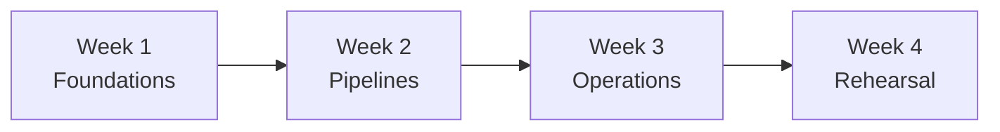
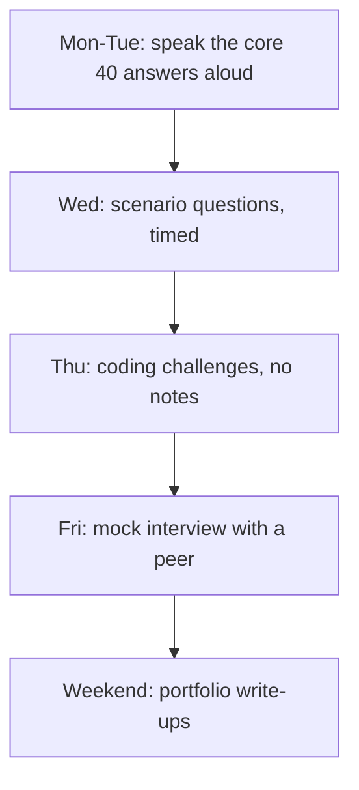
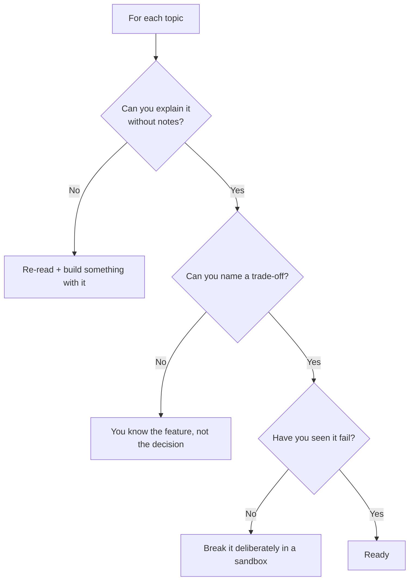

# Preparation Plan

A four-week plan, a certification map, and a final checklist.



---

## Week 1: Foundations

```text
Goal: be able to explain the platform and Delta from first principles.

Study (topics 01-07):
  Mon  Databricks architecture, compute types, runtime
  Tue  Delta Lake: log, ACID, time travel, MERGE
  Wed  Delta: OPTIMIZE, clustering, VACUUM, deletion vectors
  Thu  Unity Catalog: namespace, grants, lineage
  Fri  Unity Catalog: row filters, column masks, external locations

Build:
  A catalog with three schemas, one Delta table
  Practise MERGE, time travel, RESTORE, DESCRIBE HISTORY
  Break a table deliberately and restore it

Self-test:
  Explain Delta Lake in 90 seconds without saying "ACID" first
  Explain why a user with SELECT still gets permission denied
  Explain the difference between liquid clustering and partitioning
```

---

## Week 2: Pipelines

```text
Goal: build and defend a complete medallion pipeline.

Study (topics 08-13):
  Mon  Workflows: DAGs, retries, idempotency, repair runs
  Tue  Medallion: what belongs in each layer, and why
  Wed  Incremental: watermarks, CDC, SCD2
  Thu  Auto Loader: detection modes, schema evolution
  Fri  Streaming: checkpoints, watermarks, triggers
  Sat  DLT: declarative pipelines, expectations, apply_changes

Build:
  Project 1 (medallion pipeline) end to end
  Project 2 (incremental ETL) at least through the watermark load

Self-test:
  Why does the watermark update AFTER the write, not before?
  What makes a write idempotent, and why does it matter?
  When would you NOT use a stream-stream join?
```

---

## Week 3: Operations

```text
Goal: talk credibly about running a platform, not just building one.

Study (topics 14-17):
  Mon  Performance: skew, spill, shuffle, reading the Spark UI
  Tue  Performance: layout, small files, joins, AQE, Photon
  Wed  DevOps: bundles, CI/CD, testing
  Thu  Monitoring: system tables, the four alerts, incident response
  Fri  Security: identity, secrets, PII, network

Build:
  Project 4 (optimization framework) — at least the scanner
  Add the four alerts to Project 1
  Deploy Project 1 through a bundle with dev and prod targets

Self-test:
  How do you spot skew, and what do you try first?
  Which four alerts does every pipeline need, and why is freshness
    the one most teams lack?
  How would you investigate a wrong number in a gold table?
```

---

## Week 4: Rehearsal



```text
Monday-Tuesday:
  Work through core_questions.md OUT LOUD, 90 seconds each.
  Record yourself. Listen back for feature-listing without problems.

Wednesday:
  Scenario questions, 5 minutes each, timed. Practise the structure:
  clarify → assumptions → approach → trade-offs → verification.

Thursday:
  Coding challenges from a blank notebook, no notes.
  Narrate while you type.

Friday:
  Mock interview with a peer. Ask them to interrupt and push back.

Weekend:
  One-page write-up per project: problem, architecture diagram,
  three decisions with trade-offs, what you would change at 100× scale,
  how it is monitored.
```

---

## Certification Mapping

| Certification | Focus | This repository |
|---------------|-------|-----------------|
| **Data Engineer Associate** | Delta, ETL, Workflows, UC basics | Topics 01-10, 12 |
| **Data Engineer Professional** | Streaming, optimisation, security, CI/CD | Topics 08-17 |
| **Data Analyst Associate** | SQL, dashboards, warehouses | Topics 06, 07, 09 |
| **Spark Developer Associate** | Spark APIs, execution model | Topics 03, 14 |

```text
Certification exams test recall of features. Interviews test judgement
about trade-offs. Preparing for one does not prepare you for the other —
the exam rewards knowing that VACUUM exists; the interview rewards
knowing what it costs you.
```

---

## Reviewing Your Own Weak Spots



```text
The three levels:
1. I can define it            → enough for a certification
2. I can explain the trade-off → enough for a mid-level interview
3. I have seen it fail        → enough for a senior interview

Level 3 is why the projects matter. Deliberately breaking a pipeline
teaches more in an hour than a week of reading.
```

---

## The Failure Experiments Worth Running

```text
Run these in a sandbox before your interview:

1. Append instead of MERGE, retry the job, watch duplicates appear
2. Advance a watermark before the write, kill the job, observe data loss
3. Delete a streaming checkpoint, restart, see what happens
4. Change groupBy keys on a running stream, see the checkpoint error
5. Create 10 000 tiny files, time a query, OPTIMIZE, time it again
6. Set a watermark to 1 minute, send late data, watch it be dropped
7. VACUUM with 7-day retention, then try to time travel to day 10
8. Insert a sentinel key into a join, watch one task run forever
9. Grant SELECT without USE SCHEMA, hit the permission error
10. Publish a dashboard with embedded credentials over a row-filtered
    table, and see the security bypass for yourself

Each of these becomes a story you can tell in an interview, which is
far more persuasive than the same fact recited from documentation.
```

---

## The Day Before

```text
✔ Re-read core_questions.md and the Quick Revision blocks
✔ Re-read your own project write-ups — you will be asked about them
✔ Prepare two failure stories: what broke, how you found it, what you changed
✔ Prepare three questions to ask them
✔ Check the job description for named tools and skim those topics
✔ Sleep — recall degrades faster than knowledge
```

```text
Do NOT try to learn something new the day before. Consolidating what you
know beats half-learning something you will be caught out on.
```

---

## During the Interview

```text
✔ Clarify before answering a design question
✔ Structure: what it is → why → how → trade-off → example
✔ Mention failure behaviour, idempotency, cost, and monitoring
✔ Say "it depends on..." then COMMIT to a recommendation
✔ Admit gaps, then reason from first principles
✔ Ask what "real time" means before agreeing to build it
✔ Check depth: "I can go deeper on the mechanism if useful"

✘ Do not list features
✘ Do not bluff
✘ Do not describe a pipeline with no failure handling
✘ Do not claim every tool is the best tool
```

---

## After the Interview

```text
Write down, the same day:
- Every question you were asked
- Which answers felt weak
- Anything you did not know

That list is your study plan for the next interview — and interview
questions repeat far more than candidates expect.
```

---

## The Final Checklist

```text
Can you, without notes:

Fundamentals
□ Explain Delta Lake from first principles in 90 seconds
□ Explain the lakehouse and why it replaced two systems
□ Explain the three-level namespace and the three grants it needs

Pipelines
□ Explain medallion and what belongs in each layer
□ Explain why silver uses MERGE and what idempotency buys you
□ Explain the watermark ordering rule and what breaks without it
□ Explain CDC versus a watermark, and why deletes are invisible
□ Implement SCD2 and explain the union trick

Streaming
□ Explain checkpoints and how exactly-once works
□ Explain event time, watermarks, and how you would choose the value
□ Explain availableNow and its cost implication

Performance
□ Describe how you would diagnose a slow job, in order
□ Explain skew detection and the fix hierarchy
□ Explain liquid clustering versus partitioning

Operations
□ Name the four alerts and why freshness is the one teams lack
□ Describe how you would investigate a wrong number in gold
□ Describe your incident process, with containment before diagnosis

Delivery and security
□ Explain bundles and why UI editing is a problem
□ Explain why production runs as a service principal
□ Explain row filters and masks versus dynamic views

Judgement
□ Name something you would deliberately NOT build, and why
□ Tell a failure story ending in a prevention measure
□ Ask them how they find out a pipeline produced wrong numbers
```

---

## Quick Revision

```text
4-week plan:
W1 foundations (Delta, UC) | W2 pipelines (medallion, incremental, streaming)
W3 operations (performance, DevOps, monitoring, security) | W4 rehearsal

Three levels of knowing:
define it → explain the trade-off → have seen it fail
Only the third sounds senior, and only projects get you there

Run the failure experiments — they become your interview stories

Day before: consolidate, do not cram something new
During: clarify, structure, mention failure/cost/monitoring, commit to a view
After: write down every question — they repeat
```
