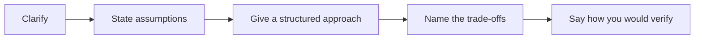
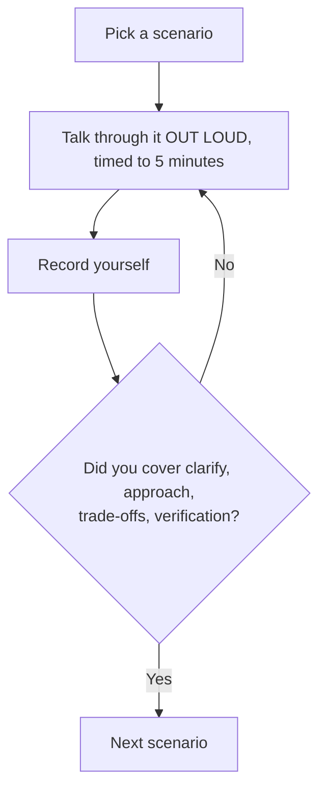

# Scenario-Based Questions

These are the questions that decide interviews. They have no single right answer;
they test how you reason under incomplete information.



---

## Scenario 1: The Pipeline Got Slow

> "A nightly job that took 20 minutes now takes 3 hours. No code has changed.
> How do you investigate?"

```text
Clarify first:
"When did it change — gradually or overnight?"
"Has the data volume grown?"
"Does it share a cluster with anything new?"

Approach:
1. system.lakeflow.job_task_run_timeline → WHICH task grew? Rarely all of them.
2. Spark UI on that task → slowest stage, then task min/median/max.
3. Max >> median → skew. Count rows per join key:
   the usual answer is a new sentinel value (-1, 'UNKNOWN') from upstream.
4. Spill present → partitions too large; raise shuffle partitions.
5. DESCRIBE DETAIL on every table it touches → did the target fragment
   into tens of thousands of small files?
6. ANALYZE TABLE → stale statistics after a big load can flip a broadcast
   join into a sort-merge join.
7. Cluster event log → spot reclamation, node loss, or a runtime upgrade.

Most likely cause in my experience: a new skewed key introduced upstream,
or the target table fragmenting so a MERGE now scans far more files.

I'd fix one thing, re-measure, and record the result — not change five
things at once.
```

---

## Scenario 2: Wrong Numbers in Production

> "An executive says last month's revenue looks too low. Go."

```text
First action is containment, not diagnosis:
annotate or hide the dashboard so no further decisions are made on it.

Then:
1. DESCRIBE HISTORY on the gold table — did it change, and when?
2. VERSION AS OF diff — exactly which rows changed
3. system.lakeflow — did the pipeline run and succeed every day?
   (Success is not the same as correctness.)
4. control.pipeline_runs — row counts versus the 30-day baseline
5. quarantine table — were valid rows rejected? What rule fired?
6. bronze _rescued_data — did the source schema or format change?
7. UC lineage — what else consumed this table?

Typical root cause: an upstream format change causing casts to return null,
rows failing validation, and gold under-reporting — with no error anywhere.

Fix: correct the parser, reprocess from bronze, verify gold reconciles
against silver aggregates, then communicate cause and verification.

The post-incident action is the alert that would have caught it on day one —
in this case, quarantine rate above a threshold.
```

---

## Scenario 3: Duplicates Appeared

> "Users report duplicate rows in a silver table. What happened and what do
> you do?"

```text
Likely causes, in order of probability:
1. The write is an append rather than a MERGE, and the job retried
2. Two concurrent runs overlapped (max_concurrent_runs > 1)
3. The source re-sent a file under a new name — Auto Loader tracks by path,
   so it is genuinely new data to the loader
4. A CDC batch contained multiple events per key with no deduplication
5. A backfill ran alongside the normal schedule

Investigation:
SELECT order_id, count(*) FROM silver.orders GROUP BY 1 HAVING count(*) > 1;
then inspect _source_file and _ingested_at on the duplicates —
same file (retry) or different files (re-delivery)?

Fix:
- Immediate: deduplicate with row_number, restore from a clean version if simpler
- Structural: convert the append to MERGE on the business key
- Set max_concurrent_runs = 1
- Add a uniqueness check to the quality gate so this fails loudly next time
```

---

## Scenario 4: The Bill Doubled

> "Finance says the Databricks bill doubled with no new pipelines. Find out why."

```text
1. system.billing.usage daily trend → identify the step change date
2. Group by SKU → all-purpose vs jobs vs SQL vs DLT
3. Group by job_id and team tag → which workload grew?

Common causes, roughly in order:
- A DLT pipeline switched from triggered to continuous
- development mode left on in a production pipeline (warm clusters)
- Autotermination disabled on a cluster
- A test streaming job started and never stopped
- A SQL warehouse with min_num_clusters raised, staying warm 24/7
- Production moved onto an all-purpose cluster
- A job now runs 3× longer, so it costs 3× more —
  cross-check runtime trends, not just DBUs

Prevention:
- Cluster policies enforcing autotermination, size caps, mandatory tags
- A daily DBU alert against a baseline
- Monthly cost review by team
```

---

## Scenario 5: The Silent Failure

> "A dashboard has been stale for three days. The job succeeded every night."

```text
Success is not progress. The job ran and processed zero rows.

Possible causes:
- The vendor stopped delivering files
- Auto Loader notification queue broke and backfillInterval was not set
- A pathGlobFilter excluded newly named files
- The upstream job that writes the source table was paused
- The dashboard reads a different table than the pipeline writes
- The refresh task was removed from the job

Diagnosis: run a freshness query on every table in the chain and find
the first stale link.

Fix the immediate issue, then add:
✔ Freshness alerts on each critical table
✔ A zero-rows-loaded alert (a successful run that did nothing)
✔ backfillInterval if using notification mode
```

---

## Scenario 6: Designing for an Unreliable Vendor

> "A partner drops files at unpredictable times between 2 AM and 9 AM, sometimes
> not at all, sometimes twice. Design the ingestion."

```text
Trigger:   file arrival trigger on the landing volume
           wait_after_last_change_seconds → avoid partial multi-file uploads
           min_time_between_triggers_seconds → debounce a burst

Ingestion: Auto Loader with availableNow, pathGlobFilter to exclude .tmp
           files, and schemaEvolutionMode = rescue

Duplicates: bronze is append-only so a re-delivery lands; silver MERGEs on
           the business key so downstream is unaffected

Missing delivery: a scheduled check at 09:30 that alerts if no file arrived
           within the SLA window — the absence of data is the failure

Monitoring: freshness alert, volume anomaly alert, rescued-data alert

Housekeeping: cleanSource MOVE after 30 days so the landing zone
           does not grow indefinitely
```

---

## Scenario 7: Migrating from a Legacy Warehouse

> "We have 400 tables in an on-premises warehouse. How would you migrate?"

```text
Clarify: "What's driving the migration — cost, scale, or capability?"
         "Does everything need to move, or is some of it dead?"
         "What's the cutover tolerance — can we run both in parallel?"

Approach:
1. Inventory and triage. Query usage: many of those 400 tables have not
   been read in a year. Migrating dead tables is pure cost.
2. Group by domain and dependency, not alphabetically. Migrate a complete
   business domain end to end so it delivers value.
3. For each domain: land raw into bronze, rebuild transformations in silver
   and gold — do not lift and shift stored procedures.
4. Run parallel: old and new produce the same outputs, compared daily.
   Zero differences for a full cycle (often a month-end) before cutover.
5. Cut over consumers gradually, starting with internal dashboards,
   ending with regulatory reports.
6. Decommission only after a full reporting cycle on the new platform.

Biggest risks:
- Business logic buried in stored procedures nobody documented
- Reports that reconcile only because of a historical quirk
- Underestimating the parallel-run period
```

---

## Scenario 8: The Latency Demand

> "The business says they need real-time data. How do you respond?"

```text
First, the question that saves 80% of the cost:
"What decision changes if this data is fifteen minutes old instead of one?"

Often the honest answer is "nothing" — they want fresh, not real time.

If they genuinely need low latency, clarify what for:
- An operational dashboard → minutes is usually enough → availableNow on a
  short schedule
- Fraud detection or alerting → seconds → streaming with a continuous job
- A customer-facing feature → that is an application concern, and the
  lakehouse may be the wrong tool

Then be explicit about the cost:
"An always-on stream is roughly ten times the compute of a 15-minute
schedule. If the latency is worth that, we build it. Let's decide with
the number visible rather than assuming."

And the operational cost:
"Always-on means someone gets paged at 3 AM. Is there on-call coverage?"
```

---

## Scenario 9: The Late-Arriving Data Problem

> "Orders sometimes arrive three days late. Your daily gold aggregate only
> recomputes today. What happens, and how do you fix it?"

```text
What happens: the late order is written to silver with its true order_date,
but gold for that date was computed three days ago and never revisited.
The number stays wrong permanently, and nobody notices because no error occurs.

Fix:
1. Measure actual lateness:
   percentile(datediff(ingested_date, order_date), 0.99)
2. Recompute gold over a rolling window covering the p99 —
   a MERGE keyed on the grain columns, not an append
3. Add a monthly full recompute for the long tail
4. Document that recent days restate, so consumers are not surprised
5. For streaming, set the watermark from the same measurement

For point-in-time reporting that must NOT restate, snapshot published
gold monthly into an immutable table.
```

---

## Scenario 10: The Schema Change

> "An upstream team added three columns and renamed one, without telling you.
> What happens in your pipeline?"

```text
Added columns:
With schemaEvolutionMode = rescue, they land in _rescued_data and the
pipeline keeps running. A rescued-data alert tells us within one run.
Silver selects explicit columns, so it is unaffected.

Renamed column:
This is the dangerous one. The old name disappears, so the silver cast
produces null, rows fail validation, and volume drops sharply.
Detection: quarantine rate alert and volume anomaly alert.

Response:
1. Bronze kept everything, so no data is lost
2. Update silver to handle both names during a transition period
3. Reprocess the affected window from bronze
4. Raise a schema contract with the upstream team

Prevention:
✔ Schema contract tests in CI on tables we consume
✔ Rescued-data and volume alerts
✔ An agreement that additive changes are fine and renames need notice
```

---

## Scenario 11: The Team Has No CI/CD

> "Everything is edited in the UI. Where do you start?"

```text
Do not try to fix everything at once — that is why these initiatives stall.

Week 1: notebooks into Git as .py source; require pull request review
Week 2: move ONE job to an Asset Bundle, deployed to dev from CI
Week 3: unit tests for that job's transformation functions
Week 4: add a staging target and a prod deploy with an approval gate
Then:   expand job by job; remove UI edit permissions as each is migrated;
        adopt Terraform for catalogs, grants, and policies

Sequencing matters: pick the job that breaks most often as the first
migration, so the benefit is visible immediately.

The hardest part is not technical — it is removing UI edit access, because
that changes how people work. Do it after the bundle path is proven.
```

---

## Scenario 12: The Compliance Request

> "An auditor asks who accessed the customer table in the last year. Can you
> answer?"

```text
If system tables are enabled and within retention:
system.access.audit filtered on the Unity Catalog service and the table name.

If beyond retention: only if you archived it.

Full answer should present both dimensions:
- Who COULD access it (SHOW GRANTS, and the group memberships)
- Who DID access it (audit log)
- What changed about those permissions (permission-change events)
- Evidence of quarterly access reviews

If I could not answer, the corrective action is a daily job archiving
system.access.audit into a compliance-owned table with a seven-year
retention and modify permission revoked from engineers — built before
the next audit, not during it.
```

---

## How to Practise These



```text
Speaking an answer is a different skill from knowing it. The first three
times you say any of these out loud, you will ramble. That is the point
of practising before the interview rather than during it.
```

---

## Quick Revision

```text
Every scenario answer:
1. Clarify (2 questions, no more)
2. State your assumptions
3. Give a numbered approach
4. Name the most likely root cause and say why
5. Say how you would verify the fix
6. Say what you would add so it cannot recur

Recurring root causes worth knowing by heart:
slow job        → new sentinel key causing skew, or a fragmented target
wrong numbers   → upstream format change → null casts → quarantined rows
duplicates      → append instead of MERGE, or overlapping runs
cost spike      → continuous mode, dev mode in prod, no autotermination
stale dashboard → job succeeded but processed zero rows
late data       → no lookback window in the gold recompute
```
