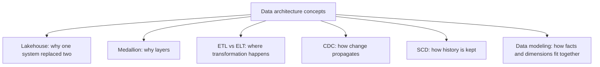

# Data Architecture

The numbered topics teach **Databricks**. This section teaches the
**architectural concepts** underneath them — ideas that predate Databricks and
outlive any single platform.



---

## Why This Section Exists

```text
You can build a working pipeline knowing only Databricks syntax.
You cannot defend a design in an architecture review without these concepts.

They are also what transfers: when you move to another platform, the
medallion pattern, SCD2, and dimensional modelling come with you.
```

---

## Reading Order

| # | File | What you learn |
|---|------|----------------|
| 1 | [lakehouse_architecture.md](lakehouse_architecture.md) | Why the lakehouse exists and what it replaced |
| 2 | [medallion_architecture.md](medallion_architecture.md) | The layering pattern, platform-agnostic |
| 3 | [etl_vs_elt.md](etl_vs_elt.md) | Where transformation happens, and why it moved |
| 4 | [change_data_capture.md](change_data_capture.md) | Propagating change without full reloads |
| 5 | [slowly_changing_dimensions.md](slowly_changing_dimensions.md) | Keeping history correctly |
| 6 | [data_modeling.md](data_modeling.md) | Star schemas, grain, normalisation, One Big Table |

---

## Relationship to the Numbered Topics

```text
Concept here                 Implementation there
─────────────────────────────────────────────────
Lakehouse                 →  Topics 01, 06, 07
Medallion                 →  Topic 10
ETL vs ELT                →  Topics 10, 13
CDC                       →  Topics 10, 13 (apply_changes)
SCD                       →  Topics 10, 13, project 2
Data modeling             →  Topic 10 (gold layer)
```

---

## Quick Revision

```text
Lakehouse = warehouse reliability on lake economics, via an open table format
Medallion = bronze (raw) → silver (true) → gold (business), each rebuildable
ETL vs ELT = transform before load vs after; cheap storage and compute moved it
CDC       = read the change log, not the current state; captures deletes
SCD       = Type 1 overwrite, Type 2 version — point-in-time correctness
Modeling  = grain first, then facts and dimensions; denormalise deliberately
```
