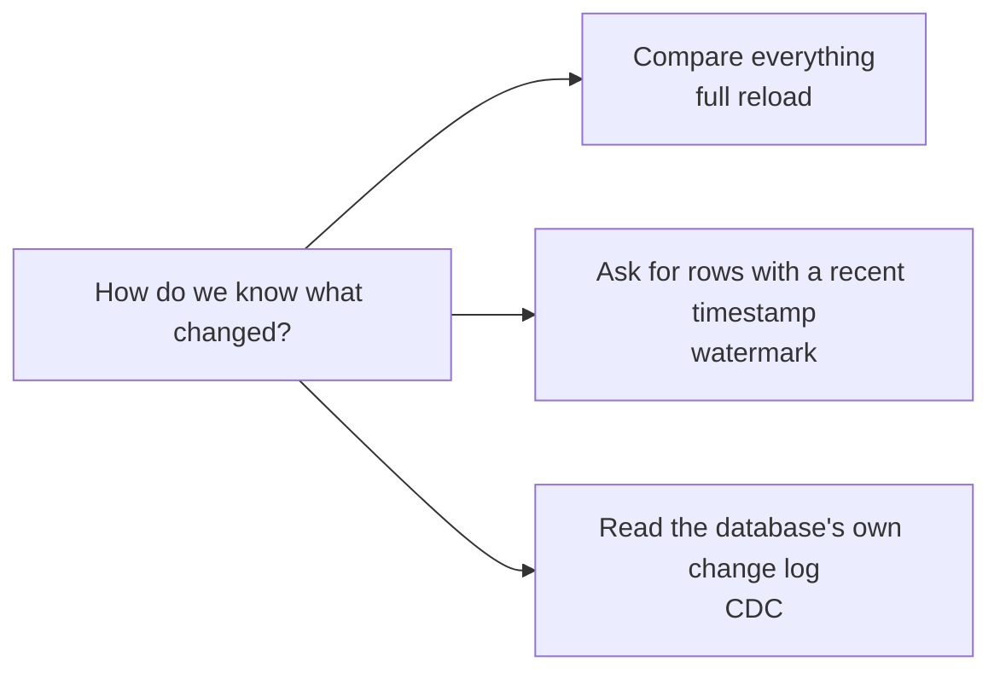
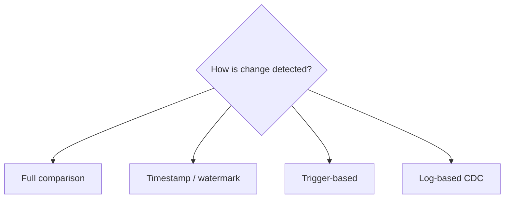
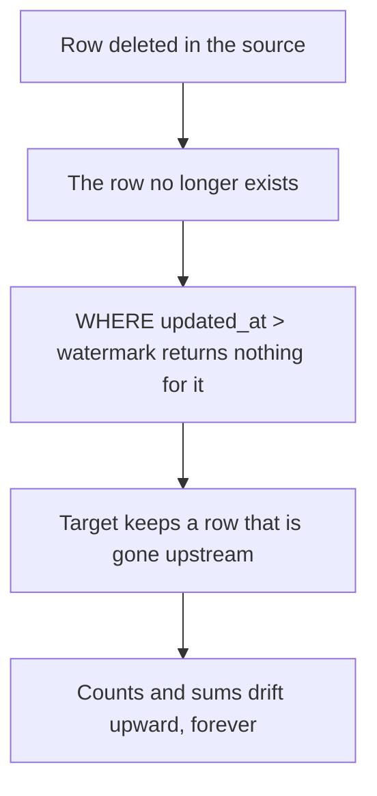
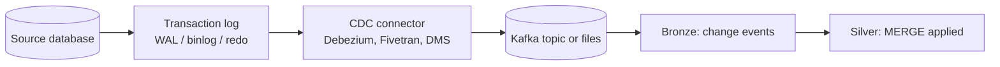
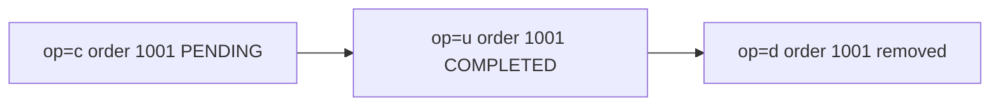
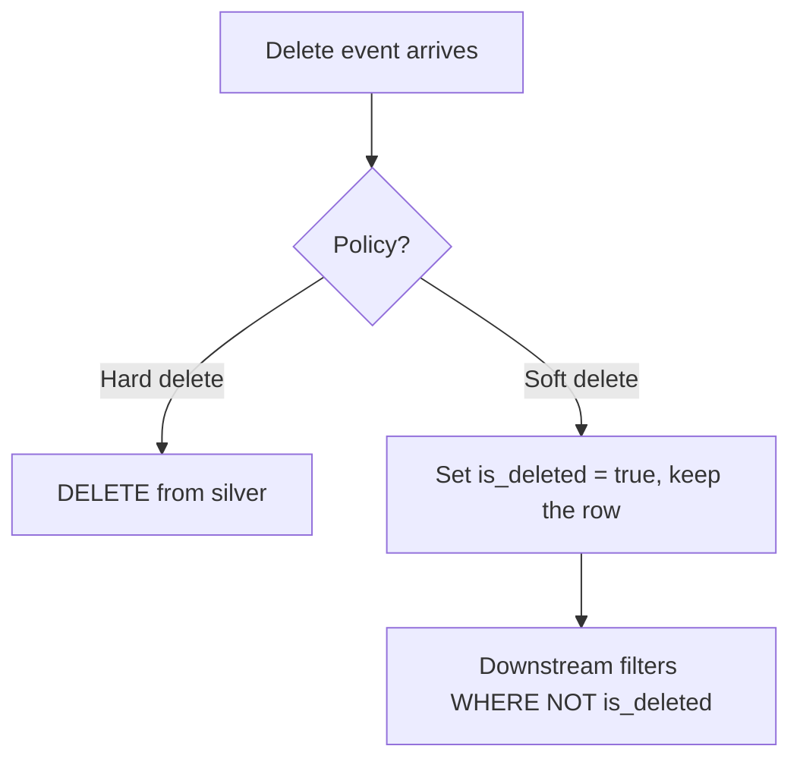
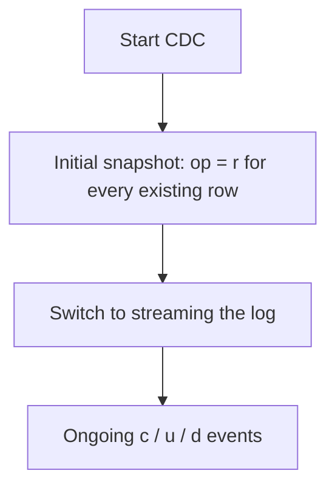
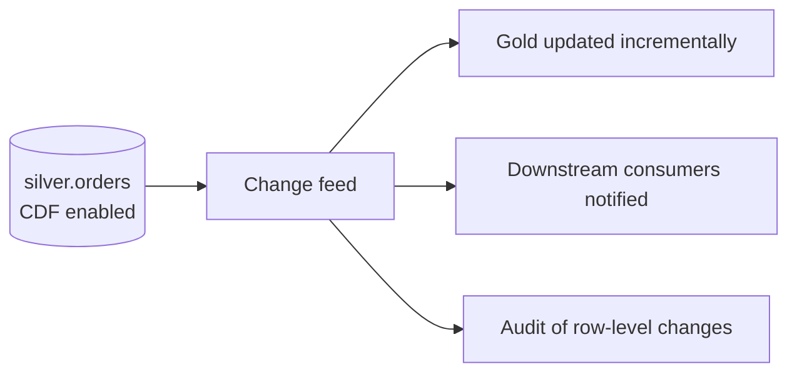
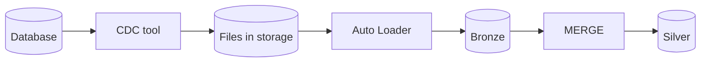
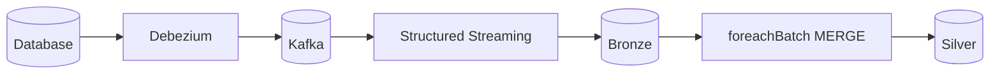

# Change Data Capture (CDC)

## The Problem

A source table has 500 million rows. Each night, 200 000 of them change.

```text
Full reload:      read 500M rows to find 200K changes
Watermark query:  read only changed rows — but cannot see DELETES
CDC:              read the change log — every insert, update, and delete
```



---

## The Four Approaches



| Approach | Sees deletes | Source load | Latency | Complexity |
|----------|--------------|-------------|---------|------------|
| **Full reload** | Yes (by absence) | Very high | Batch | Very low |
| **Watermark** | **No** | Low | Batch | Low |
| **Triggers** | Yes | High (write amplification) | Near real time | Medium |
| **Log-based CDC** | Yes | Minimal | Near real time | Medium-high |

```text
Log-based CDC is the answer at scale because it reads the database's
transaction log — the record the database already writes for its own
recovery. The source barely notices.
```

---

## Why Watermarks Miss Deletes



```text
This is not a corner case. Any source that deletes — cancelled orders,
merged customer records, GDPR erasures — will silently drift.

Mitigations short of full CDC:
✔ Soft deletes in the source (an is_deleted flag, which updates
  updated_at and so appears in the watermark query)
✔ Periodic full reconciliation to detect and correct drift
✔ Periodic full reload of small dimension tables
```

---

## How Log-Based CDC Works



```text
Every relational database writes a transaction log for durability and
replication. CDC tools read that log and emit a stream of change events.

Postgres  → write-ahead log (WAL), logical replication
MySQL     → binlog
SQL Server→ CDC tables / change tracking
Oracle    → redo logs
```

---

## The Shape of a Change Event

```json
{
  "op": "u",
  "ts_ms": 1758196800000,
  "before": {"order_id": 1001, "status": "PENDING",  "amount": 100.00},
  "after":  {"order_id": 1001, "status": "COMPLETED","amount": 100.00},
  "source": {"table": "orders", "lsn": 24857392}
}
```

```text
op values:  c = create (insert)
            u = update
            d = delete
            r = read (initial snapshot)

before / after: the row state on each side of the change
lsn / scn:      the log sequence number — the authoritative ordering
```



---

## Applying CDC Correctly

Three rules, each of which causes a production incident when ignored.

### Rule 1: collapse to one event per key before MERGE

```python
from pyspark.sql import functions as F
from pyspark.sql.window import Window

# A batch may contain several events for the same key
w = Window.partitionBy("order_id").orderBy(F.col("lsn").desc())
latest = (changes.withColumn("_rn", F.row_number().over(w))
                 .filter("_rn = 1").drop("_rn"))
```

```text
Without this: "MERGE cannot match multiple source rows to one target row".
It is the single most common CDC error.
```

### Rule 2: order by the log sequence, not by wall-clock time

```text
ts_ms comes from a clock that can drift or repeat.
lsn / scn / commit_version is monotonic and authoritative.

If ordering is wrong, an older version can overwrite a newer one —
and the symptom is intermittent, which makes it painful to diagnose.
```

### Rule 3: handle deletes explicitly

```sql
MERGE INTO silver.orders t
USING cdc_batch s ON t.order_id = s.order_id
WHEN MATCHED AND s.op = 'd' THEN DELETE
WHEN MATCHED AND s.op IN ('c','u') AND s.lsn > t.lsn THEN UPDATE SET *
WHEN NOT MATCHED AND s.op <> 'd' THEN INSERT *;
```

```text
Note the last clause: a delete for a row we never saw must not be
inserted. Without `AND s.op <> 'd'`, a delete event creates a ghost row.
```

---

## Soft Deletes vs Hard Deletes



```sql
-- Soft delete: preserves history and audit trail
WHEN MATCHED AND s.op = 'd' THEN
  UPDATE SET t.is_deleted = true, t.deleted_at = s.commit_ts
```

```text
Soft deletes are usually the better choice in a lakehouse:
✔ Analytics can still see that the record existed
✔ Reconciliation against the source remains possible
✔ Accidental upstream deletes are recoverable
✘ Every downstream query must filter, or counts are wrong

Hard deletes are required when the deletion is a legal erasure request.
```

---

## Initial Snapshot Plus Ongoing Changes



```text
The handover is where CDC pipelines break:

✘ Snapshot taken at T, streaming starts at T+5min → 5 minutes of
  changes lost
✘ Snapshot and stream overlap without ordering → old snapshot rows
  overwrite newer streamed updates

The fix is the same ordering guard: MERGE only when the incoming
lsn is greater than the stored one. Then an overlapping snapshot is
harmless, because snapshot rows carry a lower sequence number.
```

---

## Delta Change Data Feed

For change happening **inside** the lakehouse, Delta produces its own feed.

```sql
ALTER TABLE silver.orders SET TBLPROPERTIES (delta.enableChangeDataFeed = true);
```

```python
changes = (spark.read.format("delta")
    .option("readChangeFeed", "true")
    .option("startingVersion", 120)
    .table("silver.orders"))
```

```text
_change_type: insert | update_preimage | update_postimage | delete
_commit_version, _commit_timestamp
```



```text
Why it matters: it makes GOLD incremental. Instead of rebuilding a gold
aggregate from all of silver, you read only the rows that changed since
the last run — the same CDC principle applied one layer down.

Cost: CDF writes extra change files, so enable it where it is consumed,
not everywhere by default.
```

---

## CDC Architecture Patterns

### Pattern 1: CDC to files to Auto Loader



```text
✔ Decoupled — the CDC tool and Databricks fail independently
✔ Files are replayable if the merge logic has a bug
✔ Simple operationally
✘ Higher latency (minutes)
```

### Pattern 2: CDC to Kafka to streaming



```text
✔ Low latency (seconds)
✔ Multiple consumers from one topic
✘ Kafka to operate
✘ Retention limits how far you can replay
```

### Pattern 3: managed connector

```text
Lakeflow Connect, Fivetran, or a cloud-native service handles extraction
and lands directly into the lakehouse.

✔ Least engineering effort
✔ Handles schema drift and snapshots
✘ Less control, per-connector cost
✘ Still your job to apply changes correctly into silver
```

---

## Testing a CDC Pipeline

```text
Cases that must be tested explicitly:

1. Insert then update in the same batch → one row, final state
2. Insert then delete in the same batch → no row
3. Delete for a key never seen → no ghost row inserted
4. Out-of-order events → the higher lsn wins
5. Duplicate delivery of the same event → idempotent, no change
6. Snapshot overlapping the stream → stream wins
7. A schema change mid-stream → new column handled or rescued
```

```python
def test_insert_then_delete_in_one_batch(spark):
    batch = spark.createDataFrame([
        (1, "A", "c", 100),
        (1, "A", "d", 101),
    ], "id INT, val STRING, op STRING, lsn INT")
    apply_cdc(spark, batch, target="test.orders")
    assert spark.table("test.orders").filter("id = 1").count() == 0
```

---

## Common Interview Questions

### What is CDC and why use it?

Change Data Capture reads a database's transaction log and emits insert, update,
and delete events in commit order, so downstream systems can stay in sync without
full reloads and without missing deletes.

### Why do watermark-based loads miss deletes?

A deleted row no longer exists, so a query filtering on a change timestamp cannot
return it. The target keeps a row that is gone upstream, and counts drift.

### What must you do before MERGE-ing a CDC batch?

Collapse to one event per key using `row_number()` ordered by the log sequence
number, or MERGE fails with "multiple source rows matched a target row".

### Why order by LSN rather than timestamp?

Timestamps come from a clock that can drift or repeat; the log sequence number is
monotonic and authoritative, so it is the correct ordering for deciding which
version wins.

### How do you handle deletes?

Explicitly: a `WHEN MATCHED AND op = 'd' THEN DELETE` clause, plus
`AND op <> 'd'` on the insert clause so a delete for an unseen key does not create
a ghost row. Soft deletes are often preferable in analytics.

### What goes wrong at the snapshot-to-stream handover?

Changes made between the snapshot and the stream start can be lost, or snapshot
rows can overwrite newer streamed updates. An ordering guard on the sequence
number makes the overlap harmless.

### What is Delta Change Data Feed and what is it for?

A feed of row-level changes to a Delta table, with `_change_type` values. It makes
downstream layers incremental — gold can consume only what changed in silver
rather than rebuilding.

### What are the trade-offs between CDC architectures?

Files plus Auto Loader is simple, decoupled, and replayable but slower. Kafka plus
streaming is low latency but adds infrastructure and retention limits. Managed
connectors minimise effort at the cost of control.

---

## Quick Revision

```text
Detection methods:
full reload (sees deletes, expensive) | watermark (cheap, MISSES deletes) |
triggers (source overhead) | log-based CDC (minimal load, sees everything)

Event shape: op (c/u/d/r) + before + after + lsn

Three rules:
1. Collapse to one event per key BEFORE merge (row_number by lsn)
2. Order by LSN, not timestamp
3. Handle deletes explicitly, and do not insert deletes for unseen keys

Soft delete (is_deleted flag) usually beats hard delete in analytics

Snapshot → stream handover: overlap is safe only with an ordering guard

Delta CDF = CDC inside the lakehouse → makes gold incremental

Test: insert+update same batch | insert+delete same batch | delete of
unseen key | out-of-order | duplicate delivery | snapshot overlap
```
