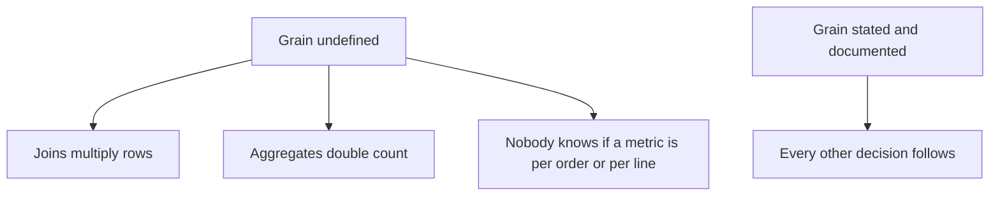
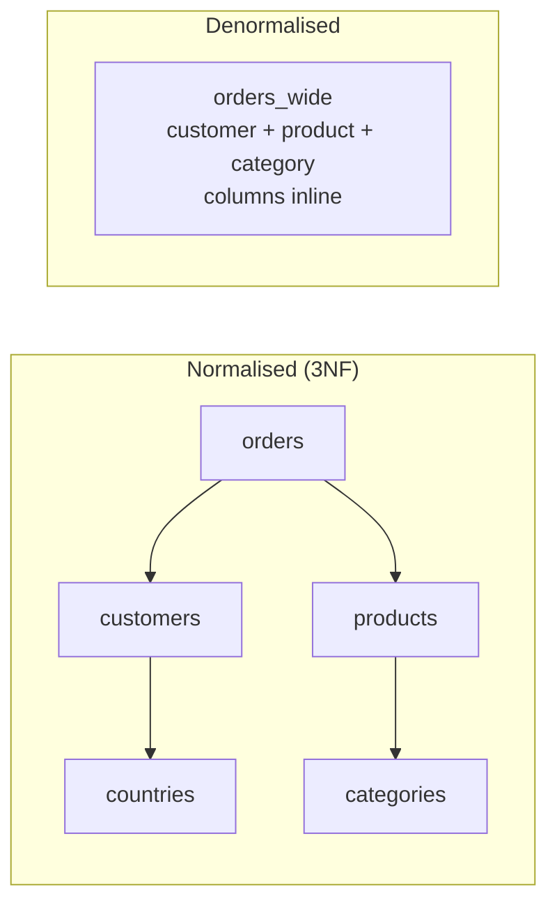
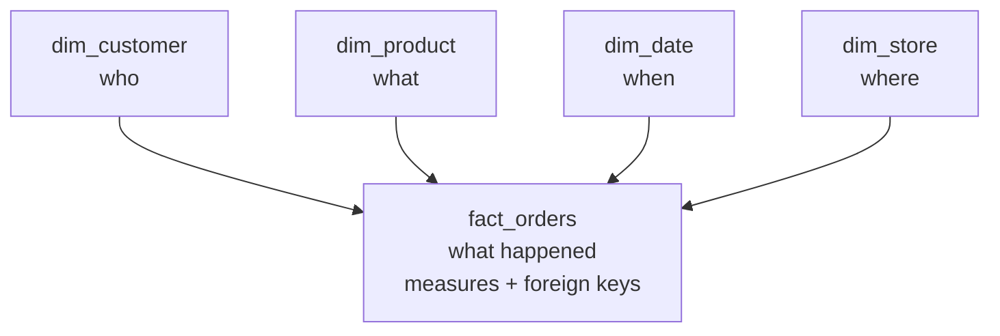
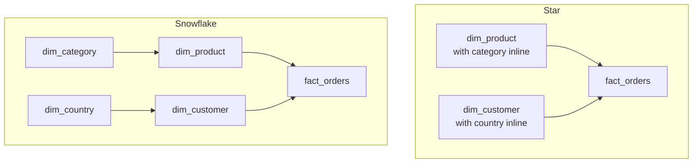
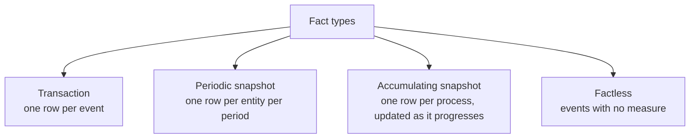
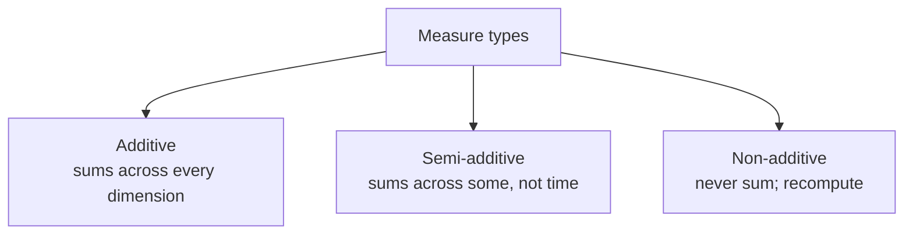
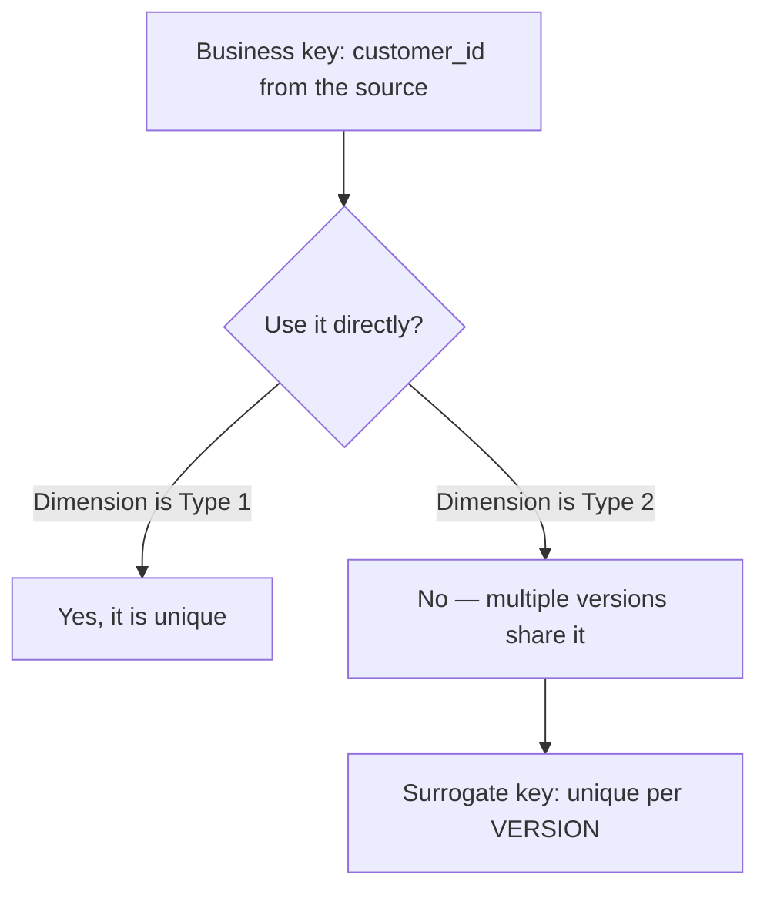
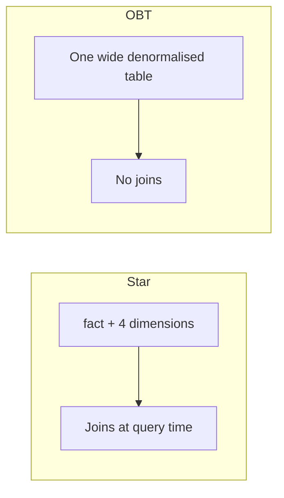
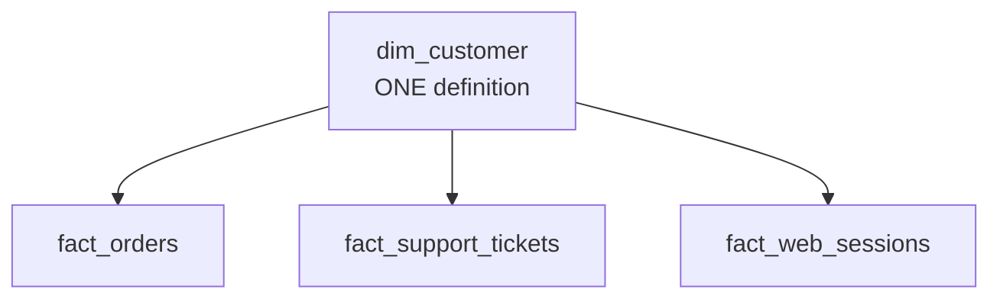
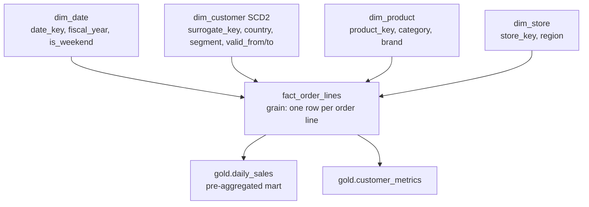

# Data Modeling

## Start With Grain

```text
Grain = what ONE ROW of this table represents.

State it in a sentence before writing any DDL:
"One row per order line item."
"One row per customer per day."
"One row per date, country, and segment."
```



```text
Mismatched grain is the most common cause of a wrong number in
analytics. Everything else in this file is downstream of getting it right.
```

---

## Normalisation vs Denormalisation



| | Normalised | Denormalised |
|---|-----------|--------------|
| Redundancy | None | Deliberate |
| Update cost | Change in one place | Change in many rows |
| Query cost | Many joins | Few or no joins |
| Storage | Minimal | Larger |
| Built for | Transactional writes | Analytical reads |

```text
Normalisation optimises for writes: OLTP systems update one row and
every reader sees the change.

Analytics optimises for reads: data is written once and read thousands
of times, so redundancy is a good trade.

That is why warehouse modelling deliberately breaks the rules taught
in a database course — the workload is the opposite.
```

---

## Dimensional Modelling: Facts and Dimensions



```text
Fact table:
  Events or measurements. Numeric measures plus foreign keys.
  Long and narrow: billions of rows, few columns.
  "Orders", "page views", "sensor readings".

Dimension table:
  Descriptive context. One row per entity.
  Short and wide: thousands of rows, many columns.
  "Customers", "products", "dates", "stores".

Test: if you would SUM it, it belongs in a fact.
      If you would GROUP BY it, it belongs in a dimension.
```

---

## Star vs Snowflake



| | Star | Snowflake |
|---|------|-----------|
| Dimensions | Denormalised, flat | Normalised into sub-dimensions |
| Joins per query | One per dimension | Several per dimension |
| Query speed | Faster | Slower |
| Storage | Slightly more | Slightly less |
| Comprehensibility | High | Lower |

```text
For a lakehouse: prefer star. Storage is cheap, joins cost time, and
business users understand a flat dimension.

Snowflake is defensible when a sub-dimension is genuinely large and
shared — a product hierarchy with millions of SKUs used by several
fact tables.
```

---

## Fact Table Types



```sql
-- Transaction: one row per order line
CREATE TABLE fact_order_lines (
    order_line_key BIGINT, order_key BIGINT,
    customer_key BIGINT, product_key BIGINT, date_key DATE,
    quantity INT, unit_price DECIMAL(18,2), line_total DECIMAL(18,2)
);

-- Periodic snapshot: one row per customer per month
CREATE TABLE fact_customer_monthly (
    customer_key BIGINT, month_key DATE,
    orders_count INT, revenue DECIMAL(18,2), days_active INT
);

-- Accumulating snapshot: one row per order, updated through its lifecycle
CREATE TABLE fact_order_fulfilment (
    order_key BIGINT,
    ordered_date DATE, paid_date DATE, shipped_date DATE, delivered_date DATE,
    days_to_ship INT, days_to_deliver INT
);

-- Factless: which customers viewed which promotions
CREATE TABLE fact_promotion_views (
    customer_key BIGINT, promotion_key BIGINT, date_key DATE
);
```

```text
Periodic snapshots answer "what was the balance at month end?" —
a question transaction facts answer only with expensive running sums.

Accumulating snapshots answer "how long does fulfilment take?" and
are the exception that gets UPDATED rather than appended.
```

---

## Additive, Semi-Additive, Non-Additive



```text
Additive:      revenue, quantity, cost
               sum across customers, products, dates — all valid

Semi-additive: account balance, inventory level, headcount
               sum across customers ✔  sum across days ✘
               (adding Monday's and Tuesday's balance is meaningless)

Non-additive:  ratios, percentages, averages, unit price
               NEVER sum. Store the numerator and denominator,
               and recompute the ratio at query time.
```

```sql
-- ❌ wrong: averaging an average
SELECT avg(avg_order_value) FROM gold.daily_sales;

-- ✅ right: recompute from the components
SELECT sum(total_revenue) / sum(order_count) FROM gold.daily_sales;
```

```text
Storing only a pre-computed ratio in gold is a design error that
guarantees someone will eventually average it. Store the components.
```

---

## The Date Dimension

Every serious model has one.

```sql
CREATE OR REPLACE TABLE dim_date AS
SELECT
    d                                AS date_key,
    year(d)                          AS year,
    quarter(d)                       AS quarter,
    month(d)                         AS month,
    date_format(d, 'MMMM')           AS month_name,
    weekofyear(d)                    AS week_of_year,
    dayofweek(d)                     AS day_of_week,
    date_format(d, 'EEEE')           AS day_name,
    CASE WHEN dayofweek(d) IN (1,7) THEN true ELSE false END AS is_weekend,
    trunc(d, 'MM')                   AS month_start,
    last_day(d)                      AS month_end,
    -- business calendar, which a date function cannot give you
    CASE WHEN month(d) >= 4 THEN year(d) ELSE year(d) - 1 END AS fiscal_year
FROM (SELECT explode(sequence(DATE'2020-01-01', DATE'2030-12-31', INTERVAL 1 DAY)) AS d);
```

```text
Why not just use date functions?
✔ A fiscal calendar, holidays, and retail 4-5-4 weeks cannot be derived
✔ Consistent definitions of "week" across every report
✔ A complete date spine exposes gaps: dates with no facts
✔ Business users can filter on is_holiday without writing logic
```

---

## Surrogate Keys



```text
With SCD2, the business key is no longer unique, so a fact joining on
it multiplies rows by the number of versions.

The fact table stores the surrogate key of the version that was current
when the event occurred, resolved at load time.

Trade-off in a lakehouse: generating and maintaining surrogate keys adds
pipeline complexity. Many lakehouse designs instead join on the business
key with a point-in-time condition, which is simpler but slower.
Either is defensible — state which you chose and why.
```

---

## One Big Table (OBT)



```sql
CREATE TABLE gold.orders_obt AS
SELECT
    o.order_id, o.order_date, o.amount, o.quantity,
    c.customer_name, c.country, c.segment,
    p.product_name, p.category, p.brand,
    d.fiscal_year, d.month_name, d.is_weekend
FROM silver.orders o
JOIN silver.customers c USING (customer_id)
JOIN silver.products p USING (product_id)
JOIN gold.dim_date d ON o.order_date = d.date_key;
```

```text
✔ No joins → fastest possible queries
✔ Simple for BI tools, Genie, and business users
✔ Columnar storage compresses the repetition well
✘ Storage multiplied
✘ A dimension change means rewriting the whole table
✘ Inflexible: a new dimension attribute means a rebuild

Verdict: OBT for a specific, known, heavily used access pattern;
star schema for flexible exploration. Most mature platforms have both.
```

---

## Conformed Dimensions



```text
A conformed dimension is shared across fact tables with the same
keys and the same meaning.

Why it matters: it enables cross-process analysis.
"Do customers who raise support tickets order less?" is answerable
only if both facts use the same customer dimension.

Without conformance, each team builds its own customer table with a
slightly different definition of segment, and cross-team analysis
becomes an argument rather than a query.
```

---

## Modelling for the Lakehouse

```text
What changes from classic Kimball:

✔ Storage is cheap → denormalise more freely
✔ Columnar formats → wide tables are not expensive to scan selectively
✔ Liquid clustering replaces index design
✔ Semi-structured columns are first class — a struct or array can
  hold what would once have needed a bridge table
✔ Time travel gives some history for free (but NOT SCD2 semantics)

What does not change:

✘ Grain still decides everything
✘ Additive vs non-additive measures still matter
✘ Conformed dimensions are still what makes cross-process analysis work
✘ Documentation is still what makes a model usable by anyone else
```

```text
The common mistake: assuming that because storage is cheap and joins
are fast, modelling no longer matters. What modelling actually buys is
SHARED UNDERSTANDING — and no amount of compute provides that.
```

---

## A Worked Model



```sql
-- Grain documented in the table comment — not optional
COMMENT ON TABLE gold.fact_order_lines IS
  'Grain: one row per order line item. Measures are additive across all dimensions. Excludes cancelled orders.';

COMMENT ON TABLE gold.daily_sales IS
  'Grain: one row per order_date, country, segment. Derived from fact_order_lines. Revenue = COMPLETED lines only.';
```

---

## Design Checklist

```text
✔ Grain stated in one sentence, in the table comment
✔ Facts hold measures and foreign keys; dimensions hold descriptions
✔ Measures classified additive / semi-additive / non-additive
✔ Ratios stored as components, never pre-computed alone
✔ A date dimension exists, including the fiscal calendar
✔ SCD type chosen deliberately per dimension and documented
✔ Dimensions conformed across fact tables
✔ Star by default; OBT for specific hot access patterns
✔ Clustering keys match how the table is actually filtered
✔ Every table and non-obvious column has a comment
```

---

## Common Interview Questions

### What is grain and why does it matter?

Grain is what one row represents. Every join, aggregation, and metric depends on
it, and mismatched grain is the most common cause of double counting.

### Fact vs dimension?

Facts hold events or measurements — numeric measures and foreign keys, long and
narrow. Dimensions hold descriptive context — one row per entity, short and wide.
If you would sum it, it is a fact; if you would group by it, it is a dimension.

### Star vs snowflake?

Star keeps dimensions flat and denormalised: fewer joins, faster, easier to
understand. Snowflake normalises dimensions into sub-dimensions: slightly less
storage, more joins. Prefer star in a lakehouse.

### What are semi-additive and non-additive measures?

Semi-additive measures sum across some dimensions but not time — balances and
inventory levels. Non-additive measures such as ratios and averages must never be
summed; store the components and recompute.

### Why have a date dimension instead of date functions?

Fiscal calendars, holidays, and retail week structures cannot be derived; it
guarantees consistent period definitions; and a complete date spine exposes
missing days.

### Why do SCD2 dimensions need surrogate keys?

Because the business key is no longer unique across versions, so a fact joining
on it would multiply rows. The fact stores the key of the version current when
the event occurred.

### When would you use One Big Table?

For a specific, known, heavily queried access pattern where join elimination
matters. Keep a star schema alongside it for flexible exploration.

### What are conformed dimensions and why do they matter?

Dimensions shared across fact tables with identical keys and meaning. They are
what makes cross-process analysis possible — comparing orders and support tickets
requires one customer definition.

### What changes when modelling for a lakehouse?

Cheaper storage and columnar formats permit more denormalisation, and clustering
replaces index design. Grain, additivity, conformance, and documentation do not
change at all.

---

## Quick Revision

```text
Start with GRAIN — one sentence, in the table comment

Fact = measures + foreign keys, long and narrow (you SUM it)
Dimension = descriptive context, short and wide (you GROUP BY it)

Star (flat dimensions, fewer joins) > snowflake, in a lakehouse

Fact types: transaction | periodic snapshot | accumulating snapshot | factless

Measures:
additive (sum anywhere) | semi-additive (not across time) |
non-additive (never sum — store the components)

dim_date: always build one; fiscal calendars cannot be derived

SCD2 → surrogate key per version, or a point-in-time join on the business key

OBT for a hot known pattern; star for exploration; mature platforms have both

Conformed dimensions are what make cross-process analysis possible

Lakehouse changes the economics, not the principles
```
