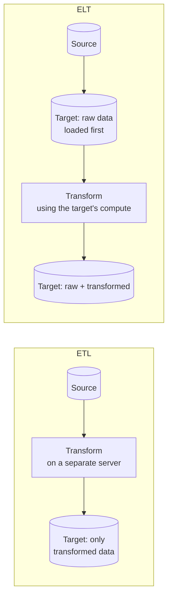
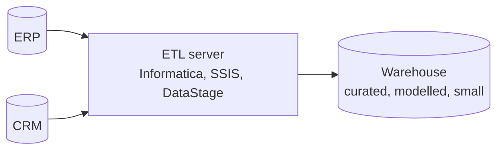
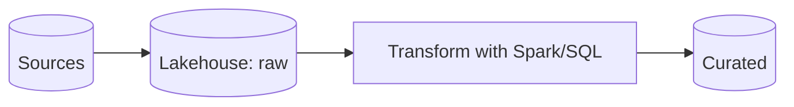
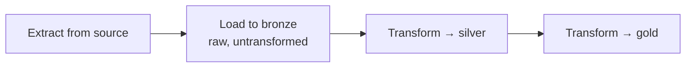
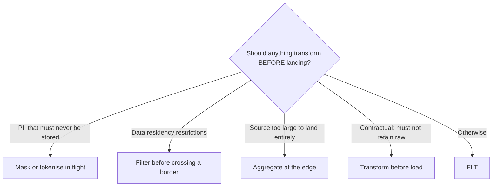
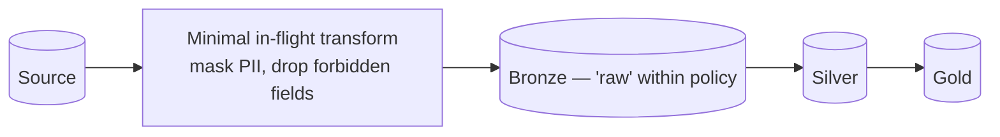
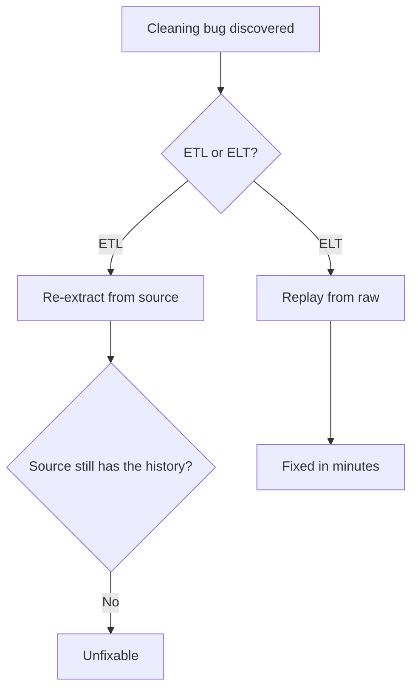
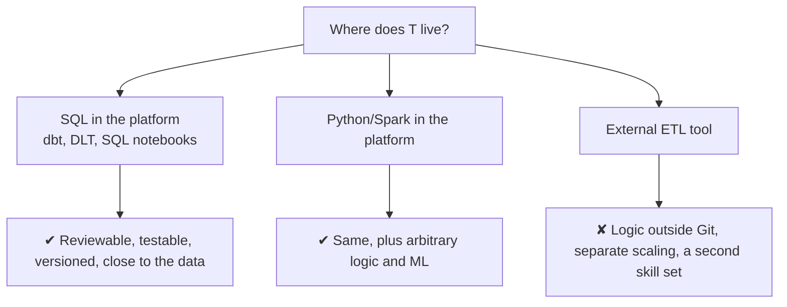

# ETL vs ELT

## The Difference in One Diagram



```text
ETL: Extract → Transform → Load     (transform BEFORE landing)
ELT: Extract → Load → Transform     (transform AFTER landing)

The letters are the same. The consequence is not.
```

---

## Why ETL Existed

```text
In 1995:
  Storage cost roughly $1000 per gigabyte
  Warehouse compute was a fixed, expensive appliance
  You could not afford to load data you would not use

Therefore: filter and aggregate BEFORE loading, and load only
the modelled result. Transformation happened on a separate ETL
server because the warehouse was too precious to waste on it.
```



```text
Consequences of that design:
✘ Raw data was never stored — you could not reprocess
✘ A new business question often meant re-extracting from source
✘ The ETL server was a bottleneck and a single point of failure
✘ Transformation logic lived in a proprietary GUI tool
✘ Scaling meant a bigger ETL server
```

---

## Why ELT Took Over

```text
By 2020:
  Cloud object storage costs cents per gigabyte per month
  Compute is elastic and billed per second
  Loading everything is cheaper than deciding what to leave out

Therefore: load raw first, transform inside the platform using
the same elastic compute that serves queries.
```



```text
Consequences:
✔ Raw data retained → reprocess any time without touching the source
✔ New questions answered from data already loaded
✔ Transformation scales with the platform, elastically
✔ Logic lives in SQL or Python, in Git, testable and reviewable
✔ No separate ETL infrastructure to license and operate
```

---

## Comparison

| | ETL | ELT |
|---|-----|-----|
| Transform runs | On a separate server | Inside the target platform |
| Raw data kept | No | Yes |
| Reprocessing | Requires re-extraction | Replay from raw |
| Scaling | Bigger ETL server | Elastic platform compute |
| Logic lives in | Proprietary tool | SQL / Python in Git |
| Load latency | Slower — transform first | Faster — land immediately |
| Storage cost | Lower | Higher (raw is retained) |
| Compute cost | Separate ETL licence and server | Part of the platform |
| Best when | Data must be masked or filtered before landing | Almost everything else |

---

## Medallion Is ELT



```text
Bronze is the "L" in ELT: land it raw, transform afterwards.

That is why the two concepts are usually taught together — medallion
is a specific, layered way of doing the T in ELT.
```

---

## When ETL Still Wins

Honest architecture includes the exceptions.



```text
Examples of legitimate pre-load transformation:

✔ Tokenising national ID numbers at the edge, because policy forbids
  the raw value ever reaching your storage
✔ Filtering EU customer rows out of a feed crossing into another region
✔ Aggregating IoT telemetry on-device, where landing every reading
  would cost more than the insight is worth
✔ A contract that explicitly forbids retaining raw vendor data

Note what these have in common: they are POLICY constraints,
not technical ones. Cost and capability no longer force ETL.
```

---

## The Hybrid in Practice

Most real platforms do both, and the boundary is worth being explicit about.



```text
"Raw" in bronze means "as received, within what policy allows us to store".

Document that distinction. An auditor asking "do you store raw national
IDs?" needs a clear answer, and a data engineer debugging a value needs
to know it was masked in flight rather than corrupted in silver.
```

---

## ELT and the Reprocessing Argument



```text
This is the strongest practical argument for ELT, and it is the one
to make in an interview — stronger than "storage is cheap".

The cost of ETL is not the server licence. It is the class of problems
that become permanently unfixable.
```

---

## ELT Does Not Mean "Load Everything Forever"

```text
A common misreading: ELT means no discipline about what you load.

It does not. It means:
✔ Load raw, at source grain, without transformation
✘ Not: load every table from every system with no owner or retention

Discipline still required:
- Retention policy per source, driven by reprocessing needs and regulation
- Classification: PII identified and isolated at load time
- Ownership: every bronze table has a team responsible for it
- Cost visibility: storage growth tracked per domain
```

---

## The Transformation Tooling Question



```text
The modern preference is transformation as CODE inside the platform:
in Git, reviewed in pull requests, unit tested, deployed by CI.

That is a bigger shift than ETL to ELT. The transformation moved
from a GUI on a server to version-controlled code — which is why
software engineering practices now apply to data pipelines.
```

---

## Common Interview Questions

### What is the difference between ETL and ELT?

ETL transforms data on a separate server before loading only the result. ELT
loads raw data into the target platform first and transforms it there using the
platform's compute.

### Why did the industry move from ETL to ELT?

Cheap cloud storage and elastic compute removed the constraint that made ETL
necessary. Loading everything became cheaper than deciding in advance what to
discard, and the platform gained enough compute to do the transformation.

### What is the strongest practical argument for ELT?

Reprocessing. With raw data retained, a bug found months later is fixed by
replaying from raw. With ETL, it requires re-extraction — and the source system
has usually purged the history.

### How does ELT relate to the medallion architecture?

Bronze is the "L": land raw, transform afterwards. Medallion is a layered way of
organising the "T".

### When is ETL still the right choice?

When policy, not cost, requires it: PII that must be masked before it is ever
stored, data residency restrictions, contractual bans on retaining raw data, or
edge aggregation where landing everything is genuinely uneconomic.

### Does ELT mean loading everything indefinitely?

No. It means loading raw at source grain, still with retention policies,
classification, ownership, and cost visibility per source.

### What changed beyond the order of the letters?

Transformation logic moved from a proprietary GUI tool to version-controlled
code in the platform, which brought code review, testing, and CI/CD to data
pipelines.

---

## Quick Revision

```text
ETL = Extract → Transform → Load   (transform before landing)
ELT = Extract → Load → Transform   (transform after landing)

ETL existed because storage and warehouse compute were expensive
ELT won because cloud storage is cheap and compute is elastic

ELT advantages:
✔ Raw retained → reprocessing possible
✔ New questions answered from existing data
✔ Elastic scaling, no separate ETL server
✔ Logic as code in Git, testable and reviewed

ETL still right for POLICY reasons:
PII masking in flight | data residency | contractual no-raw-retention |
edge aggregation

Medallion is ELT: bronze is the L, silver and gold are the T

The real shift: transformation moved from a GUI tool to versioned code
```
