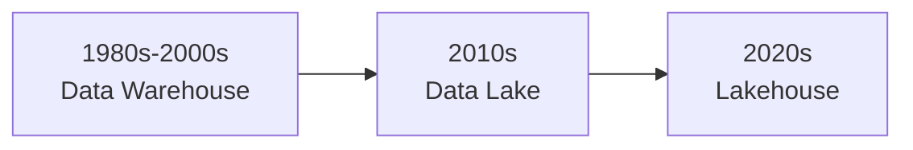
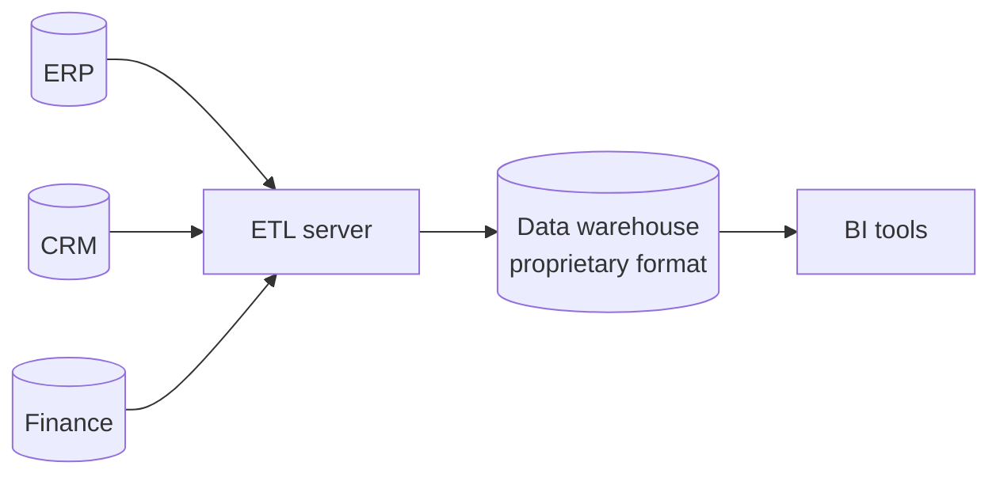
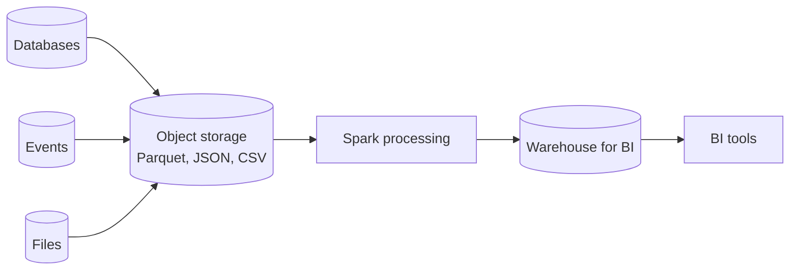
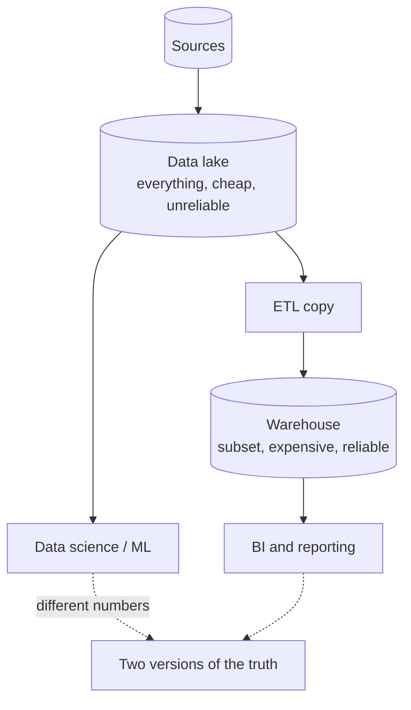
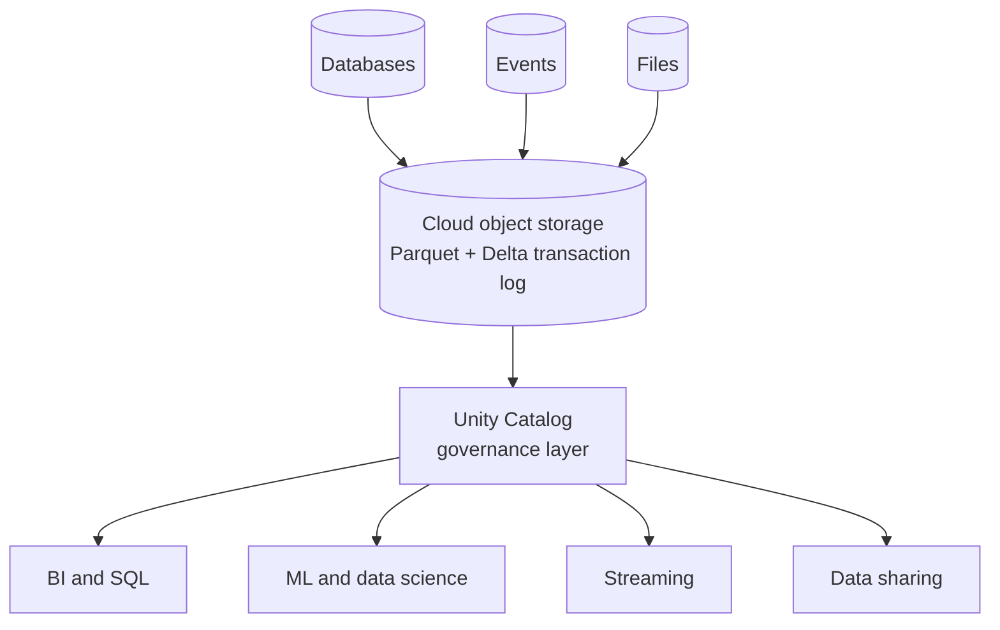
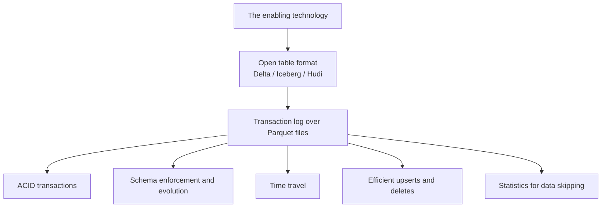
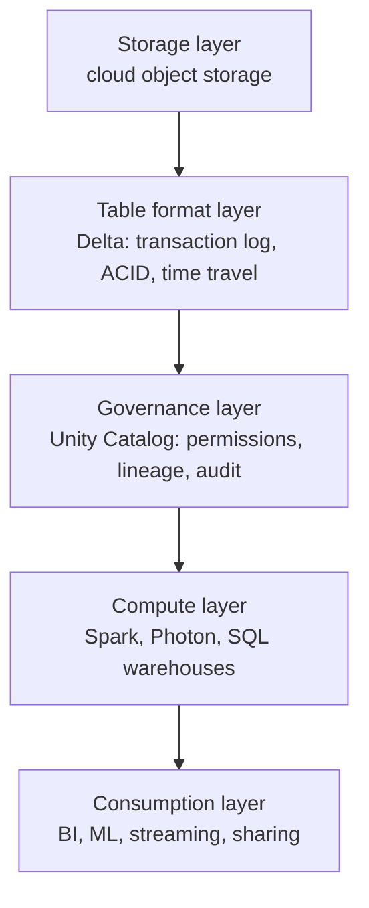
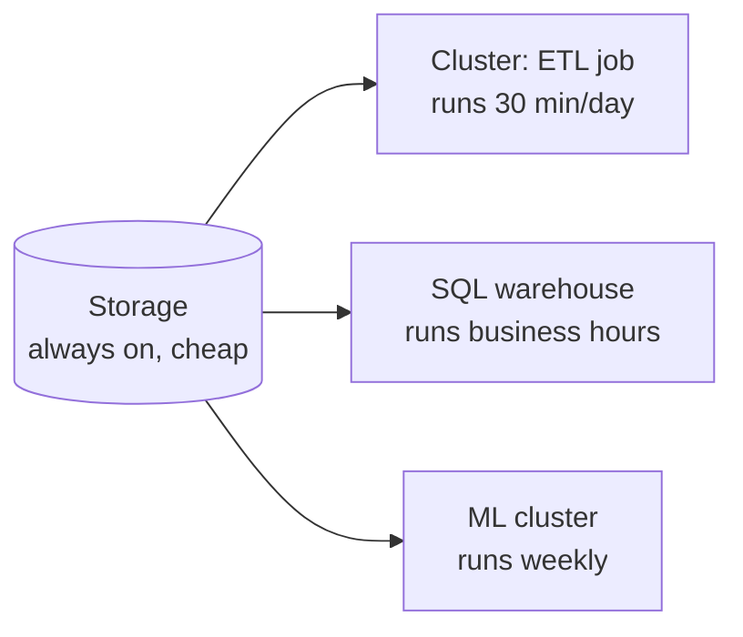
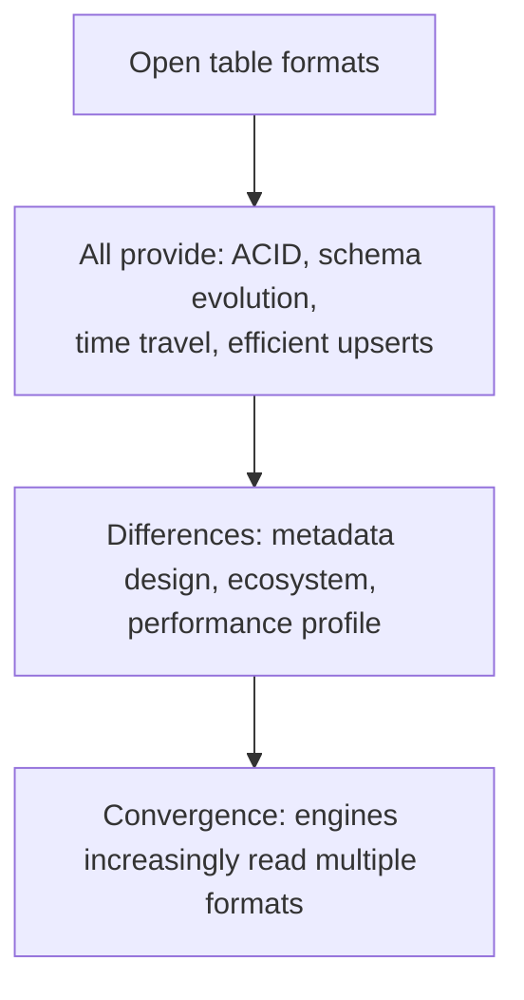

# Lakehouse Architecture

## The Three Eras



Understanding why each one replaced the last is the whole argument.

---

## Era 1: The Data Warehouse

```text
Structured, curated, reliable data for business reporting.
```



```text
✔ ACID transactions and reliability
✔ Fast SQL on structured data
✔ Schema enforcement and data quality
✔ Mature governance and tooling

✘ Expensive — storage and compute coupled, priced per terabyte
✘ Structured data only: no JSON, images, logs, or events
✘ Proprietary format: data locked inside the vendor's system
✘ Schema-on-write: you must model before you can load
✘ Scaling meant buying a bigger appliance
```

```text
The breaking point: by 2010 the most valuable data was clickstream,
sensor readings, and application logs — semi-structured, high-volume,
and far too expensive to put in a warehouse.
```

---

## Era 2: The Data Lake



```text
✔ Cheap storage, decoupled from compute
✔ Any format: structured, semi-structured, unstructured
✔ Schema-on-read: load first, model later
✔ Open formats — Parquet, not a vendor's binary format
✔ Scales horizontally and cheaply

✘ No ACID transactions: a failed write left partial files
✘ No schema enforcement: anything could be written
✘ No updates or deletes without rewriting whole partitions
✘ Slow queries: no statistics, no indexing, small files everywhere
✘ No governance: who could read what was a folder permission
```

```text
The result was the "data swamp": vast, cheap, and untrustworthy.
So organisations kept the warehouse too, and copied data into it.
```

---

## The Two-System Problem



```text
Every organisation running both paid for:

1. Two copies of the data — storage cost doubled
2. An ETL layer between them — engineering cost, and a lag
3. Two governance models — permissions granted twice, inconsistently
4. Two sets of numbers — the lake said one thing, the warehouse another
5. Staleness — BI saw yesterday's copy of the lake
6. Two skill sets and often two teams

The ML team worked on the lake. The BI team worked on the warehouse.
They disagreed in meetings, and both were technically right.
```

---

## Era 3: The Lakehouse

```text
Warehouse reliability and performance, directly on lake storage,
via an open table format.
```



```text
One copy. One governance model. One set of numbers.
```

### What makes it possible



```text
The key insight: reliability does not require a proprietary storage
engine. It requires a transaction log. Put a log next to open Parquet
files and you get warehouse guarantees on lake economics.
```

---

## Feature Comparison

| | Warehouse | Data lake | Lakehouse |
|---|-----------|-----------|-----------|
| Storage cost | High | Low | Low |
| Format | Proprietary | Open | Open |
| ACID transactions | Yes | No | Yes |
| Schema enforcement | Yes | No | Yes |
| Updates and deletes | Yes | Painful | Yes |
| Semi/unstructured data | No | Yes | Yes |
| BI performance | Excellent | Poor | Very good |
| ML workloads | Awkward | Yes | Yes |
| Streaming | Limited | Yes | Yes |
| Governance | Mature | Weak | Mature |
| Time travel | Limited | No | Yes |
| Vendor lock-in | High | Low | Low |

---

## The Architecture in Layers



```text
The layering matters: each layer is replaceable.

Storage is your cloud provider's.
The table format is open — other engines can read Delta.
Compute is separate, so you can scale it independently or use
a different engine entirely.

That is the structural difference from a warehouse, where all four
layers were one product from one vendor.
```

---

## Decoupled Storage and Compute



```text
Consequences:
✔ Pay for compute only when it runs
✔ Size compute per workload, not for the peak of everything
✔ Multiple engines read the same data simultaneously
✔ Storage grows without forcing a compute upgrade

In a traditional warehouse these were one resource: more storage
meant a bigger appliance, and an idle warehouse still cost full price.
```

---

## Where the Lakehouse Is Not the Answer

Honest architecture includes knowing the limits.

```text
A warehouse may still be the better choice when:
✘ The workload is purely structured BI at moderate scale
✘ The team is SQL-only with no Spark capability
✘ Sub-second dashboard latency on small data is the priority
✘ An existing warehouse works and there is no compelling driver

An OLTP database is the right tool when:
✘ You need single-row lookups at millisecond latency
✘ You need high-concurrency transactional writes
✘ The lakehouse is an ANALYTICAL store, not an application database

A specialised store is right when:
✘ Vector search, graph traversal, or time-series at extreme granularity
```

```text
The strongest answer in an interview is not "lakehouse always".
It is "lakehouse because we have semi-structured data, ML workloads,
and two systems we are paying to keep in sync — and here is what
we would still not put in it."
```

---

## Open Table Formats

```text
Delta Lake    → Databricks-originated, now Linux Foundation
Apache Iceberg → Netflix-originated, strong multi-engine adoption
Apache Hudi    → Uber-originated, strong on incremental upserts
```



```text
Why "open" matters commercially: your data stays in your storage
account in a format other engines can read. Changing platforms means
changing compute, not migrating petabytes out of a proprietary store.

That is the structural difference from the warehouse era, and it is
why the format choice matters more than the vendor choice.
```

---

## The Medallion Connection

```text
The lakehouse gives you reliable storage. Medallion gives you a way
to organise it. They are complementary, not alternatives:

Lakehouse = WHERE the data lives and what guarantees it has
Medallion = HOW you structure it as it becomes trustworthy
```

See [medallion_architecture.md](medallion_architecture.md).

---

## Common Interview Questions

### What is a lakehouse?

An architecture combining data lake economics — cheap object storage, open
formats, any data type — with data warehouse guarantees: ACID transactions,
schema enforcement, governance, and BI performance, enabled by an open table
format with a transaction log.

### What problem does it solve?

The two-system problem: organisations ran a lake for ML and a warehouse for BI,
paying for two copies, an ETL layer between them, two governance models, and
ending up with two conflicting versions of the truth.

### What technically makes a lakehouse possible?

A transaction log over open Parquet files. The log provides atomic commits,
snapshot isolation, schema enforcement, time travel, and statistics for data
skipping — without a proprietary storage engine.

### Why does decoupled storage and compute matter?

Compute is paid for only while running and sized per workload, storage grows
independently, and multiple engines can read the same data concurrently.

### When would you still choose a warehouse?

Purely structured BI at moderate scale with a SQL-only team and no ML or
semi-structured requirement — or when an existing warehouse works and there is no
driver to change.

### Is a lakehouse suitable as an application database?

No. It is an analytical store. Single-row lookups at millisecond latency and
high-concurrency transactional writes belong in an OLTP database.

### Delta, Iceberg, or Hudi?

All provide ACID, schema evolution, time travel, and upserts, differing in
metadata design and ecosystem. The important property is that all are open, so
data is not locked to one engine.

---

## Quick Revision

```text
Warehouse → reliable, fast, expensive, structured-only, proprietary
Data lake → cheap, open, any format, but unreliable and slow
Two systems → double cost, ETL lag, two governance models, conflicting numbers

Lakehouse = warehouse guarantees on lake economics
Enabled by: an open table format = Parquet + a transaction log

Layers: storage → table format → governance → compute → consumption
Each replaceable; that is the anti-lock-in property

Decoupled storage and compute → pay per run, size per workload

Not for: OLTP, millisecond single-row lookups, or when a warehouse
         already meets a purely structured BI need
```
