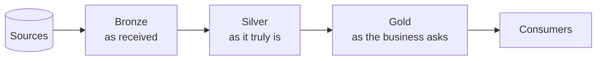
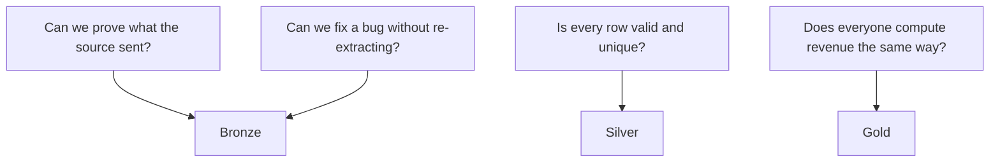
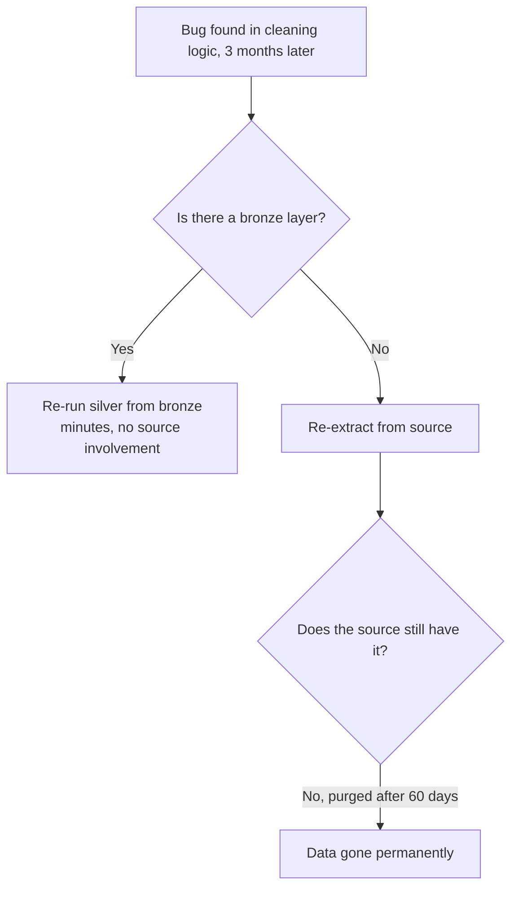
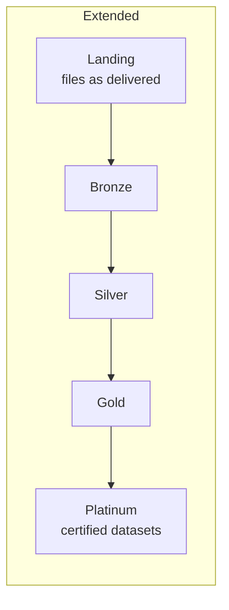
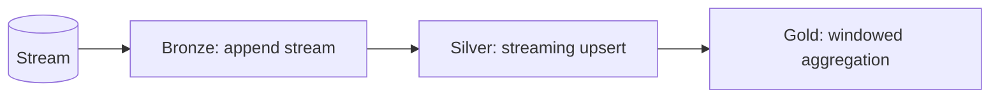
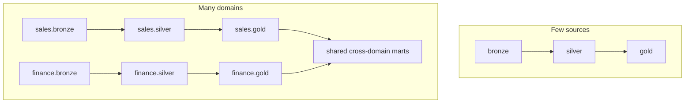

# Medallion Architecture (Concept)

> The Databricks implementation is in [topic 10](../10_data_engineering/medallion_architecture.md).
> This file covers the pattern itself, independent of platform.

---

## The Pattern



```text
Bronze = what the source said
Silver = what is true
Gold   = what the business asks about
```

---

## Why Layers At All

The pattern is a direct answer to four questions that a single
transformation step cannot answer.



```text
Without bronze: the source purged the data; the bug is unfixable.
Without silver: every gold table re-implements the same cleaning.
Without gold:   every dashboard re-implements the same business rule,
                and produces a different number.
```

---

## The Separation of Concerns

| | Bronze | Silver | Gold |
|---|--------|--------|------|
| Question | What arrived? | What is true? | What does the business ask? |
| Rules | None | Technical correctness | Business definitions |
| Grain | Source grain | One row per entity or event | Aggregated |
| Write | Append only | Upsert | Rebuild or incremental |
| History | Everything | Current state (or versioned) | Usually current |
| Consumers | Engineers | Engineers, power users | Everyone |
| Failure impact | Ingestion stops | Downstream stale | Reports stale |

```text
The rule that keeps layers honest:

Silver rules are true regardless of who is asking.
  "A null order_id is invalid" — always true.

Gold rules are business decisions.
  "Revenue excludes cancelled orders" — a choice someone made.

Putting business decisions in silver means every new question
forces a silver rewrite. That is the most common design error.
```

---

## Reprocessing: the Real Payoff



```text
This single property justifies the storage cost of bronze many times over.
Source systems purge history; your bronze layer is the only durable
copy of what they actually sent.
```

---

## Layer Design Rules

```text
Bronze
✔ Append-only; never transform on the way in
✔ Preserve source column names and values exactly
✔ Add ingestion metadata: when, from where, which batch
✔ Retention long enough to rebuild everything downstream
✔ Restrict access — it contains known-bad rows

Silver
✔ One row per business entity, with an explicit key
✔ Types enforced; failed casts detected, not silently nulled
✔ Deduplicated by a deterministic rule, not an arbitrary one
✔ Idempotent writes, so reprocessing is safe
✔ Rejects quarantined with reasons, not dropped

Gold
✔ Business definitions implemented exactly once
✔ Grain documented explicitly
✔ Aggregated to what consumers actually query
✔ Broad access — this is the layer you open up
```

---

## Variations



```text
Landing zone before bronze:
  Raw files as delivered, before any table exists. Useful when the
  file itself is the legal record, or when formats vary wildly.

Split silver:
  Silver 1 — cleaned, one row per source record
  Silver 2 — conformed across sources into a canonical entity
  Common when several systems describe the same customer.

Platinum / certified:
  A small set of governed, signed-off datasets for regulatory or
  executive use, separate from the wider gold layer.
```

```text
Each extra layer costs storage, latency, and complexity.
Add one only when you can name the problem it solves.
```

---

## Medallion Is Not Only for Batch



```text
The layers are identical. Only the trigger and write mechanics change.
A streaming bronze is still append-only raw; a streaming gold still
holds business aggregates.
```

---

## Medallion vs Other Patterns

| Pattern | Idea | Relationship |
|---------|------|--------------|
| **Medallion** | Layer by trustworthiness | The subject here |
| **Lambda** | Parallel batch and speed layers reconciled | Medallion can implement both paths |
| **Kappa** | Everything as a stream, replayed for reprocessing | Bronze replay is the same idea |
| **Data mesh** | Domain-owned data products | Medallion applies *within* each domain |
| **Data vault** | Hubs, links, satellites for auditable integration | Often sits between bronze and silver |

```text
These are not competitors. Data mesh decides WHO owns data;
medallion decides HOW each owner structures it. A mesh where every
domain uses medallion internally is a very common real design.
```

---

## Organising at Scale



```text
Naming conventions matter more than they appear to:

Small platform:   catalog per environment, schema per layer
Large platform:   schema per domain AND layer, or catalog per domain

The deciding factor is ownership. When different teams own different
pipelines, the naming should mirror who is accountable — because that
is also how permissions and on-call rotas are organised.
```

---

## Anti-Patterns

```text
❌ Transforming on the way into bronze
   → you can no longer prove what the source sent

❌ Business logic in silver
   → every new business question rewrites silver

❌ Dashboards reading silver
   → slow, and each one reinvents the business rules

❌ Skipping silver: bronze straight to gold
   → cleaning logic duplicated in every gold table

❌ A gold table per dashboard tile
   → hundreds of near-identical tables, none trusted

❌ Bronze retention shorter than your ability to detect a bug
   → the layer exists but cannot do its job
```

---

## Common Interview Questions

### What is the medallion architecture?

A layered design — bronze (raw as received), silver (cleaned and conformed), gold
(business aggregates) — where each layer has one responsibility and can be
rebuilt from the layer before it.

### Why not transform once, from source to reporting table?

Because you cannot reprocess without re-extracting, cannot prove what the source
sent, and cleaning plus business logic become one untestable step.

### Which layer holds business logic, and why?

Gold. Silver holds rules that are true regardless of who is asking; business
definitions are choices, and putting them in silver means every new question
forces a silver rewrite.

### Should dashboards query silver?

No. Silver is row-level and unaggregated, so queries are slow and each dashboard
re-implements the same business rules, producing conflicting numbers.

### Does medallion apply to streaming?

Yes — the layers are identical, only the trigger and write mechanics differ.

### How does medallion relate to data mesh?

Data mesh decides who owns which data products; medallion decides how each owner
structures theirs internally. They compose naturally.

### How many layers should you have?

Three by default. Add a landing zone or certified layer only when you can name
the specific problem it solves, because each layer costs storage, latency, and
complexity.

---

## Quick Revision

```text
Bronze = what the source said   → append-only, raw, retained
Silver = what is true           → typed, validated, deduplicated, idempotent
Gold   = what the business asks → aggregated, defined once, documented

Why layers:
prove what arrived | reprocess without re-extraction |
separate technical rules from business decisions | one definition per metric

Rule: silver rules are true for everyone; gold rules are choices

Reprocessing is the payoff — and it depends entirely on bronze retention

Variations: landing zone | split silver | certified layer — only with a reason
Composes with: data mesh (who owns), data vault (integration), lambda/kappa

Anti-patterns: transform into bronze | business logic in silver |
               dashboards on silver | skipping silver | a gold table per tile
```
