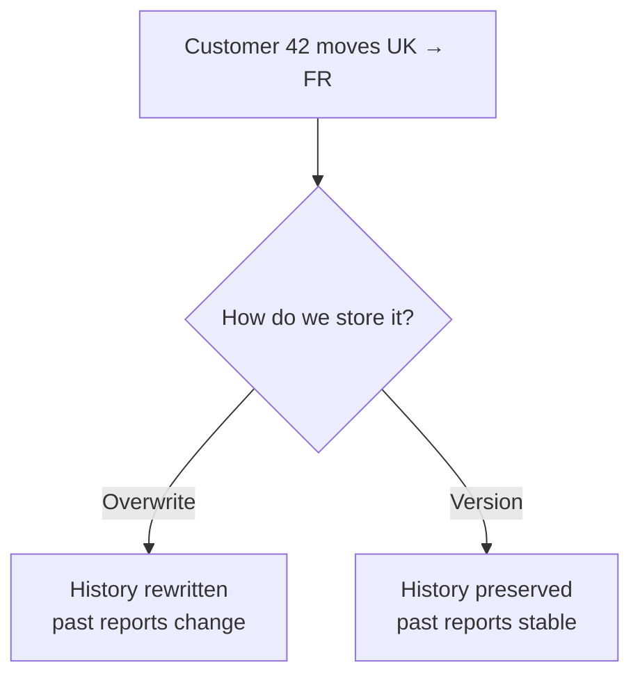
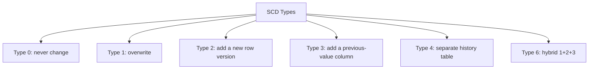
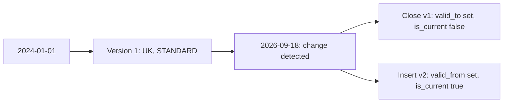
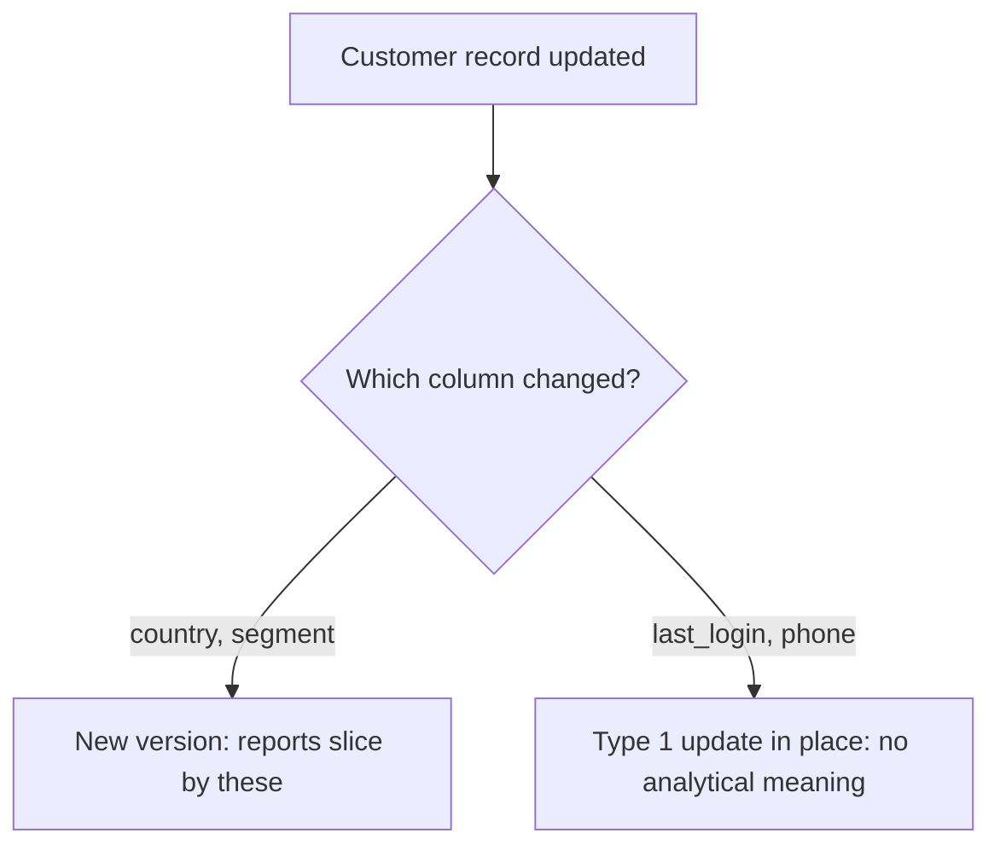
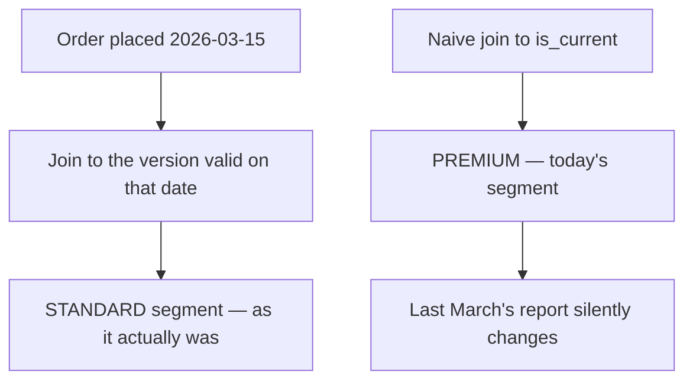
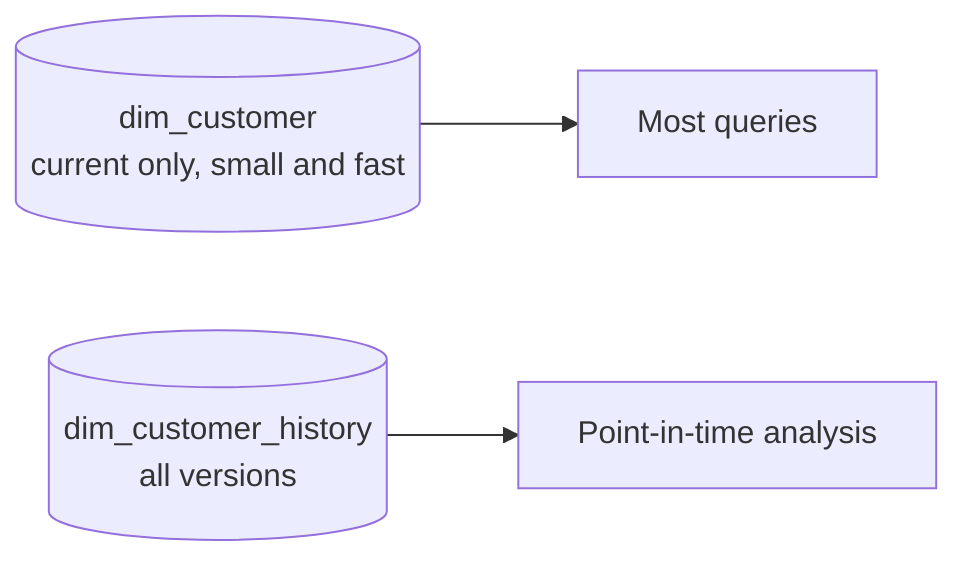
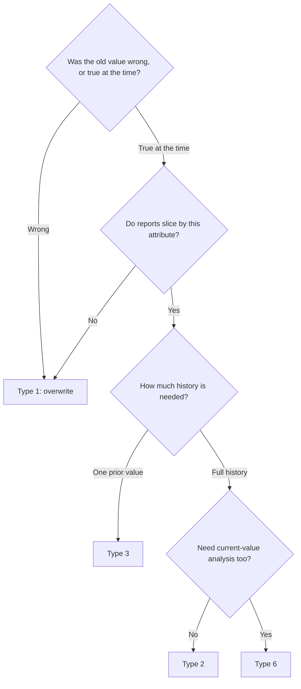

# Slowly Changing Dimensions (SCD)

## The Problem

A customer moves from the UK to France. You overwrite their country.

```text
Now: "revenue by country for last March" changes retroactively.
A report you published in April no longer reconciles with the same
query run today. Nobody changed the orders — only the customer record.
```



```text
SCD is the set of answers to: "what do we do with the old value?"
```

---

## The Types



| Type | Mechanism | History | Use for |
|------|-----------|---------|---------|
| **0** | Never updated | Original only | Date of birth, original signup date |
| **1** | Overwrite | None | Typo corrections, non-analytical attributes |
| **2** | New row with validity dates | Full | Anything reports slice by |
| **3** | Extra "previous value" column | One step | A single tracked change, e.g. previous region |
| **4** | Current table + history table | Full | Very wide dimensions, rarely-queried history |
| **6** | Combination of 1, 2, and 3 | Full + current | Both point-in-time and current views needed |

```text
In practice you will use Type 1 and Type 2. Types 3, 4, and 6 appear
in interviews more often than in production.
```

---

## Type 1: Overwrite

```text
Before:  42 | Alice | UK | STANDARD
After:   42 | Alice | FR | PREMIUM
```

```sql
MERGE INTO dim_customer t
USING updates s ON t.customer_id = s.customer_id
WHEN MATCHED THEN UPDATE SET *
WHEN NOT MATCHED THEN INSERT *;
```

```text
✔ Simple, one row per entity, small table
✔ Correct for fixing errors — a misspelt name was never "true"
✘ Historical reports change retroactively
✘ You cannot answer "what segment were they in when they ordered?"
```

```text
The right question to decide Type 1 vs Type 2:

"Was the old value WRONG, or was it TRUE AT THE TIME?"

Wrong  → Type 1. Correcting a typo should retroactively fix reports.
Was true → Type 2. A customer really did live in the UK last March.
```

---

## Type 2: Versioned Rows

```text
customer_id | name  | country | segment  | valid_from | valid_to   | is_current
42          | Alice | UK      | STANDARD | 2024-01-01 | 2026-09-18 | false
42          | Alice | FR      | PREMIUM  | 2026-09-18 | NULL       | true
```



### The columns

```text
valid_from  when this version became true
valid_to    when it stopped being true (NULL = still current)
is_current  a convenience flag; redundant with valid_to IS NULL
            but makes queries and indexes simpler
surrogate_key  a unique key per VERSION, distinct from the business key
```

```text
Why a surrogate key: the business key (customer_id) is no longer unique,
so fact tables must reference the specific version — otherwise a join
multiplies rows by the number of versions.
```

### Implementation

```sql
MERGE INTO dim_customer t
USING (
    -- Rows that will INSERT a new version
    SELECT customer_id AS merge_key, * FROM updates
    UNION ALL
    -- NULL merge_key never matches, forcing the INSERT branch,
    -- while the row above matches and closes the old version
    SELECT NULL AS merge_key, u.*
    FROM updates u
    JOIN dim_customer d
      ON u.customer_id = d.customer_id AND d.is_current = true
    WHERE u.country <> d.country OR u.segment <> d.segment
) s
ON t.customer_id = s.merge_key AND t.is_current = true

WHEN MATCHED AND (t.country <> s.country OR t.segment <> s.segment) THEN
    UPDATE SET t.is_current = false, t.valid_to = s.effective_date

WHEN NOT MATCHED THEN
    INSERT (customer_id, name, country, segment, valid_from, valid_to, is_current)
    VALUES (s.customer_id, s.name, s.country, s.segment, s.effective_date, NULL, true);
```

```text
The union trick exists because one MERGE cannot both close a row and
insert a new one for the same key. Two source rows are emitted:
one with the real key (matches → closes) and one with NULL (inserts).
```

```python
# The same thing declaratively in DLT
dlt.apply_changes(
    target="dim_customer",
    source="customer_cdc",
    keys=["customer_id"],
    sequence_by="updated_at",
    stored_as_scd_type=2,
    track_history_column_list=["country", "segment"],
)
```

```text
Build it by hand once to understand the mechanism, then use the
declarative version in production.
```

---

## Which Columns Trigger a New Version



```text
Tracking every column creates version noise: a customer who logs in
daily generates 365 versions a year, and every point-in-time join
becomes slower for no analytical benefit.

Decide deliberately:
✔ Track: attributes reports group or filter by
✘ Do not track: operational metadata, timestamps, free-text notes

track_history_column_list in DLT expresses exactly this.
```

---

## Querying a Type 2 Dimension

```sql
-- Current state only
SELECT * FROM dim_customer WHERE is_current = true;

-- As it was on a specific date
SELECT * FROM dim_customer
WHERE valid_from <= DATE'2026-03-15'
  AND (valid_to IS NULL OR valid_to > DATE'2026-03-15');

-- Point-in-time join: the reason SCD2 exists
SELECT d.segment, sum(f.amount) AS revenue
FROM fact_orders f
JOIN dim_customer d
  ON f.customer_id = d.customer_id
 AND f.order_date >= d.valid_from
 AND (d.valid_to IS NULL OR f.order_date < d.valid_to)
GROUP BY d.segment;
```



```text
The naive join (`AND d.is_current = true`) is the bug that makes
historical reports drift. It looks correct, runs fine, and quietly
restates the past.
```

---

## The Boundary Condition

```text
valid_to on the closed row must equal valid_from on the new row,
and the join must use >= on one side and < on the other.

Row 1: valid_from 2024-01-01, valid_to 2026-09-18
Row 2: valid_from 2026-09-18, valid_to NULL

An order at exactly 2026-09-18:
  f.order_date >= d.valid_from AND f.order_date < d.valid_to
  → matches row 2 only. Correct.

Using <= on both sides matches BOTH rows and doubles the revenue.
This is the classic SCD2 duplication bug.
```

---

## Type 3: Previous Value Column

```text
customer_id | country | previous_country | country_changed_date
42          | FR      | UK               | 2026-09-18
```

```sql
UPDATE dim_customer
SET previous_country = country,
    country = 'FR',
    country_changed_date = current_date()
WHERE customer_id = 42;
```

```text
✔ Very simple; one row per entity
✔ Enough for "compare current versus previous region"
✘ Only one step of history
✘ A second change loses the original value

Use case: a sales territory reorganisation where "before and after"
is the whole question, and older history is irrelevant.
```

---

## Type 4: Separate History Table



```text
✔ The hot table stays small, so common queries are fast
✔ History is still complete
✘ Two tables to maintain and keep consistent
✘ Point-in-time queries must know to use the history table

Worth considering for very wide dimensions where most queries only
need current state.
```

---

## Type 6: Hybrid

```text
customer_id | country | current_country | valid_from | valid_to | is_current
42          | UK      | FR              | 2024-01-01 | 2026-09-18 | false
42          | FR      | FR              | 2026-09-18 | NULL       | true
```

```text
Each row carries both the value AS IT WAS (Type 2) and the CURRENT
value (Type 1 column, updated on every row).

✔ Both analyses without a second join:
  "revenue by segment at order time" and
  "revenue by the customer's CURRENT segment"
✘ Every historical row is rewritten on each change — expensive writes
✘ More complex to implement and explain
```

```text
Type 6 answers a real business question: "how much revenue comes from
customers who are PREMIUM today?" — which Type 2 alone cannot answer
without a second join back to the current row.
```

---

## Choosing a Type



---

## Practical Guidance

```text
✔ Default to Type 2 for dimensions reports slice by
✔ Default to Type 1 for everything else — do not version by reflex
✔ Track only analytically meaningful columns
✔ Use a surrogate key per version; facts reference the version, not the entity
✔ Get the boundary condition right: >= valid_from AND < valid_to
✔ Test: two changes in one batch, a change and a revert, a late-arriving change
✔ Document which dimensions are Type 2 — consumers must know to use
  a point-in-time join
```

```text
The failure mode nobody anticipates: a Type 2 dimension that consumers
join on is_current. The data is correct; the query is wrong; the report
drifts. Document it, and provide a view that does the join properly.
```

```sql
CREATE OR REPLACE VIEW v_orders_enriched AS
SELECT f.*, d.country, d.segment
FROM fact_orders f
JOIN dim_customer d
  ON f.customer_id = d.customer_id
 AND f.order_date >= d.valid_from
 AND (d.valid_to IS NULL OR f.order_date < d.valid_to);
```

---

## Common Interview Questions

### What is a slowly changing dimension?

A dimension whose attributes change over time, and a set of strategies for
deciding what happens to the previous value.

### Type 1 vs Type 2, and how do you choose?

Type 1 overwrites, keeping only current state; Type 2 adds a new row version with
validity dates. Choose by asking whether the old value was wrong (Type 1) or true
at the time (Type 2), and whether reports slice by that attribute.

### Which columns does Type 2 need?

`valid_from`, `valid_to`, `is_current`, and a surrogate key unique per version —
because the business key is no longer unique.

### Why is the surrogate key necessary?

Fact tables must reference a specific version; joining on the business key alone
would multiply fact rows by the number of dimension versions.

### How do you write a point-in-time join?

Join on the business key with `fact_date >= valid_from AND (valid_to IS NULL OR
fact_date < valid_to)` — using `>=` on one side and `<` on the other to avoid
matching two versions at the boundary.

### What is the classic SCD2 bug?

Joining on `is_current = true` instead of a point-in-time condition, which
silently restates historical reports whenever a dimension attribute changes.

### Why not track every column in Type 2?

Version noise: frequently changing operational columns generate huge numbers of
versions with no analytical value, slowing every point-in-time join.

### What does Type 6 add?

Both the historical value and the current value on every row, allowing
"revenue by segment at order time" and "revenue from customers who are PREMIUM
today" without a second join — at the cost of rewriting historical rows.

---

## Quick Revision

```text
Type 0 never change | Type 1 overwrite | Type 2 version rows
Type 3 previous-value column | Type 4 separate history table | Type 6 hybrid

Decide with: was the old value WRONG (Type 1) or TRUE AT THE TIME (Type 2)?

Type 2 columns: valid_from | valid_to | is_current | surrogate key per version

Point-in-time join:
  fact_date >= valid_from AND (valid_to IS NULL OR fact_date < valid_to)
  >= on one side, < on the other — or rows double at the boundary

Classic bug: joining on is_current → historical reports silently restate

Track only analytically meaningful columns, or version noise explodes

Implementation: the union trick (real key + NULL key) by hand,
or stored_as_scd_type=2 declaratively
```
